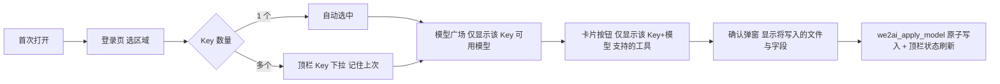
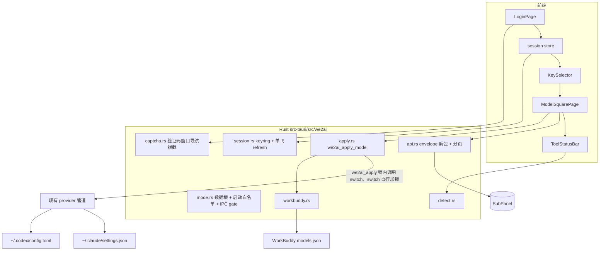
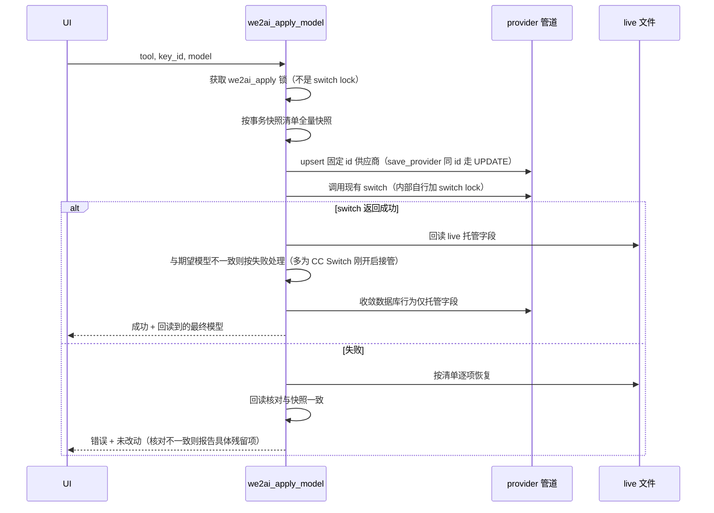
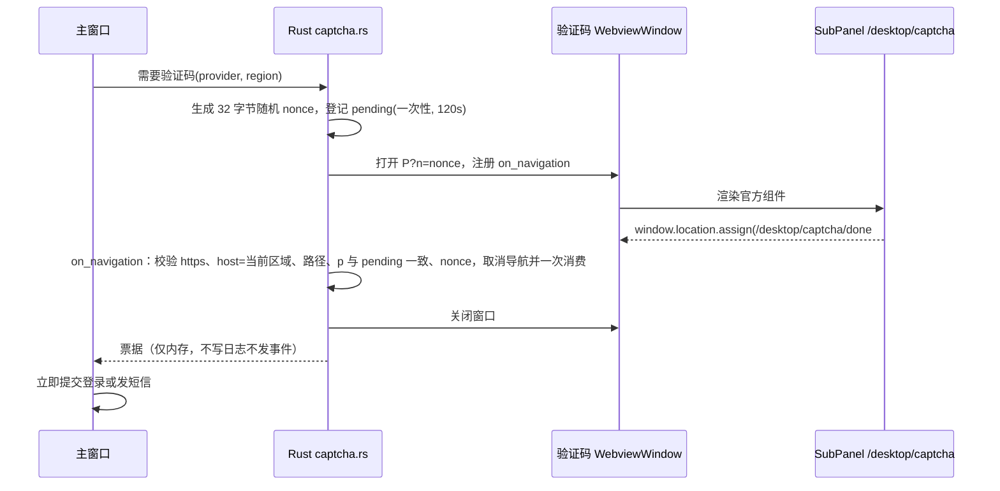

# WE2AI 桌面客户端定制方案 v13

日期：2026-09-23　基线：cc-switch we2ai 分支 `85777fa0`（4.20.4，上游 3.20.4）、SubPanel `1b881528`　后端：SubPanel

当前版本 v13，经 Codex 10 轮、Fable 5 两轮对抗评审修订，各版本改动见文末附录。

## 0. 已定决策

| # | 决策 | 结论 |
|---|---|---|
| 1 | 供应商范围 | 只有 we2ai.com，用户不可添加其他供应商 |
| 2 | 登录方式 | 邮箱密码（含 2FA）+ 国内版手机验证码；OAuth 全部不做 |
| 3 | 会话保持 | refresh_token 存系统钥匙串，静默续期，默认最长 30 天免登录 |
| 4 | 目标工具 | Claude Code、Codex、WorkBuddy；检测安装状态，未装给下载链接 |
| 5 | 指定模型 | 客户端本地写工具配置并激活，SubPanel 不存"哪台机器用哪个模型" |
| 6 | Key 选择 | 用户从已有 Key 中选，客户端不创建 Key |
| 7 | 其余模块 | 前端隐藏、Rust 启动白名单禁用、IPC 默认拒绝白名单拦截（第 6.2 节），代码保留 |
| 8 | 品牌 | productName、identifier、scheme、数据目录、图标、托盘、关于页全改为 WE2AI |
| 9 | 上游同步 | 继续整体 merge，冲突人工核对 |
| 10 | 后端改动 | **SubPanel 需要 6 处改动**（第 3.2 节），v1 的"后端零改动"不成立 |

## 1. 用户旅程

| 减少选择的规则 | 做法 |
|---|---|
| 不问槽位 | Claude Code 四个模型变量写同一模型（现有生成器即如此，`src-tauri/src/provider.rs:771-800`）；「高级」折叠可分别改 |
| 不问协议 | 工具按钮由服务端返回的 Key 级能力决定（第 3.2 节），客户端不做任何协议推断 |
| 不问供应商名 | Claude Code、Codex 各一条固定 id 的供应商记录原地更新；WorkBuddy 见第 4.3 节 |

## 2. 架构

## 3. SubPanel 接口

### 3.1 通用约定

| 项 | 规则 | 证据 |
|---|---|---|
| 响应 | 成功 `{code:0, message, data}`；失败 `{code≠0, message, reason?}` + HTTP 状态码 | `backend/internal/pkg/response/response.go:14-38` |
| 分页 | `data = {items, total, page, page_size, pages}`，默认 20 条；客户端循环到 `page == pages` | `backend/internal/handler/api_key_handler.go:104-147` |
| 请求头 | `Authorization: Bearer <access_token>`；`User-Agent: WE2AI-Desktop` 常量，跨版本、跨系统不变；版本与系统放 `X-We2ai-Client: desktop/<version>/<os>` | session binding 以 UA+IP 为指纹，UA 变化会撤销整个 refresh 家族（`backend/internal/service/session_binding.go:15`、`backend/internal/service/auth_service.go:1870`） |

### 3.2 SubPanel 需要新增或修改的 6 处

| # | 改动 | 原因 | 验收 |
|---|---|---|---|
| B1 | 新增 `GET /api/v1/desktop/keys/:id/models`，计算顺序：① Key 归属当前用户且 `status=active`、未过期；② 取 Key 分组可调度账号的模型集；③ 套分组模型白名单（`backend/internal/server/middleware/group_model_allowlist.go:32`）；④ 复合分组按模型解析目标平台（`backend/internal/server/routes/gateway.go:606`）；⑤ 逐 `模型 × 端点` 计算 `tools: ["claude_code","codex","workbuddy"]`。可选能力字段 `supports_tool_call / supports_images / reasoning_efforts` 无数据则省略 | 现有 `/api/v1/models` 按用户全部分组取并集，不接收 Key、不套白名单（`backend/internal/handler/usage_handler.go:744-781`、`backend/internal/service/model_routing_service.go:70`）；`provider` 是目录元数据，不是入站协议 | 负例全部覆盖：跨分组 Key、白名单外模型、复合分组同组不同模型、OpenAI 分组关闭 messages dispatch、禁用或过期 Key、他人 Key 返回 404 |
| B2 | 手机 `send-sms-code`、`phone-login` 的 DTO 与 handler 改为接收完整 `CaptchaProof`（turnstile_token / tencent ticket+randstr / aliyun param），调用 `VerifyCaptcha` | 现在只调 `VerifyTurnstile`，腾讯、阿里启用后手机流程必失败（`backend/internal/handler/auth_handler.go:795-800,869-883`） | 三家验证码分别开启时，手机发码与登录均通过 |
| B3 | 前端新增路由 `/desktop/captcha?n=<nonce>&p=<provider>`：复用现有验证码组件；成功后用 `window.location.assign()` 做**完整页面导航**（不用 `router.push`）到 `https://<本站>/desktop/captcha/done#n=<nonce>&p=<provider>&<proof>`。proof 按 provider 结构化：turnstile `t=`；tencent `ticket=&randstr=`；aliyun `param=` | 桌面端无法渲染验证码组件；腾讯校验需要两个独立字段（`backend/internal/service/auth_service.go:93`）；SPA 内路由切换不触发 WebView2 `NavigationStarting` | 三家验证码分别开启，桌面端发短信与登录端到端通过 |
| B4 | `/auth/logout`：用传入 refresh 查出家族 id（先查有效 token，查不到再查 B5 的已消费映射），调用已有的 `RevokeSessionFamily`（`backend/internal/service/auth_service.go:1912`）撤销整个家族：用一个 Redis Lua 脚本原子完成"写家族墓碑（TTL = refresh 有效期）+ 删除家族全部成员 token + 删除家族索引"，取代现在先取成员再删除的两步（`backend/internal/repository/refresh_token_cache.go:69`）；响应增加 `revoked: bool`，仅当查到家族且脚本执行成功时为 true | 现在只删单个 token 且吞掉错误（`backend/internal/handler/auth_handler.go:726-735`、`backend/internal/service/auth_service.go:1898`）；`DEL` 删 0 个键也算成功（`backend/internal/repository/refresh_token_cache.go:68`） | 撤销有效 token 返回 true 且同家族所有 token 失效；用已轮转旧 token 登出也能经已消费映射撤销家族并返回 true；映射过期后返回 false；网页端行为不变 |
| B5 | `/auth/refresh` 的消费与签发合并为**同一个** Lua 脚本：Go 先非破坏性读取旧 token 数据、完成用户状态与会话绑定校验、生成新 token 对；再执行脚本原子完成"旧 token 仍存在 → 删除旧 token → 家族墓碑不存在 → 写入新 token + 加入家族索引 + 加入用户索引"，同一脚本内再写入已消费映射 `consumed:<旧 token 哈希> → family_id`，TTL 为旧 token 的剩余有效期。任一条件不满足则整体拒绝、不产生任何写入。**复用检测：**提交的 refresh 命中已消费映射（说明旧 token 被重复使用），视为泄露，直接对该家族执行 B4 的撤销脚本。取代现在"读取→删除→签发"分步执行和分别存 token 与索引的做法（`backend/internal/service/auth_service.go:1790,1880`）。消费与签发之间没有空档：登出在脚本之前执行，用旧 token 查到家族、写墓碑，脚本随后被拒；在脚本之后执行，用旧 token 经已消费映射查到家族并撤销。后者覆盖"脚本已提交、响应丢失或客户端崩溃、客户端只剩旧 token"的情况 | 现在两个并发 refresh 可读到同一旧 token，各自签发后继 token（`backend/internal/service/auth_service.go:1823,1880`）；登出只能撤销其中之一 | 同一 refresh 并发两次只有一次成功，失败的那次触发复用检测、家族被撤销；脚本提交后丢弃响应，再用旧 token 登出，断言家族内无存活 refresh、旧 access token 返回 401；并发刷新两次后登出，断言家族内无存活 token；用测试钩子把登出固定在"Go 校验之后、脚本执行之前"执行，断言脚本被拒且无后继 token 可刷新 |
| B6 | 抽出共用的墓碑校验函数，在**两条** JWT 鉴权路径中调用：普通用户中间件（`backend/internal/server/middleware/jwt_auth.go:60` 之后）和管理员中间件（`backend/internal/server/middleware/admin_auth.go:165`，`/admin` 路由不经过普通中间件，`backend/internal/server/routes/admin.go:23`）。按 claims 的 `sid` 检查家族墓碑，存在即返回 401 `TOKEN_REVOKED`；无 `sid` 的旧 token 按现状处理 | 只撤销 refresh 家族时，已签发的 access token 到期前仍可调用返回明文 Key 的 `/keys`（`backend/internal/handler/dto/types.go:57`），默认有效期回退为 24 小时（`backend/internal/config/config.go:2438`） | 登出后用旧 access token 请求 `/api/v1/keys` 返回 401；管理员登出后旧 JWT 请求 `/api/v1/admin/*` 返回 401；未登出会话不受影响；中间件每请求多一次 Redis `EXISTS` |

工具与入站端点的对应关系固定：Claude Code → `/v1/messages`，Codex → `/v1/responses`，WorkBuddy → `/v1/chat/completions`。

B1 对每个 `模型 × 端点` 的判定**直接调用网关处理该端点时使用的同一组判定函数**（入站协议、目标平台、账号出站端点、messages dispatch 放行规则如 `allowOpenAICompatibleMessagesDispatch`，`backend/internal/handler/openai_gateway_handler.go:334`），不在方案或 B1 中另写平台对照表。若判定逻辑散落在 handler 内无法复用，先抽成 service 层纯函数，网关与 B1 共用。

B1 契约负例在前述基础上追加：Grok、Kimi、智谱、DeepSeek、MiniMax、OpenCode Go 分组无需 dispatch 开关即出现 `claude_code`；generic 分组按账号实际协议走 Gemini 兼容链的 `/v1/chat/completions`；每个返回的工具能力至少用真实请求打一次对应端点验证。

### 3.3 客户端使用的接口

| 用途 | 方法 路径 | 请求 | 响应 data |
|---|---|---|---|
| 公开设置 | GET /api/v1/settings/public | — | 验证码开关与 site key |
| 邮箱登录 | POST /api/v1/auth/login | email, password, 验证码字段 | TokenPair 或 `{requires_2fa, temp_token}` |
| 2FA | POST /api/v1/auth/login/2fa | temp_token, **totp_code**（6 位） | TokenPair |
| 发短信 | POST /api/v1/auth/send-sms-code | phone + CaptchaProof（B2 后） | — |
| 手机登录 | POST /api/v1/auth/phone-login | phone, code + CaptchaProof（B2 后） | TokenPair |
| 续期 | POST /api/v1/auth/refresh | refresh_token | 新 TokenPair，旧 refresh 原子失效（B5 后） |
| 登出 | POST /api/v1/auth/logout | **refresh_token**（不带则服务端不撤销） | `{revoked}`，撤销整个家族（B4 后） |
| Key 列表 | GET /api/v1/keys?page=&page_size=100 | — | 分页，取 `status=active` |
| Key 模型 | GET /api/v1/desktop/keys/:id/models | — | B1 |
| 日用量 | GET /api/v1/**user**/api-keys/:id/usage/daily | — | 第二期 |

区域与地址（一个安装包，登录页切换，记住上次）：

| 区域 | 地址 | 2026-09-23 实测 |
|---|---|---|
| 国际版 | `https://api.we2ai.com` | 在线，验证码均关闭 |
| 国内版正式 | `https://api.wtgo.com.cn` | 未上线 |
| 国内版测试 | `https://jiwu.wtgo.com.cn` | 在线，仅开发构建可选 |

工具写入的网关地址：Claude Code 用根地址，Codex、WorkBuddy 用 `/v1`。

## 4. 工具写入

### 4.1 统一入口 `we2ai_apply_model`

单一 Rust 命令，前端不再分别调 `add_provider` 和 `switch_provider`。

**不在外层拿 switch lock。** `ProviderService::switch` 内部会获取同一把按应用划分的非重入锁（`services/provider/mod.rs:5739`、`proxy/switch_lock.rs:18`），外层再拿会死锁。WE2AI 用自己的 `we2ai_apply` 互斥锁串行化自身调用，再调用现有 `switch`，由它自己拿锁。这样不改上游 provider 服务文件。`switch` 内部用 `futures::executor::block_on` 获取 tokio 锁（`services/provider/mod.rs:5743-5749`），上游命令都在 `spawn_blocking` 中调用它（`commands/provider.rs:119-125`），`we2ai_apply_model` 同样在 `spawn_blocking` 中执行，不直接在 async 上下文调用。

WE2AI 进程内没有其他切换入口：托盘的供应商切换菜单隐藏，本地代理接管在启动白名单中禁用（第 6.2 节）。

**跨进程：** live 文件（`~/.claude/settings.json`、`~/.codex/*`、WorkBuddy `models.json`）属于用户，CC Switch、工具本身或用户都可能同时改写。这些写入者之间没有共同遵守的文件锁，WE2AI 无法建立跨进程协调，因此**只做尽力检测，不承诺杜绝覆盖**：比对与替换之间的毫秒级窗口无法消除，这是已知限制，写进用户文档。策略是"写后记代次，恢复前比对"：

| 时点 | 动作 |
|---|---|
| 快照 | 记录每个文件的内容哈希 H0 |
| 写入后 | `switch` 返回后立即回读文件计算 H1，这样现有写入器的规范化、MCP 重投影都已计入，不改上游写入层。回读前的瞬间若有外部写入会被误记为 H1，归入本节已知限制 |
| 失败恢复前 | 当前哈希 = H1 才恢复（= H0 说明未写入，无需恢复）；否则判定被外部改写，不自动恢复，报告"检测到其他程序修改，未回滚"，并给出快照文件路径供用户手动恢复 |
| 应用启动与每次 apply 前 | 检测 CC Switch 进程是否在运行，在运行则在顶栏提示"CC Switch 也在管理这些工具，可能互相覆盖"。检测键：macOS 按 bundle id `com.ccswitch.desktop`；Windows 按进程名 `cc-switch.exe`；Linux 按可执行名 `cc-switch`。用户自行改名的便携版检测不到，列为已知限制 |

**前置条件：** ① apply 前校验 WE2AI 数据库中该应用只有固定 id 一条供应商、current 指向它或为空；② 用现有 `detect_takeover_in_live_configs` 同款判定检查目标 live 文件不处于代理接管状态（Claude `env` 含 `PROXY_MANAGED`、Codex 含本地代理路由）。任一不满足则拒绝并提示；接管状态的提示为"CC Switch 正在代理接管此工具，请先在 CC Switch 中关闭接管"。第 ② 条防止现有 `switch` 走热切换分支（`services/provider/mod.rs:5759-5797`）只改数据库、不写 live 却返回成功。"更新公共配置片段"分支由供应商 `meta.common_config_enabled == true` 门控（`services/provider/mod.rs:6229-6236`），与接管无关，由第 4.2 节"固定 id 供应商不启用公共配置"保证不进入。第 ① 条保证现有 `switch` 不会进入"回填旧供应商行"分支（`services/provider/mod.rs:5844`），快照清单无需覆盖旧供应商行。启动导入已禁用，正常使用下前置条件恒成立。

事务快照清单：

| 对象 | 内容 | 依据 |
|---|---|---|
| 数据库 | 固定 id 供应商行（含不存在状态）、该应用 DB current 标记 | `database/dao/providers.rs:180-238` |
| 本地设置 | 该应用的本地 current 供应商 | `services/provider/mod.rs:5961` |
| Claude Code | `~/.claude/settings.json` | |
| Codex | 复用 `CodexLiveStateSnapshot`：`auth.json`、`config.toml`、模型目录、托管 marker | `codex_config.rs:251-290` |
| WorkBuddy | `models.json`、托管状态记录 | 第 4.3 节 |

`switch` 返回成功不等于成功：回读 live 托管字段与期望模型一致才向用户报成功，否则走恢复清单并提示"检测到代理接管，未生效"。这覆盖前置条件检查与 `switch` 内部再判定之间 CC Switch 恰好开启接管的窗口（`services/provider/mod.rs:5778-5797`）。

验收：在 upsert 后、switch 中、live 写入后三个阶段分别注入失败，回读上表全部对象与快照一致。同一工具并发发起两次 apply，第二次排队完成且不挂起。故障注入前让另一进程改写 live 文件，WE2AI 不覆盖该文件并报告冲突（验收覆盖"比对前外部写入"，不覆盖不可消除的比对后窗口）。无外部写入时，在 Codex 规范化与 MCP 重投影之后注入失败，WE2AI 正常回滚且不误报冲突。数据库预置第二条供应商时 apply 被拒绝。CC Switch 开启代理接管后，WE2AI 的 apply 被拒绝且 live 文件不变。

### 4.2 Claude Code 与 Codex

**保留用户已有配置。** 现有管道把供应商配置整份写成 live 文件（Claude `services/provider/live.rs:1312`、Codex `codex_config.rs:1125`），固定 id 反复切换也不会触发回填分支。因此 apply 每次都先读当前 live 文件作为基底，只覆盖托管字段，再把合并结果作为供应商配置交给管道：

| 工具 | 托管字段（WE2AI 覆盖） | 其余内容 |
|---|---|---|
| Claude Code | `env.ANTHROPIC_BASE_URL`、`env.ANTHROPIC_AUTH_TOKEN`、`env.ANTHROPIC_MODEL`、`env.ANTHROPIC_DEFAULT_{SONNET,OPUS,HAIKU}_MODEL`；并删除会与之冲突的 `env.ANTHROPIC_API_KEY` | hooks、permissions、其他 env、MCP 等原样保留 |
| Codex | 顶层 `model_provider`、`model`；整张 `[model_providers.we2ai]` 表 | 其他顶层键、其他 provider 表、`[mcp_servers]`、profiles 等原样保留；用 `toml_edit` 保持格式与注释 |

live 文件不存在时以空对象或空文档为基底。

**外来密钥收敛：** 合并基底可能含用户自己的其他密钥（Codex 其他 `[model_providers.*]` 的 `experimental_bearer_token`、Claude 其他 env 密钥），而 `switch` 读取的是数据库行（`services/provider/mod.rs:5718`），合并结果必须先落库。`switch` 成功后立即再次 `save_provider`，把该行 `settings_config` 收敛为只含托管字段；下次 apply 仍从 live 重新取基底，不依赖数据库中的完整配置。固定 id 供应商的 `meta.common_config_enabled` 不设或为 false。验收：预置含 hooks、permissions、自定义 env 的 `settings.json` 和含 MCP、profiles 的 `config.toml`，预置含其他 provider 表 token 的 `config.toml`，apply 后数据库供应商行不含该 token。连续 apply 两次后：Claude 非托管字段的结构与值不变（现有 `write_json_file` 会对键排序并重新格式化，`config.rs:332`，不要求逐字节）；Codex 非托管内容的注释与格式保留。

托管字段的具体取值与 live 验收（数据库行在收敛后只保留"供应商内部配置"一列）：

| 工具 | 固定 id | 供应商内部配置 | live 文件验收 |
|---|---|---|---|
| Claude Code | `we2ai-claude` | `env.ANTHROPIC_BASE_URL`、`ANTHROPIC_AUTH_TOKEN`、`ANTHROPIC_MODEL`、`ANTHROPIC_DEFAULT_{SONNET,OPUS,HAIKU}_MODEL` | `~/.claude/settings.json` 对应字段 |
| Codex | `we2ai-codex` | `auth.OPENAI_API_KEY` + `[model_providers.we2ai]`（`we2ai` 不是保留名，不会被管道的保留名迁移改写，`codex_config.rs:2900-2915`），交给现有管道投影 | `config.toml` 含 `model_provider`、`model`、`base_url`、`wire_api="responses"`、provider 级 `experimental_bearer_token`；**Key 不出现在 `auth.json`**；官方 ChatGPT 登录按现有保留设置处理 |

依据：Codex 0.149 起第三方 Key 只写 config.toml（`src-tauri/src/codex_config.rs:3890-3902`）。

### 4.3 WorkBuddy

| 项 | 规则 |
|---|---|
| 目录 | `$WORKBUDDY_CONFIG_DIR` → `$CODEBUDDY_CONFIG_DIR` → `<home>/.workbuddy`；home 用 cc-switch 的 `dirs::home_dir()`，不读 `HOME`（Windows 上 Git/MSYS 的 `HOME` 可能错误，`src-tauri/src/config.rs:9-16`） |
| 条目模型 | 一个条目 = 一个模型（WorkBuddy 以 `id` 作模型名）。WE2AI 在自有数据库记录"上次托管的 id" |
| 托管记录 | 数据库记录上次写入条目的 `id` 与**内容指纹**（规范化 JSON 的 SHA-256） |
| 切换 | 按 id 找到旧条目并比较指纹：一致则删除；不一致说明被用户或其他工具改过，保留并提示"检测到手工修改，未删除"。再写入新条目；新 id 与非托管条目重名时弹窗确认后覆盖 |
| 字段 | `id, name:"WE2AI <model>", vendor:"Custom", url:<网关>/v1, apiKey, useCustomProtocol:false`；能力字段仅在 B1 返回时写入，未返回则省略，键名映射：`supports_tool_call → supportsToolCall`、`supports_images → supportsImages`、`reasoning_efforts → supportsReasoning:true + reasoning.supportedEfforts` |
| 写入 | 读原数组并记录文件哈希 → 修改 → 替换前再算一次哈希，变化则重读重算（最多 3 次，仍冲突则报错）→ 原子替换；不触碰非托管条目。WorkBuddy 自身不使用文件锁，最终比对与替换之间的窗口无法消除，同 4.1 属于尽力检测 |
| 文件权限 | Unix 下 `models.json` 写入后为 0600（参考写入器用的是 0644，`localwrite.rs:424`，不照搬）；已有文件为宽权限时写入后同样收紧为 0600 |
| 验收 | 新建文件与原为 0644 的已有文件，写入后均为 0600；写入后手改同 id 条目，再切换模型，手改条目保留且出现提示；读取之后、最终比对之前由另一写入器修改其他条目，该修改不丢失 |

WorkBuddy 事实（本机核实）：腾讯出品，`/Applications/WorkBuddy.app`，bundle id `com.tencent.workbuddy.mac`，5.5.3；`models.json` 为顶层数组。

### 4.4 安装检测

| 工具 | 检测 | 下载 |
|---|---|---|
| Claude Code | 复用 `get_tool_versions` | Anthropic 官方文档页 |
| Codex | 复用 `get_tool_versions` | openai/codex 发布页 |
| WorkBuddy | macOS 读 `/Applications/WorkBuddy.app/Contents/Info.plist` 版本；Windows 查 `%LOCALAPPDATA%\Programs\WorkBuddy\WorkBuddy.exe`；兜底查配置目录 | 国际 `workbuddy.ai/downloads`，国内 `workbuddy.cn/downloads/` |

## 5. 会话与安全

### 5.1 登录验证码（窗口内拦截，不经过系统协议）

| 要点 | 规则 |
|---|---|
| 不走 `we2ai://` | 系统协议可被其他程序抢注（Windows 注册在 HKCU），截获 URL 即可抢先消费票据 |
| 一次性 | 每次发短信、每次登录各取一张新票据；pending 超时或窗口被关闭即作废 |
| 票据结构 | 与 B3 一致，按 provider 结构化，腾讯为 ticket+randstr 两字段，Rust 侧映射到对应请求字段 |
| 触发条件 | 公开设置中任一家开启才弹窗；当前线上均关闭 |
| 深链入口 | 注册 `we2ai://`，解析器 `deeplink/parser.rs` 改为接受 `we2ai`；WE2AI 模式下 provider、mcp、skill、prompt 四类导入全部拒绝（避免创建非 WE2AI 供应商），第一版深链只用于唤起窗口。三条入口（single-instance、`on_open_url`、macOS `RunEvent::Opened`）合并到同一分发函数，错误分支不回传原始 URL |

### 5.2 令牌

| 项 | 规则 |
|---|---|
| access_token | 只在内存 |
| refresh_token | `keyring` crate；service=`com.we2ai.desktop`，account=`{region}:{user_id}`；切区域加载该区域会话，没有则登录 |
| 会话索引 | `~/.we2ai` 下持久化非秘密索引 `{region → user_id, email_masked}`，登录成功时写入（用户 id 取自登录后 `GET /api/v1/user/profile`）；重启时按当前区域查索引再读钥匙串 |
| 轮转落盘 | 服务端轮转后旧 refresh 立即失效（B5 后为原子操作）。响应到达后先写钥匙串再使用新 access token；写入失败、或刷新途中崩溃导致新 token 丢失，状态定义为"需重新登录"，不承诺免登录 |
| 会话锁 | 每个 `{region}:{user_id}` 一把会话锁，refresh 与 logout 共用；钥匙串写入带 generation，旧请求不得覆盖或清除新 token |
| 单飞续期 | 同一时刻只有一个 refresh，其余请求等待其结果 |
| 失败分类 | 仅 `TOKEN_REVOKED`、token invalid、session binding mismatch 回登录页；网络错误、429、5xx 保留凭证并退避重试 |
| 登出 | ① 置会话为"登出中"，拒绝新 refresh；② 等待在途 refresh 完成；③ 持最新 refresh_token 调 `/auth/logout`；④ 清钥匙串和索引，generation 递增使迟到的写入失效。仅当响应 `revoked:true` 才显示"已退出"，其余情况（网络失败、`revoked:false`、B4 未部署）显示"本地已退出，远端撤销未确认" |
| 免登录时长 | 文案写"默认最长 30 天，服务端策略、凭证撤销或网络指纹变化可能提前失效"（`backend/internal/service/session_binding.go:12-33`） |
| 钥匙串异常 | 锁定、不可用、拒绝访问时退化为本次会话内存保存，并提示 |
| API Key 落盘位置 | 复用供应商管道意味着明文 Key 会进入：① 三个工具的 live 配置文件；② WE2AI 数据库供应商表的 `settings_config`（`database/dao/providers.rs:219,249`）；③ 数据库定期备份（`database/backup.rs:412`）。v1–v8 的"数据库不存 Key"与此矛盾，予以删除 |
| 落盘权限 | Unix：`~/.we2ai` 目录 0700，数据库与备份文件 0600，启动时校验并收紧；Windows：数据根位于用户目录，继承当前用户 ACL，不额外处理 |
| 外来密钥 | apply 过程中用户 live 文件里的其他密钥会短暂进入数据库行，`switch` 成功后立即收敛清除（第 4.2 节）；若恰在此窗口触发定期备份，备份中会带上这些密钥，登出时随备份一并删除。列为已知限制 |
| 登出处理 | 登出时清空 WE2AI 数据库中两条固定供应商行的整个 `settings_config`，并删除 `~/.we2ai/backups` 下全部备份；工具 live 文件中的 Key 保留（否则工具立即不可用），登出确认弹窗说明这一点，并提供"同时从工具配置中移除 Key"勾选项 |
| Key 吊销 | 客户端不吊销 Key；需要作废时去网页端删除或禁用 Key |

## 6. 品牌与数据隔离

### 6.1 数据目录（阻断项修复）

cc-switch 在运行时代码里有 4 处独立写死 `~/.cc-switch`（2026-09-23 全仓扫描，排除测试代码与临时文件前缀）。只改 identifier 会让两个应用共享数据库、本地设置和备份：

| 位置 | 用途 |
|---|---|
| `config.rs:264,277` `get_app_config_dir()` | 数据库、日志等主数据根 |
| `settings.rs:583` `AppSettings::settings_path()` | 本地设置（含每个应用的本地 current 供应商、工具目录覆盖），每次切换都会写（`services/provider/mod.rs:5963`） |
| `panic_hook.rs:28` | setup 之前的崩溃日志回退目录 |
| `services/env_manager.rs:71` `get_backup_dir()` | 环境变量备份目录 |

| 项 | 规则 |
|---|---|
| 数据根 | `get_app_config_dir()` 在 WE2AI 模式返回 `~/.we2ai`，覆盖数据库、设置、日志、备份、OAuth marker |
| 迁移 | 不从 `~/.cc-switch` 自动导入任何数据 |
| 实现 | 新增 `we2ai::mode::data_root()`，上表 4 处在 WE2AI 模式下都改为调用它。其中 `get_app_config_dir()` **最先**返回 `~/.we2ai`，早于 Store override 与 Windows 旧目录回退（`config.rs:259`）；panic hook 在 setup 之前安装，其初始化前回退目录同步改为 `~/.we2ai`（`panic_hook.rs:24`、`lib.rs:347`） |
| 验收 | 负例一：预置指向 `~/.cc-switch` 的 Store override，WE2AI 仍写 `~/.we2ai`；负例二：setup 前触发 panic，日志落在 `~/.we2ai`；负例三：CC Switch 已有 `settings.json`（含自定义 Claude/Codex 目录），WE2AI 指定模型前后该文件内容与修改时间不变，WE2AI 写入的是默认工具目录 |
| 守卫 | `check-guards.sh` 扫描 `src-tauri/src` 非测试代码中的 `.join(".cc-switch")`，命中上表以外的位置即失败，拦截上游新增的写死路径 |

### 6.2 启动白名单

`lib.rs` 启动时会导入工具配置、初始化供应商、恢复代理、启动同步任务（`lib.rs:534-541,727-782,1141-1148,1257-1264`）。WE2AI 模式下：

| 启动项 | 处理 |
|---|---|
| 数据库初始化、托盘、窗口、更新器、深链 | 保留 |
| 首次运行导入现有工具供应商 | 禁用 |
| 官方供应商种子 `init_default_official_providers()`（`lib.rs:776`、`database/dao/providers_seed.rs:30`） | 禁用 |
| 累加模式每次启动导入供应商 | 禁用 |
| 默认 Skills 初始化、Skills 扫描 | 禁用 |
| 表为空时导入 MCP、导入提示词 | 禁用 |
| 本地代理恢复与接管（`lib.rs:1260`） | 禁用 |
| 启动时的接管残留恢复 `recover_from_crash()`（`lib.rs:1235-1243`） | 禁用。CC Switch 开启代理接管时 live 文件含 `PROXY_MANAGED` 占位符（`services/proxy.rs:2729-2774`），WE2AI 若执行恢复会改写 CC Switch 正在接管的文件 |
| 退出时的 live 恢复 `stop_with_restore_keep_state()`（`lib.rs:1916-1928`） | 禁用，理由同上 |
| WebDAV/S3 同步、会话索引、用量轮询 | 禁用 |
| 托盘供应商切换菜单 | 隐藏 |
| 命令注册表 | 上游 `generate_handler!` 列表一行不动；`we2ai_*` 命令放在 WE2AI 自己的第二个 `generate_handler!` 中 |
| 命令分发 | **默认拒绝的 IPC 白名单**：`.invoke_handler(tauri::generate_handler![...])` 改为 `.invoke_handler(we2ai::mode::gate(we2ai_handler, tauri::generate_handler![...]))`。`gate` 读取 `invoke.message.command()`（Tauri `ipc/mod.rs:543`；本节 Tauri 行号取自本机 registry 的 tauri-2.11.5 源码，`src-tauri/Cargo.lock` 当前锁定 2.10.3，两版结构相同，上游升级后需复核）：`we2ai_*` 交给 WE2AI handler；白名单内的上游命令交给上游 handler；其余调用 `resolver.reject(...)` 后返回 `true`，避免框架再报一次 not found |
| 插件命令 | `plugin:*` 命令走插件分发，不经 `invoke_handler`（Tauri 2 `webview/mod.rs:1811-1912`），gate 管不到，由 `src-tauri/capabilities/default.json` 控制。当前只开放 opener、updater、log、process、dialog、window 子集，未开放 store、fs。守卫对 capabilities 文件做权限白名单，上游新增权限即失败 |

IPC 白名单（WE2AI 模式唯一可调用的命令）：

| 类别 | 命令 |
|---|---|
| WE2AI 自有 | 全部 `we2ai_*`：登录、登出、会话、Key、模型、`we2ai_apply_model`、安装检测、验证码，以及 `we2ai_get_settings`、`we2ai_save_settings` |
| 上游启动必需 | `get_init_error`、`get_migration_result`、`get_skills_migration_result`、`set_window_theme` |
| 上游功能 | `get_tool_versions`、`check_for_updates`、`install_update_and_restart`、`restart_app`、`open_external`、`get_auto_launch_status`、`set_auto_launch` |
| 窗口控制 | 走 `plugin:window`，受 capabilities 管控，不在此表 |

设置读写不放行上游 `get_settings` / `save_settings`：gate 只能读 payload、不能改写（`ipc/mod.rs:498-509`），而 `save_settings` 会整体覆盖 `AppSettings`，包括本地 current 供应商与工具目录覆盖（`commands/settings.rs:62-71`）。改由 `we2ai_get_settings` 只返回主题、语言、窗口、开机自启字段；`we2ai_save_settings` 读取现有设置、只覆盖这些字段后保存。

前端：WE2AI 模式下不调用 `syncModelsDevPricingOnStartup`（`src/main.tsx:91,135`）等上游启动任务；实施时以"启动日志中无 IPC 拒绝记录"为准逐一补齐白名单。

所有供应商命令（`add/update/delete/switch_provider`）、导入导出（`import_config_from_file`、`restore_db_backup` 等）、MCP、Skills、Prompts、代理、同步命令都不在白名单内。托管记录只能经 `we2ai_apply_model` 修改，它在 Rust 内部调用服务层，不经过 IPC，因此不受白名单影响。上游以后新增的命令默认被拒，无需逐个跟进。

命令层验收：直接 `invoke` 以下调用均返回错误，数据库与工具 live 文件不变——`add_provider`（非 WE2AI id）、`update_provider`（固定 id + 非 WE2AI 地址）、`add_provider`（固定 id + 错误 app）、`switch_provider`、`import_config_from_file`、`restore_db_backup`；`get_settings`、`save_settings` 被拒；`we2ai_save_settings` 携带工具目录字段时该字段被忽略。守卫：单测断言白名单外的任一已注册命令被拒。全流程验收：启动、登录、指定模型、切换主题、检查更新、开关开机自启、登出，全程无 IPC 拒绝日志。

实现：新增 `we2ai::mode::startup_allowed(task) -> bool`，在上述每个调用点前加一行判断（起点 `lib.rs:852` 导入链，实施时逐个枚举调用点并登记到功能列表）。验收：全新数据根首次启动、第二次启动各一次，确认数据库中供应商表只有 WE2AI 写入的记录，MCP、提示词、Skills 表为空，无代理监听端口。CC Switch 开启代理接管后启动并退出 WE2AI，Claude 与 Codex 的 live 文件逐字节不变。

### 6.3 改名清单

| 位置 | 现值 | 新值 |
|---|---|---|
| `tauri.conf.json` productName / identifier / scheme | CC Switch / com.ccswitch.desktop / ccswitch | WE2AI / com.we2ai.desktop / we2ai |
| `src-tauri/src/deeplink/parser.rs` 协议校验 | ccswitch | we2ai（WiX 模板从 `tauri.conf.json` 的 schemes 取值，无需改 wxs） |
| `lib.rs` 深链前缀、启动日志、tooltip | ccswitch:// / CC Switch | we2ai:// / WE2AI |
| `tray.rs` 主页链接 | ccswitch.io | we2ai.com |
| `src-tauri/src/auto_launch.rs` 开机自启注册名 | CC Switch（`auto_launch.rs:20,34`） | WE2AI |
| `src-tauri/icons/*` | 上游 | `pnpm tauri icon assets/designs/appicon.png` |
| `src/index.html` favicon、登录页与关于页 logo | 上游 | `assets/designs/favicon.svg`、`web-logo.svg` |
| i18n 与 12 个前端文件中的品牌文字 | CC Switch | WE2AI |
| updater endpoints 与公钥 | fork 已有 | 不变；identifier 不影响验签 |
| `.github/workflows/release.yml` DMG 打包步骤 | `.app` 名、卷名、图标目标写死为 CC Switch（`release.yml:324` 附近） | WE2AI；产物文件名同步改为 WE2AI 前缀 |
| `.github/workflows/release.yml` Windows 便携版 | 直接复制 `cc-switch.exe` 进 ZIP（`release.yml:468`） | ZIP 内可执行文件重命名为 `WE2AI.exe` |

identifier、productName、scheme 在首次发版前冻结，之后不再改。

## 7. 上游同步

上游文件触点（v1 的"≤3 处入口"低估了改动面，已废弃）：

| 文件 | 触点 | 冲突预期 |
|---|---|---|
| `src/App.tsx` | WE2AI_MODE 时渲染 `We2aiShell`，其余视图入口不渲染 | 高 |
| `src-tauri/src/lib.rs` | `mod we2ai`、`gate(we2ai_handler, ...)` 包裹上游 `generate_handler!`、启动与退出白名单判断（约 8 处）、深链前缀 | 高 |
| `src/main.tsx` | WE2AI 模式跳过上游启动任务 | 中 |
| `src-tauri/src/config.rs`、`settings.rs`、`panic_hook.rs`、`services/env_manager.rs` | 数据根（第 6.1 节 4 处） | 中 |
| `src-tauri/src/tray.rs`、`auto_launch.rs` | 品牌、隐藏托盘切换菜单 | 低 |
| `src-tauri/capabilities/default.json` | 不改，受守卫监控 | 低 |
| `tauri.conf.json` | 品牌与 scheme | 中 |
| `src-tauri/src/deeplink/parser.rs`、深链导入分发 | 协议名、WE2AI 模式拒绝导入 | 中 |
| `src-tauri/Cargo.toml` | `keyring` 依赖 | 低 |
| 品牌文字文件 | 第 6.3 节 | 低 |
| `.github/workflows/release.yml` | 打包命名 | 中（上游改发版流程时冲突） |

守卫从"数标记"改为校验行为：

| 守卫 | 检查方式 |
|---|---|
| 数据根 | 单测断言 WE2AI 模式下 `get_app_config_dir()` 以 `.we2ai` 结尾，含存在 override 的负例 |
| 启动白名单 | 单测断言禁用项返回 false |
| scheme 唯一 | `tauri.conf.json` 只有 `we2ai`；单测断言 `we2ai://` 能解析、`ccswitch://` 被拒、WE2AI 模式下导入请求被拒 |
| 品牌残留 | 用户可见字符串中无 `CC Switch` |
| 写死路径 | 非测试代码中 `.join(".cc-switch")` 只出现在第 6.1 节登记的 4 处 |
| IPC 白名单 | 单测断言白名单外的任一已注册命令被拒 |
| 插件权限 | `capabilities/default.json` 权限集与登记清单一致，上游新增权限即失败 |

每次上游合并后执行：无提交合并演练 → 守卫 → 同时启动 CC Switch 与 WE2AI，确认数据库、日志、窗口状态互不影响。

## 8. 实施阶段与验收

| 阶段 | 交付 | 验收 |
|---|---|---|
| P0 壳、品牌、隔离 | 6.1–6.3；WE2AI_MODE；隐藏视图；启动与退出白名单；IPC gate | 两个应用同时运行互不影响；`~/.cc-switch` 无新写入；第 6.2 节命令层验收通过；守卫通过 |
| P1 SubPanel 改动 | B1–B6（B3 为前端路由，其余为后端）+ 契约测试（真实 Gin router，含分页、2FA、B1 全部负例、登出撤销家族、并发 refresh、登出后旧 access token 401） | SubPanel 单测通过；在 jiwu 测试环境部署 |
| P2 登录会话 | 5.1、5.2 | 重启免登录；升级版本后续期不掉线；并发 10 个请求同时过期只发生一次 refresh；断网不回登录页；钥匙串写入失败进入"需重新登录"；登出后旧 refresh 无效；三家验证码各自开启时发短信与登录均通过 |
| P3 Key 与模型广场 | Key 分页拉取、B1 渲染 | 不同分组 Key 显示不同模型与按钮 |
| P4 写入 | 4.1–4.4 | 三工具各指定两次，live 文件托管字段符合第 4 节、非托管内容不变；三阶段故障注入后快照清单全部回到原状；同工具并发 apply 不挂起；WorkBuddy 手改条目保留；Windows 下错误 `HOME` + 正确 `USERPROFILE` 仍写对目录 |
| P5 收尾 | 功能列表、守卫、macOS/Windows 安装升级卸载并存矩阵、发版；检查实际产出的 DMG 内 `.app` 名与卷名为 WE2AI、Windows 便携版 ZIP 内为 `WE2AI.exe`，并与 CC Switch 并存安装；两款应用分别开启、查询、关闭开机自启互不影响；Unix 下 `~/.we2ai` 为 0700、数据库与备份为 0600；登出后数据库供应商行无 Key、备份目录为空 | `pnpm test`、`cargo test` 通过 |

分支：cc-switch 从 `we2ai` 切 `feature/we2ai-client`；SubPanel 从 `zhiguofan` 切 `feature/desktop-api`，按其 CHANGELOG 与功能列表规则提交。

## 9. 风险

| # | 风险 | 处理 |
|---|---|---|
| R1 | B1 能力计算与网关实际行为漂移 | B1 复用网关路由判定函数，不另写一套；契约测试逐工具实际请求一次 |
| R2 | 国内版正式环境未上线 | 开发期对 jiwu 联调；上线后回归登录、Key 列表、B1 |
| R3 | App.tsx、lib.rs 上游改动频繁 | 触点集中到 `We2aiShell` 与 `we2ai::mode`，每次同步走第 7 节演练 |
| R4 | WorkBuddy Windows 安装路径未验证 | 兜底查配置目录；在 Windows 实机验证 |
| R5 | 钥匙串在部分 Linux 桌面不可用 | 退化为内存会话并提示 |

## 10. 与 SubPanel 的仓库关系

两仓库分离，客户端继续跟 cc-switch 上游，与 SubPanel 通过接口契约联动。

| 选项 | 结论 | 理由 |
|---|---|---|
| A 分离并跟上游 | **采用** | 白拿上游对工具写入、检测、平台兼容的持续修复 |
| B 分离并脱钩 | 备选 | 触发条件：单次同步冲突超过 1 小时，或上游两次以上破坏 WE2AI 入口 |
| C 搬进 SubPanel | 不采用 | 需多养 Rust/Tauri 工具链与签名发版，每次推送过 SubPanel pre-push 与 e2e |

SubPanel 侧联动：

| # | 动作 | 验收 |
|---|---|---|
| 1 | `API_DOCUMENTATION.md` 新增"桌面客户端依赖接口"，与本方案 3.3 一致 | 清单一致 |
| 2 | 契约测试走真实 Gin router，校验 envelope、分页、2FA、B1 跨 Key 负例 | 字段改名或行为变化时测试失败 |
| 3 | 识别 `X-We2ai-Client` 头用于日志与统计 | 日志可见 |
| 4 | 两仓库功能列表互相登记 | 任一侧同步上游时可见对面依赖 |

## 附录：评审记录

每轮意见均逐条核实代码证据后处理，版本号与轮次对应关系见"处理"列。

| 轮次 | 评审者 | 结论 | 处理 |
|---|---|---|---|
| 1 | Codex（gpt-5.6-sol） | FAIL：阻断 2、高 7、中 4 | 13 条全部采纳，形成 v2 |
| 2 | Codex（gpt-6-sol） | FAIL：第 1 轮 4 条已解决、9 条部分解决；新增阻断 1、高 5、中 3 | 9 条全部采纳，形成 v3 |
| 3 | Codex（gpt-6-sol） | FAIL：第 2 轮 6 条已解决、3 条部分解决；剩高 3、中 3，无阻断 | 6 条全部采纳，形成 v4 |
| 4 | Codex（gpt-6-sol） | FAIL：第 3 轮 2 条已解决、4 条部分解决；阻断 1、高 2、中 2 | 5 条全部采纳，形成 v5；跨进程两条按"无法协调则收窄保证"处理 |
| 5 | Codex（gpt-6-sol） | FAIL：第 4 轮 3 条已解决、2 条部分解决；阻断 1、中 2 | 3 条采纳形成 v6；H1 未按"从写入层传出字节"实现，改为切换后回读，避免改上游写入层 |
| 6 | Codex（gpt-6-sol） | FAIL：第 5 轮 2 条已解决、1 条部分解决；阻断 1、高 1 | 2 条采纳形成 v7；消费空档改用"消费与签发同一脚本"消除，未采用"已消费 token 映射" |
| 7 | Codex（gpt-6-sol） | FAIL：第 6 轮 2 条部分解决；阻断 1、高 1、中 1 | 3 条采纳形成 v8；第 6 轮拒绝的"已消费 token 映射"被证明必要（响应丢失场景），改为采纳并加复用检测 |
| 8 | Codex（gpt-6-sol） | FAIL：第 7 轮 3 条已解决；高 1、中 2 | 3 条采纳形成 v9 |
| 9 | Codex（gpt-6-sol） | FAIL：第 8 轮 3 条已解决；高 1、中 2 | 3 条采纳形成 v10；并主动全仓扫描写死路径，一次补齐 4 处 |
| 10 | Codex（gpt-6-sol） | FAIL：第 9 轮 2 条已解决、1 条部分解决；高 2 | 改为 IPC 默认拒绝白名单，一次覆盖两条及上游未来新增命令，形成 v11 |
| 11 | Codex（gpt-6-sol） | 未完成：Codex 用量额度耗尽 | 改由 Fable 5 先行评审 |
| 11 | Fable 5（claude-fable-5-1） | FAIL：高 1、中 3、低 3；确认 IPC 白名单在 Tauri 2 可行，前 10 轮修复无回退 | 7 条全部采纳，形成 v12 |
| 12 | Fable 5（claude-fable-5-1） | **PASS**：上轮 6 条已解决、1 条部分解决；剩中 1、低 6 | 全部采纳，形成 v13 |
