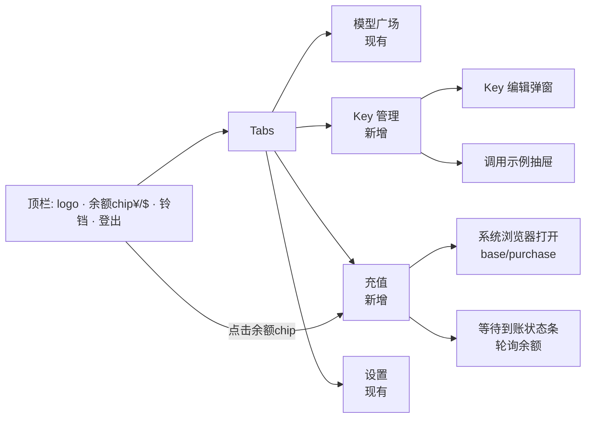
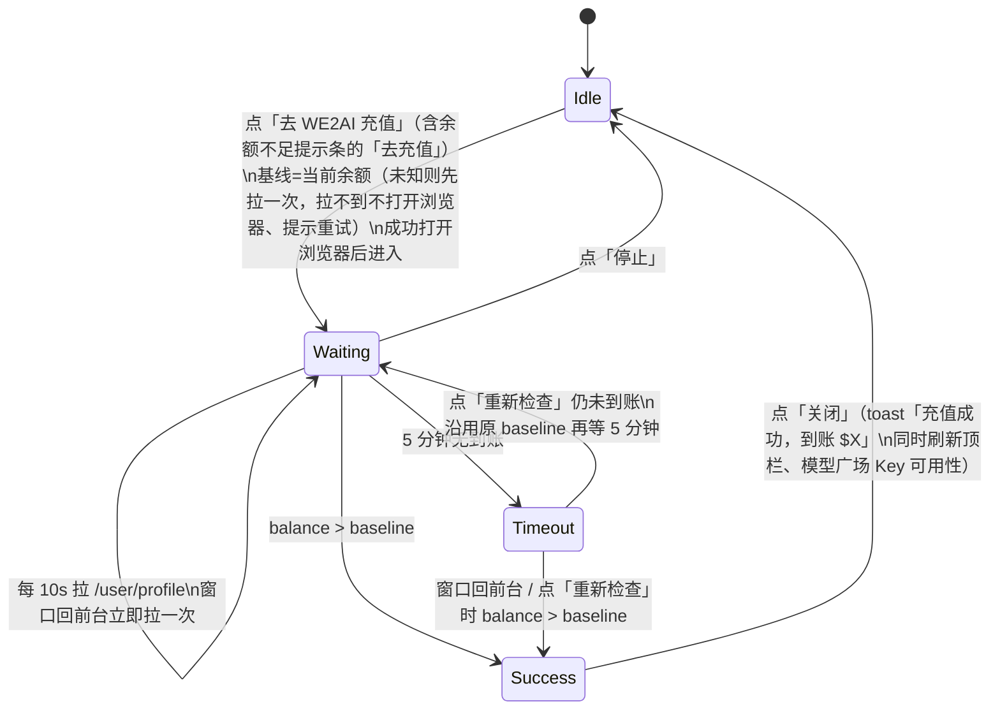

# WE2AI 客户端：充值与 Key 管理设计方案（v0.1 草案）

> 目标：客户端内查余额、一键跳转 Web 充值页、增删改 Key，并在 Key 管理页拿到 curl / Python / Java 等调用样例。
> 依据：客户端现状（`src-tauri/src/we2ai/keys.rs`、`api.rs`、`We2aiShell.tsx`）+ SubPanel 接口（`backend/internal/server/routes/{user,payment}.go`）。
> 原型：`docs/we2ai/prototypes/billing-keys.html`（Codex 绘制）。

## 0. 现状与差距

| 能力 | 客户端现状 | SubPanel 已有接口 | 差距 |
|---|---|---|---|
| Key 列表 | 只读，仅 `active`/`quota_exhausted`，前端只拿掩码 | `GET /api/v1/keys`（返回明文、额度、过期、用量） | 缺额度/过期/用量字段；缺 `inactive`/`expired` |
| 创建/编辑/删除/启停 | 无 | `POST/PUT/DELETE /keys[/:id]` | 全缺 |
| 调用样例 | 无（Web 端也只有 CLI 配置模板） | 无需后端 | 客户端本地生成 |
| 余额 | 无（`UserProfile` 只解析 id/email） | `GET /user/profile` → `balance` 等 | 缺 |
| 充值 | 无 | Web 端 `{base}/purchase`（与 API 同域，含全部支付方式与兑换码） | **复用 Web 充值页，客户端不实现支付** |

## 1. 信息架构



- 顶栏余额 chip：显示 `balance`（美元），点击跳「充值」Tab；余额 < $1 时 chip 变橙色。
- 模型广场 Key 不可调用且原因为余额不足时，提示条增加「去充值」按钮。
- 无 Key 时，模型广场空状态 `noKeys` 的「请先在 WE2AI 网站创建」改为「去创建 Key」按钮，跳 Key 管理。

## 2. Key 管理页

### 2.1 列表

| 列 | 来源字段 | 展示 |
|---|---|---|
| 名称 / 分组 | `name`、`group.name`、`group.rate_multiplier` | 分组 chip，倍率 ≠1 时显示 `×0.8` |
| Key | 由 Rust 生成掩码 `sk-123…cdef` | mono；「复制」按钮（见 2.4） |
| 状态 | `status` | 正常 / 已禁用 / 额度用完 / 已过期 四色 chip |
| 额度 | `quota_used` / `quota`（0=不限） | 进度条 + `$3.20 / $10`；不限显示 `$3.20 / 不限` |
| 过期 | `expires_at` | 相对时间；7 天内橙色 |
| 最近使用 | `last_used_at` | 相对时间 |
| 操作 | — | 调用示例 · 编辑 · 启用/禁用 · 删除 |

- 顶部：搜索框（本地过滤名称）、状态筛选、「+ 新建 Key」。
- 管理页列出**全部状态**；模型广场保持只列可用 Key（现有逻辑不动）。

### 2.2 新建 / 编辑弹窗（一期字段）

| 字段 | 接口字段 | 规则 |
|---|---|---|
| 名称* | `name` | 1–50 字符 |
| 分组 | `group_id` | 下拉，选项来自 `GET /groups/available` + `/groups/rates` 显示倍率 |
| 额度上限 | `quota` | 美元，空/0=不限；编辑时附「重置已用额度」勾选 → `reset_quota` |
| 有效期 | 新建 `expires_in_days`；编辑 `expires_at` | 选项：永久/7/30/90/自定义日期 |
| 状态 | `status` | 仅编辑；开关 |

- 二期（折叠「高级设置」）：IP 白/黑名单、5h/1d/7d 限速、自定义 Key。一期不做，避免表单过重。
- 新建请求带 `Idempotency-Key: <uuid>`（同一次弹窗提交重试复用）。
- 新建成功后弹出「Key 已创建」卡片：显示完整明文 + 复制按钮 + 直接打开调用示例；关闭后明文从前端状态清除。

### 2.3 删除 / 禁用

- 删除用应用内确认弹窗（不用系统 `confirm`），要求输入 Key 名称确认。
- 若该 Key 是当前已写入工具（`key_selection.json` 选中项）的 Key，确认弹窗额外提示「Claude Code / Codex 当前使用此 Key，删除后将无法调用」。
- 变更成功后：失效 `We2aiKeyState` 缓存 → 刷新管理列表和模型广场 Key 下拉。

### 2.4 明文处理（安全边界）

现状约束：明文只在 Rust 内存，不过 IPC，守卫 4.5 锁定 `KeyView` 字段。方案：

| 动作 | 实现 | 明文是否进前端 |
|---|---|---|
| 列表展示 | 新视图 `KeyManageView`（掩码 + 额度等），**不改** `KeyView` | 否 |
| 复制 Key | 新命令 `we2ai_reveal_key(keyId)` → 前端拿到后立即 `copyText()`，不进 state | 是，瞬时 |
| 示例里「填入真实 Key」 | 同上命令，仅存在于示例抽屉组件局部 state，关闭即清 | 是，限抽屉生命周期 |
| 示例默认 | 使用占位 `$WE2AI_API_KEY` / `os.environ["WE2AI_API_KEY"]` | 否 |

- `we2ai_reveal_key` 只接受缓存里已有的 keyId（同 `KEY_NOT_FOUND` 规则），不提供批量导出。
- 守卫新增：`KeyManageView` 字段清单锁定、不含 `key` 字段；`we2ai_reveal_key` 返回类型单独登记。

## 3. 调用示例抽屉

### 3.1 交互

```
┌ 调用示例 · 我的Key(默认分组) ──────────────── ✕ ┐
│ 协议: [OpenAI 兼容] [Anthropic] [Responses]     │
│ 模型: [claude-sonnet-4-5 ▾]   □ 填入真实 Key     │
│ 语言: curl | Python | Node.js | Java | Go       │
│ ┌──────────────────────────────────────────┐   │
│ │ <代码块，mono，语法高亮可选>               │   │
│ └──────────────────────────────────────────┘   │
│ Base URL: https://api.we2ai.com/v1  [复制]       │
│                                  [复制代码]     │
└────────────────────────────────────────────────┘
```

- 模型下拉：来自现有 `we2ai_key_models(keyId)`（B1），只列 `callable` 模型；默认选第一个。
- 协议默认值：分组 `platform=anthropic` → Anthropic；其余 → OpenAI 兼容。
- Base URL：新命令 `we2ai_gateway_info` 返回 `region.base_url()`；OpenAI/Responses 用 `{base}/v1`，Anthropic 用 `{base}`（与 `apply.rs` 写入工具的规则一致）。
- 「Anthropic」协议下 Java/Go 样例用原生 HTTP，不引入 SDK。

### 3.2 模板矩阵（`{BASE}`、`{MODEL}`、`{KEY}` 为占位）

| 语言 \ 协议 | OpenAI 兼容 `/v1/chat/completions` | Anthropic `/v1/messages` | Responses `/v1/responses` |
|---|---|---|---|
| curl | ✅ | ✅ | ✅ |
| Python | `openai` SDK | `anthropic` SDK | `openai` SDK |
| Node.js | `openai` SDK | `@anthropic-ai/sdk` | `openai` SDK |
| Java | `java.net.http`（JDK 11+，无依赖） | 同左 | 同左 |
| Go | `net/http` 标准库 | 同左 | 同左 |

示例（OpenAI 兼容 · curl）：

```bash
curl {BASE}/v1/chat/completions \
  -H "Authorization: Bearer {KEY}" \
  -H "Content-Type: application/json" \
  -d '{"model":"{MODEL}","messages":[{"role":"user","content":"Hello"}]}'
```

示例（Anthropic · Python）：

```python
import os
from anthropic import Anthropic

client = Anthropic(base_url="{BASE}", api_key=os.environ["WE2AI_API_KEY"])
msg = client.messages.create(
    model="{MODEL}",
    max_tokens=1024,
    messages=[{"role": "user", "content": "Hello"}],
)
print(msg.content[0].text)
```

示例（OpenAI 兼容 · Java）：

```java
import java.net.URI;
import java.net.http.*;

public class We2aiDemo {
    public static void main(String[] args) throws Exception {
        String body = """
            {"model":"{MODEL}","messages":[{"role":"user","content":"Hello"}]}
            """;
        HttpRequest req = HttpRequest.newBuilder(URI.create("{BASE}/v1/chat/completions"))
            .header("Authorization", "Bearer " + System.getenv("WE2AI_API_KEY"))
            .header("Content-Type", "application/json")
            .POST(HttpRequest.BodyPublishers.ofString(body))
            .build();
        HttpResponse<String> resp = HttpClient.newHttpClient()
            .send(req, HttpResponse.BodyHandlers.ofString());
        System.out.println(resp.body());
    }
}
```

- 模板放 `src/we2ai/codeSamples.ts`，纯函数 `renderSample(lang, protocol, {base, model, key})`，全部单测快照覆盖（15 个组合）。
- 「填入真实 Key」关闭时：curl 用 `$WE2AI_API_KEY`，其余语言读环境变量；并在代码块上方提示 `export WE2AI_API_KEY=sk-...`。

## 4. 充值：复用 Web 充值页

决策：客户端**不实现支付**，统一跳 SubPanel Web 充值页 `{base}/purchase`（与 API 同域，已确认可打开）。支付方式、兑换码、订单、退款只维护 Web 一套。

### 4.1 入口

| 入口 | 动作 |
|---|---|
| 顶栏余额 chip | 切到「充值」Tab |
| 「充值」Tab 主按钮「去 WE2AI 充值」 | `open_external({base}/purchase)` |
| 「充值」Tab 次按钮「订单记录」 | `open_external({base}/orders)` |
| 模型广场「余额不足」提示条 | 「去充值」→ 切到充值 Tab 并直接执行主按钮流程（打开 `{base}/purchase` + 开始到账检测） |

- URL 由 Rust 侧 `we2ai_gateway_info` 返回的 `base_url` 拼接，前端不硬编码域名；`domestic_dev` 自动指向 `https://jiwu.wtgo.com.cn/purchase`。
- **优先级：国际版先行**。首个交付只验收国际版 `https://api.we2ai.com/purchase`（浏览器内完成 Stripe/Airwallex 等国际支付，客户端不接触支付 SDK）；国内版代码路径相同，随后单独验收。
- 按钮下方说明文案按区域切换：国际版「支持银行卡（Stripe）等，将在浏览器中打开」；国内版「支持支付宝/微信/兑换码」。
- 浏览器未登录时，SubPanel 路由守卫自动跳 `/login?redirect=/purchase`，登录后回到充值页（`SubPanel/frontend/src/router/index.ts:947-953`）；浏览器保留登录态，之后无需再登。

### 4.2 「充值」Tab 布局

| 区块 | 内容 |
|---|---|
| 余额卡 | 可用余额 `$`、冻结、累计充值；「刷新」按钮。人民币 hover 折算**本期未做**：汇率只在 B1 `pricing.cnyRate`（随 `we2ai_key_models` 返回，仅模型广场页内持有），顶栏/充值页没有现成汇率，不为此新增接口；后续若 `/user/profile` 或网关信息带汇率再补 |
| 主操作 | 「去 WE2AI 充值」大按钮 + 按区域切换的支付方式说明（见 4.1） |
| 等待到账条 | 点击主按钮后出现：「等待到账… 已检查 3 次」+「我已完成支付」（立即刷新）+「停止」 |
| 次操作 | 「订单记录」链接 |

### 4.3 到账检测



- Timeout 是独立状态（不回 Idle）：停止自动轮询，但窗口回前台与「重新检查」仍会检查；面板提供「重新检查」「去订单记录查看」。
- Success 保持显示到点「关闭」或再次发起充值；到账同时通知模型广场重拉准入状态，「余额不足」提示条随之消失。
- 轮询放前端（用户此时在浏览器付款，客户端窗口可能失焦但未隐藏；超时后停止，不常驻）。
- 10s 一次 × 5 分钟 = 30 次，远低于 240 次/分钟限流。
- 余额增加但非本次充值（如他人代充）同样提示成功，不区分来源。

### 4.4 不做

客户端内下单、二维码、订单轮询、兑换码输入、内嵌 WebView 支付（需向远程页注入 JWT，且 Stripe/支付宝跳转在内嵌窗口不稳定）。

### 4.5 二期可选：免二次登录

浏览器首次需登录一次。若要消除，需后端新增一次性票据：客户端 `POST /desktop/handoff`（已登录）→ 返回 60s 有效的 `code` → 打开 `{base}/auth/desktop-handoff?code=…&redirect=/purchase` → Web 端换取登录态。SubPanel 目前无此接口，一期不做。

## 5. 新增 Tauri 命令（全部 `we2ai_` 前缀，默认放行，无需改白名单）

| 命令 | SubPanel 接口 | 返回给前端 |
|---|---|---|
| `we2ai_gateway_info` | — | `{ base_url }` |
| `we2ai_get_balance` | `GET /user/profile` | `{ balance, frozen_balance, total_recharged }` |
| `we2ai_manage_list_keys` | `GET /keys`（全部状态，分页同现有） | `KeyManageView[]` |
| `we2ai_list_key_groups` | `GET /groups/available` + `/groups/rates` | `[{id,name,platform,rate}]` |
| `we2ai_create_key` | `POST /keys` + `Idempotency-Key` | `KeyManageView` + 一次性明文 |
| `we2ai_update_key` | `PUT /keys/:id` | `KeyManageView` |
| `we2ai_delete_key` | `DELETE /keys/:id` | `()` |
| `we2ai_reveal_key` | —（读缓存） | `string` |

- 打开充值页复用已在白名单的上游命令 `open_external`，不新增命令。
- 全部走现有 `call_protected_api`（自动续期、401 终止会话同 `keys.rs`）。
- Key 写操作成功后统一调用 `We2aiKeyState::invalidate()`，并 emit `we2ai-keys-changed` 让模型广场刷新。
- 文件拆分：`src-tauri/src/we2ai/key_manage.rs`、`billing.rs`（仅余额）；前端 `KeyManagePage.tsx`、`KeyEditDialog.tsx`、`CodeSampleDrawer.tsx`、`codeSamples.ts`、`BillingPage.tsx`、`useBalanceWatch.ts`。

## 6. 风险与边界

| 风险 | 影响 | 处置 |
|---|---|---|
| 列表接口返回明文 | 前端误存/日志泄露 | 明文只在 Rust；`KeyManageView` 无 `key` 字段；守卫锁定 |
| 浏览器首次需登录 | 多一步操作 | 一期接受；二期 4.5 票据方案 |
| 用户付款超过 5 分钟 | 自动检测停止 | 「我已完成支付」手动刷新；窗口回前台时也会拉余额 |
| 会话 IP/UA 绑定 | UA 变化会话被撤销 | 沿用固定 `User-Agent: WE2AI-Desktop`（浏览器侧是独立会话，互不影响） |
| 删除正在使用的 Key | 工具调用失败 | 确认弹窗提示 + 删除后若命中选中项，清除 `key_selection` |
| CORS 不含 `Idempotency-Key` | — | 请求在 Rust 侧发，不受影响 |

## 7. 待确认

| # | 问题 | 结论 / 默认建议 |
|---|---|---|
| Q1 | 国际支付（Stripe） | ✅ 已解决：Web 充值页自带 |
| Q2 | Web 面板地址 | ✅ 已确认与 API 同域，`{base}/purchase` 可打开 |
| Q3 | 余额显示美元还是人民币 | 主显示美元；hover 人民币折算 P1 未做（见 4.2） |
| Q4 | 一期是否开放 IP 名单/限速/自定义 Key | 不开放，放二期「高级设置」 |
| Q5 | 示例语言是否需要 Gemini 协议 | 不需要 |

## 8. 分期与验收

| 期 | 范围 | 验收标准 |
|---|---|---|
| P1 | **国际版充值**：顶栏余额 + 充值 Tab（跳转 `https://api.we2ai.com/purchase`）+ 到账检测 + 余额不足「去充值」 | 国际版账号点击后浏览器打开正确页面，未登录时登录后回到 `/purchase`；国际版实付 1 笔（最小金额）后 10s 内 toast 到账并刷新顶栏；5 分钟超时、「停止」「我已完成支付」行为正确 |
| P2 | Key 管理列表 + 新建/编辑/删除/启停 + 复制（国际版验收） | 四种操作后 Web 端与客户端列表一致；模型广场下拉同步刷新；日志、IPC 抓包中除 `reveal`/`create` 响应外无明文 |
| P3 | 调用示例抽屉（5 语言 × 3 协议，国际版验收） | 15 个快照单测通过；curl/Python/Java 三种在国际版实测返回 200 |
| P4 | 国内版验收（代码同 P1–P3，不单独开发） | `api.wtgo.com.cn` / `jiwu.wtgo.com.cn` 充值页打开正确、支付宝或微信 1 笔到账检测通过；Key 管理与示例在国内版回归通过 |
| 每期 | `check-guards.sh` 新增条目、`自定义开发功能列表.md` 新增功能 20/21 | `./scripts/we2ai/check-guards.sh` 通过；`pnpm typecheck`、`vitest`、`cargo test` 通过 |
