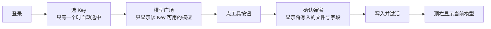

# WE2AI 桌面客户端用户说明

WE2AI 把 we2ai.com 账号里的 Key 与模型一键写入 Claude Code、Codex、WorkBuddy。

## 1. 使用流程

| 步骤 | 说明 |
|---|---|
| 登录 | 国际版用邮箱密码（开启 2FA 时输入 6 位验证码）；国内版另支持手机验证码。登录状态保存在系统钥匙串，默认最长 30 天免登录；服务端策略、凭证撤销或网络环境变化可能提前失效 |
| 区域 | 国际版 `api.we2ai.com`；国内版 `api.wtgo.com.cn`。登录页切换，记住上次选择 |
| 选 Key | 只列出状态为"正常"或"额度用完"的 Key。额度用完、余额不足、分组停用等情况下工具按钮置灰并显示原因 |
| 工具按钮 | 只显示该 Key 与模型实际支持的工具，由服务端判定 |
| Claude Code 高级 | 默认四个模型变量写同一模型；确认弹窗"高级"里可分别指定 Sonnet、Opus、Haiku 槽位 |
| WorkBuddy 同名条目 | 已有同名模型条目且内容与 WE2AI 上次写入的不同，会先询问是否覆盖 |

## 2. 写入了什么

| 工具 | 文件 | 改写的字段 | 保持不变 |
|---|---|---|---|
| Claude Code | `~/.claude/settings.json`（只有旧版 `claude.json` 时写它） | `env.ANTHROPIC_BASE_URL`、`ANTHROPIC_AUTH_TOKEN`、`ANTHROPIC_MODEL`、`ANTHROPIC_DEFAULT_{SONNET,OPUS,HAIKU}_MODEL`；删除 `env.ANTHROPIC_API_KEY` | hooks、permissions、其他 env、MCP 等（**确认弹窗里列出的"额外变更"除外**：顶层 `api_format`/`apiFormat`/`openrouter_compat_mode`/`openrouterCompatMode` 这类内部专用字段如果存在会被一并移除，写入前的确认弹窗会如实列出，不是悄悄发生） |
| Codex | `~/.codex/config.toml`；同目录下还会连带维护模型目录文件 `cc-switch-model-catalog.json`（确认弹窗里显示为中性名称"Codex 模型目录文件"，不显示这个真实文件名） | 顶层 `model_provider`、`model`；整张 `[model_providers.we2ai]` | 注释、其他 provider、`[mcp_servers]`、profiles（**确认弹窗里列出的"额外变更"除外**：其他保留名 provider 表——`openai`/`ollama`/`lmstudio`——若存在会被迁移改名并规范化；其他自定义 provider 表缺少 `name` 字段时会被补全为该表的 id；两者都会在写入前的确认弹窗里如实列出，不是悄悄发生）；`auth.json` 内容与 ChatGPT 登录不改，仅权限收紧为 0600 |
| WorkBuddy | `~/.workbuddy/models.json` | 一个 WE2AI 条目（`id` 为模型名） | 其他条目 |

写入前三个配置目录设为仅本人可访问（0700），含 Key 的文件设为 0600。写入失败时会尽力恢复到写入前的状态，但不保证一定成功：如果恢复前发现文件已被其他程序改写，不会覆盖该文件，只把原始内容另存到 `~/.we2ai/apply-snapshots/` 供手动核对；如果写入过程本身中途失败（还没来得及记录"写入后"的内容用于比对），无法确定这段时间里的差异是我们自己的未完成写入还是外部程序同时的修改，此时仍可能按快照覆盖，这是第 4 节已知限制之一；恢复动作本身也可能因权限、磁盘等问题失败，届时会提示具体原因。

应用数据目录 `~/.we2ai` 权限收紧失败时（提示"数据目录权限收紧失败"或错误码 `DATA_ROOT_NOT_HARDENED`），为避免账号 Key 明文写入不安全位置，会直接拒绝这次写入，不尝试部分写入。排查方法：确认 `~/.we2ai` 不是符号链接（`ls -ld ~/.we2ai` 查看是否有 `->` 指向别处）、属主是当前登录用户（`stat -f '%Su' ~/.we2ai` 或 `ls -ld` 里的用户名一列）、且可以被设为仅本人可访问（`chmod 700 ~/.we2ai` 手动尝试，若报权限不足需检查上级目录权限或磁盘只读状态）；修复后重启应用重试。

## 3. 安装检测

| 工具 | 未安装时 |
|---|---|
| Claude Code | 顶栏给出 Anthropic 官方安装文档链接 |
| Codex | 顶栏给出 openai/codex 发布页链接 |
| WorkBuddy | 国际版给 `workbuddy.ai/downloads`，国内版给 `workbuddy.cn/downloads` |

未安装也可以先写配置，安装后直接生效。"已安装但无法运行"表示找到了程序但 `--version` 执行失败，通常是运行环境（如 Node 版本）不满足。

## 4. 已知限制

| 限制 | 影响 | 处理 |
|---|---|---|
| 与其他配置管理工具或工具自身同时改配置 | 这些程序之间没有共同的文件锁，写入前后的比对与替换之间有一个无法完全消除、也没有确定时长上限的窗口（含写入过程本身），可能互相覆盖 | 检测到有其他配置管理工具在运行时顶栏提示；写入失败后，如果这次调用已经拿到"写入后"的内容用于比对且判断文件被外部改过，不覆盖，把原内容另存到 `~/.we2ai/apply-snapshots/` 供手动恢复；如果写入过程本身中途失败、还没来得及做这次比对，无法分辨窗口内的差异是我们的未完成写入还是外部同时的修改，此时仍可能被按快照覆盖——这一种情况不承诺保留外部修改；恢复本身失败（权限、磁盘等）时会提示具体原因，不代表文件已经损坏 |
| 其他配置管理工具正在代理接管中 | WE2AI 拒绝写入该工具 | 先在该程序中关闭接管 |
| Codex 不显示 ChatGPT 账户状态 | 使用 WE2AI 期间 Codex 不刷新 ChatGPT 令牌；切回官方登录时令牌若已过期需重新登录 | 不影响 WE2AI 请求 |
| 改名的便携版配置管理工具 | 检测不到其运行 | 自行确认未同时运行 |
| 部分 Linux 桌面没有系统钥匙串 | 登录状态只在本次运行有效 | 顶栏提示，重启后需重新登录 |

## 5. 退出登录

| 项 | 结果 |
|---|---|
| 服务端 | 联网时撤销本次登录的整个令牌家族；离线时只完成本机清理，服务端凭据按有效期自然失效 |
| 本机 | 清除钥匙串中的登录凭据，清空 WE2AI 数据库里两条供应商记录的配置，删除数据库备份 |
| 工具配置 | 默认保留，Claude Code、Codex、WorkBuddy 可继续使用已写入的 Key；登出弹窗勾选"同时恢复工具的官方配置"时，对每个当前仍指向 WE2AI 的工具移除 WE2AI 写入的一切（Claude 的六个托管 env 键、Codex 顶层 `model_provider`/`model` 与整张 `[model_providers.we2ai]` 表、WorkBuddy 的 WE2AI 条目），只有 Claude Code 会额外写回 apply 前用户自己保存的 `ANTHROPIC_API_KEY`（如果当时保存过）；工具未指向 WE2AI（从未指定过，或已恢复过，或被其他程序接管）视为无需处理，不算失败。顶栏也可对单个工具直接点"恢复官方"，效果相同 |

**"恢复官方"≠"恢复到 apply 之前"**：apply 前你自己配置的 `ANTHROPIC_BASE_URL`/`AUTH_TOKEN`/模型、Codex 的 `model`/`model_provider` 不会被还原——恢复的是官方默认状态（相当于这些字段从未被 WE2AI 写过），只有非空的 Claude `ANTHROPIC_API_KEY` 会被保存并写回。手工改过的内容（如 WorkBuddy 条目被改名、Codex 表被手改）会被跳过并提示，不强制覆盖。

本机清理失败时界面提示"本机保存的登录凭据未能完全清除"，点"重试"即可；重启应用后提示仍在。

## 6. 数据位置

| 内容 | 位置 |
|---|---|
| 应用数据 | `~/.we2ai/`（仅本人可访问） |
| 登录凭据 | 系统钥匙串，服务名 `com.we2ai.desktop` |
| 与其他配置管理工具 | 数据目录、开机自启、深链 scheme 均独立，可同时安装 |
