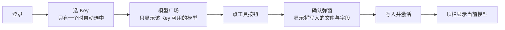

# WE2AI 桌面客户端用户说明

WE2AI 把 we2ai.com 账号里的 Key 与模型一键写入 Claude Code、Codex、WorkBuddy。

## 1. 使用流程

| 步骤 | 说明 |
|---|---|
| 登录 | 国际版用邮箱密码（开启 2FA 时输入 6 位验证码）；国内版另支持手机验证码。登录状态保存在系统钥匙串，默认最长 30 天免登录；服务端策略、凭证撤销或网络环境变化可能提前失效 |
| 区域 | 国际版 `api.we2ai.com`；国内版 `api.wtgo.com.cn`。登录页切换，记住上次选择 |
| 选 Key | 只列出状态为"正常"或"额度用完"的 Key。额度用完、余额不足、分组停用等情况下工具按钮置灰并显示原因 |
| 工具按钮 | 只显示该 Key 与模型实际支持的工具，由服务端判定 |
| Claude Code 高级 | 默认四个模型变量写同一模型；确认弹窗"高级"里可分别指定 Sonnet、Opus、Haiku 槽位 |
| WorkBuddy 同名条目 | 已有同名模型条目且内容与 WE2AI 上次写入的不同，会先询问是否覆盖 |

## 2. 写入了什么

| 工具 | 文件 | 改写的字段 | 保持不变 |
|---|---|---|---|
| Claude Code | `~/.claude/settings.json`（只有旧版 `claude.json` 时写它） | `env.ANTHROPIC_BASE_URL`、`ANTHROPIC_AUTH_TOKEN`、`ANTHROPIC_MODEL`、`ANTHROPIC_DEFAULT_{SONNET,OPUS,HAIKU}_MODEL`；删除 `env.ANTHROPIC_API_KEY` | hooks、permissions、其他 env、MCP 等 |
| Codex | `~/.codex/config.toml` | 顶层 `model_provider`、`model`；整张 `[model_providers.we2ai]` | 注释、其他 provider、`[mcp_servers]`、profiles；`auth.json` 内容与 ChatGPT 登录不改，仅权限收紧为 0600 |
| WorkBuddy | `~/.workbuddy/models.json` | 一个 WE2AI 条目（`id` 为模型名） | 其他条目 |

写入前三个配置目录设为仅本人可访问（0700），含 Key 的文件设为 0600。任一步失败会恢复到写入前的状态。

## 3. 安装检测

| 工具 | 未安装时 |
|---|---|
| Claude Code | 顶栏给出 Anthropic 官方安装文档链接 |
| Codex | 顶栏给出 openai/codex 发布页链接 |
| WorkBuddy | 国际版给 `workbuddy.ai/downloads`，国内版给 `workbuddy.cn/downloads` |

未安装也可以先写配置，安装后直接生效。"已安装但无法运行"表示找到了程序但 `--version` 执行失败，通常是运行环境（如 Node 版本）不满足。

## 4. 已知限制

| 限制 | 影响 | 处理 |
|---|---|---|
| 与 CC Switch 或工具自身同时改配置 | 这些程序之间没有共同的文件锁，写入前后的比对与替换之间有毫秒级窗口，可能互相覆盖 | 检测到 CC Switch 在运行时顶栏提示；写入失败回滚时若发现文件已被其他程序改过，不覆盖，并把原内容另存到 `~/.we2ai/apply-snapshots/` 供手动恢复 |
| CC Switch 代理接管中 | WE2AI 拒绝写入该工具 | 先在 CC Switch 中关闭接管 |
| Codex 不显示 ChatGPT 账户状态 | 使用 WE2AI 期间 Codex 不刷新 ChatGPT 令牌；切回官方登录时令牌若已过期需重新登录 | 不影响 WE2AI 请求 |
| 改名的 CC Switch 便携版 | 检测不到其运行 | 自行确认未同时运行 |
| 部分 Linux 桌面没有系统钥匙串 | 登录状态只在本次运行有效 | 顶栏提示，重启后需重新登录 |

## 5. 退出登录

| 项 | 结果 |
|---|---|
| 服务端 | 联网时撤销本次登录的整个令牌家族；离线时只完成本机清理，服务端凭据按有效期自然失效 |
| 本机 | 清除钥匙串中的登录凭据，清空 WE2AI 数据库里两条供应商记录的配置，删除数据库备份 |
| 工具配置 | 默认保留，Claude Code、Codex、WorkBuddy 可继续使用已写入的 Key；登出弹窗勾选"同时从工具配置中移除 Key"时，移除 WE2AI 写入的 Key（Claude 仅当地址指向 WE2AI 时；WorkBuddy 条目被手工改过则保留并提示）。移除后这些工具因缺少 Key 无法调用 WE2AI，重新登录后再次指定模型即可恢复 |

本机清理失败时界面提示"本机保存的登录凭据未能完全清除"，点"重试"即可；重启应用后提示仍在。

## 6. 数据位置

| 内容 | 位置 |
|---|---|
| 应用数据 | `~/.we2ai/`（仅本人可访问） |
| 登录凭据 | 系统钥匙串，服务名 `com.we2ai.desktop` |
| 与 CC Switch | 数据目录、开机自启、深链 scheme 均独立，可同时安装 |
