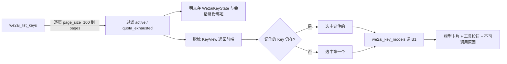
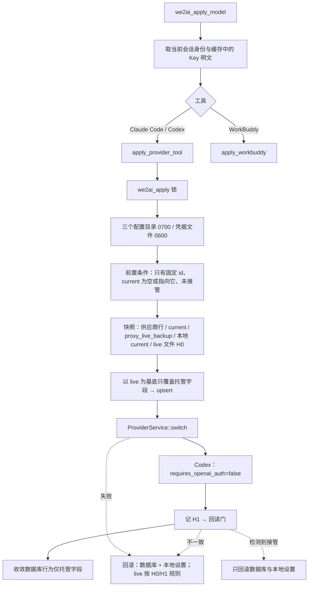
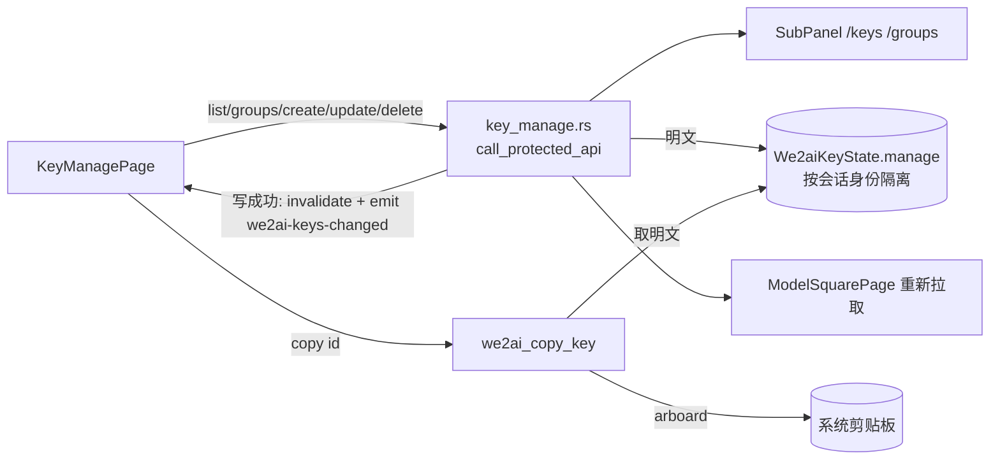
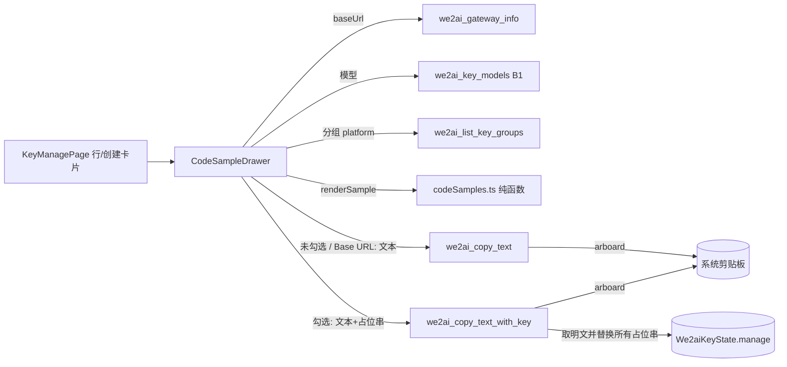

# we2ai 分支自定义功能列表

记录 `we2ai` 分支相对上游 `farion1231/cc-switch` 的全部差异，是同步上游时判断合并风险的唯一依据。实现细节看 git 历史，这里只写：fork 有什么、动了哪些文件、合并时要注意什么。

> 与代码冲突时以**当前代码**为准，并回头修正本文档。

## 分支模型

```
upstream/main (farion1231/cc-switch)
      │  fast-forward only（main 禁止混入 fork 改动）
      ▼
    main ──push──▶ origin/main
      │  整体 git merge（冲突主战场）
      ▼
    we2ai ──push──▶ origin/we2ai      ← 唯一发布分支，包含全部 fork 功能
```

| 动作 | 命令 |
|---|---|
| 合并前风险分析（只读） | Claude Code 中执行 `/sync-upstream` |
| 执行同步 | `./scripts/we2ai/sync-upstream.sh`（`NO_PUSH=1` 只合并不推送） |
| 单独跑守卫 | `./scripts/we2ai/check-guards.sh` |

**准入规则**：`we2ai` 对 `main` 一律整体 `git merge`，不逐条 cherry-pick。只有命中下方「排除类别」的上游内容，才在合并后手动裁剪；裁剪结论必须写进「同步记录」。

**新增 fork 功能时**：同一批提交内在本文档登记（风险表 + 功能说明）。会被上游改动还原、且能机械校验的，同时加进 `scripts/we2ai/check-guards.sh`。

---

## 快速风险评估表

同步后逐项检查，被还原的要手动恢复。同一文件只列一行。

| 风险 | 文件 / 位置 | 检查要点 | 守卫 |
|---|---|---|---|
| 🔴 高 | `package.json`、`src-tauri/tauri.conf.json`、`src-tauri/Cargo.toml`、`src-tauri/Cargo.lock` | 功能 1：4 处版本号一致，且主号 = 上游主号 + 1。上游每次发版都会改这几行，同步脚本会自动解决冲突 | ✅ 自动 |
| 🔴 高 | `.github/workflows/*.yml` | 功能 2：`on:` 只允许 `workflow_dispatch`（保留原有 `inputs`）。**上游新增的 workflow 文件不会冲突，会带着自动触发器直接进来**，靠守卫拦截 | ✅ 自动 |
| 🔴 高 | `src-tauri/tauri.conf.json` → `plugins.updater` | 功能 4：`endpoints` 只有 fork Release 地址；`pubkey` 为 we2ai 公钥（key ID `3B2842A26CC12882`）。上游换公钥/加镜像地址会冲突，保留 fork 侧 | ✅ 自动 |
| 🟡 中 | `src/components/DatabaseUpgrade.tsx`、`src/components/settings/AboutSection.tsx`、`src-tauri/src/commands/misc.rs` | 功能 4：发布页链接指向 `imleoo/cc-switch/releases`。上游新增的发布页/更新地址不会冲突，靠守卫扫 `farion1231/cc-switch/releases`、`dl.ccswitch.io` | ✅ 自动 |
| 🟢 低 | `scripts/we2ai/`、`.claude/commands/sync-upstream.md`、`CLAUDE.md`、本文档 | 功能 3：fork 独有文件，上游不会改 | — |
| 🔴 高 | `src-tauri/src/config.rs`、`settings.rs`（含 `mutate_settings` 可见性放宽为 `pub(crate)`，供 `we2ai::commands` 复用同一把写锁）、`panic_hook.rs`、`services/env_manager.rs` | 功能 6：5 行写死 `~/.cc-switch` 改为调用 `we2ai::mode::data_root()`（WE2AI 模式最先返回 `~/.we2ai`，早于 Store override 与 Windows 旧目录回退）。上游改这几个函数的写死路径高概率冲突，需人工核对 we2ai 分支的判断仍在最前面 | ✅ 自动（每处写死行上一行放 `// we2ai-allow-cc-switch` 标记，且标记必须落在登记的 `文件::函数名` 组合上——单纯贴标记不够，函数名对不上照样报错；非标记行一律要求落在 `#[cfg(test)]` 模块内；标记跟着代码走，不怕行号漂移；单测覆盖 `data_root()`、`get_backup_dir()` 落在 `.we2ai/backups`、真实负例 `get_app_config_dir()` 无视 Store override） |
| 🟢 低 | `src-tauri/src/app_store.rs` | 功能 6：新增 `#[cfg(test)] set_app_config_dir_override_for_test()`，仅供 `we2ai::mode` 的负例单测直接写入 override 缓存（该函数私有缓存原本只能通过真实 Tauri Store 写入，测试期没有真实 AppHandle） | — |
| 🔴 高 | `src-tauri/src/lib.rs` | 功能 7：`mod we2ai`（现为 `pub mod`，供外部集成测试引用）、`.invoke_handler(we2ai::mode::gate(...))` 包裹上游 `generate_handler!`、15 个启动/退出任务的 `we2ai::mode::startup_allowed(...)` 门控（含新增的 Skills SSOT 迁移、Codex 历史迁移三件套、定期数据库备份）、深链分发合并进 `handle_deeplink_url`、Linux deep-link handler 文件名按运行时实际二进制名动态推导（不写死 `cc-switch-handler`）、品牌字符串（`we2ai://`、`WE2AI v{}`、托盘 tooltip、数据库迁移对话框文案） | ✅ 自动（守卫检查 `invoke_handler(` 恰好出现 1 次且是 `gate(` 包裹的那次；`mode.rs` 的 `StartupTask` 每个变体在 `lib.rs` 里恰好出现 1 次，变体清单直接从 `mode.rs` 解析而非脚本里另存一份数字；`lib.rs` 不得出现字面量 `cc-switch-handler`；非注释行无残留 `CC Switch`；`cargo test` 用 `tauri::test` mock 运行时真实调用 `gate()` 验证三条分发路径，`tests/we2ai_startup_migration_gates.rs` 用真实 fixture 验证两个新增迁移门控） |
| 🟢 低 | `src-tauri/Cargo.toml` `[dev-dependencies]` | 功能 7：追加 `tauri = { version = "2.8.2", features = ["test"] }`，仅测试构建时通过 dev-dependency 与正式依赖合并生效，正式依赖不带 `test` feature，不影响发布产物体积；用于 `tauri::test::mock_builder`/`mock_app` 起 `MockRuntime` 测 `gate()` 的真实分发 | — |
| 🟡 中 | `src-tauri/src/codex_history_migration.rs`、`services/skill.rs` | 功能 7：不改动这两个文件本身，只是门控点调用的真实迁移逻辑所在，供排查"为什么这段没跑"时对照 | — |
| 🟡 中 | `src-tauri/src/tray.rs`、`auto_launch.rs` | 功能 5/7：托盘供应商/项目切换子菜单在 `we2ai::mode::enabled()` 时隐藏；主页链接 `we2ai.com`；开机自启注册名 `WE2AI` | — |
| 🟡 中 | `src-tauri/src/deeplink/parser.rs`、`lib.rs::handle_deeplink_url` | 功能 5：scheme 只接受 `we2ai`；WE2AI 模式下 provider/mcp/skill/prompt 四类导入全部拒绝，深链只用于唤起窗口；`we2ai::mode::enabled()` 分支恒真时会在此提前 `return true`，其后为非 WE2AI 构建保留的 `match parse_deeplink_url(...)` 分支在本 fork 中不可达，是死代码但不删除——上游解析失败（`Err(e)`）分支只发射 `deeplink-error` 事件、不聚焦主窗口（与解析成功分支不对称，成功才会 `unminimize/show/set_focus`），保留该行为差异供未来非 WE2AI 分支或上游同步核对，不属于 WE2AI 侧需要修的问题 | ✅ 自动（单测 `we2ai_scheme_is_accepted` / `ccswitch_scheme_is_rejected`） |
| 🔴 高 | `src-tauri/tauri.conf.json`、`tauri.windows.conf.json`、`Info.plist` | 功能 5：`productName=WE2AI`、`identifier=com.we2ai.desktop`、`mainBinaryName=we2ai`（见下方 Linux deep-link 行）、`plugins.deep-link.desktop.schemes=["we2ai"]`、Windows 窗口标题、macOS `CFBundleURLSchemes=we2ai` | ✅ 自动（守卫校验 tauri.conf.json 三项 + 对 `tauri.*.conf.json`/`Info.plist` 做 `CC Switch`/`ccswitch` 残留扫描） |
| 🔴 高 | `src-tauri/tauri.conf.json`（`mainBinaryName`）、`lib.rs`（Linux deep-link 处理器判断）、`.github/workflows/release.yml`（Windows exe 路径） | 功能 5：Linux 并存冲突修复——见下方"Linux deep-link 并存冲突"小节 | ✅ 自动（守卫拦 `cc-switch-handler` 字面量；三平台产物路径人工核对，未做真实跨平台构建验证，见已知限制） |
| 🟡 中 | `.github/workflows/release.yml` | 功能 5：DMG `.app`/卷名/图标目标、Windows 便携版 ZIP 内可执行文件名（`WE2AI.exe`）、Windows portable exe 源路径改为 `we2ai.exe`（`mainBinaryName` 生效后 cargo 产出的 `cc-switch.exe` 会被 `tauri build` 重命名，原路径不存在了）、产物文件名前缀、Release 标题与正文改为 WE2AI；上游改发版流程时高概率冲突 | — |
| 🟢 低 | `src/App.tsx`、`src/main.tsx`、`src/config/we2ai.ts`、`src/we2ai/`、`src/components/DatabaseUpgrade.tsx` | 功能 8：`WE2AI_MODE` 恒为 `true` 时 `App()` 早退渲染 `We2aiShell`；`main.tsx` 跳过 `syncModelsDevPricingOnStartup`；`DatabaseUpgrade.tsx` 隐藏 `check_app_update_available`/`open_app_config_folder` 两个非白名单入口 | ✅ 部分（`pnpm typecheck`；`tests/integration/App.test.tsx` mock `WE2AI_MODE=false` 继续覆盖上游 App 树；`We2aiShellIpcWhitelist.test.tsx`/`DatabaseUpgradeIpcWhitelist.test.tsx` 真实渲染 `<App/>`/`<DatabaseUpgrade/>` 并断言全部 `invoke()` 落在前端白名单 `src/we2ai/ipcWhitelist.ts` 内，该文件与 Rust 白名单由 `upstream_whitelist_matches_frontend_ipc_whitelist` 单测强制同步） |
| 🟢 低 | `src/we2ai/We2aiShell.tsx`（`web-logo.svg`）、`src/components/settings/AboutSection.tsx`（未改，logo 仍是上游 `app-icon.png`） | 功能 8：关于页 logo——`AboutSection.tsx` 在 WE2AI 模式下不挂载（属于 We2aiShell 不渲染的上游视图之一），改它的图标资源没有实际意义，也不属于"品牌改名"应该动的用户可见路径，未改；`We2aiShell` 自己的顶栏与关于卡片用 `assets/designs/web-logo.svg`（复制到 `src/assets/icons/web-logo.svg`，与 `favicon.svg` 同一引入方式） | — |
| 🟡 中 | `src-tauri/Cargo.toml` | 功能 9：新增生产依赖 `rand`（验证码 nonce）；按 `target.'cfg(target_os = "...")'.dependencies` 追加 `keyring`（macOS `apple-native`、Windows `windows-native`、Linux `sync-secret-service`，3.6 系列，MSRV 1.75，兼容本 crate 声明的 `rust-version = "1.85.0"`；v4 系列 MSRV 1.88 暂不采用）；`[dev-dependencies]` 新增 `wiremock` 做 HTTP mock 测试；Y1 追加 `tokio` 的 `features` 列表新增 `"process"`（`we2ai::detect::cc_switch_running_status` 用 `tokio::process::Command` 异步执行检测子进程并带超时/`kill_on_drop`，缺这个 feature 会编译失败）。上游改这些既有 target 分区（新增/调整依赖）或 `tokio` 的 `features` 列表时高概率冲突，需人工核对 `keyring` 那一行、`tokio` 的 `"process"` feature 都没被误删 | ✅ 自动（`cargo check`/`cargo test` 编译失败即报错；守卫另加 `tokio` 的 `features` 含 `"process"` 的机械断言，见功能列表底部 X4/Z3 描述） |
| 🟡 中 | `src-tauri/src/lib.rs` | 功能 9：`app.manage(We2aiSessionState(...))`、`app.manage(We2aiCaptchaState(...))` 初始化块（紧跟 `app.manage(app_state)` 之后）；`generate_handler!` 的 WE2AI 命令列表新增 12 个 `we2ai_*` 登录会话命令（含 `we2ai_retry_now`） | — |
| 🟢 低 | `src-tauri/src/we2ai/{api,captcha,region,secret_store,session,commands_auth}.rs`、`src/we2ai/{LoginPage.tsx}`、`src/we2ai/{api.ts,strings.ts,We2aiShell.tsx}`（登录会话相关新增部分） | 功能 9：fork 独有文件/新增导出，上游不会改，冲突面小 | — |
| 🟢 低 | `.github/workflows/{ci,release}.yml` 的 Linux apt 依赖列表 | 功能 9：新增 `libdbus-1-dev`（`keyring` crate 的 `sync-secret-service` 后端构建期链接系统 libdbus-1 所需）。上游若重排这段 apt 安装脚本会冲突，保留这一行 | — |
| 🟡 中 | `src-tauri/src/lib.rs` | 功能 10：`app.manage(we2ai::keys::We2aiKeyState::default())`；WE2AI 命令列表追加 `we2ai_list_keys`、`we2ai_select_key`、`we2ai_key_models` | — |
| 🔴 高 | `src-tauri/src/services/provider/mod.rs` `ProviderService::switch` | 功能 11：`should_hot_switch` 判定之后插入一段：`is_managed_provider_id(id)`（`we2ai-claude`/`we2ai-codex`）在接管状态下返回本地化错误 `we2ai.takeover_conflict`，不进入热切换、不写 live 与 `proxy_live_backup`。只拦 WE2AI 固定 id，上游其他供应商与上游测试行为不变。上游改 switch 的接管分支时高概率冲突，必须保留这段且位于热切换调用之前。**偏差修复项 B 追加**：`mod live;` 放宽为 `pub(crate) mod live;`，供 `we2ai::apply` 读取该子模块新增的 `CLAUDE_LIVE_INTERNAL_ONLY_KEYS`（见下一行），本身不改变任何现有行为 | ✅ 自动（守卫 4.6：恰好 1 处且位于 `hot_switch_provider_inner` 之前；`apply_tests::takeover_starting_right_before_switch_is_refused_and_left_intact`） |
| 🟡 中 | `src-tauri/src/services/provider/live.rs`、`src-tauri/src/codex_config.rs` | 偏差修复项 B（Codex 验收报告"非托管配置保留"偏差）：`live.rs` 新增 `pub(crate) const CLAUDE_LIVE_INTERNAL_ONLY_KEYS`，`sanitize_claude_settings_for_live` 改为遍历这个常量而不是四行硬编码 `obj.remove(...)`（行为不变，只是把字段名列表提成单一数据源）；`codex_config.rs` 从 `migrate_stale_reserved_provider_tables` 里抽出只读的 `stale_reserved_provider_table_ids_present`/`pub(crate) fn preview_stale_reserved_provider_table_ids`，供 `we2ai::apply::plan_for` 在写入前预览"上游管道会无条件一并改动、但 WE2AI 未列为托管字段"的内容（Claude 顶层 `api_format`/`apiFormat`/`openrouter_compat_mode`/`openrouterCompatMode` 会被写入器删除；Codex 的 `openai`/`ollama`/`lmstudio` 保留名 provider 表会被无条件迁移改名并规范化 `wire_api`/`name`），写进 `ApplyPlan.extraChanges` 交前端确认弹窗展示。两处新增都是纯读取型 helper，不改变原有写入/迁移逻辑本身；上游改这两个函数的内部实现时，若把字段名列表或保留名判定挪到别处，需要同步核对这两个新增的 `pub(crate)` 入口仍然指向正确的数据源 | ✅ 部分（`apply_tests::apply_plan_lists_claude_internal_only_fields_as_extra_changes_and_leaves_other_fields_untouched`、`apply_plan_has_no_extra_changes_for_claude_when_live_has_no_internal_only_fields`、`apply_plan_lists_codex_stale_reserved_provider_tables_as_extra_changes_and_leaves_other_content_untouched`、`apply_plan_has_no_extra_changes_for_codex_when_config_has_no_stale_reserved_tables`；前端 `We2aiApplyFlow.test.tsx` 两例断言弹窗展示/不展示额外变更区块） |
| 🟡 中 | `src-tauri/src/lib.rs`、`we2ai/commands_auth.rs` | 功能 11：WE2AI 命令列表追加 `we2ai_tool_status`、`we2ai_apply_plan`、`we2ai_apply_model`、`we2ai_restore_official`、`we2ai_restore_plan`（功能 17，P6 取代功能 12 的 `we2ai_remove_tool_keys`）；`we2ai_logout` 增加 `app_handle` 参数，登出后清除固定 id 供应商行里的 Key | ✅ 自动（守卫 4.9：`we2ai_remove_tool_keys`/`RemoveToolKeysOutcome` 不得重现；`we2ai_restore_official`/`we2ai_restore_plan` 必须在 `lib.rs` 命令列表里） |
| 🟢 低 | `src-tauri/src/we2ai/{apply,apply_tests,fsguard,snapshot,workbuddy,detect,commands_apply}.rs`、`src/we2ai/{ApplyDialog,ToolStatusBar}.tsx`、`src/we2ai/toolLabels.ts` | 功能 11：fork 独有 | — |
| 🟢 低 | `src-tauri/src/lib.rs`（WE2AI 初始化块）、`we2ai/mode.rs`、`docs/we2ai/` | 功能 12：启动时 `harden_data_root()` 并记录结果（`record_harden_result`，先于 `app.manage(We2aiSessionState(...))`）；`docs/we2ai/` 为 fork 独有文档目录。登出移除 Key 的命令注册已被功能 17 取代（原 `we2ai_remove_tool_keys`，见上一行） | ✅ 自动（守卫 4.10：`record_harden_result` 必须早于 `app.manage(We2aiSessionState(...))`；`mode.rs` 不得出现 `unwrap_or(true)`） |
| 🟡 中 | `src-tauri/src/we2ai/{apply,commands_apply,session,secret_store}.rs`、`src/we2ai/{api,strings,We2aiShell,ToolStatusBar}.tsx` | 功能 17（P6，方案外增补）：`we2ai_restore_official` 取代 `we2ai_remove_tool_keys`——不再只删 Key，而是移除 WE2AI 为该工具写入的一切并把工具恢复到官方配置；结果分 `restored`/`unchanged`/`skipped` 三态，`unchanged`（未指向 WE2AI 或被 CC Switch 接管）不算失败、不弹警告；`we2ai_restore_plan` 是恢复确认弹窗专用的独立计划命令，与写入用的 `we2ai_apply_plan` 不共用（字段语义相反）；`SessionManager` 新增 `secret_store()` 只读访问器；`apply_provider_tool` 新增 `secret_store: &dyn SecretStore` 形参（Claude apply 删除用户自己的 `env.ANTHROPIC_API_KEY` 前先存入系统钥匙串固定 account `tool:claude:ANTHROPIC_API_KEY`，保存失败则整次 apply 中止不写入；恢复时如 live 没有该字段则从钥匙串写回，文件写入成功后才删钥匙串条目）。上游不会触碰这些文件，冲突面小；`apply_provider_tool`/`merged_claude_settings` 签名变化在同步时需要一并检查调用点 | ✅ 自动（守卫 4.9） |
| 🟢 低 | `src-tauri/src/we2ai/keys.rs`、`src/we2ai/ModelSquarePage.tsx`、`api.rs`/`session.rs`/`commands_auth.rs`/`api.ts`/`strings.ts`/`We2aiShell.tsx` 的 Key 与模型广场部分 | 功能 10：fork 独有，冲突面小 | ✅ 自动（守卫 4.5：`KeyView` 与 `We2aiKeyView` 字段允许清单，禁止 serde 属性） |
| 🟢 低 | `src/we2ai/we2ai-theme.css`（新增）、`src/we2ai/{We2aiShell,LoginPage,ModelSquarePage,ApplyDialog,ToolStatusBar}.tsx` 的 className | 功能 13：UI 视觉对齐 we2ai.com，只改样式不改行为/文案/testid，fork 独有文件，冲突面小 | ✅ 部分（`pnpm typecheck`；既有 `tests/integration/{We2aiShellIpcWhitelist,We2aiShellOffline,LoginPage,We2aiApplyFlow,ModelSquarePage}.test.tsx` 回归） |
| 🟢 低 | `src-tauri/src/we2ai/{api,keys}.rs`、`src/we2ai/{api,pricing,strings,ModelSquarePage}.ts(x)`（新增 `pricing.ts`）、`docs/we2ai/B1定价契约.md`（新增，取代原方案评审草稿 `scratchpad/b1-pricing-contract.md`） | 功能 18：模型广场分组折扣价（B1 定价扩展 v2，依赖 SubPanel 同批扩展 `GET /api/v1/desktop/keys/:id/models`）；`ModelView`/`KeyModelsView` 去掉 `Eq` 派生（新增字段含 `f64`）；Opus 复核追加 P1（`pricing.unit` 校验）/P2（image/video 等非 token 计费兜底显示按次价）/P4（倍率容差比较 + 划线价与折后价文案相同时不重复显示）/P5（加价改标注、不划线，判定倍率优先用模型自己的 `price.multiplier`）/P6（收紧必需字段范围、单个价格字段负数/非有限单独置空、`formatWe2aiPriceNumber` 非有限值显示"—"）/P7（划线原价用 `<del>` + sr-only 前缀）/P8（按次计费行标签）/P3（价格新鲜度：过期静默重拉 + 页脚显示获取时间）。fork 独有字段/文件，冲突面小 | ✅ 部分（`cargo test --locked we2ai::{api,keys} --lib`；`pnpm typecheck`；`tests/we2ai/pricing.test.ts`；`tests/integration/ModelSquarePage.test.tsx` 分组折扣价与价格新鲜度用例；守卫 4.12：`keys.rs` 含 `"usd_per_1m_tokens"` 字面量） |
| 🟡 中 | `src-tauri/Cargo.toml`、`Cargo.lock`、`package.json`、`pnpm-lock.yaml`、`src-tauri/src/lib.rs`、`src-tauri/src/we2ai/{announcements,api,mod}.rs`（新增 `announcements.rs`）、`src/we2ai/{Announcement*,useAnnouncements,announcementMarkdown,api,strings,We2aiShell}`、`tests/{we2ai,integration}/Announcement*` | 功能 19：公告同步与系统通知。上游同步后检查：`Cargo.toml` 仍有 `tauri-plugin-notification = "=2.4.0"`（固定版本，`Cargo.lock` 里 `notify-rust` 须保持 4.11.7，升级会要求 rustc ≥ 1.89 导致 1.88 无法编译）；`lib.rs` 三处（`.plugin(tauri_plugin_notification::init())`、`start_background_poller`、两个 `we2ai_*announcement*` 命令）；`package.json` 有 `marked`、`dompurify`；`We2aiShell.tsx` 顶栏挂载 `AnnouncementCenter`。上游改 `lib.rs` 插件链或 `generate_handler!` 时高概率冲突 | ✅ 自动（`check-guards.sh` 4.13） |
| 🟡 中 | `src-tauri/src/lib.rs`、`src-tauri/src/we2ai/{billing,api,mod}.rs`（新增 `billing.rs`）、`src/we2ai/{BillingPage,useBalanceWatch,ModelSquarePage,We2aiShell,api,strings}`、`src/we2ai/we2ai-theme.css`、`tests/{we2ai,integration}/{BillingPage,useBalanceWatch,We2aiShellBilling}*` | 功能 20：充值入口与余额（复用 Web 充值页，客户端不实现支付）。上游同步后检查：`lib.rs` 命令列表仍有 `we2ai::billing::we2ai_get_balance`、`we2ai_gateway_info`；`We2aiShell.tsx` 的 Tab 是受控的（`value={activeTab}`，顺序 模型广场 \| Key 管理 \| 充值 \| 设置），顶栏 logo 右侧有余额 chip，充值 Tab 带 `forceMount`；`ModelSquarePage` 的 `onOpenBilling`。上游改 `generate_handler!` 或 `We2aiShell` Tabs 结构时高概率冲突 | ✅ 自动（`check-guards.sh` 4.14：两个命令已注册、`BillingPage` 含 `"/purchase"` 且无写死 http(s) 地址、Shell 已挂载 `BillingPage`、`package.json` 无 `@stripe/*` / `qrcode*`） |
| 🟡 中 | `src-tauri/src/lib.rs`、`src-tauri/src/we2ai/{key_manage,keys,api,mod}.rs`（新增 `key_manage.rs`；`keys.rs` 抽出公共分页 `fetch_all_pages`、`We2aiKeyState` 新增管理页明文缓存与 `invalidate()`、`clear_selection_if`、`KEYS_PAGE_SIZE`/`KEYS_MAX_PAGES` 放宽为 `pub(super)`）、`src/we2ai/{KeyManagePage,KeyEditDialog,keyManageUtils,ModelSquarePage,We2aiShell,api,strings}`、`src/we2ai/we2ai-theme.css`、`tests/{we2ai,integration}/{KeyManagePage,KeyEditDialog,We2aiShellKeys,ModelSquarePage,We2aiShellBilling}*` | 功能 21：Key 管理（创建/编辑/删除/启停/复制）。上游同步后检查：`lib.rs` 命令列表仍有 6 个 `we2ai::key_manage::*`；`We2aiShell.tsx` Tab 顺序 模型广场 \| Key 管理 \| 充值 \| 设置，Key 管理 Tab **不** `forceMount`（切走即卸载，创建结果明文 state 随之丢弃）；`keys.rs` 的 `KeyView`/`list_keys` 语义不变（模型广场仍只列 `active`/`quota_exhausted`）。**明文边界**：`KeyManageView`/`We2aiManagedKey` 无 `key` 字段；复制由 `we2ai_copy_key` 在 Rust 侧写系统剪贴板，明文不经 IPC，唯一出 Rust 的明文是 `we2ai_create_key` 响应里的一次性 `plaintext`（只用于「Key 已创建」卡片展示）。`ModelSquarePage` 的 `onCreateKey` 与 `We2aiShell` 的 `createKeyRequested` 是「去创建 Key」入口上游改 `generate_handler!`、`We2aiShell` Tabs 结构或 `keys.rs` 分页时高概率冲突 | ✅ 自动（`check-guards.sh` 4.15：6 个命令已注册且不得出现 `we2ai_reveal_key`、页面不得用 `copyText`/`navigator.clipboard`；`KeyManageView`/`We2aiManagedKey` 字段允许清单（含私有字段）且禁止 serde 属性、`we2ai_copy_key` 返回 `()`；`we2ai-keys-changed` 事件名两侧一致；`KeyManagePage` 无 `confirm(`） |
| 🟡 中 | `src-tauri/src/lib.rs`、`src-tauri/src/we2ai/key_manage.rs`（新增 `copy_text` / `copy_text_with_key`、常量 `SAMPLE_KEY_PLACEHOLDER` 与命令 `we2ai_copy_text`、`we2ai_copy_text_with_key`）、`src/we2ai/{CodeSampleDrawer,codeSamples,KeyManagePage,api,strings}`（新增 `CodeSampleDrawer.tsx`、`codeSamples.ts`）、`src/we2ai/we2ai-theme.css`、`scripts/we2ai/check-samples.sh`、`tests/we2ai/{codeSamples,CodeSampleDrawer,copyCommands,KeyManagePage}*`、`docs/we2ai/{充值与Key管理设计方案,用户说明}.md` | 功能 22：调用示例抽屉（curl / Python / Node / Java / Go / PowerShell × OpenAI 兼容 / Anthropic / Responses）。上游同步后检查：`lib.rs` 命令列表仍有 `we2ai::key_manage::we2ai_copy_text` 与 `we2ai_copy_text_with_key`；`KeyManagePage.tsx` 每行有「调用示例」入口、「Key 已创建」卡片有「查看调用示例」。**明文边界**：代码框永不显示明文（默认环境变量占位，勾选「填入真实 Key」只显示掩码），复制时前端传带占位串 `__WE2AI_API_KEY__` 的文本，由 Rust 替换为缓存里的明文再写剪贴板，命令返回 `()` 且不接收占位串参数；非敏感文本同样由 Rust 写剪贴板（`we2ai_copy_text`），抽屉与模板文件不用 `copyText` / `navigator.clipboard`、不调用返回明文的命令。上游改 `generate_handler!` 时高概率冲突 | ✅ 自动（`check-guards.sh` 4.16：两个命令已注册且返回 `Result<(), We2aiApiError>`、Rust / TS 占位串字面量一致、`CodeSampleDrawer`/`codeSamples` 不含 `copyText`/`navigator.clipboard`/`revealKey`/`plaintext`/`created.`/`createKey`/`copyKey`、抽屉走 `copyPlainText` 与 `copyTextWithKey`） |
| 🟢 低 | `src/we2ai/{We2aiShell,strings}.ts(x)` 的检查更新状态展示 | 更新检查失败状态修复：失败时不再误显示"已是最新版本"（改看 `update.error`，不依赖 `updateInfo === null`，覆盖"先查到更新、后一次检查失败"场景，Opus 复核 P9）；toast 描述不再展示英文原始错误，改固定本地化提示 `checkFailedHint`，原始错误只写 console；已知限制见"### 4. 自动更新指向 we2ai"小节（fork 仓库首次发版前 `latest.json` 不存在，检查更新必然失败，这是环境状态不是代码缺陷） | ✅ 自动（守卫 4.12：`We2aiShell.tsx` 含 `update.error` 判断）；`tests/integration/We2aiShellUpdateCheck.test.tsx` |
| 🔴 高 | `src-tauri/Cargo.toml` | 功能 14：新增 `[[bin]] name = "we2ai" path = "src/main.rs"`，让 `cargo build`/`pnpm tauri dev` 直接产出 `we2ai(.exe)`，不再是跟着 `[package] name` 走的 `cc-switch(.exe)`。`[package] name`（`cc-switch`）与 `[lib] name`（`cc_switch_lib`）不变——上游同步改 `Cargo.toml` 时高概率与新增的 `[[bin]]` 段冲突，合并时必须保留这三者：包名/库名不变 + `[[bin]]` 段存在且 `name = "we2ai"` | ✅ 自动（守卫 4.7：`[[bin]]` 段存在且 `name` 为 `we2ai`；`[package]`/`[lib]` 的 `name` 未被误改） |
| 🟡 中 | `.github/workflows/release.yml` | 功能 15：macOS 签名/公证全部改为按 `secrets.APPLE_CERTIFICATE` 是否存在走双分支（有证书=原有完整签名公证流程；无证书=`APPLE_SIGNING_IDENTITY=-` 临时签名、跳过公证/装订、DMG 不加 `--codesign`）；`release` job 新增 tag 守卫（非 `v*` tag ref 直接失败）。上游改这段会与双分支逻辑冲突，需人工核对新增的 `HAS_APPLE_CERT` 判断与各步骤 `if:` 条件仍然完整 | ✅ 部分（守卫检查 tag 守卫步骤存在；双分支的实际 CI 运行未验证，见已知限制） |
| 🟢 低 | `src-tauri/icons/tray/macos/statusbar_template_3x.png`、`assets/designs/tray-template.svg`（新增） | 功能 16：macOS 菜单栏托盘模板图标换成 WE2AI 标志（上游同名文件被替换，上游改托盘图标时会产生二进制冲突，保留 fork 侧版本） | — |

## 排除类别（上游内容，we2ai 主动不采纳）

| 类别 | 判定依据 | 处理 |
|---|---|---|
| 自动触发的 workflow | 功能 2 | 合并后把 `on:` 改回仅 `workflow_dispatch` |

暂无其他排除类别。首次决定"整链不采纳"某项上游功能时，在此登记类别、判定依据和检查命令。

---

## 功能详细说明

> 每节固定三段：功能一句话 → 关键文件 → 合并注意。

### 1. 自定义版本号

上游主号 +1，次/修订号跟随上游：上游 `3.20.4` → we2ai `4.20.4`。副作用：主号更高，上游 3.x 的自动更新不会覆盖 we2ai 安装。

**文件**：`package.json`、`src-tauri/tauri.conf.json`、`src-tauri/Cargo.toml`（`[package]`）、`src-tauri/Cargo.lock`（`name = "cc-switch"` 条目）。读写逻辑在 `scripts/we2ai/lib.sh`。

**合并注意**：同步脚本会先把三方版本统一成占位符再做三方合并，只有版本号行冲突时自动解决；无冲突合并后也会统一改写为 fork 版本。手动 merge 时必须跑 `check-guards.sh`。

### 2. GitHub Actions 全部改为仅手动触发

7 个上游 workflow（ci / claude / labeler / release / stale / sync-r2 / wsl2-nightly）的 `on:` 块统一改为只有 `workflow_dispatch`，防止 fork 仓库自动跑上游的发版、R2 同步、定时任务、PR bot。

**文件**：`.github/workflows/*.yml` 的 `on:` 块（每个文件带 `# we2ai:` 注释标记）。

**合并注意**：上游改 `on:` 块会冲突，保留 fork 侧写法；上游**新增** workflow 不冲突，守卫检查会报出来。

### 3. 上游同步基础设施

两分支同步模型、同步脚本、守卫检查、`/sync-upstream` 风险分析命令，以及本文档。

**文件**：`scripts/we2ai/{lib,check-guards,sync-upstream}.sh`、`.claude/commands/sync-upstream.md`、`CLAUDE.md`、`自定义开发功能列表.md`。上游 `.gitignore` 忽略了 `CLAUDE.md` 和 `.claude/`，这两处是 `git add -f` 强制跟踪的。

**合并注意**：上游若改 `.gitignore` 不影响已跟踪文件；新建同类文件时记得 `git add -f`。

### 4. 自动更新指向 we2ai

应用内更新从 fork 的 GitHub Release 拉 `latest.json`，用 we2ai 自己的密钥验签；手动"打开发布页"的兜底链接也指向 fork。

**文件**：`src-tauri/tauri.conf.json`（`plugins.updater.endpoints` / `pubkey`）；发布页链接在 `DatabaseUpgrade.tsx`、`AboutSection.tsx`、`commands/misc.rs`。`release.yml` 生成 `latest.json` 时用 `$GITHUB_REPOSITORY`，无需改。

**密钥**：私钥 `~/.tauri/we2ai.key`，口令 `~/.tauri/we2ai.key.password`（均只在本机，权限 600）；GitHub Secret `TAURI_SIGNING_PRIVATE_KEY` / `TAURI_SIGNING_PRIVATE_KEY_PASSWORD` 已配置在 `imleoo/cc-switch`。**私钥丢失 = 已安装的 we2ai 客户端再也无法自动更新**，务必另行备份。

**发版**：打 `v4.x.y` tag 推到 origin 后，在 Actions 手动运行 `release.yml`（功能 2 已禁用 tag 自动触发），选 tag 作为 ref。`sync-r2.yml` 同步的是上游的 R2/`dl.ccswitch.io`，we2ai 不要运行。

**合并注意**：上游改 updater 配置会冲突，保留 fork 侧。项目主页链接自功能 5（WE2AI 品牌改名）起已改为 `we2ai.com`，不再是未改状态。

**已知限制（首次发版前）**：fork 仓库在第一次跑通 `release.yml` 之前，`plugins.updater.endpoints` 指向的 GitHub Release 里没有 `latest.json`，"检查更新"必然以 404 失败——这是环境状态，不是代码缺陷，不需要改代码。真正需要改的是失败时的**界面表现**：此前"检查更新"失败时 toast 会把英文原始错误（如 updater 插件抛出的 `Could not fetch a valid release JSON from the remote`）直接拼进描述展示给用户，且失败后的状态判断只看 `!isChecking && !hasUpdate && updateInfo === null`（未看 `UpdateContext` 的 `error` 字段），导致检查失败时界面仍显示"已是最新版本"，与真实结果矛盾。已修复：`We2aiShell.tsx` 的检查结果展示新增对 `update.error` 的判断，失败时显示"检查更新失败"而不是"已是最新版本"；toast 描述改为固定的本地化提示（`checkFailedHint`：中文"暂时无法获取更新信息，请稍后重试"/英文对应译文），原始错误只写 `console.error`。`UpdateContext.tsx` 启动时的自动检查（`checkUpdate().catch(console.error)`）本就不弹 toast，此次未改、行为保持不变。新增测试 `tests/integration/We2aiShellUpdateCheck.test.tsx`。

### 5. WE2AI 品牌改名

产品名、`identifier`、深链 scheme、图标、托盘、开机自启、发布产物全部改为 WE2AI；`identifier`/`productName`/scheme 首次发版前冻结，之后不再改。

**文件**：`src-tauri/tauri.conf.json`（`productName`/`identifier`/`plugins.deep-link.desktop.schemes`）、`src-tauri/tauri.windows.conf.json`（窗口标题）、`src-tauri/Info.plist`（`CFBundleURLSchemes`/`CFBundleURLName`；与 `tauri.conf.json` 的 `plugins.deep-link.desktop.schemes` 两处 scheme 必须保持一致，由 `check-guards.sh` 4.3b 的品牌/scheme 残留扫描保证）、`src-tauri/src/deeplink/parser.rs`（scheme 校验）、`src-tauri/src/lib.rs`（深链前缀、启动日志、托盘 tooltip、数据库迁移/初始化失败对话框里"回退到旧版本 WE2AI"“升级 WE2AI”文案——注意 `lib.rs` 里另外 3 处提到"CC Switch"的是注释，指的是与真实存在的 CC Switch 应用互操作场景，不应替换）、`src-tauri/src/tray.rs`（主页链接）、`src-tauri/src/auto_launch.rs`（开机自启注册名）、`src-tauri/icons/*`（`pnpm tauri icon assets/designs/appicon.png` 重新生成）、`src/index.html`（favicon，复制自 `assets/designs/favicon.svg` 到 `src/assets/icons/favicon.svg` 后以相对路径引用，与项目现有 `src/assets/icons/*` 静态资源方式一致）、`src/main.tsx`（数据库加载失败兜底路径 `~/.we2ai/config.json`）、`src/i18n/locales/*.json` 与 12 个前端文件（`CC Switch` → `WE2AI` 的用户可见文案）、`.github/workflows/release.yml`（DMG `.app`/卷名/图标目标、Windows 便携版 ZIP 内可执行文件改名 `WE2AI.exe`、全部产物文件名前缀与 Release 标题/正文）。updater 的 `endpoints`/`pubkey`（功能 4）不受影响。

**品牌替换的例外（不改）**：
- i18n `settings.partnerPromotion.*`（合作伙伴推广文案）：其中的"CC Switch"指代真实签约的产品名、"cc-switch"/"CCSWITCH"/"CC-SWITCH" 是第三方实际生效的优惠码，都是事实性内容，不是我们的自称，全部保留原文，不随品牌改名替换。
- `src/utils/errorUtils.ts` 的 `"changed outside CC Switch"`：这是与后端 `pi_config/mod.rs`、`services/{pi_prompt_files,prompt}.rs` 错误文案做字符串匹配的字面量，后端未改（那些文案面向的是 Pi 客户端交叉编辑场景，与品牌无关），前端必须保持一致才能命中匹配，不能替换。
- `src/config/codexProviderPresets.ts` 两处"直接/以 CC Switch 为例"：转述的是第三方（Kimi/Moonshot 官方文档）原文用词，改成 WE2AI 会歪曲第三方文档的实际表述，保留原文。
- 判断准则：字面量只要用于**匹配、比较、协议、外部事实转述**，一律不随品牌改名替换；只有**我们自称产品名**的用户可见文案才替换。

**N1 追加决定（用户新决定，收紧上述准则的一个子类）**：上面的"外部事实转述"例外原本也覆盖"并存检测""接管提示"这类描述真实第三方程序（真实存在的 CC Switch 应用）当前状态的文案——例如"检测到 CC Switch 也在运行""CC Switch 正在代理接管此工具"。这类文案虽然是事实性描述（确实检测到那个具体的第三方程序），但用户决定：WE2AI 的用户界面一律改为不点名具体是哪个程序的中性措辞（"检测到另一个配置管理工具正在运行""该工具正被其他程序代理接管"），**进程检测逻辑本身（bundle id `com.ccswitch.desktop`、可执行名 `cc-switch`/`cc-switch.exe`）不变**，只改显示文案。已修复位置：`src/we2ai/strings.ts`（`ccSwitchRunningBanner`、`errorApplyTakeover` 中英各一处）、`src-tauri/src/we2ai/apply.rs`（`check_preconditions`/`apply_provider_tool` 的接管拒绝文案两处、`restore_official` 的 `unchanged`/`skipped` 原因四处）、`src-tauri/src/we2ai/commands_apply.rs`（并存警告一处）、`src-tauri/src/services/provider/mod.rs`（热切换拒绝的 `AppError::localized` 兜底文案，与功能 11 唯一改动同一行，未新增触点）、`src-tauri/src/lib.rs`（数据库初始化失败对话框里"包含 cc-switch.db"泛化为"含数据库文件"）。**不改**（不是用户界面文案，或本就不可达）：数据库/日志实际文件名（`cc-switch.db`/`cc-switch.log`，改名是未请求的迁移级变更，超出本次范围）；`src/i18n/locales/*.json`（partnerPromotion 等）——WE2AI 模式下 `App.tsx` 提前 `return <We2aiShell/>`，且 `src/we2ai/*.tsx` 全部使用独立的 `strings.ts`/`getWe2aiStrings()`、不引入 `react-i18next`，这些键在 WE2AI 界面里不可达；`src/utils/errorUtils.ts`、`src/config/codexProviderPresets.ts`、`src/config/hermesProviderPresets.ts` 等同理，均对应上游 Pi/Hermes/OpenCode 供应商管理 UI，WE2AI 模式下不挂载、对应 IPC 命令也不在白名单内，不可达。测试代码与源码注释（如 `apply_tests.rs`、`mode.rs`/`detect.rs`/`apply.rs` 内的说明性注释）里对真实 CC Switch 应用的引用保留不改——那是面向开发者的工程说明，不是用户可见文案。

**N1 残留（Opus 第 2 轮复核低危项 R5 登记；第 3 轮 S1/S2 已把其中可修的部分修掉，用户决定"完全去除"不允许留登记豁免）**：
1. ~~`apply.rs:360` 确认弹窗展示模型目录文件真实文件名~~——**已被 S1 修掉**：`ApplyPlan.files` 从 `Vec<String>` 改为 `Vec<PlanFile>`（`display`/`path` 分离，`apply.rs::PlanFile`），Codex 模型目录文件的 `display` 固定为中性标签"~/.codex/ 下的 Codex 模型目录文件"，真实路径只留在不展示的 `path` 字段；前端（`ApplyDialog.tsx`/`ToolStatusBar.tsx`）只渲染 `display`。回滚/快照/外部改写等错误消息同样可能带出这个真实文件名，统一在 `apply::sanitize_message_for_display`（跨 IPC 边界前的唯一脱敏点，`commands_apply.rs::impl From<ApplyError> for We2aiApiError`）里替换（S3）。真实文件名（上游历史遗留常量 `codex_config.rs::CC_SWITCH_CODEX_MODEL_CATALOG_FILENAME`）不改，登记在 `docs/we2ai/用户说明.md`（文档不算界面，S6）。
2. ~~lib.rs/DatabaseUpgrade.tsx 展示数据库文件真实文件名 `cc-switch.db`~~——**已被 S2 修掉**：`lib.rs::show_database_init_error_dialog` 与 `InitErrorPayload.path`（`lib.rs` 数据库版本过新分支）改为只传父目录，不传文件名；`DatabaseUpgrade.tsx` 文案从"数据库文件"改为"数据库所在目录"+"（数据库文件位于此目录）"提示（4 个 i18n locale 同步）。数据库实际文件名本身（`cc-switch.db`）不做迁移，不出现在任何界面文本里即可，不需要改名。
3. **仍然登记、真正不改**：`src/components/DatabaseUpgrade.tsx` 的 `RELEASES_URL = "https://github.com/imleoo/cc-switch/releases"`——这是 fork 自己的 GitHub 仓库地址（功能 4"自动更新指向 we2ai"的既有触点），在"数据库版本过新"等初始化失败提示里可达。仓库地址就是这个 slug，没有另一个"WE2AI 自己的发布页域名"可用；改仓库 slug（连带 CI、README、既有 issue/PR 链接等）超出本次范围，登记为已知限制，不属于可以用中性标签绕开的"展示文案"类问题——它是一个真实要跳转的外部链接，必须是真实可用的地址。
4. `src/components/DatabaseUpgrade.tsx`、`src-tauri/src/codex_config.rs` 均**不在守卫 4.11 当前扫描目录（`src/we2ai/**`、`src-tauri/src/we2ai/**`）之内**，不需要新增白名单条目；这里登记只是为了让"品牌残留"验收标准（v27 §7）与实际情况保持一致，不产生误导。

**守卫**：`check-guards.sh` 4.11 按行扫描 `src/we2ai/**`（`.ts`/`.tsx`/`.css`）与 `src-tauri/src/we2ai/**`（`.rs`，排除 `*_tests.rs` 文件与内联 `#[cfg(test)] mod tests` 之后的区域）里非注释代码是否残留 `CC Switch`/`CC-Switch`/`ccswitch`/`cc-switch`（大小写不敏感），白名单精确到字面量：`com.ccswitch.desktop`、`cc-switch.exe`、`"-x", "cc-switch"`（均在 `detect.rs` 的进程检测里）。这是按行的启发式扫描，不做真正的语法分析，无法覆盖跨行拼接等刁钻写法，但足以拦住平铺直叙的品牌字样残留。

**i18n 路径文案同步**：`settings.skillStorage.ccSwitchHint`（键名是历史遗留，未改）的存储路径示例已从 `~/.cc-switch/skills/` 改为 `~/.we2ai/skills/`，与 `SkillService::get_ssot_dir()` 实际调用 `get_app_config_dir()` 的真实路径一致。

**合并注意**：上游改 `tauri.conf.json`/`Info.plist` 品牌字段、`deeplink/parser.rs` 的 scheme 校验、`lib.rs` 深链分发逻辑、`release.yml` 打包命名，均高概率冲突，保留 fork 侧 WE2AI 值；上游新增用户可见字符串若含 `CC Switch`，守卫会报出来但不会自动改，需要人工判断是否属于上面的"例外"再决定是否替换。

**Linux deep-link 并存冲突（identifier 不隔离这个场景）**：`app.path().data_dir()`（`PathResolver::data_dir()`）在 Linux 上解析到裸的 `$XDG_DATA_HOME`（即 `~/.local/share`），**不带 bundle identifier**——会按 identifier 隔离的是另一个方法 `app_data_dir()`，我们和 `tauri-plugin-deep-link` 2.4.7 内部用的都是前者。deep-link 插件把处理器写到 `~/.local/share/applications/<可执行文件名>-handler.desktop`（插件源码 `src/lib.rs` 的 `register`/`unregister`/`is_registered` 三处，见发行包 `tauri-plugin-deep-link-2.4.7.crate`），这是共享目录，只靠 identifier 不同并不能让 WE2AI 和真实 CC Switch 的处理器文件互不冲突——冲突的根源是**两边编译出的可执行文件都叫 `cc-switch`**（Cargo 包名未改）。

处理方式：在 `tauri.conf.json` 顶层加 `"mainBinaryName": "we2ai"`。这是 Tauri 2 官方配置项，作用是"`tauri build` 时把 cargo 产出的二进制重命名为这个名字，再交给 `tauri bundle`"（`tauri-utils::config::Config::main_binary_name` 的文档原文），选它而不是改 `[package] name`（Cargo 包名）是因为后者会让 `Cargo.toml`/`Cargo.lock` 的包名条目、版本管理脚本（`scripts/we2ai/lib.sh` 依赖 `name = "cc-switch"` 定位版本行）、以及所有引用包名的地方全部跟着变，冲突面大得多；`mainBinaryName` 只影响最终产物的文件名，不碰 Cargo 元数据。三个平台的影响：
- **Windows**：`tauri build` 产出 `we2ai.exe`（不再是 `cc-switch.exe`），release.yml 里 Windows 便携版打包步骤原本找 `target/**/release/cc-switch.exe` 已同步改成找 `we2ai.exe`。
- **macOS**：`.app/Contents/MacOS/` 内的可执行文件改名为 `we2ai`（`CFBundleExecutable` 由 tauri-bundler 同步指向新名字，这是该配置项的既定契约，本机没有 tauri-bundler 源码缓存，未逐行核对，需要在真实 macOS 构建里验证一次能正常启动）。DMG/`.app` 的打包发现逻辑用 `find "$path" -name "*.app"` 通配，不关心内部可执行文件名，不受影响。
- **Linux**：`tauri build` 产出的可执行文件（进而 AppImage/deb/rpm 内打包的那份）改名为 `we2ai`；release.yml 的 Linux 步骤只用 `--bundles appimage,deb,rpm` 让 tauri-cli 自己找二进制并打包，没有硬编码路径，不受影响。

`lib.rs` 侧配合改了判断逻辑：原来的 Linux 分支写死检查 `~/.local/share/applications/cc-switch-handler.desktop` 是否存在来决定要不要跳过注册（避免覆盖用户改过的 `.desktop` 文件），这个写死名字本身也是本次要修的问题之一。改为用 `tauri::utils::platform::current_exe()`（与插件内部用的是同一个函数）在运行时取实际可执行文件名，动态拼出 `<文件名>-handler.desktop` 再判断是否存在——这样无论 `mainBinaryName` 在当前这次运行下是否真的生效（例如某些不经过 `tauri build` 重命名步骤的运行方式，判断始终和插件的真实行为对齐，不会因为写死名字而跟插件的实际产物脱节。守卫拦截 `lib.rs` 里出现字面量 `cc-switch-handler`，防止这处判断被静默改回写死。

已知限制：`mainBinaryName` 对 macOS `CFBundleExecutable`、`tauri dev` 场景下二进制是否同步重命名，本次没有条件在三个平台各跑一次真实的 `tauri build`/`tauri dev` 验证，只核对了配置字段的官方文档描述与 `lib.rs` 判断逻辑本身的正确性（`cargo check` 通过，Linux 分支代码临时放宽 `#[cfg(target_os)]` 在 macOS 本机编译验证过语法与类型）；正式发版前应在 Linux 环境实机验证：装一个改名前的旧构建（模拟"真实 CC Switch"）+ 新的 WE2AI 构建，确认两者的 `.desktop` 文件不再重名。

**守卫 4.3c 的扫描范围只到 `lib.rs`，不是全仓**：`pi_config/mod.rs`、`services/{pi_prompt_files,prompt}.rs`、`database/backup.rs` 等文件里仍保留的"CC Switch"错误文案没有被扫描，也不需要扫描——这些文案所在的命令（Pi 供应商写冲突检测、SQL 备份导入校验等）本来就不在 IPC 白名单内，WE2AI 模式下 `gate()` 会在请求到达这些 handler 之前就拒绝掉，用户永远看不到这些文案，替换与否不影响 WE2AI 的用户体验，反而替换了会导致 `errorUtils.ts` 之类的前端匹配字面量需要同步改（见上面的"品牌替换例外"）。只扫 `lib.rs` 是因为它是 WE2AI 自己写的对话框/日志文案的唯一落点（数据库迁移、初始化失败对话框），这些命令在启动阶段就会跑到，是真正会展示给 WE2AI 用户看的文案。

### 6. 数据隔离（`~/.we2ai`）

WE2AI 与 CC Switch 除 `identifier` 不同外，运行时数据完全隔离：数据库、本地设置、崩溃日志、环境变量备份统一落在 `~/.we2ai`，不从 `~/.cc-switch` 自动导入任何数据。

**文件**：`src-tauri/src/we2ai/mode.rs`（`data_root()`）；`src-tauri/src/app_store.rs::set_app_config_dir_override_for_test`（仅测试期使用，直接写入 override 缓存验证负例）；5 处写死点，各自在写死行的**上一行**放 `// we2ai-allow-cc-switch` 标记放行——`config.rs`（`get_app_config_dir()` 里两处：默认目录、Windows 旧目录回退，早于 Store override 判断）、`settings.rs`（`AppSettings::settings_path()`）、`panic_hook.rs`（`default_app_config_dir()`）、`services/env_manager.rs`（`get_backup_dir()`）。

**合并注意**：上游若新增写死 `~/.cc-switch` 的位置，`check-guards.sh` 会因为那一行的上一行没有 `// we2ai-allow-cc-switch` 标记而报错，需要评估是否也要接入 `data_root()`——评估后决定放行的话，在写死行上一行加这个标记即可，不用改脚本或维护单独的行号清单。选标记而不是 `file:line` 精确登记：行号登记会在两种常见场景下失真——上游在登记行前面插入/删除代码导致行号整体偏移（明明还是同一行代码，行号对不上就被误报为新增违规）；或者 we2ai 分支的判断被误删但那一行字面量本身没删（行号凑巧还留在登记表里，反而漏报）。标记贴在代码行正上方，跟着代码一起移动、一起被删，两种失真都不会发生。测试代码判定按 `#[cfg(test)]` 模块边界排除（见 `database/backup.rs` 内的测试 fixture；`services/skill.rs` 的测试 fixture 已改用 `.we2ai` 不再匹配），不需要额外加标记。守卫匹配的是精确字符串字面量 `".cc-switch"`（不要求紧跟 `.join(`），能同时拦住 `PathBuf::from(".cc-switch")` 等写法，但不会误伤 `codex_config.rs` 里 `"[model_providers.cc-switch]"` 这类无关的更长字符串子串。

### 7. 启动/退出白名单与 IPC 默认拒绝白名单

WE2AI 模式下，启动阶段不导入/种子任何供应商、MCP、提示词、Skills，不做 Skills SSOT 迁移或 Codex 历史迁移，不做本地代理接管恢复或退出时的 live 恢复，不跑 WebDAV/S3 同步与会话用量扫描；IPC 层默认拒绝一切非白名单命令。

**文件**：`src-tauri/src/we2ai/mode.rs`（`StartupTask` 枚举 + `startup_allowed()`、`gate()` 及上游命令白名单纯函数）、`lib.rs`（14 处调用点门控 + `.invoke_handler(we2ai::mode::gate(...))` 包裹）、`we2ai/commands.rs`（`we2ai_get_settings`/`we2ai_save_settings`，唯一放行的设置读写入口，只覆盖主题/语言/窗口/开机自启相关字段，通过 `settings::mutate_settings` 单次写锁做读-改-写，避免并发保存互相覆盖）。

`lib.rs` 15 个启动/退出门控点（对应 `StartupTask` 枚举的全部变体，见 `mode.rs`；`check-guards.sh` 不再单独维护一份数量常量，而是直接从 `mode.rs` 解析变体清单，逐个核对每个变体在 `lib.rs` 里恰好出现一次——新增/删除变体或门控点会被守卫自动感知，不需要手改脚本里的数字）：首次运行导入现有工具供应商、官方供应商种子、累加模式导入（含 OMO/OMO Slim 本地导入）、默认 Skills 初始化、表空导入 MCP、表空导入提示词、启动代理状态恢复、崩溃残留恢复、退出时 live 恢复、WebDAV/S3 同步、会话用量同步与轮询、公共配置片段抽取与 Gemini 泄漏清理、**Skills SSOT 迁移**、**Codex 历史迁移三件套**、**定期数据库备份**（功能 11 新增：备份是整库副本，含供应商行里的 Key）。

**Skills SSOT 迁移 / Codex 历史迁移已加门控（此前的说法有误，已更正）**：早期版本认为这两处"只在全新数据根下走不到，不需要门控"，其中 Codex 历史迁移三个函数确实会在 DB 内没有第三方 provider 时提前 no-op，但 **Skills SSOT 迁移（`services/skill.rs::migrate_skills_to_ssot`）会扫描各工具的真实 Skills 目录（`~/.claude/skills`、`~/.codex/skills` 等）并把发现的文件复制进 SSOT**——这就是"从外部工具读取"，不是纯内部数据库格式迁移，此前"不读取任何外部工具配置"的表述是错的。两者现已分别用 `StartupTask::SkillsSsotMigration`、`StartupTask::CodexHistoryMigration` 门控。`tests/we2ai_startup_migration_gates.rs` 补了负例：预置迁移标记 + 真实会被扫到的 Skill 目录（Skills 侧）、预置会让 `collect_source_model_provider_ids` 非空的第三方 Codex 供应商 + 真实会被改写的 session jsonl（Codex 侧），每个测试双重验证：① 门控函数返回值——直接断言 `we2ai::mode::startup_allowed(task)` 为 `false`；② fixture 活性——迁移调用包在与 `lib.rs` 相同的 `if startup_allowed(task) { ... }` 模式内并保持未执行，随后断言 fixture（Skills 表、session jsonl、迁移完成标记）原样未变，证明这些 fixture 是会被真实扫描到、若门控失效将产生可观察副作用的活数据，而不是不会被触碰的摆设。

上游命令白名单（IPC gate 唯一放行的非 `we2ai_*` 命令）：`get_init_error`、`get_migration_result`、`get_skills_migration_result`、`set_window_theme`、`get_tool_versions`、`check_for_updates`、`install_update_and_restart`、`restart_app`、`open_external`、`get_auto_launch_status`、`set_auto_launch`。`plugin:*` 命令（如 `updater`、`opener`、`dialog`、`window`）不经过 `invoke_handler`，由 `capabilities/default.json` 单独管控，未改动。前端有一份镜像清单 `src/we2ai/ipcWhitelist.ts`（`WE2AI_UPSTREAM_IPC_WHITELIST`），两份清单没有跨语言共享机制，靠 `cargo test` 里的 `upstream_whitelist_matches_frontend_ipc_whitelist` 在测试期解析 TS 源文件、逐项 diff 两份列表来防止漂移；改任一侧都必须同步改另一侧，否则该单测会失败。

**守卫的真实能力（避免文档与实现不符）**：`check-guards.sh` 是静态结构检查，能确认三件事——①`invoke_handler(` 在 `lib.rs` 里恰好出现 1 次且是 `gate(` 包裹的那一次（多一处未包裹的 `invoke_handler` 就可能绕开白名单）；②`mode.rs` 的 `StartupTask` 每个变体在 `lib.rs` 里恰好被引用 1 次（不是只核对调用点"总数"——总数相同不代表每个变体都被正确用到，可能出现"漏了一个变体、另一个变体被误用两次"从而总数凑巧相等还蒙混过关的情况，已用故意构造的漂移场景验证过总数检查会漏掉但逐变体检查能抓到）；③写死 `.cc-switch` 路径的标记必须落在登记的 file+函数名 组合上（见功能 6）。它**不能**验证"白名单外的调用真的会被拒绝"这种运行时行为——那部分由 `cargo test` 覆盖：`gate_dispatches_ipc_commands_to_the_correct_handler`（用 `tauri::test::mock_builder`/`mock_app` 起一个真实的 `MockRuntime` App，各发一次 `we2ai_*`、白名单内、白名单外三种命令，核对分发结果）、`upstream_whitelist_rejects_everything_else`（判定纯函数的负例）。`Cargo.toml` 的 `[dev-dependencies]` 里为此把 `tauri` 加了 `features = ["test"]`（正式依赖不带这个 feature，只在测试构建时通过 dev-dependency 合并生效，不影响发布产物体积）。

**合并注意**：上游在 `lib.rs` 新增启动任务或新命令时不会自动加入白名单/门控，默认即被拒绝/跳过——这是设计意图（更安全），但如果新功能应该在 WE2AI 里可用，需要人工评估是否要放行。上游高频改动 `lib.rs`，每次同步都要跑 `cargo test we2ai` 核对 15 个门控点与白名单判定仍然成立；新增门控点时只需要在 `mode.rs` 加变体、在 `lib.rs` 加一次引用，`check-guards.sh` 会自动核对数量，不需要再手改脚本常量。

### 8. WE2AI 前端壳

`WE2AI_MODE` 恒为 `true`：`App()` 顶部早退只渲染 `We2aiShell`（未登录时渲染登录页 `LoginPage`；登录后为品牌顶栏 + 模型广场（功能 10）+ 精简设置页，见功能 9），上游供应商/MCP/Skills/代理等视图不挂载，`main.tsx` 跳过会触发非白名单命令的启动任务（如 `syncModelsDevPricingOnStartup`）。

**文件**：`src/config/we2ai.ts`（`WE2AI_MODE` 常量）、`src/we2ai/`（`We2aiShell.tsx`、`api.ts`、`strings.ts`、`ipcWhitelist.ts`）、`src/App.tsx`（1 处早退分支）、`src/main.tsx`（1 处条件跳过）、`src/components/DatabaseUpgrade.tsx`（WE2AI 模式下隐藏"打开配置目录"按钮，且启动时不探测 `check_app_update_available`——二者均不在 IPC 白名单内；这个界面独立于 `App.tsx`/`We2aiShell` 渲染，由 `main.tsx` 在数据库版本过新时直接挂载，所以要单独处理，不能指望 `We2aiShell` 的早退分支覆盖它）。

**合并注意**：上游改 `App.tsx` 顶部结构（如迁移到新的状态管理、拆分组件）容易和早退分支冲突，冲突时保留 we2ai 分支的早退判断，其余按上游改动合并；上游改 `DatabaseUpgrade.tsx` 增加新的 IPC 调用时要检查是否需要同样在 WE2AI 模式下隐藏。`tests/integration/App.test.tsx` 通过 `vi.mock("@/config/we2ai", ...)` 把 `WE2AI_MODE` 强制设为 `false`，继续对上游 App 树做回归测试——上游代码仍打包在 fork 里，只是默认不挂载，这样上游测试改动同步时仍能提示真实回归。`tests/integration/We2aiShellIpcWhitelist.test.tsx` 反过来用真实的 `WE2AI_MODE=true`（不 mock）渲染 `<App/>`，断言它落在 `We2aiShell` 分支、且期间发出的每个 `invoke()` 都在 `src/we2ai/ipcWhitelist.ts` 白名单内；`tests/integration/DatabaseUpgradeIpcWhitelist.test.tsx` 同样用真实 `WE2AI_MODE=true` 单独渲染 `<DatabaseUpgrade/>`（它不挂在 `We2aiShell` 树下，需要单独覆盖），断言挂载阶段不产生任何 invoke、"打开配置目录"按钮不渲染、点击"升级应用"后的 `invoke()` 落在白名单内。

### 9. 登录会话（方案第 5.1、5.2 节，P2 阶段）

邮箱密码登录（含 2FA）、国内版手机验证码登录、单飞 refresh、失败分类、登出四步、验证码窗口内导航拦截、会话索引与钥匙串持久化。

**文件**：

- `src-tauri/src/we2ai/region.rs`：`Region` 枚举（国际版 / 国内版正式 / 国内版测试，后者仅 `cfg!(debug_assertions)` 可选）与基址映射、存储 key。
- `src-tauri/src/we2ai/api.rs`：`ApiClient`（reqwest）、envelope/四种错误响应形态解码为 `ErrorCode::{Named,Status}`、`User-Agent: WE2AI-Desktop` 常量与 `X-We2ai-Client` 头、`CaptchaTicket` 按 provider 序列化为 SubPanel 实际请求字段（`turnstile_token` / `tencent_captcha_ticket`+`tencent_captcha_randstr`，字段名已对照 SubPanel `auth_handler.go` 的 `LoginRequest`/`SendSmsCodeRequest`/`PhoneLoginRequest` 核实，不是按方案文字臆测）。
- `src-tauri/src/we2ai/secret_store.rs`：`SecretStore` trait + `KeyringSecretStore`（生产，基于 `keyring` crate）+ `test_support::InMemorySecretStore`（仅测试期，可注入读/写/删除失败，覆盖"钥匙串锁定/不可用/拒绝访问"退化路径而不依赖真实系统钥匙串）。
- `src-tauri/src/we2ai/session.rs`：`SessionManager`（`Arc` 包装、廉价 `Clone`）——会话索引 `~/.we2ai/session_index.json`（`region → {user_id, email_masked}`；"记住上次"的区域另存独立文件 `~/.we2ai/last_region.json`，见下方第 5 轮条目；二者均经 `we2ai::mode::data_root()`，原子写入用上游 `config::atomic_write_private`）、单飞 refresh（`futures::future::Shared`，同一时刻多个调用者只触发一次 `/auth/refresh`）、失败分类（受保护接口 `TOKEN_EXPIRED`/`ACCESS_TOKEN_EXPIRED` 触发单飞 refresh 后重放，重放结果再走一次 `classify_protected_error` 而不是原样上抛；`TOKEN_REVOKED`/`INVALID_TOKEN`/`USER_NOT_ACTIVE`/`BACKEND_MODE_ACTIVE`/未知 401 终止会话；refresh 接口对应终止码集合另列；网络/429/5xx 保留凭证退避重试）、登出四步（置登出中拒绝新 refresh → 等待在途 refresh → 持最新 refresh_token 调 `/auth/logout` → 清钥匙串与索引、generation 递增）、`ResumeOutcome::{Restored,NeedLogin,OfflineRetained}` 三态恢复结果（断网时保留内存会话，不回登录页）。
  - 简化：只维护"当前一个活跃会话"，未按 `{region}:{user_id}` 做锁表——桌面客户端 UI 一次只显示一个已登录账号，多会话锁表是不必要的复杂度（YAGNI），已在文件顶部文档注释登记。
  - **并发/竞态修复（Opus 5 代码评审）**：① 单飞 refresh 槽位改成 `(attempt_id, future)`，清空前核对 `attempt_id` 是自己那次，不再无条件 `*guard = None`（否则一批并发请求完成后清槽位的动作可能顶掉另一批新请求刚放进去的 future，导致重复触发 `/auth/refresh`，B5 下会被判为复用）；② `persist_rotated_token` 返回 `PersistOutcome::{Written,Stale,WriteFailed}` 三态，`Stale`（generation 已过期）与 `WriteFailed` 不再一律 `terminate`；`clear_local_session` 改用 `ClearScope::{Force,ActiveGeneration(u64)}`，`ActiveGeneration` 只在当前状态恰好是 `Active` 且 generation 匹配时才清空（不清 `LoggingOut`、不清已经被推进的新会话），彻底避免"旧 refresh 完成后清掉重新登录建立的新会话"与"refresh 在途时登出，refresh 成功轮转后 logout() 读到 LoggedOut 而误报 NotLoggedIn、从未真正调用 `/auth/logout`"两个问题；③ `call_protected` 重放前比较"失败时用的 token"与"当前 token"，不同则说明并发的另一次调用已经刷新过，直接用新 token 重放、不再触发一次没必要的 refresh。
  - **已退化会话的轮转（中危）**：`persist_rotated_token` 对 `keyring_degraded == true` 的会话直接按 `Written` 处理、跳过钥匙串写入尝试，只有"本来能写、这次写失败"才会真正判定为 `WriteFailed` 并进入需要重新登录，避免已退化会话每次轮转都被误判成"钥匙串刚变得不可用"。
  - **`establish_session`（现 `commit_new_session`） 的孤儿家族清理（低危）**：拿到 token 对后 `get_profile` 失败时，尽力调用一次 `logout(refresh_token)`（忽略其结果）再上抛原始错误，避免这个从未被记录到任何地方的 refresh_token 家族无限期有效。
  - **`ensure_refreshed` 状态检查竞态（低危，Opus 5 第 2 轮）**：新建 refresh future 前的会话状态检查（`LoggingOut`/`LoggedOut`）挪到已经持有 `refresh_inflight` 锁之后再做，不再是"先查状态、再单独去拿锁插入"——后者中间那段空档可能被 `logout()` 插进来，导致新建了一次 `logout()` 读取 inflight 槽位时机不巧就漏等的 refresh。加入一个已有 future 不需要重复检查。
  - **自动退避重试（中危，Opus 5 第 2 轮，未推迟到 P3）**：新增 `backoff_delay(attempt)`（1s、2s、4s……封顶 60s）。`resume_session` 遇到瞬时网络错误时启动后台重试循环（`start_offline_retry`/`run_offline_retry_loop`），按退避序列反复调用 `ensure_refreshed()`，成功或遇到终止性错误才停止；`SessionSummary.offline_retry_in_seconds` 暴露下次尝试的倒计时供前端展示；`retry_now()` 提供"立即重试一次"（窗口聚焦/`online` 事件/手动按钮），不等后台定时器；`call_protected` 的 `RetryWithBackoff` 分支同样按这套序列自动重试，最多 `MAX_PROTECTED_BACKOFF_ATTEMPTS`（7 次，对应退避到 60s 那一档）后把最后一次错误上抛，不无限期挂起调用方（已被第 4 条取代：现为 `PROTECTED_FAST_RETRY_ATTEMPTS` 2 次快速重试）。退避调度选在 Rust 侧实现（而不是前端）：`SessionManager` 本来就持有会话状态与单飞 refresh 机制，重试循环直接复用 `ensure_refreshed()`，且 Rust 侧用 `tokio::time::sleep` + wiremock 能对退避序列做确定性的端到端测试；前端只负责每秒轮询一次 `we2ai_session_status`（纯本地查询）刷新倒计时展示，以及在窗口聚焦/`online` 事件时调用 `we2ai_retry_now`。
  - **断网恢复的空 token（中危，Opus 5 第 2 轮）**：`OfflineRetained` 恢复出的会话 `access_token` 是空字符串，`call_protected` 发请求前先判空并触发一次 `ensure_refreshed()`，不会真的带空 Bearer 发请求（SubPanel `jwt_auth.go` 对空 token 返回 401 `EMPTY_TOKEN`）；`EMPTY_TOKEN` 也已加入"需刷新"错误码集合作为兜底。
  - **登录/区域切换操作代次（高危，Codex 第 3 轮）**：新增 `Inner::login_epoch`（`AtomicU64`），`login_email`/`login_2fa`/`login_phone`/`resume_session` 在发起网络请求之前先用 `begin_login_epoch()` 领取一个严格递增的代次号；`establish_session`（现 `commit_new_session`） 与 `resume_session` 在真正写 `state` 那一刻、同一把锁内重新核对代次是否仍等于"当前已发出的最新代次"，不是就丢弃（登录场景尽力调用一次 `logout(refresh_token)` 避免孤儿家族，恢复场景直接按 `summary().logged_in` 汇报当前实际状态，不再对着一个可能已经被别的操作改写的 `state` 继续 `ensure_refreshed()`）。修复"区域 A 登录在途、切到区域 B 恢复成功、A 登录稍后完成时覆盖 B 会话"（及其镜像：区域 A 恢复在途、切到区域 B 登录先完成）。钥匙串/会话索引写入也挪进这同一把锁的临界区（两者都是同步调用，跨锁没有异步调度问题），确保"检查代次"与"真正提交（含持久化）"之间不会插入另一次并发提交。前端 `LoginPage.tsx` 配合：登录/2FA 请求在途禁用区域 `Select`，区域切换在途禁用登录/2FA/发短信按钮（`loginFlowBusy`/`regionSwitchBusy`），是 UX 层配合措施，不是正确性的唯一保障。测试：`stale_login_completing_after_a_newer_region_switch_wins_is_discarded_and_logged_out`、`stale_resume_completing_after_a_newer_login_wins_does_not_clobber_the_new_session`；前端交错用例见 `tests/integration/LoginPage.test.tsx` 的 `disables the region select while an email login request is in flight` / `disables the login button while a region switch is resuming a session`。
  - **结构性重构：单一提交串行化（Codex 第 4 轮，3 高 2 中，会话持久化的并发时序问题连续 3 轮暴露，改为架构级修复而不是逐点打补丁）**：

    根因复盘：前三轮的补丁思路是"在 `state: std::sync::Mutex<SessionState>` 这一把锁的临界区里塞进越来越多的校验"，第 3 轮甚至把钥匙串/索引 I/O 也挪进了这把 `std::sync::Mutex` 的临界区（为了让"检查代次"和"写入"原子）——这直接引入了新的阻塞问题：真实 macOS Keychain 弹出 Touch ID/密码授权对话框时可能挂起数十秒，期间持有 `std::sync::Mutex` 会让 `summary()`/`call_protected()`（前端每秒轮询、受保护接口取 token）全部卡死。三轮下来证明"在单一 std 锁上叠校验"这条路线无法收敛，本轮改为架构级方案。

    **新架构：读写分离 + 提交锁**（第 5 轮在第 4 轮基础上又收紧了一处关键设计，见下方"登录提交"）

    - **只读快照**：`Inner::snapshot: std::sync::Mutex<Arc<SessionState>>` 取代原来的 `state: Mutex<SessionState>`。所有读路径（`summary()`、`call_protected()` 取 access token、`ensure_retry_target_still_active()` 等）只 `.lock().unwrap().clone()` 这个 `Arc` 指针，从不在持有这把锁时做任何 I/O 或 `.await`——因此永远不会被钥匙串/索引 I/O 卡住。写路径（下述"提交"）只在真正要发布新状态的那一刻整体替换这个 `Arc`。
    - **提交锁**：`Inner::commit_lock: tokio::sync::Mutex<()>`。所有改变会话持久化或身份的操作——登录/2FA/手机登录提交、区域恢复/切换、refresh 结果落盘、登出清理、generation 匹配的终止清理、索引降级处理——都必须持有它才能真正"发布新快照"。用 `tokio::sync::Mutex` 而不是 `std::sync::Mutex`，因为需要跨 `spawn_blocking().await` 持有；持有它不会阻塞任何读路径（读路径根本不碰这把锁），只会串行化"会改变身份/持久化"的操作之间彼此的提交顺序，**不加超时强行放锁**（见下方"不加超时的取舍"）。
    - **按操作是否写持久化状态区分两种模式**（第 5 轮修正：第 4 轮曾经把"登录提交"也归进"两阶段、锁外写"一类，Codex 第 3 轮 review 指出这样过期登录的钥匙串/索引写入会在锁外的窗口里覆盖掉已经提交的更新登录的凭证，且被作废登录写下的残留从不回滚——本轮改为登录提交也必须"整体原子"）：
      1. **只读、不写持久化状态，可被更新操作抢先作废（区域恢复/切换）**：`resume_session` 先在 `commit_lock` 内领取代次号（`login_epoch` 严格递增；即便"目标区域没有索引、直接 `NeedLogin`"这条快路径也要先在锁内领号，才能让更早发起、仍在网络在途的登录被这次领号作废，修 Codex 高-1），随后在锁外读（不写）钥匙串/索引，最后在一次新的 `commit_lock` 持有内复查代次并发布新快照。之所以可以安全地把"读"放在锁外，是因为 `resume_session` 全程只读不写持久化状态——不存在"锁外窗口里的孤儿写入覆盖别人"的风险，读到的数据如果因为代次已过期而作废，直接丢弃内存里的中间结果即可，磁盘上什么都没有被这次读操作改变过。
      2. **会写持久化状态，必须整体原子（登录提交 / refresh 落盘 / 登出清理 / 终止清理）**：网络请求（登录、`get_profile`、refresh、登出）永远在 `commit_lock` **之外**执行；拿到结果后获取**一次** `commit_lock`，在这一次持有内连续完成"复查（代次/generation/当前状态）→ 通过 `spawn_blocking` 写钥匙串 → 写索引（含失败时的补救）→ 发布新快照"，中途不释放锁——复查失败就什么持久化 I/O 都不做，只在锁外尽力做一次远端 `logout` 撤销孤儿 refresh。这保证了：
         - **登录提交**（`commit_new_session`，第 5 轮高危项 1）：同账号的两次并发登录，较晚发起的那个代次号更新；较早的那个即使网络响应先回来，只要它进入 `commit_lock` 时代次已经过期，就完全不触碰钥匙串/索引——不会出现"过期登录在锁外把已提交的新登录覆盖掉"，也不会有残留需要回滚（因为压根没写）。复查还额外拒绝"当前状态是 `LoggingOut`"的情况（第 5 轮低危项 7）：登出正在进行时不能被登录提交覆盖，返回可重试的 `SessionError::Transient`，不碰 `LoggingOut` 状态，登出本身不受影响地继续。
         - **refresh 落盘**（`commit_refreshed_token`）：generation 校验与钥匙串写入在同一次持有内完成（修高-3 前半）——如果检查完就放锁、写钥匙串放在锁外，同账号的新登录可能抢先写入更新的 token，随后 refresh 的写入会把它覆盖回旧值；改成同一次持有后，新登录的提交只能排在 refresh 完全提交（或判定 Stale/WriteFailed）之后才能拿到锁，最终钥匙串必然是"更晚提交"的那个值。
         - **登出第④步 / 终止清理**（`wipe_persisted_credentials` + `terminate_if_generation_matches`/`logout`）：置 `LoggedOut` 与删钥匙串/索引在同一次持有内完成，且只有当前状态仍是"发起时那个 generation"才动手——否则说明等待网络那段时间里，同一个 `region:user_id`（钥匙串 key 完全一样）已经被重新登录取代，此时如果仍然删钥匙串会把新登录刚写入的凭据删掉；不满足就整个跳过清理（登出：视为目标会话已不存在，回 `NotLoggedIn`；终止清理：直接放弃，返回 `false`，不误伤新会话）。
    - **同一把 `commit_lock` 上"两阶段"与"整体原子"混用为什么是安全的**：`resume_session` 领号（阶段①）本身就是对 `commit_lock` 的一次独立、短暂持有；`commit_new_session`/`commit_refreshed_token`/清理路径的"整体原子"提交也各自独立持有同一把锁。由于 Rust 互斥锁保证同一时刻只有一个持有者，`resume_session` 的领号步骤和其他任何提交的复查/写入步骤不可能真正并发交叉执行；`resume_session` 唯一"跨越锁外"的部分是只读操作，不产生需要与其他提交互斥的副作用。
    - **钥匙串/索引 I/O 一律通过 `tokio::task::spawn_blocking` 执行**（新增模块级 `async fn keyring_get/keyring_set/keyring_delete` 与 `SessionManager::load_index/index_save`），不占用 tokio 工作线程，也不在执行期间持有任何 `std::sync::Mutex`（`commit_lock` 是 `tokio::sync::Mutex`，允许跨 `.await` 持有但不会阻塞其他线程的调度）。
    - **不加超时的取舍（第 5 轮中危项 5，诚实登记）**：`commit_lock` 在持有期间执行钥匙串 `spawn_blocking` 调用时**不设超时强行放锁**——真实系统钥匙串（尤其 macOS Keychain）可能弹出 Touch ID/密码授权对话框，用户不理会时可能挂起数十秒甚至更久。曾经考虑"超时后放锁、让其他操作先走"，但这样做会破坏"整体原子"提交的正确性保证（超时放锁之后，谁也不知道钥匙串那次调用最终是否成功，另一个操作此时如果也去写同一个 key，会造成两次并发写入互相踩踏，比现在的"排队等一次授权"更危险）。因此选择让等待方（其他登录/刷新/登出/读取快照都不受影响，只有其他**同样需要 `commit_lock` 的提交**会排队）诚实地等待，前端在 `resumeSession`/`retryNow`/`logout` 的等待超过 10 秒时提示"正在等待系统钥匙串授权"（`We2aiShell.tsx` 的 `withKeyringWaitHint`），而不是假装很快会有结果。**P5 真机验收待办**：需要在真实弹出系统钥匙串授权对话框的场景下验证这个提示确实会出现，且用户完成/取消授权后应用能正确恢复。
    - **离线重试循环加 `loop_id`**：`OfflineRetryState` 新增 `loop_id: u64`（`Inner::offline_retry_loop_counter` 递增分配）。`run_offline_retry_loop` 在唤醒检查、`ensure_refreshed()` 成功后的清空、瞬时失败后的状态推进、终止性失败后的清空**这四处**都核对自己的 `loop_id` 仍与 `offline_retry` 里记录的一致（第 5 轮中危项 4 修正：第 4 轮只在唤醒时核对，`ensure_refreshed().await` 完成之后的清空仍是无条件的，一次耗时较长的旧循环调用完成时会清掉在它等待期间已经启动的新循环的状态）；`start_offline_retry`/`clear_offline_retry` 之间没有耦合，"停止后立即重新开始"或"旧循环仍在刷新时新循环已启动"都不会出现旧循环清掉新循环状态的情况。
    - **索引持续写失败与"可靠作废"（本轮扩展修高-2 / 高-3）**：
      - 登录时索引写**成功**且该区域原索引指向另一个 `user_id`：顺手删除旧账号的钥匙串条目，不留孤儿凭据（第 5 轮扩展——第 4 轮只在索引写**失败**的分支里清理旧账号，成功分支完全没有清理）。
      - 登录时索引写**失败**：若该区域原索引指向另一个账号，尝试删除旧账号的钥匙串条目；删除成功则视为已安全清场，标记这次会话 `index_degraded`（仅本次运行内有效）；连旧账号钥匙串都删不掉，就不报告登录成功——锁内已经放弃提交，锁外尽力撤销新签发的 refresh，返回 `SessionError::PersistFailed`（前端错误码 `SESSION_PERSIST_FAILED`，文案"无法保存登录状态"）。
      - 登出/终止清理的"可靠作废"设计（第 5 轮高危项 3）：`wipe_persisted_credentials` 先删索引、后删钥匙串，返回 `PersistedCredentialsCleanup{index_absent, index_entry_removed, keyring_removed}`（第 10 轮起为三项；索引读取失败时前两项都为 false，不算确认无条目）；**三项任一成立**就能保证重启时 `resume_session` 走 `NeedLogin`（索引不指向该用户就不会去拼钥匙串 key；钥匙串没了即使索引还在也读不到 refresh_token）。`logout()` 据此计算最终结果：远端确认撤销（`revoked: true`）优先报 `Revoked`（不管本地清理成不成功，服务端家族已经真的失效）；远端未确认且本地两项**全部**失败，新增 `LogoutOutcome::LocalCleanupFailed`，前端不得表现成"已退出"，改为提示"退出未完成：无法清除本机保存的登录凭据"并提供重试（`We2aiShell.tsx` 的 `handleConfirmLogout`）。
    - **"记住上次区域"拆到独立文件（第 5 轮高危项 2）**：新增 `LastRegionFile`（`~/.we2ai/last_region.json`，原子写 0600），`SessionIndex` 不再含 `last_region` 字段。根因：`set_last_region` 原来对整份 `session_index.json` 做"读—改—存"，如果与登录/登出对同一份文件的"读—改—存"交错执行，后写入的一方会把先写入的一方刚加/删的条目覆盖掉。拆成独立文件后两者不再共享任何可变状态，问题从根源上消失；`we2ai_get_last_region`/`we2ai_set_last_region` 保持同步命令不变（单个几十字节的原子写入不构成有意义的阻塞，二选一里选了"拆文件"而不是"改 async + spawn_blocking"）。写入失败会返回 `LAST_REGION_SAVE_FAILED` 给前端，登录页 toast 提示"下次启动可能恢复为之前的区域"（第 6 轮中危项 3，此前错误被吞掉）。前端 `LoginPage.tsx` 的 `handleRegionChange` 不需要 `await`/排序 `setLastRegion` 与 `resumeSession` 的调用顺序——两者现在天然互不干扰。
    - **第 6 轮（Codex 验收第 4 轮）修正**：
      - **操作上下文统一校验（高危项 1）**：`call_protected` 发起时用 `current_token_and_context` 捕获 `OperationContext{generation, region}`，每次刷新、重放、快速重试前都经 `current_token_if_context_matches` 校验；账号或区域一旦变化立即返回 `SessionError::SessionChanged`（命令层 `SESSION_CHANGED`），绝不读取新会话 token 去重放发往旧身份/区域 API 的请求。
      - **恢复不打断登出（高危项 2）**：`resume_session` 提交时拒绝 `LoggingOut`，与登录提交一致；refresh 落盘只原地更新字段、从不把 `LoggingOut` 换成 `Active`。三条会发布 `Active` 的路径对 `LoggingOut` 行为一致。
      - **可重试的本地清理（高危项 3）**：远端未确认且索引、钥匙串都删不掉时，登记待清理目标（第 8 轮起改为发布 `LoggedOut` 并写入独立的 `pending_cleanups`，见下方），新增 `we2ai_retry_local_cleanup` 命令（`we2ai_` 前缀经 gate、前端白名单同步），前端重试按钮调用它；待清理期间，索引仍指向待清理用户的区域 `resume_session` 被拒，不会从残留凭据里把刚登出的会话救活；切到其他区域照常恢复（移出规则见第 9、10 轮条目）。
      - **同账号再次登录钥匙串写失败（中危项 1）**：先删除该账号旧钥匙串条目，删不掉则删除该区域索引项，两者都失败则登录返回 `PersistFailed` 并撤销新 refresh，保证"仅本次运行有效"的提示成立。
      - 测试：`call_protected_stops_with_session_changed_when_account_or_region_switches_mid_call`、`resume_during_logout_does_not_revive_the_session_or_skip_cleanup`、`retry_local_cleanup_completes_after_failures_clear_and_restart_needs_login`、`same_account_relogin_with_keyring_write_failure_does_not_restore_old_refresh_on_restart`、`set_last_region_reports_write_failure`。
    - **第 7 轮（Codex 验收第 5 轮）修正**：
      - **登录提交读回校验（高危项 1）**：发布新会话前从磁盘读回索引，并用三态 `keyring_read`（区分"确认不存在"与"此刻读不出"）读取索引指向的钥匙串条目，判断重启后 `resume_session` 会恢复成什么；只有"指向本次新账号且钥匙串正是本次新 refresh"才算完整持久化，其余可被重启复活的残留依次尝试删除钥匙串条目、删除该区域索引项，都失败则返回 `PersistFailed` 并撤销新 refresh。取代此前逐个枚举"钥匙串写失败 × 索引写失败 × 同/异账号"组合的分支。
      - **终止路径保留待清理目标（高危项 2）**：`terminate_if_generation_matches` 本地两项清理都失败时登记待清理目标（与登出一致；第 8 轮起为独立的 `pending_cleanups`），`SessionSummary.local_cleanup_pending` 暴露给前端；未登录界面顶部显示提示与重试按钮（调用 `we2ai_retry_local_cleanup`）。
      - **refresh 未知非 401 不终止（中危项）**：新增 `RefreshOutcome::Failed`，清单外具名码或无业务码的非 401 4xx 保留会话，按普通失败上抛（方案第 3.1 节）。
      - **成功响应也复查身份（中危项）**：`call_protected` 返回成功结果前复查 `OperationContext`，会话已切换则返回 `SessionChanged`。
      - **可控提交放行点（中危项）**：测试构建新增 `Inner::commit_gate`（`set_test_commit_gate`），登录在网络阶段结束、获取 `commit_lock` 前通知到达并等待放行；双登录交错测试改为在此窗口执行**真实**的 B 登录后再放行 A，不再依赖响应延迟或手动递增代次。
      - **测试构建 HTTP 客户端不保留空闲连接**：`pool_max_idle_per_host(0)` 仅作用于 `cfg(test)`，避免池化连接跨 `#[tokio::test]` 运行时复用导致随机网络错误；生产保留连接池，单测因此不覆盖生产连接复用行为。
      - 测试：`keyring_and_double_index_failure_on_same_account_relogin_is_not_restorable_on_restart`、`login_fails_with_persist_failed_when_stale_credential_cannot_be_invalidated_by_any_means`、`terminate_with_double_cleanup_failure_keeps_pending_cleanup_and_retry_clears_it`、`refresh_unknown_400_keeps_the_session_and_credentials`、`classify_refresh_unknown_non_401_is_a_non_terminal_failure`、`call_protected_success_arriving_after_session_switch_returns_session_changed`；前端 `shows a cleanup-pending banner on the login view and retries local cleanup`。
    - **第 8 轮（Codex 验收第 6 轮）修正**：
      - **读回校验区分索引读取失败（高危项 1）**：新增 `SessionIndex::try_load`（文件不存在为空索引，读取或解析失败为错误）。读回时若索引读取失败，不再按"无条目"放行，而是把索引覆盖写成已知内容（钥匙串写入成功时只含本区域新条目，否则为空，其他区域条目随之丢弃，属安全方向）；覆盖写也失败则返回 `PersistFailed` 并撤销新 refresh。
      - **待清理残留独立于会话状态（高危项 2）**：移除 `SessionState::LogoutCleanupPending`，改为 `Inner::pending_cleanups: region → user_id`，只在持 `commit_lock` 时修改。登出与终止在本地双失败时登记；登录或恢复其他区域不再覆盖它；`resume_session` 拒绝有待清理残留的区域并明确返回 `NeedLogin`（此前落到"按当前状态汇报"分支，当前为其他区域会话时会误报 `Restored`）；某区域登录提交成功后，同一账号的待清理条目移出，不同账号须确认旧账号钥匙串已删除才移出（见第 9 轮）；`retry_local_cleanup` 逐个重试所有待清理区域。`SessionSummary.local_cleanup_pending` 在已登录与未登录界面都会展示提示与重试按钮；重试成功后前端重新读取真实会话状态，不再强行切到未登录。
      - 限制：待清理集合只在进程内存中；本地双失败后若应用在重试成功前重启，磁盘上的残留仍可能被恢复——这正是 `LocalCleanupFailed` 不报告"已退出"的原因，磁盘持续不可写时无法落盘任何"勿恢复"标记。
      - 测试：`index_read_failure_during_read_back_resets_index_so_restart_cannot_restore_stale_session`、`pending_cleanup_survives_switching_to_another_region_and_blocks_reviving_it`；前端 `shows the cleanup-pending banner while logged into another region`。
    - **第 9 轮（Codex 验收第 7 轮）修正**：
      - **同区域换账号登录不再过早丢弃待清理记录（高危项 1）**：登录提交时，若该区域待清理的是同一账号可直接移出；是另一账号则须确认旧账号钥匙串条目已删除才移出，否则保留提示与重试入口。`wipe_persisted_credentials` 只删除**指向该 user_id** 的索引项，按旧账号重试清理不会删掉新账号的索引；索引不指向该用户时必须靠删除钥匙串判定清理完成。`resume_session` 只拦"索引仍指向待清理用户"的区域，同区域已被新账号占用时正常恢复新账号。
      - **登出后按真实摘要渲染（高危项 2）**：登出成功后前端重新读取 `we2ai_session_status`，不再写入固定的"未登录"摘要，其他区域的待清理提示不会被隐藏。
      - 测试：`relogin_as_another_account_keeps_pending_cleanup_until_old_keyring_entry_is_deleted`；前端 `keeps the cleanup-pending banner after logging out of another region`。
    - **第 10 轮（Codex 验收第 8 轮）修正**：
      - **清理路径区分索引读取失败（高危项 1）**：`wipe_persisted_credentials` 改用 `load_index_checked`，返回 `index_absent`（确认无条目）、`index_entry_removed`（删掉了指向该用户的条目）、`keyring_removed` 三项；读取失败三项中前两项均为 false，且不改写读不到的索引。登出/终止的"可靠作废"为三项任一成立。
      - **待清理移出条件收紧（高危项 2）**：`retry_local_cleanup` 只在"删掉了指向该用户的索引项"或"删掉了它的钥匙串条目"时移出；索引不指向它（包括无条目、被新账号占用）时必须靠删除钥匙串。
      - 测试：`logout_with_index_read_failure_and_keyring_delete_failure_is_not_reported_as_cleaned`、`pending_old_account_is_not_dropped_when_index_is_empty_but_its_keyring_entry_remains`。
    - **第 11 轮（Fable 5 终验）修正**：终验 PASS，两项中危、四项低危处理如下。
      - **恢复读取与登出清理交错（中危 1）**：新增 `Inner::wipe_epoch`，每次 `wipe_persisted_credentials`（均在 `commit_lock` 内）递增；`resume_session` 在锁外读索引/钥匙串前记下，提交时不等即放弃，防止"读在登出前、提交在登出后"复活已登出会话。不复用 `login_epoch`，避免与登出并发的正常登录被作废。测试 `resume_read_before_logout_wipe_does_not_revive_the_logged_out_session`（去掉检查即失败）。
      - **索引已删、钥匙串删失败（中危 2）**：新增 `needs_pending_cleanup`：远端确认撤销不登记；三项全失败登记；索引已作废但钥匙串删失败也登记，给出提示与重试入口。例外：会话本身钥匙串退化（写不进钥匙串）时不登记，否则会留下永远重试不掉的提示，重启安全由索引作废保证。横幅文案改为"本机保存的登录凭据未能完全清除，请重试"。测试 `logout_with_only_index_cleanup_succeeding_still_forces_need_login_on_restart`（追加待清理与重试断言）、`keyring_degraded_session_logout_does_not_leave_an_unclearable_pending_cleanup`。
      - 低：登出④与终止在持锁内 `clear_offline_retry`；`we2ai_get_last_region` 过滤当前构建不可用的区域；`call_protected` 注释与本文第 4 条改为"瞬时失败交调用方界面重试，后台循环只由启动恢复启动"；历史条目中已改名的标识标注现名。
      - 已知低危（不修）：`ensure_refreshed` 加入在途 refresh 时不核对 generation，新会话首个受保护调用若撞上旧会话在途 refresh，会多收到一次 `Transient`，重试即恢复。
    - **公开 API 基本不变**：`SessionManager` 对外方法签名（`login_email`/`login_2fa`/`login_phone`/`resume_session`/`retry_now`/`summary`/`call_protected`/`last_region`/`set_last_region`）保持不变；`logout()` 返回类型新增 `LogoutOutcome::LocalCleanupFailed` 变体，`SessionError` 新增 `PersistFailed` 变体，`commands_auth.rs`/前端 `api.ts` 对应新增 `localCleanupFailed`/`SESSION_PERSIST_FAILED` 分支，其余调用点无需改动。
    - **第 4 轮遗留的残余风险已在第 5 轮关闭**：第 4 轮版本"登录提交"仍是锁外写钥匙串/索引，同账号双登录竞争时无法保证钥匙串字节与内存快照一致；第 5 轮把登录提交也改成"整体原子"后，这个窗口已经不存在——见 `same_account_double_login_race_leaves_only_the_final_committers_credentials` 测试：同账号双登录交错 + 模拟重启，断言钥匙串与索引都是最终提交者的值，被作废的一方不留下任何持久化残留。

  - **会话索引写入失败的一致性（高危，Codex 第 3 轮，已被上面的结构性重构取代/扩展）**：`ActiveSession`/`SessionSummary` 新增 `index_degraded` 字段（`indexDegraded`），语义与 `keyring_degraded` 一致——"仅本次运行内有效，不可持久恢复"。`establish_session`（现 `commit_new_session`） 里索引 `save()` 失败时，尽力删除该区域的索引项（而不是放任旧账号的索引项继续留在磁盘上）：否则下次启动 `resume_session` 会用旧索引项的 `user_id` 拼出旧账号的钥匙串 key，把它当成"可以免登录恢复"的账号，而用户明明已经登录了一个新账号。新账号刚写入钥匙串的那条 refresh_token 保留不删——索引项已经被删除后，`resume_session` 从一开始就不会尝试拼这个账号的 key，删不删它不影响"是否会错误匹配到旧账号"这个安全性质，保留可以让代码更简单。`persist_rotated_token` 同样把 `index_degraded` 并入"已退化、跳过钥匙串写入"的判断（复用 `keyring_degraded` 的既有分支）。前端提示文案新增 `sessionNotPersistableWarning`（"登录状态无法保存，下次启动需要重新登录"），与 `keyringDegradedWarning` 分开展示，避免把"索引写失败"错误归因成"系统钥匙串不可用"。测试：`login_with_failed_index_write_degrades_session_and_does_not_resurrect_the_old_account`（用测试专用的 `set_test_force_index_save_failures` 确定性复现"旧索引仍在、新账号写索引失败"，断言当前内存会话仍可用且标记 `index_degraded`，磁盘索引项已被删除，模拟重启后 `resume_session` 返回 `NeedLogin` 而不是恢复旧账号）。
- `src-tauri/src/we2ai/captcha.rs`：`CaptchaRegistry`（32 字节随机 nonce、120 秒 pending、一次性消费）+ `evaluate_navigation()`（纯函数：校验 https/host/路径/provider/nonce 并按 provider 提取字段，可在没有真实窗口的情况下单测）+ `open_captcha_window()`（真正创建 `WebviewWindow`、注册 `on_navigation`/`on_window_event`，只能在真实 Tauri 运行时里跑，不做单测）。
  - **验证码窗口纵深防御（高危，Opus 5 第 1 轮）**：`evaluate_navigation` 新增 `expected_region` 参数，对非 done 路径的导航也做校验——必须是 https 且 host 属于当前区域域名、`CAPTCHA_SDK_HOSTS` 精确域名、或 `CAPTCHA_SDK_HOST_SUFFIXES` 后缀域名之一，否则一律 `RejectReason::DisallowedNavigation` 拒绝。
  - **iframe 子导航修正（中危，Opus 5 第 2 轮，v1 假设有误）**：v1 文档错误地断言"`on_navigation` 只对顶层 frame 触发"——实测 wry 0.54.3 的 macOS `WKWebView` 导航策略回调（`wkwebview/navigation.rs::navigation_policy`）完全没有检查 `isMainFrame()`，Linux WebKitGTK 的 `decide-policy` 同样覆盖子 frame，验证码挑战 iframe 自身的导航也会经过这里。修正：① `about:blank`/`about:srcdoc`（iframe 初始空文档）无条件放行；② `data:`/`blob:` 默认不放行（三家官方接入方式都是脚本创建指向真实 https 地址的 iframe，没找到需要这两种 scheme 的证据，真机验收如发现需要再补证据放开）；③ 腾讯、阿里改按域名后缀匹配（`.captcha.qcloud.com`、`.gtimg.com`、`.alicdn.com`、`.aliyuncs.com`，后缀边界精确匹配防 `evilqcloud.com` 类仿冒）。**P5 实机验收登记**：需要在 macOS 与 Linux 上分别实测 Turnstile、腾讯天御、阿里云三家验证码，确认这份域名清单是否完整、iframe 导航是否都被正确放行。
  - **并发创建保护（中危）**：`CaptchaRegistry` 新增 `window_lock: tokio::sync::Mutex<()>`，`open_captcha_window` 持锁贯穿整个调用期间，序列化验证码窗口创建（标签固定为 `"we2ai-captcha"`，同时创建两个会失败）；前端 `LoginPage.tsx` 配合把邮箱登录/发短信/手机登录三个按钮的置灰状态合并为 `captchaFlowBusy`，减少用户能感知到的"排队等待"。
  - **窗口建失败作废 nonce（中危）**：`.build()` 失败时先 `registry.invalidate(&nonce)` 再返回错误，避免这次 pending 一直占位到 120 秒自然过期。
  - **锁释放时机（低危，Opus 5 第 2 轮）**：`window.close()` 在部分平台（Windows WebView2）上不是同步销毁完成的；`_window_guard` 改为等 `WindowEvent::Destroyed` 真正触发后才释放（5 秒兜底超时防止异常情况下把锁永久卡住），避免排队中的下一次验证码请求在旧窗口标签还没被系统回收时就因为标签冲突创建失败。
- `src-tauri/src/we2ai/mode.rs`：**IPC 调用来源校验（高危安全项，Opus 5 第 1 轮）**——`gate()` 分发前新增 `is_trusted_invoke_source()` 校验：调用方 webview 的标签必须是 `"main"`，且当前 URL 是本应用资源，不满足则直接 `reject`，即便命令名本身在白名单内。根因：Tauri 2.10.3 向**所有** webview 的主 frame 无条件注入 IPC 桥接脚本（`manager/webview.rs` 的 `IpcJavascript` 初始化脚本），ACL 校验只在"命令属于插件"或"应用声明了自己的 ACL manifest"时才生效（`webview/mod.rs::on_message`），本应用 `build.rs` 只调用 `tauri_build::build()`、未给自定义命令声明 ACL，因此 `capabilities/default.json` 的 `"windows": ["main"]` **只挡得住 `plugin:*` 命令，挡不住 `we2ai_*` 等自定义命令**。
  - **`is_app_local_url` 阻断性 bug 修复（Opus 5 第 2 轮）**：第 1 轮实现只在 `cfg!(debug_assertions)` 为真时放行 `http://` scheme 且只认 `localhost`/`127.0.0.1`，忽略了 Tauri 2 在 **Windows/Android 生产构建**下默认地址就是 `http://tauri.localhost`（`WindowManager::tauri_protocol_url()`，`manager/mod.rs:331-337`，由 `useHttpsScheme` 配置决定 `http`/`https`，本项目未设置该项、默认 `false` → `http`）——上线会导致 Windows 正式版主窗口的全部 IPC 被拒、应用不可用。修复为按 scheme+host 精确匹配 `tauri://localhost`（macOS/Linux）与 `{http,https}://tauri.localhost`（Windows/Android，两种都放行，不按当前编译平台分支——`.localhost` 是 RFC 6761 保留域名，接受"平台并集"不构成安全放宽）、`http://localhost:3000`/`http://127.0.0.1:3000`（仅 `debug_build` 参数为真时，对应 devUrl 端口）。拆成 `is_app_local_url`（真实调用）与 `is_app_local_url_for_build(url, debug_build)`（显式传参，供表驱动单测同时覆盖 debug/release 两种构建类型的判定结果）。`check-guards.sh` 新增 4.3f 静态检查 `gate()` 函数体内存在该校验且在分发之前；真正的运行时验证是 `cargo test` 的 `gate_rejects_invokes_from_non_main_windows_even_for_whitelisted_commands` / `gate_rejects_invokes_from_main_window_navigated_to_a_remote_url` / `is_app_local_url_table_driven_platform_and_build_matrix`（用 `tauri::test::mock_builder` 起真实 `MockRuntime`）。**第 3 轮追加**：低危项 1，`{http,https}://tauri.localhost` 分支额外要求 `url.port().is_none()`——带非默认端口的地址不是 Tauri 生产构建会产生的真实地址；低危项 3，表驱动测试补了 6 种更刁钻的仿冒/边界形态（userinfo 夹带 `tauri.localhost@evil.com`、大小写、结尾多余的点、host 里的百分号编码点、自定义 scheme 的大小写保留、显式非默认端口），逐个用 `url` crate 2.5.8 的真实解析结果核实后再写期望值，而不是假设。
- `src-tauri/src/we2ai/api.rs`：`ApiClient`（reqwest）、envelope/四种错误响应形态解码为 `ErrorCode::{Named,Status}`、`User-Agent: WE2AI-Desktop` 常量与 `X-We2ai-Client` 头、`CaptchaTicket` 按 provider 序列化为 SubPanel 实际请求字段（`turnstile_token` / `tencent_captcha_ticket`+`tencent_captcha_randstr`，字段名已对照 SubPanel `auth_handler.go` 的 `LoginRequest`/`SendSmsCodeRequest`/`PhoneLoginRequest` 核实，不是按方案文字臆测）。
  - **共享 HTTP 客户端（低危）**：`ApiClient::new*` 改为 `.clone()` 一个 `once_cell::sync::Lazy` 静态 `reqwest::Client`，不再每次请求都 `Client::builder()...build()`（此前每次登录/刷新/登出都重建一次连接池，丢弃 keep-alive 复用）。代理策略：不调用 `.no_proxy()`，走 reqwest 默认行为，遵循系统代理与 `HTTP_PROXY`/`HTTPS_PROXY`/`NO_PROXY` 环境变量；WE2AI 客户端本身不提供独立的全局代理配置项。
- `src-tauri/src/we2ai/commands_auth.rs`：`we2ai_get_public_settings`、`we2ai_available_regions`、`we2ai_get_last_region`/`we2ai_set_last_region`、`we2ai_resume_session`（返回 `We2aiResumeOutcome::{restored,needLogin,offlineRetained}`）、`we2ai_login_email`、`we2ai_login_2fa`、`we2ai_send_sms_code`、`we2ai_login_phone`、`we2ai_session_status`、`we2ai_logout`——全部 `we2ai_*` 前缀，登录/发短信/手机登录内部按需驱动 `captcha.rs`，验证码票据不经过任何 IPC 返回值。
- `src/we2ai/LoginPage.tsx`：登录页（区域切换 + 记住上次、邮箱/密码、2FA、国内区域显示手机登录 Tab、错误码中文化，`BACKEND_MODE_ACTIVE` 在手机 Tab 显示"请使用邮箱登录"）。切区域时静默调用 `resumeSession(newRegion)`，命中 `restored`/`offlineRetained` 直接进入已登录界面，不需要重新输入邮箱密码。
- `src/we2ai/{api.ts,strings.ts,We2aiShell.tsx}`：`we2aiApi` 新增登录会话方法与类型（字段名已用 Rust 侧 `commands_auth::serde_shape_tests*` 单测锁定实际 wire 形状，含 `We2aiResumeOutcome` 三态、`SessionSummary.offlineRetryInSeconds`）；`We2aiShell` 启动时按"记住的区域"静默恢复会话，`offlineRetained` 时保持已登录界面并展示离线横幅（显示 Rust 后台自动退避重试的倒计时，每秒轮询 `we2ai_session_status` 刷新；窗口 `focus`/`online` 事件与手动"重试"按钮均调用 `we2ai_retry_now` 立即重试一次），未登录渲染 `LoginPage`，已登录显示账号 + 登出按钮（确认弹窗说明"工具配置中的 Key 保留"）。

**已知简化 / 限制**（诚实登记，均在报告中一并说明）：

1. （P2 时）工具 Key 写入尚未实现，登出弹窗只说明保留。P5 已补"同时从工具配置中移除 Key"勾选项，见功能 12。
2. 未做真实系统钥匙串、真实 SubPanel 部署、真实验证码窗口三项端到端环境验证——`SecretStore` 抽成 trait 后单测全部用内存假实现，`captcha.rs` 的窗口编排代码没有自动化测试覆盖，仅静态核对 Tauri 2.10.3 源码中的 `on_navigation`/`WebviewWindowBuilder`/`WindowEvent`/`Webview::label`/`Webview::url` 签名。**P5 实机验收待办**：需要在 Windows 与 macOS 上分别实测 `on_navigation` 回调收到的 `Url` 是否保留 `#fragment`（票据字段目前放在 fragment 里，两个平台的 WebView2/WKWebView 对 fragment 的处理理论上应该一致，但未做真机验证）。
3. `we2ai_get_public_settings` 命令暴露给前端但当前登录页未调用它（验证码判定完全在 Rust 侧内部完成），保留是为了匹配方案第 3.3 节列出的接口清单，供未来展示"验证码已启用"之类的提示时复用。
4. 断网重连已实现自动指数退避重试（`backoff_delay`：1s/2s/4s.../封顶 60s，Rust 后台循环 + 前端每秒轮询展示倒计时 + 窗口聚焦/`online` 事件/手动按钮立即重试），不是"只有手动按钮"的范围收窄版本。`call_protected`（受保护接口调用包装）**改为**只在自身请求内做 2 次快速重试（1s、2s，`PROTECTED_FAST_RETRY_ATTEMPTS`），超过就把错误当 `Transient` 交回调用方——由调用方界面提示并提供重试（后台自动退避循环只由启动恢复 `resume_session` 启动，`call_protected` 不启动），不在一次 `invoke` 里挂起（Codex 代码评审第 3 轮中危项 1：原先上限 7 次退避叠加单次请求 20 秒超时，断网最坏要 ~4.7 分钟才返回）。同时：① 只对幂等请求（`idempotent: bool` 由调用方按 HTTP 方法语义传入，GET 等）自动重试，POST 等非幂等请求遇到网络错误/429/5xx 直接返回 `Transient`、一次都不重放，避免服务端已处理完第一次请求时产生重复副作用；② 每次快速重试前用 `ensure_retry_target_still_active`（现 `current_token_if_context_matches`） 重新确认会话仍是发起调用时的那个 generation 的 `Active` 状态，期间登出/切换账号会立即停止重试并返回相应错误，不会对着一个已经不存在的会话继续傻等。
5. Linux 上 `keyring` crate 的 `sync-secret-service` 后端依赖桌面环境提供 Secret Service（GNOME 的 gnome-keyring 或 KDE 的 KWallet 通过 `ksecretservice` 桥接）；没有这类服务的极简桌面环境或纯 CLI/容器场景会导致钥匙串读写失败，按方案退化为"本次会话内存保存"，即每次启动都需要重新登录。构建期该后端通过 pkg-config 链接系统 `libdbus-1`，`.github/workflows/{ci,release}.yml` 的 Linux 依赖列表已加 `libdbus-1-dev`。
6. `data:`/`blob:` 导航默认不放行进验证码窗口（见上方 captcha.rs 条目），如果 P5 真机验收发现某家验证码依赖它们，需要补充证据后再调整。
7. `CAPTCHA_SDK_HOST_SUFFIXES` 里的 `.aliyuncs.com`、`.gtimg.com` 两个后缀偏宽（`.aliyuncs.com` 覆盖阿里云几乎所有产品线的子域，`.gtimg.com` 是腾讯通用静态资源域，不是验证码专属）——本轮（Codex 代码评审第 3 轮中危项 2）**不改代码**，先如实登记。**P5 实机验收待办**：实测打开 Turnstile、腾讯天御、阿里云三家验证码窗口，抓取 `on_navigation` 实际收到的子域名清单，把这两个后缀收窄到验证码实际用到的具体子域（而不是整个厂商泛域名），减小理论上被同厂商其他子域"蹭"放行的攻击面。
8. **Windows 正式构建真机 IPC 分发（P5 实机验收待办）**：`is_app_local_url` 对 `http://tauri.localhost`/`https://tauri.localhost` 的放行目前只由 `MockRuntime` 与表驱动单测验证。需在 Windows 正式安装包上实测：主窗口全部白名单命令可调用；验证码窗口（远程源）调用任一 `we2ai_*` 与白名单上游命令均被拒。
9. **交错测试的时序保证边界（如实登记）**：会话模块交错测试用 `RequestGate` 在请求到达 mock server 时发确定性信号，响应本身靠 `set_delay` 延迟放行，另一侧只需在延迟窗口内完成本地内存操作。wiremock 0.6 用单线程运行时处理全部连接，`respond()` 内阻塞会让同一 server 上其他并发请求停摆，因此无法做到"按需放行"；当前方案在该限制下已是最确定的做法，延迟余量（300ms 起）远大于本地操作耗时。

**合并注意**：以上文件均为 fork 新增，上游不会触碰，冲突面小；`lib.rs` 的 `app.manage(...)` 初始化块与 `generate_handler!` 追加项按功能列表登记的位置核对即可；`mode.rs` 的 `gate()` 是上游同步时的高风险点——上游若重构 `Invoke`/`InvokeMessage` 的窗口访问 API，`is_trusted_invoke_source` 需要跟着核对，`check-guards.sh` 4.3f 会在校验调用被误删时报错，但不能替代 `cargo test` 里两条真实分发测试的验证。

### 10. Key 列表与模型广场（方案第 1、3.3 节，P3 阶段）

登录后在模型广场选 Key，查看该 Key 可用的模型及每个模型支持的工具。



| 项 | 规则 |
|---|---|
| 受保护调用 | 新增 `SessionManager::call_protected_api`：发起时捕获身份，用同一身份的区域构造 `ApiClient`，返回结果附带 `SessionIdentity{region,user_id,generation}`；原 `call_protected` 抽出 `run_protected` 共用 |
| 分页 | 每页都走 `call_protected_api`，各页身份不一致按 `SessionChanged` 整体失败、不写缓存；上限 50 页，到上限仍未到最后一页返回 `KEY_LIST_TOO_LARGE`，不交出不完整列表 |
| 缓存写入顺序 | 每次拉取领取序号，只有比已写入的序号更新的结果才写缓存；过期结果返回 `KEY_LIST_SUPERSEDED`，前端忽略（Codex P3 验收第 2 轮中危项） |
| 明文 Key | 只存在 `We2aiKeyState`（进程内存），取用时身份不一致即清空；`we2ai_logout` 后清空；`RemoteApiKey` 的 `Debug` 隐去明文 |
| 选择记忆 | `~/.we2ai/key_selection.json`，键为 `区域:用户 id`，0600，不含秘密；`we2ai_select_key` 只接受当前缓存里的 Key |
| B1 | 工具只保留 `claude_code`/`codex`/`workbuddy`；`callable=true` 时丢弃 `blocked_reason`；Key 不在缓存直接 `KEY_NOT_FOUND`、不发请求；校验与请求的会话身份必须一致 |
| 前端 | 单个 Key 不显示下拉；Key 列表与模型请求都只采纳最后一次（序号保护）；会话终止类错误回调外壳刷新会话状态；页面以 `区域:脱敏邮箱` 作 React key，换账号整页重建；工具按钮 P3 阶段置灰，P4 接入写入 |

**测试**：`keys.rs` 10 个（分页与过滤且序列化无明文、按账号记忆与回退、身份变化清缓存、B1 工具过滤与准入、页数上限报错、两次拉取乱序不覆盖缓存、分页途中换会话、未登录、脱敏、`Debug` 隐去明文）；`tests/integration/ModelSquarePage.test.tsx` 8 个（单 Key、不同 Key 不同模型与按钮、模型慢响应不覆盖、Key 列表乱序不覆盖、不可调用原因、无 Key、会话终止回调与重试、网络错误不回调）。

**评审**：Codex 验收 2 轮（第 2 轮 PASS，剩余中危已修）；Fable 5 终验 PASS。终验低危处理：除网络类错误外一律回调外壳复查会话（覆盖按未知 401 终止的情形）；最新请求被 Rust 判为过期时自动重拉一次；刷新成功后即使选中 Key 未变也重拉模型与准入状态。测试见 `ModelSquarePage.test.tsx` 新增 3 个（共 11 个）。未修低危：被动终止会话后明文缓存要到下次取用才清空（取用时身份校验必然失败，不会被使用）；页面 React key 用脱敏邮箱，不同账号脱敏后相同不会重建（当前换账号必经登录页卸载，不可触发）。

**按 B1 `kind` 过滤非文本模型**：`RemoteKeyModel.kind`（`api.rs`）→ `ModelView.kind`（`keys.rs`，Option）→ `We2aiModelView.kind?`（`api.ts`）；共享判定 `src/we2ai/modelKind.ts::isTextModel`（`kind` 缺失/空/`text` 显示，其余含 `other` 与未知值一律隐藏，客户端不写名称规则），被 `ModelSquarePage`（含 ApplyDialog 的 Claude 槽位候选）与 `CodeSampleDrawer`（模型下拉，过滤后为空退化为手填框）共用；模型广场过滤后为空显示 `noTextModels`，服务端本身返回空仍显示 `noModels`。服务端 kind 取值 text/image/video/audio/other：媒体/音频/other 类 mode 显式优先，chat/responses/completion/空/未知 mode 落到名称规则再兜底 text（文本类 mode 不压过名称规则，catalog 把部分图片模型标成 chat），并与定价媒体判定对齐（复合分组别名价卡也参与，见 `docs/we2ai/B1定价契约.md`）。需 SubPanel 对应版本。测试：`api.rs::remote_key_models_parses_kind_when_present`、`keys.rs::key_models_passes_through_kind_and_tolerates_missing`、`tests/we2ai/modelKind.test.ts`、`ModelSquarePage.test.tsx` 的 "model kind filtering"、`CodeSampleDrawer.test.tsx` 的 model selection 过滤用例、`We2aiApplyFlow.test.tsx` 的 Claude 槽位候选用例。模型视图字段不受守卫 4.5 锁定（只锁 `KeyView`/`We2aiKeyView`），无需改守卫。

**已知限制**：B1 的 `ACCESS_DENIED` 按客户端请求 B1 时的出口 IP 判定，与工具实际出口不同时为近似判断（方案 3.2 节已登记）；真实分组下"不同 Key 显示不同模型"需在 jiwu 测试环境部署 SubPanel 后实测（P5 待办）。

### 11. 工具写入与安装检测（方案第 4 节，P4 阶段）

模型卡片上的工具按钮 → 确认弹窗（展示将写入的文件与字段，Claude Code 可在"高级"里分别指定三个槽位）→ `we2ai_apply_model` 写入并激活 → 顶栏工具状态刷新。



| 项 | 实现 |
|---|---|
| 固定 id | `we2ai-claude`、`we2ai-codex`；`meta.common_config_enabled = Some(false)`；Codex provider 表名 `we2ai` |
| 托管字段 | Claude：`env.ANTHROPIC_BASE_URL/AUTH_TOKEN/MODEL/DEFAULT_{SONNET,OPUS,HAIKU}_MODEL`，删除 `env.ANTHROPIC_API_KEY`；Codex：顶层 `model_provider`、`model`，整张 `[model_providers.we2ai]`（`toml_edit` 保留注释格式），Key 由上游管道写成 provider 级 `experimental_bearer_token` |
| Codex 登录 | `preserve_codex_official_auth_on_switch` 在首次写 Codex 前固定为 true，`auth.json` 永不删除；switch 后把 `we2ai` 表的 `requires_openai_auth` 改为 false |
| 回滚规则 | 有 H1：当前 = H1 恢复，= H0 跳过，其余视为外部改写，不恢复并把原内容另存到 `~/.we2ai/apply-snapshots/`；无 H1 且**已标记"尝试过写入"**（switch 中途失败）：≠ H0 即按快照写回；无 H1 且**从未标记"尝试过写入"**：≠ H0 一律视为外部改写、不覆盖（`RestoreResult::ExternalModified`，P6 二轮新语义，见下）；switch 因接管拒绝或回读发现接管时只回滚数据库与本地设置，不动 live；Codex 的 `auth.json` 不在这份快照/回滚清单里（P6 五轮，见下） |
| 上游触点 | `switch` 对固定 id 在接管状态下拒绝（见风险表）；清空 DB current 用 WE2AI 自有 SQL |
| 前置条件读取失败 | 读取 `proxy_live_backup` 出错时停止，不当作没有备份 |
| WorkBuddy | 目录 `$WORKBUDDY_CONFIG_DIR` → `$CODEBUDDY_CONFIG_DIR` → `get_home_dir()/.workbuddy`；托管记录存 `~/.we2ai/workbuddy_managed.json`（id + 规范化 JSON 指纹，0600，不含 Key；方案写"自有数据库"，此处用自有文件，避免新增表）；新旧 id 与指纹规则按方案 4.3；同名需确认时返回 `WORKBUDDY_CONFIRM_OVERWRITE`，前端二次确认后带 `overwrite` 重试；读后、替换前哈希变化则重算，最多 3 次，每次重算重新取快照；托管记录写失败时 `models.json` 只回到本次写入前（保留期间其他程序的修改）；B1 返回可选能力时写 `supportsToolCall`、`supportsImages`、`supportsReasoning` + `reasoning.supportedEfforts`，未返回则省略（能力按会话身份与 Key 缓存自最近一次 B1 查询） |
| 安装检测 | Claude/Codex 复用 `get_tool_versions`（经 JSON 读取私有字段 `version`、`installed_but_broken`，后者显示「已安装但无法运行」；字段名由单测锁定）；WorkBuddy：macOS 读 `Info.plist`（XML 取版本，二进制 plist 视为已安装、版本未知）、Windows 查 `%LOCALAPPDATA%\Programs\WorkBuddy\WorkBuddy.exe`、兜底配置目录；下载链接按区域；顶栏同时显示当前生效的 WE2AI 模型 |
| CC Switch 并存 | macOS `/usr/bin/lsappinfo find bundleid=com.ccswitch.desktop`（Codex 验收 W1：此前用 `osascript` 查是否在运行，未安装过 CC Switch 的机器上会误报检测失败）、Windows `tasklist` 查 `cc-switch.exe`、Linux `pgrep -x cc-switch`；运行中时顶栏提示，apply 成功提示附警告 |
| 登出 | `clear_local_key_material`：清空两条固定 id 供应商行的整个 `settings_config`（方案 5.2）、删除 Claude/Codex 的 `proxy_live_backup`、清空 `~/.we2ai/backups`；工具 live 文件保留。任一项失败：登出结果改为 `localCleanupFailed`，会话摘要 `localCleanupPending=true`，`we2ai_retry_local_cleanup` 连同会话凭据一起重试（Codex P4 验收第 1 轮高危项）；待清理状态同时写持久标记 `~/.we2ai/key_material_cleanup_pending`（不含秘密），重启后仍提示并可重试（第 2 轮高危项）；标记写不进磁盘时，未登录状态下 `we2ai_session_status` 与重试命令直接扫描残留（供应商行 Key、代理备份、备份目录非空，`key_material_residue`），第 3 轮高危项 2 |
| apply 与登出串行 | 清理全程持 `we2ai_apply` 锁；apply 取锁后先复查会话身份（`ensure_session_current`），已登出或换会话返回 `SESSION_CHANGED` 且不写入；进行中的 apply 先完成，清理随后去掉它写进数据库行的 Key（第 2 轮高危项）；清理拿到锁后若已有新会话（登出后又登录），不再清理，材料归新会话（第 3 轮高危项 1） |
| 定期备份 | WE2AI 模式禁用定期数据库备份（新增启动门控 `StartupTask::PeriodicBackup`），避免备份持续复制含 Key 的供应商行 |

**`FileSnapshot` 语义变化（P6 二轮起，Opus 复核高危项 1a，影响本节所有回滚路径；P6 四轮再修正）**：`snapshot.rs::FileSnapshot` 新增 `write_attempted` 标记（默认 `false`）与配套的 `h_pre`（标记那一刻的哈希）。`mark_write_attempted()` 由调用方在"真正可能开始写 live 文件"之前显式调用，同时记录 `h_pre`——`apply_provider_tool` 在 `hook!(BeforeSwitch)` 成功之后、`ProviderService::switch` 调用之前统一标记全部快照；`workbuddy.rs` 在确认 `current == H0`（确定还没被外部抢先改写）之后、真正调用 `atomic_write_private` 之前标记。`restore()` 现在的判定顺序是：① 当前 = H0 → `Unchanged`；② **未标记** → 一律 `ExternalModified`（不覆盖，无论 H1 是否存在）；③ 已标记且**当前 = H_pre** → 从标记那一刻到现在这个文件其实从未被真正写过（一次 `switch` 会给多个文件统一打标记，但某个文件可能因为管道内部逻辑而不写——如 Codex 保留 ChatGPT 登录时 `auth.json` 从不写入，或更早的失败发生在触碰任何 live 文件之前）——按 `h_pre` 是否等于 H0 分别报告 `Unchanged`/`ExternalModified`，不写入（**P6 四轮新增，见下**）；④ 已标记且当前 ≠ H_pre 时才看 H1：有 H1 时当前 = H1 才恢复，其余视为被外部改写、不恢复并报告；没有 H1（`switch` 中途失败）时按快照写回。

这两轮各自堵住一个漏洞：
- **二轮**（只有 `write_attempted`，没有 `h_pre`）：Claude apply 的 `preserve_users_claude_api_key`（钥匙串 `set`，可能阻塞在系统授权弹窗）曾经发生在快照捕获**之后**、真正调用 `switch` 之前；用户在授权弹窗停留期间编辑 `settings.json`，弹窗结束后若 `set` 失败中止 apply，旧逻辑（"没有 H1 时任何差异都当部分写入"）会把这次外部编辑当成"我们的半写状态"直接覆盖回滚，静默丢弃用户刚做的编辑。
- **四轮**（`h_pre` 修正"已标记≠真的写过"）：二轮的方案有个遗留漏洞——`mark_write_attempted()` 是给**这次 apply 涉及的全部文件**统一打标记，但 `switch` 可能在触碰任何 live 文件之前就失败（如保存本地 current 失败），或者某个文件（Codex 的 `auth.json`）在整次 `switch` 期间压根不会被写。这些文件被标记为"尝试过写入"，但没有 H1，如果标记之后（例如在 `Stage::BeforeSwitch` 阶段）这个文件被外部程序改动过一次（如 Codex 自己刷新了令牌），旧逻辑仍然会把这次改动当成"部分写入"覆盖掉。`h_pre` 通过在标记那一刻就固定"当时的内容"，让 `restore()` 能识别出"这个文件从标记到现在压根没被我们碰过"，从而正确区分"真的是我们的半写状态"与"标记前就已经存在、且我们从未真正写过的外部差异"。

**WorkBuddy 的 H1 改为从内存字节直接计算（P6 四轮 Opus 复核高危项 2，独立于上面两轮，是另一处既有的类似漏洞）**：新增 `FileSnapshot::record_h1_from_bytes(&[u8])`，直接用刚写盘的字节算哈希，不重新读盘。`workbuddy.rs` 原先的写法是：`atomic_write_private` 写完 → 尝试保存托管记录 → **只在保存失败时**才 `mark_write_attempted()` + 重新读盘记 H1——写入与"重新读盘记 H1"之间隔着保存托管记录这段时间，如果外部程序恰好在这个窗口改写了 `models.json`，重新读盘拿到的就是外部内容而不是我们真正写下的内容，H1 会被外部编辑"认领"；一旦保存记录真的失败触发回滚，旧逻辑发现"当前 = H1"就直接拿我们自己的原始快照覆盖回去，把外部编辑连同我们自己的写入一起抹掉。修复后 `mark_write_attempted()` 挪到 `atomic_write_private` **之前**（此时 `current == H0`，`h_pre` 因此等于 H0，不会误触发上面④的新分支），`record_h1_from_bytes` 紧跟在 `atomic_write_private` **之后**用内存里的 `bytes` 直接算，全程不重新读盘，彻底消除这个窗口。

**Codex `auth.json` 移出快照/回滚清单（P6 五轮 Codex 验收高危项 1）**：`live_files(Codex)` 从 `[auth.json, config.toml, model_catalog, marker]` 减到 `[config.toml, model_catalog, marker]`。WE2AI 模式下 `preserve_codex_official_auth_on_switch` 恒为 `true`（见下方 `ensure_codex_login_preservation`），上游 `switch` 管道在这个设置下保证不写 `auth.json`——这次调用从职责上就不会碰这个文件，不该纳入"我们负责标记、回滚"的清单：即便有 `h_pre` 兜底能避免误覆盖，多一个从不会被写的文件留在清单里也只是徒增判定面、没有实际收益。`credential_files()`（权限收紧用途，仍然包含 `auth.json`）与 `restore_codex`（恢复官方配置用途，本来就不碰 `auth.json`）不受影响，此处只是让 apply 的快照/回滚清单与它们的既有原则保持一致。

**`mark_write_attempted()` 不再吞掉读取错误（P6 五轮 Codex 验收高危项 2）**：签名从 `fn mark_write_attempted(&mut self)` 改为返回 `std::io::Result<()>`。标记那一刻如果 `hash_file` 因为权限问题等真正的 I/O 错误失败（`NotFound` 已经在 `hash_file` 内部归一化成"文件不存在"这个正常状态，不会走到 `Err` 分支），错误不再被旧版 `.ok()` 静默吞掉、误判成"没有 `h_pre`"，而是原样返回给调用方。`apply_provider_tool` 的标记循环遇到 `Err` 立刻中止（记录错误后 `break`，循环结束才调用 `fail(&files, ...)`，避免与 `files.iter_mut()` 的可变借用冲突），此时还没有调用 `switch`，没有任何 live 文件被真正写过；`workbuddy.rs` 同样把标记错误 `?` 出去，写入前中止。`restore()` 新增一条独立兜底：已标记但 `h_pre` 未知（标记时读取失败）时一律不写入，报告 `Failed("标记写入前读取文件失败，无法判断是否需要恢复")`——即便调用方没有正确中止（防御性设计），这个文件也不会被误判成"可以安全按 H1 恢复"或"当作部分写入覆盖"。

**`rollback()` 同时报告外部修改与恢复失败（P6 五轮 Codex 验收高危项 3）**：旧逻辑只要 `external` 非空就直接返回 `ERR_EXTERNAL`，把同一次回滚里其他文件的 `failures`（恢复本身失败，如读取失败）整个丢掉，用户看不到"还有文件没能恢复"这件事。修复后两个列表都拼进同一条消息；只要 `failures` 非空就用更严重的 `ERR_ROLLBACK`（外部修改至少内容还在原地，恢复失败则状态不确定），否则外部修改单独存在时仍是 `ERR_EXTERNAL`——单独存在外部修改时的错误码与既有行为保持不变，不影响老测试。

**测试**（Opus 复核低危项 R6：以下数字为功能 11 初版 P6 batch 的原始计数，已过时，改正为当前实测总数并说明差额来源）：`apply_tests.rs` 当前实测共 78 个 `#[test]`（`awk '/#\[test\]/{c++} END{print c}' src-tauri/src/we2ai/apply_tests.rs`），其中功能 11 初版 P6 batch 31 个（备份条目删不掉时清理报失败、旧登出清理不动新会话材料、无标记时的残留扫描；会话已变化时不写入、登出清理等待进行中的 apply 后去掉 Key、待清理持久标记；登出清除 Key 材料含备份目录与代理备份、WorkBuddy 能力字段有无、重算后记录写失败只回到本次写入前；Claude 两次指定保留非托管字段与数据库收敛、首次使用三目录 0700、已有目录与文件收紧、三阶段故障注入回滚、成功后再失败回到上次状态、回滚前外部改写不覆盖并另存快照、旧版 `claude.json` 回滚且 0600、第二条供应商拒绝、live 接管与代理备份拒绝、switch 前开启接管被拒且 live 原样保留、同工具并发两次均完成、登出清 Key；Codex 两次指定保留注释/其他 provider/MCP/profiles 且 `auth.json` 不变、五种登录态下 `requires_openai_auth=false`、三阶段故障注入回滚；WorkBuddy 换 Key 原地替换、换模型删旧留手改、同名需确认、新建与 0644 文件均 0600、读写之间的外部修改不丢失、托管记录写失败回滚、目录环境变量）；`fsguard` 4 个、`snapshot` 4 个、`detect` 7 个、`commands_auth` 登出与重试结果合成 2 个、`keys.rs` 能力缓存断言；差额（78 − 31 = 47）来自本文档"同步记录"2026-09-26 行登记的偏差修复批次（数据根收紧/额外变更预览/极性一致性等新增用例，逐一列名见该行）。前端 `We2aiApplyFlow.test.tsx` 当前实测共 20 个 `it(`（`awk '/  it\(/{c++} END{print c}' tests/integration/We2aiApplyFlow.test.tsx`），初版 P6 batch 9 个，差额同样来自 2026-09-26 行登记的批次。

**评审**：Codex 验收 4 轮（第 4 轮 PASS，剩余中危已修）；Fable 5 终验 PASS。终验处理：WorkBuddy 安装检测的配置目录兜底改为"目录内有 WorkBuddy 自己的其他文件，或 `models.json` 有非 WE2AI 条目"（WE2AI 写任何工具前都会创建该目录，原兜底会误报已安装）；Codex 确认弹窗同时列出模型目录文件；只回滚数据库的两条路径也收紧凭据文件；写入清单读取失败时禁止确认；补 Codex 文件 0600 断言。**Codex 验收报告偏差修复项 F**：CC Switch 进程检测此前只在登录后刷新顶栏与每次 apply 之后附加警告，登录后才启动 CC Switch 时下一次打开确认弹窗不会得到新的并存提示；改为 `ModelSquarePage` 新增 `onBeforeApplyDialogOpen` 回调，点击工具按钮打开确认弹窗前先触发一次顶栏工具状态刷新（`We2aiShell.tsx` 接到同一个 `refreshToolStatus`），接管硬拒绝仍由 Rust 侧每次 apply 实时判定、不受此前端缓存影响；`We2aiApplyFlow.test.tsx` 新增一例断言该回调在弹窗打开前被调用。

**已知限制**：跨进程无共同文件锁，比对与替换之间的毫秒级窗口无法消除（方案 4.1）；Windows 下错误 `HOME` + 正确 `USERPROFILE` 的目录解析依赖 `dirs::home_dir()`，需 Windows 实机验证；Codex 实际启动不出现登录页、请求走 WE2AI、CC Switch 不同代理端口下的实际请求需实机验证（P5）。WorkBuddy 托管指纹覆盖整条目（含 `apiKey`）：若 WorkBuddy 保存时给条目补默认字段，托管条目会被判为手改，需实机确认 5.5.3 不重写条目（P5）。**apply 侧同类窗口（P6 五轮如实登记，不打算修复）**：`config.toml`/`settings.json` 在 `mark_write_attempted()` 之后、真正调用上游 `switch` 之前仍有一个无法消除的极短窗口——如果外部程序恰好在这个窗口里改写了文件，而 `switch` 随后失败，这次外部编辑仍可能被回滚覆盖，因为上游 `switch` 不会报告它这次实际写了哪些文件，WE2AI 无法在事后分辨"这次失败前 `switch` 已经写过这个文件"与"这次外部编辑发生在写入之前、`switch` 其实从未碰过它"。与恢复路径的同类窗口（见功能 17 已知限制、真机验收 4A.7）是同一种限制，接受为已知限制，真机验收前不当作已解决。

### 12. 收尾：数据目录权限与文档（方案第 8 节 P5）

| 项 | 实现 |
|---|---|
| 数据目录权限 | 启动时（数据库初始化之后）`we2ai::mode::harden_data_root()`：`~/.we2ai` 与子目录 0700、文件 0600，最多到根下第 5 层，不跟随符号链接（数据根本身是链接时报失败不处理），只收紧不放宽；**Codex 验收报告 r0 偏差修复项 A（Opus 复核中危项 M1 追加 fail-closed）**：失败结果记为进程级状态 `we2ai::mode::HARDEN_RESULT`，不阻止启动本身，但 `apply_provider_tool`/`apply_workbuddy` 的共同写入前置 `tighten_all()` 会据此拒绝写入（`ERR_DATA_ROOT_NOT_HARDENED`），未记录、锁中毒、或记录到非空失败项时均视为未通过（fail-closed），只有明确记录到空失败列表才放行 |
| 登出后无 Key | 见功能 11"登出"：供应商行去 Key、删 `proxy_live_backup`、清空备份目录；定期备份已禁用 |
| 登出移除工具 Key（**已被功能 17 取代**） | ~~登出弹窗勾选"同时从工具配置中移除 Key"后，登出成功时调用 `we2ai_remove_tool_keys`~~——P6 改为"恢复官方配置"（移除 WE2AI 写入的一切，不只是 Key），命令改名 `we2ai_restore_official`，见功能 17。本行保留仅作历史记录，不代表当前行为 |
| 用户文档 | `docs/we2ai/用户说明.md`：使用流程、写入字段、安装检测、已知限制（跨进程无锁、接管、Codex 账户状态、便携版检测、Linux 钥匙串）、登出与数据位置 |
| 实机验收 | `docs/we2ai/实机验收清单.md`：前置部署与推送、登录会话、模型广场、工具写入、安装并存、SubPanel 遗留低危，逐项给出平台、步骤与通过标准 |

**测试**：`mode::tests::harden_data_root_makes_dirs_0700_and_files_0600_without_following_symlinks`；`mode::tests::data_root_hardened_reflects_recorded_result`（未记录/锁中毒 fail-closed、记录成功与失败三态）；`mode::tests::poisoned_lock_is_fail_closed_and_record_still_writes`（真实制造 `PoisonError`，断言 fail-closed 且 `record_harden_result` 不静默跳过写入）；`apply_tests::data_root_symlink_hardening_failure_blocks_apply_and_leaves_no_key_in_db`、`apply_tests::data_root_hardening_success_does_not_block_normal_apply`。

### 13. WE2AI 客户端视觉对齐 we2ai.com（neo-brutalist）

只改 `src/we2ai/` 下组件的 className/样式，不动行为、props、IPC 调用、文案、`data-testid`、`role`；不改上游组件与全局 `src/index.css`/`tailwind.config`。

**文件**：`src/we2ai/we2ai-theme.css`（新增，CSS 变量 `--we2ai-paper/-paper-2/-ink/-orange/-blue` 与少量原子类 `.we2ai-panel`/`.we2ai-ticker`/`.we2ai-chip`/`.we2ai-model-cell` 等，作用域限定在 `.we2ai-theme` 类下，`.dark .we2ai-theme` 覆盖深色变量）；`We2aiShell.tsx`、`LoginPage.tsx`、`ModelSquarePage.tsx`、`ApplyDialog.tsx`、`ToolStatusBar.tsx`（各自 `className` 改为直角描边 + 硬阴影 + mono 大写标签的品牌视觉，shadcn 组件用 Tailwind 任意值 className 覆盖默认样式，不改组件本身）。

**已知坑与处理**：Radix `Dialog`/`Select` 的内容默认 portal 到 `document.body`，脱离 `.we2ai-theme` 所在 DOM 子树，CSS 变量不会级联过去——所有 `DialogContent`/`SelectContent` 都额外挂了 `we2ai-theme` class 重新声明变量（`We2aiShell.tsx` 登出弹窗与两个设置下拉、`LoginPage.tsx` 区域下拉、`ModelSquarePage.tsx` Key 下拉、`ApplyDialog.tsx` 弹窗）。

**macOS 红绿灯遮挡修复**：`titleBarStyle: "Overlay"`（`src-tauri/tauri.conf.json`）下红绿灯悬浮不占布局空间，原顶栏 logo/文案被遮住；`We2aiShell.tsx` 顶栏与 `LoginPage.tsx` 顶部拖拽条用 `isMac()`（`@/lib/platform`）判断后加左侧留白（`pl-20`），沿用上游 `App.tsx` 已有的 `data-tauri-drag-region` 做法，非 macOS 平台不受影响。

**"只改样式"的例外**：为红绿灯留白与窗口拖动新增了非 className 属性——仅 macOS 渲染的顶部拖拽条（`isMac()` 判断，拖拽属性用上游 `DRAG_REGION_ATTR`，Linux 上按上游规避 Tauri #13440 自动关闭），占位元素 `aria-hidden="true"`（纯装饰，不应被读屏）；顶栏内可点击元素的 `style={{ WebkitAppRegion: "no-drag" }}` 沿用上游 `App.tsx` 写法（Tauri 拖拽只在 `e.target` 自身带 `data-tauri-drag-region` 时触发，WKWebView 不实现 `-webkit-app-region`，该 style 实际无副作用，保留仅为与上游一致）。位置：`LoginPage.tsx`、`We2aiShell.tsx` 加载屏与顶栏。不涉及 IPC、文案、`data-testid`、`role`。

**测试**：不新增测试，靠既有 `tests/integration/{We2aiShellIpcWhitelist,We2aiShellOffline,LoginPage,We2aiApplyFlow,ModelSquarePage}.test.tsx`（均只断言 role/testid/文案，不断言 className）回归；`pnpm typecheck`、`pnpm test:unit`、`./scripts/we2ai/check-guards.sh` 均通过。

### 14. dev/release 二进制名统一为 we2ai

`pnpm tauri dev`/`cargo build` 之前产出的二进制沿用 Cargo 包名 `cc-switch(.exe)`（`tauri.conf.json` 的 `mainBinaryName="we2ai"` 只在 `tauri build` 打包阶段重命名产物，不影响 `cargo build`/`tauri dev` 直接跑出来的可执行文件），导致本地开发时 macOS 钥匙串授权弹窗、登录项等系统级 UI 显示的进程名是 `cc-switch` 而不是 `WE2AI`。

**文件**：`src-tauri/Cargo.toml` 新增 `[[bin]] name = "we2ai" path = "src/main.rs"`。不改 `[package] name`（仍是 `cc-switch`）与 `[lib] name`（仍是 `cc_switch_lib`）——改包名会牵动 `Cargo.lock` 包名条目、`scripts/we2ai/lib.sh` 的版本号定位（依赖 `name = "cc-switch"` 一行）、以及测试代码里大量 `cc_switch_lib::` 引用，冲突面远大于只加一个 `[[bin]]` table。

**验证**：`cargo build` 产出 `target/debug/we2ai`（不再产出/更新 `target/debug/cc-switch`，该文件是改动前的旧产物，`target/` 已被 gitignore）；`cargo test`（全部 17 个测试二进制、含 3119 个 lib 单测）全部通过；`pnpm tauri build --bundles app` 产出 `src-tauri/target/release/bundle/macos/WE2AI.app/Contents/MacOS/we2ai`，`plutil -p Info.plist` 确认 `CFBundleExecutable => we2ai`（updater `.tar.gz` 的 `.sig` 签名步骤因本机未设置 `TAURI_SIGNING_PRIVATE_KEY` 而失败，属预期的本地限制，不影响本功能验证）。

**全仓扫描结论**：搜索 `target/(debug|release)/cc-switch`、`cc-switch.exe`、`CARGO_BIN_EXE_cc-switch` 等构建产物路径/名字引用，未发现需要跟着改的地方——`.github/workflows/release.yml` 的 Windows 便携版步骤在功能 5 时已经改成找 `we2ai.exe`；`ci.yml`/`wsl2-nightly.yml` 里的 `cc-switch` 字符串是 WSL 测试用的临时目录名（`/tmp/cc-switch-windows-test-root`）和 lib target 名（`cc_switch_lib`），都不是二进制文件名，不受影响；`flatpak/` 目录（`com.ccswitch.desktop.{desktop,yml,metainfo.xml}` 的 `Exec=cc-switch`/`command: cc-switch`/`<binary>cc-switch</binary>`）不属于 fork 定制范围、未在本文档登记过、也没有被任何 workflow 实际调用（`release.yml` 只安装了 `flatpak`/`flatpak-builder` 这两个系统包，没有执行 flatpak 打包步骤），是纯上游遗留的手动/本地构建脚本，在 `mainBinaryName="we2ai"` 生效（功能 5）时就已经与实际产物不一致，本次不在改动范围内，按现状登记，不处理。

**合并注意**：上游改 `Cargo.toml` 的 `[package]`/`[lib]` 段容易和新增的 `[[bin]]` 段产生上下文冲突，合并时保留三者：`[package] name = "cc-switch"`、`[lib] name = "cc_switch_lib"`、`[[bin]] name = "we2ai"`。

### 15. release.yml 在无 Apple 证书 Secret 时也能发内测包

fork 仓库 `imleoo/cc-switch` 未配置 Apple Developer ID 证书（只有 `TAURI_SIGNING_PRIVATE_KEY`/`TAURI_SIGNING_PRIVATE_KEY_PASSWORD` 用于 updater 签名），原 `release.yml` 的 macOS 签名/公证步骤在证书 Secret 为空时会直接失败（导入空证书报错、`stapler staple`/`create-dmg --codesign` 在签名身份为空时硬失败、公证与校验步骤强制要求公证成功）。

**文件**：`.github/workflows/release.yml`。

- **`HAS_APPLE_CERT` 双分支**：`release` job 新增 job 级 `env: HAS_APPLE_CERT: ${{ secrets.APPLE_CERTIFICATE != '' }}`（job 级 `env` 支持引用 `secrets`）。`true` 时走原有完整流程（导入证书 → 真实签名构建 → staple → 签名 DMG → 公证 → 校验签名+公证），一行代码都不变；`false` 时：跳过导入证书步骤，新增"Configure unsigned macOS signing identity"步骤把 `APPLE_SIGNING_IDENTITY` 设为 `-`（Tauri 2 的 ad-hoc 签名标记）；构建前 `unset APPLE_ID APPLE_PASSWORD APPLE_TEAM_ID`（不能留成空字符串——tauri-bundler 只判断这三个环境变量"是否被设置"，空字符串仍会触发公证尝试并失败）；跳过 `stapler staple`；`create-dmg` 不传 `--codesign`；跳过整个"Notarize macOS DMG"步骤；校验步骤只对 `.app` 跑 `codesign --verify --deep --strict`（ad-hoc 签名也能通过这个检查）并确认 DMG 文件存在，不跑 `spctl`/`stapler validate`（这两者对未公证产物必然失败，属预期）。每个跳过/降级分支都用 `::warning::` 显式提示。
- **Release 正文双文案**：`publish-release` job 用 `${{ secrets.APPLE_CERTIFICATE != '' && '<已签名文案>' || '<内测包提示：需手动跳过 Gatekeeper 或 xattr -dr com.apple.quarantine>' }}` 替换原来写死的"已通过 Apple 代码签名和公证"一句话。**`publish-release` job 新增 `environment: release`**——这个 secret 挂在 `release` 这个 GitHub Environment 下，job 不声明就读不到，会一律读成空字符串、永远显示"未公证"文案，即使实际签名成功也会显示错误提示；这是本次改动里最容易被忽略但如果漏掉会产出错误文案的一点。
- **tag 守卫**：`release` job 新增首个步骤"Guard against non-tag dispatch"，`workflow_dispatch` 手动运行时若 `github.ref_type != 'tag'` 或 `github.ref_name` 不匹配 `v*`，立即报错退出——防止 `publish-release` 用 `github.ref_name` 当 `tag_name` 时，误把一次选错 ref（分支）的手动运行发布成一个以分支名为 tag 的错误 Release。放在矩阵每条 runner 的最前面（而不是拆成单独的前置 job），实现简单，代价是 5 条 runner 各花几秒重复校验一次同一个条件。

**验证**：`python3 -c 'import yaml; yaml.safe_load(...)'` 解析通过（`on:` 被 PyYAML 按 YAML 1.1 规则解析成布尔键 `True` 是已知的库行为，不代表文件有问题）；`./scripts/we2ai/check-guards.sh` 新增的 4.8 项通过。**未安装 `actionlint`**（`brew list actionlint` 未找到，`npx actionlint` 也没有对应的可执行 npm 包），未做 actionlint 校验，这是本次验证的已知空白。**签名/未签名两条分支均未在真实 GitHub Actions 上跑过**（没有触发一次真实 CI），只做了静态审查：`if:` 条件覆盖的语义、`unset` 时机、`create-dmg` 的 `--codesign` 条件数组写法（`"${DMG_CODESIGN_ARGS[@]}"`，空数组时不传该参数）均按 bash 语法人工核对，未做端到端验证——这是发布前必须补的一步，建议先手动 `workflow_dispatch` 跑一次（在没有配置 Apple 证书的当前仓库状态下应该产出未签名内测包并成功发布 Release）。

**合并注意**：上游改这段 macOS 签名/公证流程时，`HAS_APPLE_CERT` 判断与各步骤的 `if:`/`unset`/`DMG_CODESIGN_ARGS` 分支高概率冲突，需要人工核对每一处 `if: runner.os == 'macOS'` 是否还需要叠加 `&& env.HAS_APPLE_CERT == 'true'`；`publish-release` 的 `environment: release` 与正文的三元表达式也要保留。

**bash 3.2 兼容**：DMG 步骤在 `set -u` 下展开可能为空的 `DMG_CODESIGN_ARGS` 数组，必须写成 `${DMG_CODESIGN_ARGS[@]+"${DMG_CODESIGN_ARGS[@]}"}`；直接写 `"${DMG_CODESIGN_ARGS[@]}"` 在 macOS 自带 bash 3.2 下会报 `unbound variable`（本机 `/bin/bash` 3.2.57 已复现）。

**流程变化**：`publish-release` 声明 `environment: release` 后，若在仓库设置里给该 Environment 配了 required reviewers / wait timer，构建完成后发布前会出现第二道审批门（不是失败）。tag 守卫中的 `github.ref_type`/`ref_name` 经 `env:` 传入脚本，不直接内联。

### 16. macOS 托盘模板图标

P0 换品牌时只替换了应用图标，macOS 菜单栏托盘仍显示上游星形图标：`lib.rs::macos_tray_icon()` 以 `include_bytes!` 嵌入 `icons/tray/macos/statusbar_template_3x.png` 并 `icon_as_template(true)`。Windows/Linux 托盘用 `default_window_icon()`（即应用图标），不受影响。

**文件**：`assets/designs/tray-template.svg`（新增，`appicon.svg` 同一标志的单色版本，线条加粗以适配菜单栏尺寸）；`src-tauri/icons/tray/macos/statusbar_template_3x.png`（由上述 SVG 用 `rsvg-convert -w 72 -h 72` 导出，72×72 RGBA，模板图只有 alpha 生效）。同目录的 `statusTemplate.png`/`statusTemplate@2x.png` 为上游遗留、代码未引用，未改动。

**合并注意**：上游若替换同名 PNG 会产生二进制冲突，保留 fork 侧文件。

### 17. 恢复官方配置（P6，取代功能 12 的登出移除 Key）

登出弹窗与顶栏都能把某个工具恢复为官方默认状态：不再只删 Key，而是移除 WE2AI 写入的全部托管字段，同时保护用户自己原有的 Claude `ANTHROPIC_API_KEY`（apply 时先存钥匙串、恢复时写回）。

**已知限制（用户确认的范围：只做恢复官方 + API Key 保护，不做通用存档）**：apply 前用户自己配置的其他托管键——Claude 的 `ANTHROPIC_BASE_URL`/`ANTHROPIC_AUTH_TOKEN`/`ANTHROPIC_MODEL`/`ANTHROPIC_DEFAULT_*_MODEL`（例如接第三方中转的地址与 token）、Codex 顶层的 `model`/`model_provider`——在 apply 时被覆盖且不留存，恢复时只删除、不还原，用户需自行重新配置。唯一被保存并写回的是 `env.ANTHROPIC_API_KEY`（非空时）。顶栏"恢复官方"按钮只在工具"指向 WE2AI 且有 Key"（`detect.rs` 的 `managedModel`）时出现；"指向 WE2AI 但 Key 已被删除"的状态（未发布的旧版"登出时移除 Key"遗留）只能通过登出勾选"同时恢复工具的官方配置"恢复，`restore_official` 本身能处理该状态。

**问题**：旧版 `we2ai_remove_tool_keys` 只删认证字段，工具仍指向 WE2AI 网关但没有 Key——两头都不可用；Claude apply 还会静默丢弃用户自己配置的 `env.ANTHROPIC_API_KEY`，没有任何找回途径。

**新命令**：`we2ai_restore_official(tools: Vec<We2aiToolArg>)` → `RestoreOfficialOutcome { restored: Vec<String>, unchanged: Vec<String>, skipped: Vec<String> }`（camelCase）。无论是否登录都可调用；持与 `apply_provider_tool` 相同的 `apply_lock`（进行中的 apply 先完成）。三个字段语义严格区分（Opus 复核高危项 1）：
- `restored`：真的移除了 WE2AI 写入内容的文件；
- `unchanged`：本来就没有可做的事，**不是失败**——未指向 WE2AI、或正被 CC Switch 代理接管（接管判定与未指向 WE2AI 的文件一律不动，天然不会碰 CC Switch 的接管）；
- `skipped`：真失败——读取/解析失败、WorkBuddy 条目被手工修改、`still_allowed()` 变为 false（会话已变化）、DB 清理失败、钥匙串读取失败。

`unchanged` 与 `skipped` 混在一起会让"三个工具只指定了一个"这种正常情况在登出恢复时始终弹出警告 toast——三个工具里两个天然落进 `unchanged`，前端如果不区分就会把这当成失败提示，是假警报。

| 工具 | 恢复动作 |
|---|---|
| Claude Code | 仅当 `env.ANTHROPIC_BASE_URL` 仍是 WE2AI 网关、且未检测到 CC Switch 代理接管时动手：删除 `claude_managed_env` 定义的全部托管键（`ANTHROPIC_BASE_URL`/`AUTH_TOKEN`/`MODEL`/`DEFAULT_{SONNET,OPUS,HAIKU}_MODEL`，恢复函数与 apply 共用同一份键清单，不重复维护）；若钥匙串里存有 apply 时保存的用户 Key 且当前 `env` 没有 `ANTHROPIC_API_KEY`，写回后再删钥匙串条目；恢复后 `env` 即使变空也不删除该对象本身（方案决定，最小改动） |
| Codex | 仅当顶层 `model_provider == "we2ai"`、且未检测到 CC Switch 代理接管才删顶层 `model_provider`/`model`；`[model_providers.we2ai]` 表只在其 `base_url` 仍是 WE2AI 网关时才整张删除（与 Claude 一致的"用户改过端点就不动"判定），`model_providers` 变空一并删除该表；`auth.json`（ChatGPT 官方登录）从不触碰 |
| WorkBuddy | 复用既有 `workbuddy::remove_managed_entry`（未改） |

**用户自己 Key 的保护**（方案外新增，与本命令搭配）：`SessionManager` 新增 `secret_store()` 只读访问器，复用登录会话已经注入的同一个 `SecretStore` 实现（生产为系统钥匙串，测试为 `InMemorySecretStore`）；固定 account `tool:claude:ANTHROPIC_API_KEY`（与登录会话账号 `{region}:{user_id}` 格式不同，不会冲突）。`apply_provider_tool` 新增 `secret_store: &dyn SecretStore` 形参。

**apply 侧的 TOCTOU 防护**（P6 三轮 Opus 复核高危项 1，取代二轮版本）：`preserve_and_read_users_claude_api_key` 是 Claude apply 的第一步——早于 `FileSnapshot::capture`、早于 `DbSnapshot::capture`：读一次 live 的 `env.ANTHROPIC_API_KEY`（非空才有值），非空则立刻 `secret_store.set(...)`（可能阻塞在系统授权弹窗上），保存失败直接中止、此时还没有任何快照，没有可回滚的东西，live 文件保持外部编辑（若有）原样。快照随后才被捕获，天然反映弹窗结束后的最新内容。`merged_claude_settings` 不再自己调用 `secret_store.set`，改为接收上一步保存的值作为 `saved_key: Option<&str>`：重新读到的 `env.ANTHROPIC_API_KEY` 若非空且与 `saved_key` 不同（说明文件在"保存到钥匙串"与"这次真正读取"之间的极短窗口里又被改过一次），直接中止并报错"检测到 Claude 配置在授权期间被修改，请重试"，不写入任何内容。二轮版本把 `secret_store.set` 放在快照捕获**之后**的 `merged_claude_settings` 内部，本轮验收发现：`rollback` 复用同一套 `FileSnapshot::restore`，而当时没有 H1 时"任何差异都当部分写入覆盖"的旧语义（见功能 11）会把授权弹窗期间的外部编辑当成半写状态吞掉——这正是下面 `FileSnapshot` 语义修复要解决的同一类问题，本轮从"更早保存 Key + 不再依赖回滚"的角度一并堵上。

**`FileSnapshot::mark_write_attempted` / `h_pre` / `record_h1_from_bytes`**（P6 三轮 + 四轮 + 五轮 Opus 复核高危项 1/1a/2，详见功能 11 的完整语义说明）：`restore()` 在从未标记"尝试过写入"时，遇到与 H0 不同的当前内容一律 `ExternalModified`、不覆盖，不再依赖"有没有 H1"；`mark_write_attempted()` 额外记录标记那一刻的哈希 `h_pre`，用于区分"已标记但这个文件其实从未被真正写过"（四轮新增，修的正是三轮版本自己留下的漏洞：一次 `switch` 给多个文件统一标记，但 Codex 的 `auth.json` 在保留 ChatGPT 登录时从不写入，`switch` 也可能在碰任何 live 文件之前就失败）。`apply_provider_tool` 在 `hook!(BeforeSwitch)` 成功之后、真正调用 `switch` 之前统一标记；`workbuddy.rs` 改为在确认 `current == H0` 之后、`atomic_write_private` **之前**标记，并用 `record_h1_from_bytes` 从内存里的写入字节直接算 H1（不再重新读盘，避免"写入"与"记 H1"之间的窗口被外部编辑抢先并误认成"我们写的内容"，四轮新增，是独立于 `mark_write_attempted` 的另一处既有漏洞）。**五轮**再修三处（详见功能 11）：① Codex 的 `auth.json` 直接移出这份标记/回滚清单，不再需要靠 `h_pre` 兜底去区分"标记了但从不写"；② `mark_write_attempted()` 签名改为返回 `std::io::Result<()>`，标记时读取失败（权限问题等真正 I/O 错误）不再被 `.ok()` 吞掉，调用方必须在真正调用 `switch` 之前中止、不写任何文件，`restore()` 对"已标记但 `h_pre` 未知"这种状态也独立兜底成不写入、报告 `Failed`；③ `rollback()` 不再让 `external` 非空就吞掉同一次回滚里的 `failures`，两者都进消息，有恢复失败时错误码升级为更严重的 `ERR_ROLLBACK`。

**恢复的 TOCTOU 防护**（`restore_claude`/`restore_codex`，与 apply 侧是两套独立机制，設計取舍不同）：
- **`restore_codex` 无钥匙串依赖**，直接在写入前复查。`restore_claude` 则是"先读 live 文件、只在确实需要时才碰钥匙串"（P6 三轮 Opus 复核中危项 2，取代二轮"钥匙串优先"的版本）——二轮版本让 `restore_claude` 无条件先 `secret_store.get()` 再读文件，会导致登出批量恢复对着**从未指定过 WE2AI** 的工具也触发一次系统钥匙串访问（可能弹授权窗，纯属多余）。三轮改为：文件不存在 → 直接 `Unchanged`，不碰钥匙串；文件存在但不指向 WE2AI 且没有非空 `ANTHROPIC_API_KEY` → 同样不碰钥匙串；不指向 WE2AI 但有非空 Key → 查一次钥匙串，走陈旧残留清理（`cleanup_stale_claude_key`）；指向 WE2AI、真正要恢复 → 才读钥匙串（可能阻塞）。
- **写入前复查（`restore_claude`、`restore_codex` 均有，语义不变）**：组装好待写内容后、真正 `atomic_write_private` 之前，重新执行三项检查——① 重新读一次文件字节，与最初解析时的字节逐一比对；② 重新调一次 `detect_takeover_in_live_config_for_app`；③ 重新调一次调用方传入的 `still_allowed()`（`restore_claude`/`restore_codex` 均有 `still_allowed: &dyn Fn() -> bool` 形参，由 `restore_official` 透传，同一个闭包在写入前会被再调用一次）。命中任一项都不写、不改钥匙串，报告"检测到其他程序修改，未恢复，请重试"/"检测到 CC Switch 代理接管，未恢复"/"登录状态已变化，未恢复"（进 `skipped`）。三项按"字节比对 → 接管判定 → 会话判定"顺序检查，字节已变化时不会再单独暴露接管专属文案——接管发生必然伴随字节变化，字节比对天然覆盖这一类场景。
- **已知限制（如实登记，与方案第 4.1 节"只做尽力检测"一致）**：最后一次比对与真正调用 `atomic_write_private` 之间仍有一个无法消除的极短窗口——这段窗口只是纯内存操作（没有阻塞 I/O），已经比"阻塞钥匙串期间"的窗口小了几个数量级，但不是零。真机验收 4A.7 登记了这条限制的复现步骤。**apply 侧是同一种限制**（P6 五轮如实登记，不打算修复）：`config.toml`/`settings.json` 在 `mark_write_attempted()` 之后、真正调用上游 `switch` 之前也有类似的极短窗口，外部编辑若恰好落在这个窗口里、随后 `switch` 又失败，仍可能被回滚覆盖——根因是上游 `switch` 不报告它这次实际写了哪些文件，WE2AI 无法事后分辨；详见功能 11 已知限制、真机验收清单"4. 工具写入"小节末尾的已知限制说明。
- **测试**：`InMemorySecretStore` 包一层 `SecretStoreWithGetSideEffect`（在 `get()` 里对 live 文件做副作用）与 `SecretStoreWithSetSideEffect`（在 `set()` 里做副作用），前者覆盖 `restore_claude` 自身等待钥匙串期间被外部编辑即中止、会话/接管变化时不写入三种场景，后者覆盖 apply 侧"钥匙串写入期间的编辑被自然拿到/中止后不回滚/Key 二次变化时中止"三种场景；`CountingSecretStore` 统计 `get()` 调用次数，覆盖"文件不存在""指向别处且无 Key"（0 次）与"指向别处但有 Key""真正恢复"（≥1 次）四种路径；`restore_codex` 用 `still_allowed()` 调用计数验证写入前复查生效。

**DB 收尾**：恢复每个工具时，**无论 live 文件这次是否真的被恢复（`restored`/`unchanged`/`skipped` 任一结果）都会执行**，清空该 app 在 WE2AI 自有数据库里的 current 标记与固定 id 供应商行的 `settings_config`（这个 DB 完全是 `~/.we2ai` 私有数据，与真实 CC Switch 的 `~/.cc-switch` 无关，清空不影响接管判定，也不需要等 live 恢复成功）；`proxy_live_backup` 只在其内容能匹配到任一区域的 WE2AI 网关地址时才删除（方案决定：粗略按"文本包含 WE2AI 网关地址"判断，不为 Claude/Codex 两种不同的备份内容结构各写一套精确解析），其余情况保留不动，那是 CC Switch 对其他供应商的合法备份。DB 清理失败会进 `skipped`（真失败，不因为 live 侧是 `unchanged` 就跳过报告）；工具在顶栏的当前模型状态读的是 live 文件不是这个 DB，所以 DB 清理与 live 恢复是否成功无关，该工具随时可以重试恢复。

**恢复确认弹窗的独立计划**（Opus 复核中危项 2）：新命令 `we2ai_restore_plan(tool: We2aiToolArg)` → `apply::restore_plan_for(RestoreTool)`（`ApplyPlan` 复用同一形状），与写入用的 `we2ai_apply_plan`/`plan_for` 是两套独立实现，不能共用——`plan_for` 展示"将写入什么"，恢复场景下语义相反：`env.ANTHROPIC_API_KEY（删除）` 在恢复里其实是写回；Codex 的 apply 计划额外列出模型目录文件，恢复从不触碰它。`restore_plan_for` 的 Claude 字段列表直接从 `CLAUDE_MANAGED_ENV_KEYS` 派生（不重复维护），逐个标"移除"，末尾追加"`ANTHROPIC_API_KEY`（如之前保存过用户自己的 Key，则写回）"；Codex 只列 `config.toml`（不含模型目录文件），字段标"移除"并注明 `auth.json`（ChatGPT 登录）不受影响；WorkBuddy 只列 `models.json`。同样是 `we2ai_*` 前缀命令，注册方式与放行规则和 `we2ai_restore_official` 完全一致（守卫 4.9 一并检查它出现在 `lib.rs`）。

**Codex 注释保留算法**（取代早期"只接到下一个键、且没有own 注释才接"的简化版；P6 三轮 Codex 验收中危项 3 补上了同行尾注释）：删除 `model_provider`/`model` 之前，按它们在文件里的原始出现顺序（不假设固定先后）依次收集**该键的 leading 注释**（`# note\nkey = ...` 这种写在上一行的）与**该值的 trailing 注释**（`key = "x" # note` 这种写在同一行值后面的，存在 `toml_edit` 值的 decor suffix 上，不是 key 的 decor，删 key 时会单独丢失，早期版本没收集这部分）；删除后把收集到的注释**前置**（不是替换）到表里新的第一个位置：
- 若那个位置是普通键值对，前置到它自己的 leading 注释前面，原有注释不丢；
- 若那个位置是一张表（含隐式表——`toml_edit` 对隐式表自身的 leading 注释不会渲染进输出，实测确认过）、或恢复后顶层已经空空如也，前置到文档级 leading 文本上（`doc.as_table_mut().decor_mut()`），同样是前置不是替换。

**已知行为（方案外决定，如实登记）**：保留的注释会移动到"新的第一个剩余顶层位置"，不是原来的物理行号——例如注释原本紧贴 `model_provider` 这一行，恢复后会出现在 `approval_policy`（或其他新首键/首表）前面，不是留在原地变成孤立注释。这是有意选择：孤立注释没有语义归属，容易被误认为描述错误的内容；移动到新首位仍然是"整个文件顶部说明"的合理位置。五种场景（只注释一个键、两个键都注释且新首键自己也有注释、恢复后只剩表、同行尾注释、连续恢复两次不重复）各有单测锁定，断言原始注释文本恰好出现一次。

**钥匙串条目删除失败的重试**：`restore_claude` 返回类型为 `ClaudeRestoreResult { Restored { path, keychain_delete_failed }, Unchanged { keychain_cleanup_failed } }`——文件写回用户 Key 成功后，删钥匙串条目失败不算恢复失败（`restored` 仍记这个文件），但会额外推一条消息进 `skipped`。这份残留在下一次恢复时会被自动清理：`restore_claude` 判定"未指向 WE2AI 但有 Key"的路径里调用 `cleanup_stale_claude_key`，只有当钥匙串里的值与 live 当前的 `ANTHROPIC_API_KEY` **完全一致**时才删除（证明它确实是多余的陈旧副本，不是用户自己另配的新 Key），删除成功不产生任何消息，失败才报进 `skipped`。**UI 影响与文案**（P6 三轮 Codex 验收低危项 4）：删除失败后该工具的 `managedModel` 已经是空的（live 已经恢复），顶栏"恢复官方"按钮随之消失，用户没有手动入口再触发一次针对该工具的单独恢复；两条 `skipped` 消息（写回成功但删钥匙串失败、陈旧残留清理失败）都在文案末尾补了一句"下次执行“恢复官方”或登出恢复时会自动重试清理"，明确告诉用户不需要手动操作——下一次任意包含该工具的 `restore_official` 调用（最典型是登出勾选"同时恢复工具的官方配置"，那个入口不依赖 `managedModel`）都会自动重试。未新增专门的重试 UI。

**IPC 白名单**：`we2ai_restore_official`/`we2ai_restore_plan` 都是 `we2ai_*` 前缀命令，已被 `gate()` 的默认放行规则覆盖，不需要单独登记进 `mode.rs::UPSTREAM_COMMAND_WHITELIST` 或前端 `src/we2ai/ipcWhitelist.ts`（那两份清单只登记非 `we2ai_*` 的上游命令，`we2ai_apply_plan` 同样不在其中，两个新命令与它保持一致的镜像关系）；只需要出现在 `lib.rs` 的 WE2AI 命令列表（`generate_handler!`）里，守卫 4.9 检查这一点。

**前端**：登出弹窗勾选项文案改为"同时恢复工具的官方配置（移除 WE2AI 写入的内容）"，登出成功后调用 `restoreOfficial(["claude_code","codex","workbuddy"])`；`ToolStatusBar.tsx` 对每个 `managedModel` 非空的工具行加"恢复官方"按钮，点击弹出确认弹窗（调用 `restorePlan` 展示将被移除/写回的文件与字段，视觉沿用 `ApplyDialog` 的直角描边+硬阴影风格），确认后调用 `restoreOfficial([tool])` 并刷新顶栏状态。Toast 规则（登出流程与顶栏单工具恢复一致）：`restored` 非空 → 成功提示；`skipped` 非空 → 警告提示并列出原因；`restored` 与 `skipped` 都为空（即全部落在 `unchanged`，或本来就没有工具需要处理）→ 中性提示"工具未指向 WE2AI，无需恢复"（`toolsRestoreNoop`），不是警告。

**恢复弹窗防串号**（Opus 复核中危项 4）：`openConfirm` 用 `useRef` 自增请求序号，`restorePlan` 的 `.then`/`.catch` 里核对自己的序号仍是最新才落地——快速"打开 A → 关闭 → 打开 B"时，A 的响应即使更晚到达也不会盖掉正在展示的 B 的计划。确认按钮 `disabled={restoring || !plan}`：计划还没加载成功（含加载失败 `planFailed`）时不能点确认，避免用户在看到错误提示的同时还能盲目点下去。

**测试**：`apply_tests.rs` 新增/重写约 42 个：功能性用例（恢复移除全部托管字段并保留非托管内容、恢复后 `key_material_residue` 为 false、未指向 WE2AI 的文件落 `unchanged` 而非 `skipped`、配置损坏或不可读落 `skipped`、Codex 表指向自有端点时只删顶层字段保留表、Codex 顶层非 we2ai 时整个文件不动且落 `unchanged`、恢复过程中会话变化即停止处理剩余工具、CC Switch 接管时即便 base_url 匹配也完全不动 live 文件、`restore_plan_for(Claude/Codex)` 各一例）；apply 侧 TOCTOU 三例（钥匙串写入期间的并发编辑存活、钥匙串保存失败时不回滚一个从未存在的快照、Key 二次变化时中止且不写入）；restore 侧 TOCTOU 与钥匙串访问范围七例（自身等待钥匙串期间被外部编辑即中止、会话/接管变化时不写入、文件不存在/指向别处无 Key 时零次钥匙串访问、指向别处有 Key/真正恢复时至少一次访问、Codex 写入前会话变化不写入）；Codex 注释保留五例（只一个键有注释、两个键都注释且新首键自己也有、恢复后只剩表、同行尾注释、连续恢复两次不重复）；钥匙串删除重试三例（删除失败仍报告恢复成功并额外警告、下一次恢复自动清理陈旧残留且成功时静默、live 已有自己的 Key 时不覆盖也不动用钥匙串）；`snapshot.rs` 新增三例（未标记"尝试写入"时外部改动不被覆盖、标记后维持原有部分写入语义、四轮新增：已标记但从未真正写过时，标记前就存在的外部差异不被覆盖）；`apply_tests.rs` 四轮再新增两例（Claude：`BeforeSwitch` 阶段外部编辑了 `settings.json`、`switch` 立即失败，外部编辑存活且错误码升级为 `ERR_EXTERNAL`；Codex：`BeforeSwitch` 阶段模拟 `auth.json` 刷新、`AfterLiveWrite` 阶段才失败，`auth.json` 保留刷新内容而 `config.toml` 正确回滚）；`workbuddy.rs` 四轮再新增一例（`models.json` 写盘后、保存托管记录前发生外部编辑，记录保存失败时外部内容存活而非被当成"我们的写入"覆盖）。**五轮再新增五例**：`snapshot.rs` 一例（标记那一刻读取失败——权限拒绝——不被吞掉，`restore()` 在 `h_pre` 未知时报告 `Failed` 且不写入）；`apply_tests.rs` 四例（Claude：标记 `settings.json` 时读取失败必须在 `switch` 之前中止、文件完全不受影响，替换原先合在一起的用例；Codex 的 `auth.json` 刷新测试拆成两例——`Stage::Switch` 钩子里标记之后刷新、立即失败 vs. 更晚阶段才失败，均断言 `auth.json` 不在快照清单里因而不受影响、错误码是 `ERR_FAILED`（不再是 `ERR_EXTERNAL`，因为 `auth.json` 已经移出回滚清单）；`rollback()` 同一次调用里既有外部修改（managed marker 从未被标记）又有恢复失败（model catalog 标记时读取失败、后续 `hash_file` 持续失败），断言消息同时包含两部分且错误码升级为 `ERR_ROLLBACK`）。前端更新/替换引用旧命令与旧字段语义的用例，新增"只指定过一个工具时不弹警告"“全部未指向 WE2AI 时弹中性提示而非警告”“确认弹窗不出现'删除'字样”“过期的 restorePlan 响应不覆盖当前弹窗”“计划加载失败时确认按钮保持禁用”共五例。

**评审**：本批经过五轮 Opus 复核（第三、四、五轮均由 Codex 验收 FAIL 触发）。第一轮修复：`unchanged`/`skipped` 混淆导致假警告 [高]、恢复弹窗误用写入计划导致文案说反 [中]。第二轮修复：恢复的 TOCTOU 竞态 [高]、Codex 注释保留算法丢注释 [中]、钥匙串删除失败无重试途径 [中]、恢复确认弹窗未防串号 [中]。第三轮修复：apply 回滚会覆盖授权弹窗期间的外部编辑（`FileSnapshot` 未标记写入尝试就被当成部分写入）[高]、`restore_claude` 为了二轮的"钥匙串优先"顺序而对未指定过的工具也触发钥匙串访问 [中]、Codex 恢复丢失同行尾注释 [中]、钥匙串删除失败后按钮消失但文案没说会自动重试 [低]。第四轮修复（均为三轮版本自身留下的漏洞，非回归）：`mark_write_attempted()` 给一次 `switch` 涉及的全部文件统一打标记，但 `switch` 可能在碰任何 live 文件之前就失败、或 Codex 的 `auth.json` 在保留 ChatGPT 登录时压根不写——标记后、真正写入前发生的外部编辑（如 Codex 自己刷新令牌）会被当成"我们的部分写入"回滚覆盖，新增 `h_pre` 区分"标记后是否真的写过" [高]；`workbuddy.rs` 写完 `models.json` 到保存托管记录之间有一段重新读盘记 H1 的窗口，期间的外部编辑会被误认成"我们写的内容"，记录保存失败触发回滚时把外部编辑连同自己的写入一起抹掉，新增 `FileSnapshot::record_h1_from_bytes` 直接用写盘字节算 H1、不再重新读盘 [高]。第五轮修复：Codex 的 `auth.json` 既然 `preserve_codex_official_auth_on_switch` 恒为 `true`、`switch` 保证不写它，就不该继续留在快照/标记/回滚清单里——直接移出 `live_files(Codex)`，比依赖 `h_pre` 兜底更彻底 [高]；`mark_write_attempted()` 用 `.ok()` 静默吞掉标记时的读取错误（权限问题等），把"真正的 I/O 错误"和"文件不存在"混为一谈，签名改为返回 `std::io::Result<()>`，调用方必须在真正调用 `switch` 之前中止、不写任何文件，`restore()` 对"已标记但 `h_pre` 未知"也独立兜底为不写入 [高]；`rollback()` 只要检测到外部修改就直接返回，会把同一次回滚里其他文件的恢复失败（`failures`）整个吞掉，用户看不到还有文件没能恢复，改为两者都进消息、有恢复失败时用更严重的 `ERR_ROLLBACK` [高]。仍未走完整的 Codex/Fable 多轮评审流程（P6 为方案之外的增补任务）；已知未验证：`backup_config_is_we2ai` 的"文本包含网关地址"判断未覆盖 Claude 与 Codex 两种备份内容的真实二义性边界；最后一次写入前复查与真正调用 `atomic_write_private` 之间仍有一个无法消除的极短窗口（方案第 4.1 节"只做尽力检测"），apply 侧 `mark_write_attempted()` 之后到 `switch` 之间也有同类窗口，均如实登记为已知限制，真机验收前不当作已验证。

### 18. 模型广场分组折扣价（B1 定价扩展 v7）

模型广场的每张模型卡片新增价格展示：输入 / 输出 / 缓存读三项（有则显示，token 类）或按次计费一项（含 image/video 等非 token 计费兜底，按次单位/标签按"每次"/"按次"或"每秒"/"按秒"区分），人民币与美元同时显示（人民币 = 美元 × `cny_rate`），有折扣时旁边加划线原价，有加价（含高峰）时改用"×{倍率} 倍率"标注，确实叠加了分组高峰时额外标注"高峰价"。

**依赖**：SubPanel `GET /api/v1/desktop/keys/:id/models`（B1）由另一位开发者按 `docs/we2ai/B1定价契约.md`（原方案评审草稿 `scratchpad/b1-pricing-contract.md`，已按下方 Opus/Codex 复核意见更新为 v7 后入仓）追加扩展字段（顶层 `pricing`、每模型 `price`），本条只是客户端消费方，不改服务端。**v7（服务端再次收窄范围，仅文档更新，取代 v6）**：服务端只有在能**静态确定**计费模型就是这个模型本身时才返回 `price`；渠道模型映射、`billing_model_source=response_model`、OpenAI 家族 messages dispatch 映射、账号模型映射（任一候选账号会改名，恒等映射 A→A 不算改名）、复合分组公开别名本身有显式价、媒体类模型、无价、复合分组公开别名 P 与目标 U 不同且渠道 `billing_model_source=requested`、OpenAI 家族分组模型名推理后缀归一化结果 ≠ 自身即省略（如 `gpt-5.4-xhigh→gpt-5.4`；与账号映射无关，即使账号对两个名字都配了恒等映射也省略）、国产供应商等账号的真实计费候选过滤剔除该模型（如 Kimi 分组下无显式价的 Claude 模型按零成本记账）、无候选账号、原生（Anthropic 等非 OpenAI 路由）messages 请求解析剥除 `[1m]` 等后缀后归一化结果 ≠ 自身（如 `claude-sonnet-4-5[1m]`）——任一命中都会让服务端整体省略这个模型的 `price`（客户端按既有规则显示"暂无定价"）；`per_request_unit` 在这个范围下服务端只会输出 `"request"`（客户端对 `"second"` 的识别与展示逻辑作为前向兼容保留，不删除）；有 `price` 时 `multiplier` 恒等于分组倍率 × 分组高峰，与顶层 `effective_multiplier` 一致（因为会导致独立倍率的所有情形本身就在上面的省略条件列表里）。客户端代码无需改动。

**文件**：
- `src-tauri/src/we2ai/api.rs`：`RemoteKeyModels` 新增 `pricing: Option<RemotePricing>`，`RemoteKeyModel` 新增 `price: Option<RemoteModelPrice>`（v2 追加 `multiplier: Option<f64>`——该模型自己的实际扣费倍率，image/video 类不叠加分组高峰；v3 追加 `per_request_unit`，类型是 `Option<Option<String>>` 而不是单层 `Option<String>`（Codex 复验 C4），配 `deserialize_with = "deserialize_present_option"` 让"字段完全不存在"（外层 `None`）与"字段存在但显式给了 `null`"（外层 `Some`、内层 `None`）在反序列化这一步就能区分开——单层 `Option<String>` 会把两者都折叠成同一个 `None`）；新结构体全部字段 `Option`，任一缺失只影响该字段，不影响其余字段解析（旧服务端未实现该扩展时整体省略，反序列化不报错）。
- `src-tauri/src/we2ai/keys.rs`：`ModelView`/`KeyModelsView` 新增 `price`/`pricing`（camelCase 传给前端），去掉两者的 `Eq` 派生（新增字段含 `f64`，不可 `Eq`，`PartialEq` 足够）；`to_pricing_view`/`to_price_view` 做"服务端 → 前端视图"映射——顶层 `pricing.unit` 显式给出且不是 `"usd_per_1m_tokens"` 时整个 `pricing` 视为不可用，缺省视为默认兼容（Opus 复核 P1）；核心字段收紧为只有 `cny_rate`/`effective_multiplier`（必须有限且 `> 0`），`rate_multiplier`/`peak_multiplier` 缺失或无效各自回退 `1.0`，`peak_active` 缺省按未经默认值填充的 `peak_multiplier > 1.0` 推导（Opus 复核 P6）；每个模型价格字段（含新增的 `multiplier`）单独校验有限且非负（`multiplier` 额外要求严格 `> 0`），负数/非有限单独置空、不影响同一 `price` 对象其余字段（Opus 复核 P6）；`normalize_per_request_unit` 只有字段真正**缺失**（外层 `None`）才归一化为 `"request"`，显式 `null`（外层 `Some`、内层 `None`）与显式空字符串一样归一化为 `None`（Codex 复验 C4，撤销上一轮 R4 把空字符串等同缺省的处理）。
- `src/we2ai/api.ts`：新增 `We2aiPricing`/`We2aiModelPrice` 类型（含 v2 的 `multiplier`、v3 的 `perRequestUnit: "request" | "second" | null` 字段），`We2aiModelView.price`/`We2aiKeyModels.pricing` 均为可空。
- `src/we2ai/pricing.ts`（新文件）：纯格式化函数——`formatWe2aiPriceNumber`（数字格式：≥1 保留 2 位小数，`<1` 且 `>= 0.0001` 保留 4 位有效数字去尾零，`<1` 且 `< 0.0001`（含极小正数如 `1e-98`）统一显示 `"<0.0001"`（Codex 验收 C1：继续走有效数字算法会推出超过 `toFixed` 上限的小数位数而抛 `RangeError`），处理"四舍五入进位到 1"的边界，非有限值显示 "—" 而不是 "0"，Opus 复核 P6）、`convertWe2aiUsdToCny`、`formatWe2aiPriceLine`（`¥x.xx / $y.yy`）、`formatWe2aiMultiplier`（倍率展示，最多 4 位有效数字去尾零——Codex 验收 C3：固定 2 位小数会把 `1.004` 四舍五入成与 `1` 无法区分的 `"1"`；真正等于 1 时直接显示 `"1"`，不等于 1 但 4 位有效数字仍格式化成 `"1"` 时逐步升到最多 10 位有效数字，仍是 `"1"` 就显示 `"≈1"`——Codex 复验 C5）、`resolveWe2aiEffectiveMultiplier`（v2：`price.multiplier ?? pricing.effectiveMultiplier`，模型自己的倍率优先）、`isWe2aiPriceDiscounted`/`isWe2aiPriceSurcharged`（容差 `1e-9` 比较，Opus 复核 P4/P5）、`isWe2aiModelSubjectToGroupPeak`（v3，见下"追加需求"段）、`buildWe2aiPriceRows`（`billingMode !== "token"` 且有 `perRequest` 且 `perRequestUnit` 可识别 → 按次一行；`billingMode === "token"` → 输入/输出/缓存读；token↔非 token 两个方向互相兜底而不是直接"暂无定价"，Opus 复核 P2/Q5；有折扣时划线原价，若划线价与折后价文案相同则不重复显示；有加价则不划线，Opus 复核 P4/P5）、`formatWe2aiTimeHHmm`（价格获取时间，Opus 复核 P3）。`We2aiPriceRow` 新增 `unit: "perMillionTokens" | "perRequest" | "perSecond"` 字段（v3，取代此前"按 `field === "perRequest"` 推断单位"的做法，因为按次计费现在有两种单位）。不依赖组件，独立可单测。
- `src/we2ai/ModelSquarePage.tsx`：模型卡片新增 `ModelPriceSection`——`pricing` 缺失时整个价格区不渲染；模型 `price` 为空显示"暂无定价"；确实叠加分组高峰时（`isWe2aiModelSubjectToGroupPeak`，v3）显示"高峰价"徽标，判定倍率（`resolveWe2aiEffectiveMultiplier`）加价时显示"×{倍率} 倍率"徽标；划线原价用 `<del>` 并带屏幕阅读器专用（`sr-only`）前缀"原价"/"折后价"（Opus 复核 P7）；按次计费行标签固定为"按次"（Opus 复核 P8），单位按 `row.unit` 显示"每次"或"每秒"（v3）；价格区下方固定说明"标准首档价，已含当前时刻的分组高峰与分时/峰谷规则；长上下文分档、推理等级等可能使实际扣费不同"，另起一行显示这批价格的获取时间。新增价格新鲜度维护（Opus 复核 P3）：窗口重新可见/获得焦点时若距上次拉取超过 60 秒、或页面可见时每 5 分钟，静默重拉当前 Key 的模型（复用既有请求序号保护，`loadModels` 新增 `silent` 选项）；`loadingModelsRef` 防止静默刷新在前台请求进行中抢占请求序号（Opus 第 2 轮 Q1）。
- `src/we2ai/strings.ts`：新增 `priceInput`/`priceOutput`/`priceCacheRead`/`pricePerRequest`/`priceUnitPerMillionTokens`/`priceUnitPerRequest`/`priceUnitPerSecond`（v3）/`pricePeakActive`/`priceMultiplierBadge`/`priceFootnote`/`priceUnavailable`/`priceOriginalSrLabel`/`priceDiscountedSrLabel`/`priceFetchedAt`（中英双语）。

**Opus 复核修复（P1–P9，无阻断/高危，3 中危）**：P1 顶层 `pricing.unit` 未校验 → 校验只接受 `"usd_per_1m_tokens"`，未知值整体拒绝、缺省兼容。P2 仅 `billingMode === "per_request"` 显示按次价，image/video 等其他非 token 计费方式或 token 字段全空但有 `perRequest` 时被误判"暂无定价" → 改为 `billingMode !== "token"` 且有 `perRequest` 即显示，token 类字段全空时同样兜底。P3 价格只在切 Key/手动刷新时获取，跨高峰边界会过期 → 新增窗口聚焦/可见性变化（>60 秒）与 5 分钟定时的静默刷新，页脚显示获取时间。P4 划线判定未加容差、且可能与现价文案重复 → 加 `1e-9` 容差，文案相同时不重复显示。P5 产品决定：加价（含高峰）不再显示划线价，改显示"×{倍率} 倍率"标注；折扣继续划线。P6 必需字段范围过宽（原要求 4 个倍率字段全部存在）、单个负数/非有限价格字段未过滤、`formatWe2aiPriceNumber` 对非有限值误显示 "0" → 收紧为只有 `cny_rate`/`effective_multiplier` 必需，其余字段独立校验或提供推导默认值，非有限值格式化为 "—"。P7 划线原价补 `<del>` 元素与 sr-only "原价"/"折后价" 前缀。P8 按次计费行标签补齐（此前为空字符串）。P9 见"### 4. 自动更新指向 we2ai"已知限制小节（We2aiShell 更新检查修复，与本功能同批但不属于定价扩展本身）。**追加 v2 契约变更**：每模型 `price` 新增 `multiplier` 字段（该模型实际扣费倍率，image/video 类独立、不叠加分组高峰），客户端划线/加价判定改为优先用这个字段，回退到顶层 `effective_multiplier`。

**Opus 第 2 轮复核修复（Q1–Q6，3 中危、3 低危）**：Q1（中）静默刷新（价格新鲜度维护）如果在前台请求完成前抢先发起，会把 `modelsRequestSeq` 抢先推高一格，前台请求 resolve 时序号对不上，`finally` 里的 `setLoadingModels(false)` 永远不会执行——`loadingModels` 卡在 `true`，"重试"按钮也跟着永久禁用；若静默刷新自己也失败，整个价格区就此卡死。修复：新增 `loadingModelsRef`，静默刷新发起前先检查它，前台请求进行中直接放弃这一次；`finally` 改为不分 `silent`，只要序号仍是当前值就复位 `loadingModels`（双重防线）；静默刷新成功时顺带清掉前台错误提示；每次发起新的前台请求（切换 Key/手动刷新）先重置 `modelsFetchedAtRef`/`modelsFetchedAt`，避免页脚在新请求完成前继续展示旧 Key 的拉取时间。Q2（中，**已被 v3 追加需求取代**）最初修复是"高峰价"标注只在 `billingMode === "token"` 或模型没有自己 `multiplier` 时显示；这个判定依据后来被证明不可靠（见下方 v3 追加需求）。Q3（中）契约文档"每个模型新增 `price`"一节自相矛盾——一处说标准首档价不含分时/峰谷规则，另一处说折后价已乘倍率、页脚又说"已含当前时刻的分组高峰与分时/峰谷规则" → 按服务端本轮 v2 实现口径统一：`base_*` 已含渠道侧当前时刻的分时倍率与 DeepSeek 峰谷规则（不含长上下文分档/推理等级/服务档位），折后价 = `base_* × 该模型 multiplier`（token 类 `multiplier` = 分组倍率 × 分组高峰，是"分组"这一层的折扣/加价，与 `base_*` 已含的"渠道分时定价"是两个不同层次，不重复计入）。Q4（低）`billing_mode` 缺省被 Rust 侧 `unwrap_or_default()` 变成空字符串，前端按"非 token"处理 → 归一化点收敛到 `to_price_view`（缺省或空字符串统一转成 `"token"`），前端 `pricing.ts` 再加一道防御性兜底。Q5（低）非 token 计费方式没有 `per_request` 但有 token 字段时被判"暂无定价" → `buildWe2aiPriceRows` 改为双向兜底（token↔非 token 互相兜底）。Q6（低）静默刷新失败只写 console，会话已经终止时用户会一直停留在失效的会话上、直到下次手动操作才被踢回登录页 → 会话终止类错误（非 `TRANSIENT`/`NETWORK_ERROR`）同样调用 `onSessionMaybeEnded`，纯网络错误不调。

**追加需求（v3，与 Q1–Q6 一并完成）**：每模型 `price` 新增可选 `per_request_unit`（`"request"` 缺省即此，或 `"second"` 视频按秒计费）；客户端按次行单位据此显示"每次"/"Per request" 或"每秒"/"Per second"；未识别的值不展示这一行（避免展示错误单位），有 token 字段时按 Q5 同样的兜底逻辑降级展示 token 行。"高峰价"标注判定改为：`peak_active` 且（`price.multiplier` 缺省，或 `|price.multiplier − pricing.effective_multiplier| ≤ 1e-9`）——即这个模型的倍率数值上确实等于顶层倍率，说明它确实叠加了分组高峰；**取代** Q2 里"按 `billingMode === 'token'` 判定"的做法，因为普通 `per_request` 计费的模型同样可能叠加分组高峰，仅凭计费方式字符串会误判（新增 `isWe2aiModelSubjectToGroupPeak`，删除不再准确的 `isWe2aiPricedByTopLevelMultiplier`）。契约文档同步修正三处与服务端不一致的表述：开头"服务端字段名/结构未变"改为如实说明 v2/v3 各自新增了字段；删除顶层 `pricing.unit` 行"按次类为 `usd_per_request`"的说法（服务端没有这个顶层字段，按次单位由 `per_request_unit` 表达）；`multiplier` 字段说明改为"本轮起服务端总是输出，客户端仍按可选处理以兼容旧服务端"。

**Opus 第 3 轮复核收尾（R1–R4，均为低危）**：R1 按秒计费行的标签仍固定用"按次"（配上"每秒"单位后读起来自相矛盾）→ 新增 `pricePerSecond`（"按秒"/"Per second"），`priceRowLabel` 按 `row.unit === "perSecond"` 选择标签，契约同步更新。R2 页脚口径措辞改为"折后价已含该模型适用的分组倍率与高峰规则；长上下文分档、推理等级等可能使实际扣费不同"（中英），契约同步。R3 `ModelSquarePage.tsx` 里 `selectedKeyId` 变回 `null`（唯一途径是 Key 列表变空）的 effect 分支只让请求序号作废，没有同步复位 `loadingModelsRef`/`loadingModels`——如果这时恰好有前台请求在飞行中，它的 `finally` 就再也跑不到；虽然当前渲染结构（Key 列表为空时提前 return）不会立刻暴露这个不一致，但为了不留一个错误的内部状态，这个分支自己也执行 `loadingModelsRef.current = false; setLoadingModels(false)`。R4（**已被 Codex 验收 C2 撤销**）当时把 `keys.rs::normalize_per_request_unit` 收到的空字符串等同于缺省按 `"request"` 处理；Codex 验收指出这个判断不成立——服务端 `omitempty` 语义下不会主动发出空字符串，显式给出空串属于异常数据，应该和其他未识别的值一样按"不展示按次行"处理，只有字段**完全不存在**时才按 `"request"` 处理，见下方 C2。

**Codex 验收收尾（C1–C3，2 中危、1 低危）**：C1（中）`formatWe2aiPriceNumber` 对极小正数（如 `1e-98`）会按"4 位有效数字对应的小数位数"算出超过 `toFixed` 上限（100）的小数位数而抛 `RangeError`，中断整个卡片渲染 → 新增 `MIN_DISPLAYABLE_ABS = 0.0001` 下限阈值，低于阈值统一显示 `"<0.0001"`（不显示 `"0"`，避免被误读成免费）；阈值以上的 `<1` 分支 `decimals` 最大只有 7，永远不会触达 `toFixed` 上限。C2（中，撤销上一轮 R4）`per_request_unit` 的显式空字符串不应等同于字段缺省——`omitempty` 不会主动发空串，出现即属异常数据，改回和其他未识别值一样按"不展示按次行"处理；只有字段完全不存在时才按 `"request"` 处理。C3（低）"×{倍率} 倍率"标注固定 2 位小数会把 `1.004` 四舍五入成 `1.00`、去尾零后变成 `"1"`，和真正倍率为 1（没有加价）无法区分 → `formatWe2aiMultiplier` 改用与 `formatWe2aiPriceNumber` 一致的有效数字算法（4 位有效数字，`decimals` 额外做 20 位上限保护）。**v4 追加记录（已被 v6 更正，段落保留仅作历史记录）**：曾记录"`billing_mode === "video"` 只有 grok、volcengine 两个视频平台会返回 `price`"，这个说法不成立，见下方 v6 收尾。

**Codex 复验收尾（C4–C5，1 中危、1 低危）**：C4（中）上一轮 C2 的实现有漏洞——`per_request_unit` 声明为单层 `Option<String>` 时，serde 反序列化会把"字段完全不存在"和"字段存在但显式给了 `null`"这两种不同情形都折叠成同一个 `None`，导致显式 `null` 被误当成缺省从而按 `"request"` 处理，把可能是"按秒"的价格错误展示成"按次" → 字段类型改为 `Option<Option<String>>`，配自定义 `deserialize_present_option`（`#[serde(default, deserialize_with = "...")]`）让反序列化这一步就能区分两种情形；`normalize_per_request_unit` 归一化规则相应调整：只有字段真正缺失才按 `"request"` 处理，显式 `null` 和空字符串一样按未识别值处理。C5（低）C3 把倍率格式化提到 4 位有效数字后仍有遗漏：`1.0004` 这类值恰好用 4 位有效数字四舍五入也会变成 `"1"`；调用方已经用容差 `1e-9` 判定过这个倍率确实偏离 1，不能让它最终展示成 `"1"` → 真正等于 1 时直接显示 `"1"`；不等于 1 时逐步把有效数字从 4 位升到最多 10 位，直到格式化结果不再是 `"1"`；即使 10 位仍是 `"1"`（差值贴着 `1e-9` 容差边界，落在浮点精度固有极限内）也不能显示 `"1"`，改显示 `"≈1"`（前缀"≈"，中英通用）。

**v6 收尾（服务端收窄范围，仅文档更新，代码不改）**：B1 实际只服务 Claude Code/Codex/WorkBuddy 三个文本工具的模型选择，图片/视频/音频等媒体类模型服务端一律省略 `price`——取代此前 v4 记录的"仅 grok/volcengine 视频平台返回价格"（那条说法不成立，服务端不会给任何平台的媒体类模型返回价格）。`per_request_unit` 在这个范围下服务端只会输出 `"request"`，`"second"` 目前不会出现；客户端对 `"second"` 的识别、归一化与展示逻辑（`priceUnitPerSecond`/`pricePerSecond`/`We2aiPriceRowUnit` 的 `"perSecond"` 分支等）作为前向兼容全部保留，不删除代码、不需要改动。文本类 `per_request` 计费模型的 `multiplier` = 分组倍率 `rate_multiplier` × 分组高峰 `peak_multiplier`，与 token 类完全一致——也就是说在当前范围内，服务端实际返回 `price` 的模型 `multiplier` 总是等于顶层 `pricing.effective_multiplier`；`isWe2aiModelSubjectToGroupPeak`/`resolveWe2aiEffectiveMultiplier` 里"模型自己的倍率独立于顶层、不叠加分组高峰"这条分支，以及"高峰标注"一节末尾登记的已知限制（数值巧合导致误标"高峰价"），目前都不会在真实数据里触发，是给未来可能的范围扩展保留的前向兼容能力。只更新 `docs/we2ai/B1定价契约.md`（升级到 v6）与本节描述，`src-tauri`/`src/we2ai` 下的代码与既有测试均未改动。

**v7 收尾（服务端再次收窄范围，仅文档更新，取代 v6 的省略条件表述，代码不改）**：v6 把省略 `price` 的原因单独归为"媒体类模型"，v7 更正为更完整、更准确的口径——服务端只有在能**静态确定**计费模型就是这个模型本身时才返回 `price`；下列任一条件命中都会让服务端整体省略这个模型的 `price`：① 渠道模型映射；② `billing_model_source=response_model`；③ OpenAI 家族 messages dispatch 映射；④ 账号模型映射（任一候选账号会改名）；⑤ 复合分组公开别名本身有显式价；⑥ 媒体类模型（v6 已记录的情形，仍然成立）；⑦ 无法解析出价格；⑧ 没有候选账号。也就是说"只有媒体类模型会被省略"这个 v6 表述不成立，媒体类模型只是众多省略情形之一。有 `price` 时 `multiplier` 仍然恒等于分组倍率 `rate_multiplier` × 分组高峰 `peak_multiplier`，与顶层 `pricing.effective_multiplier` 一致——因为会导致"模型自己的倍率独立于顶层"这种情形本身就在上面的省略条件列表里，服务端只要返回了 `price` 就不可能出现独立倍率；`isWe2aiModelSubjectToGroupPeak`/`resolveWe2aiEffectiveMultiplier` 里"模型自己的倍率独立于顶层"这条分支、以及"高峰标注"一节末尾登记的已知限制（数值巧合导致误标"高峰价"），在 v7 范围下不仅当前不会触发、理论上也不再可能触发，完全降级为对旧版/未升级服务端的前向兼容保留。只更新 `docs/we2ai/B1定价契约.md`（升级到 v7，保留 v1–v6 历史版本记录）与本节描述，`src-tauri`/`src/we2ai` 下的代码与既有测试均未改动。

**v7 补充（省略条件新增 3 条，编号与服务端一致，仅文档更新，代码不改）**：在上述 8 条省略条件基础上新增：⑧ 复合分组公开别名 P 与目标 U 不同，且渠道 `billing_model_source=requested`；⑨ OpenAI 家族分组中模型名含推理后缀、归一化后会改名（如 `gpt-5.4-xhigh→gpt-5.4`）；⑩ 国产供应商等账号的真实计费候选过滤会剔除该模型（如 Kimi 分组下无显式价的 Claude 模型，实际零成本记账）；原第 8 条"没有候选账号"顺延为第 11 条。**账号恒等映射（A→A）不算改名，不触发省略**——这条口径同时适用于第④条（账号模型映射改名）与新增第⑨条（推理后缀归一化改名）。只更新 `docs/we2ai/B1定价契约.md` 与本节描述，代码与既有测试均未改动。

**v7 再补充（第 9 条改口径 + 新增第 12 条，编号以服务端为准，仅文档更新，代码不改）**：第 9 条措辞更正为"OpenAI 家族分组中，模型名推理后缀归一化结果 ≠ 自身即省略"，且明确**与账号映射无关**——即使账号对推理后缀名与归一化后的名字都配了恒等映射，只要两个名字本身不相等就照样省略（删除此前"同样遵循第 4 条恒等映射口径"的说法，避免误读成"账号恒等映射能让这条不省略"）。新增第 12 条：原生（Anthropic 等非 OpenAI 路由）messages 请求解析会剥除 `[1m]` 等后缀，归一化结果 ≠ 自身即省略（如 `claude-sonnet-4-5[1m]`）。编号确认：第 11 条"没有候选账号"与服务端一致不变；第 4 条仅指账号模型映射的非恒等改名，不含其他情形。只更新 `docs/we2ai/B1定价契约.md` 与本节描述，代码与既有测试均未改动。

**测试**：`api.rs` 新增 5 个（字段齐全解析、旧服务端缺 `pricing`/`price` 不报错、`pricing` 内单个核心字段缺失仅该字段变 `None`、v2 模型级 `multiplier` 与顶层 `effective_multiplier` 独立解析——image 模型 ×0.5 而顶层因分组高峰为 ×2、v3 `per_request_unit` 解析——已更新为 `Option<Option<String>>` 断言）；`keys.rs` 新增 19 个（`to_pricing_view`/`to_price_view` 纯函数覆盖 unit 校验三态、核心字段有限正数校验、非核心字段默认值、`peak_active` 推导与显式优先、价格字段负数/非有限/零边界、模型级 `multiplier` 有效性校验、`billing_mode` 缺省/空字符串归一化、`per_request_unit` 归一化含 C4 的"字段缺失/显式 null/显式空字符串"三态区分，以及 `key_models` 端到端透传定价/`base_*`/旧服务端兼容/模型级 `multiplier` 与顶层不同两个独立值/视频模型 `per_request_unit` 透传；新增 `remote_model_price_distinguishes_missing_null_and_empty_per_request_unit` 直接从原始 JSON 反序列化验证三种 wire 形态在 serde 这一步就被正确区分）；`tests/we2ai/pricing.test.ts` 新增 49 个（数字格式边界含负数/零/非有限值/四舍五入进位、CNY 换算、倍率容差与文案相同抑制划线、加价不划线、`resolveWe2aiEffectiveMultiplier` 模型级优先与回退、image/video 计费兜底、`formatWe2aiTimeHHmm` 边界、billing_mode 归一化与双向字段兜底、`per_request_unit` 未识别/按秒计费与双向兜底、`isWe2aiModelSubjectToGroupPeak` 六个用例覆盖数值匹配判定取代 billingMode 判定、C1 的 `1e-98`/`1e-12`/`Number.MIN_VALUE`/阈值边界四例、C3 的"贴近 1 的倍率可区分"用例、C5 的精度升级/`≈1` 回退/不对称边界/恰好等于 1 四例）；`tests/integration/ModelSquarePage.test.tsx` 新增 20 个（折后价 + 划线价、倍率 = 1 不显示划线、高峰标注正反两例、按次计费单位、模型无 `price` 显示"暂无定价"、Key 无 `pricing` 整体不显示价格区、image 模型自己的倍率标注不受顶层高峰倍率影响且不误标"高峰价"、`<del>` + sr-only 前缀、价格获取时间页脚、假定时器覆盖的价格新鲜度五例（含 Q6 会话终止/网络错误两例）、前台请求进行中触发 focus 最终 loading 正确清除（Q1）、按秒计费单位（含 R1 的"按秒"标签断言）/未识别单位显示"暂无定价"/`per_request` 模型倍率匹配时仍标"高峰价"三例、R3 的"Key 列表变空又恢复"整个来回状态干净可继续加载）。

**已知限制**：真实分组下的折扣价数据需在 jiwu 测试环境部署 SubPanel 的 B1 定价扩展（v3）后实测（本条只保证客户端对契约描述的各种字段组合有对应行为并通过单测）。**接受的误判（Opus 第 3 轮复核，用户确认接受）**：`isWe2aiModelSubjectToGroupPeak` 用数值比较（`price.multiplier` 是否在容差内等于 `pricing.effectiveMultiplier`）替代 `billingMode` 判定"高峰价"标注——如果一个 image/video 类模型自己独立的倍率**恰好**在数值上等于当前顶层倍率（纯属巧合，与是否真的叠加分组高峰无关），会被误标"高峰价"。服务端没有一个显式字段能区分"这个 multiplier 是分组高峰带来的"还是"恰好数值相同的独立倍率"，这是数值判定法固有的边界情况，不打算修复。

**模型广场精简与布局（后续调整）**：① 每个模型格只保留价格：去掉折后价说明脚注（`priceFootnote`）与「价格获取于 HH:mm」（`priceFetchedAt`、`formatWe2aiTimeHHmm`、`we2ai-price-fetched-at`）；静默刷新用的过期判断改由 `modelsFetchedAtRef` 承担，行为不变。上文 R2/P3 中关于页脚口径与获取时间展示的描述，以本条为准。② 网格随窗口宽度自动分列：`.we2ai-model-grid` 用 `repeat(auto-fill, minmax(220px, 1fr))`（不再写死列数），`We2aiShell.tsx` 内容区不再限制最大宽度（设置页仍 `max-w-3xl`），模型 ID 用 `break-words`。窗口最小宽度配置为 900（`tauri.conf.json`/`tauri.windows.conf.json`），按 800 宽估算约 3 列。③ 三处外层容器由 `h-screen w-screen` 改为 `fixed inset-0`，`we2ai-theme.css` 对含 `.we2ai-theme` 的 `html`/`body` 设 `overflow: hidden`（macOS Overlay 标题栏下 `100vh` 与可视高度不一致，会整页滚动并露出 body 白底）；内容区加 `.we2ai-scroll` 单独打开滚动条（`index.css` 全局隐藏了所有滚动条）。 ④ 可点击性区分（Codex 评审方案）：供应商由 `.we2ai-chip` 胶囊改为无框纯文字 `.we2ai-model-provider`；工具按钮改用 `.we2ai-model-action`（直角、2px 黑边、2px 硬阴影、mono 粗体；已选中 `--selected` 黑底 + ✓；禁用为虚线边无阴影；`:enabled:hover` 才变色）；橙色整格内局部固定 `--we2ai-ink/paper` 三个变量保证对比度；删除整格 `:hover` 变色，避免暗示整格可点。`secondaryButtonClass`（刷新/重试/弹窗）与全局 `.we2ai-chip`（价格徽标）不动。**仅做了源码级评审与类型检查，浅色/深色主题、橙底、选中/禁用/键盘焦点的实机渲染需人工确认。** ⑤ 媒体模型（图片/视频/音频/向量）不适用于三个文本工具且服务端不返回价格：契约 v8 新增每模型可选 `kind`（见 `docs/we2ai/B1定价契约.md`），客户端待 SubPanel 实现后按 `kind` 隐藏，缺失/未知值照常显示；**客户端尚未实现，依赖服务端**。 ⑥ 顶部工具状态栏（`ToolStatusBar.tsx`、`.we2ai-ticker*`）：底色由黑改为 `--we2ai-blue`（深色主题 `.dark` 下换 `#3a4dff`），文字恒为浅色；「恢复官方」「下载」由下划线文字改为 `.we2ai-ticker-action` 实体按钮（颜色取 `--we2ai-paper/ink`，随主题：浅色米白底黑边、深色黑底浅边；2px 硬阴影，悬停变橙）；「已安装但无法运行」用黄色 `.we2ai-ticker-warn`。实机渲染需人工确认。

### 19. 公告同步与系统通知

把 SubPanel 用户公告同步到桌面 App：登录后自动弹窗、静默公告收进顶栏铃铛、应用在后台时发系统通知。

**行为**：
- 展示规则：未读且 `popup` → 登录后自动弹窗，多条按 `created_at` 从旧到新排队逐条显示，关闭（Escape / 右上角关闭 / 「知道了」）即调用标记已读；`silent` → 不弹窗，只让顶栏铃铛出现未读数角标（>99 显示 `99+`）；点铃铛打开列表（最新在前，未读加粗并带橙色左边条，可查看已读；列表底部有「关闭」按钮，因为通用 `DialogContent` 不响应点遮罩；首次拉取尚未成功时不显示「暂无公告」）。正在查看的公告在刷新后已不在列表中（到期或定向变化）时，弹窗随之关闭并清掉查看状态，之后它重新出现也不会自己弹出。已读以服务端 `read_at` 为准（关闭时先本地乐观标记，随后调用服务端；在途的旧拉取响应带着 `read_at=null` 返回时保留本地已读标记，不回到未读；标记失败时本会话不再弹出该条，之后每次拉取仍显示未读就重试标记；同一条的标记请求未结束时不并发重复提交）。弹窗点遮罩不会关闭，只有 Escape、右上角关闭、「知道了」才算确认已读。
- 拉取时机：挂载时、窗口重新可见/聚焦且距上次成功拉取 >60 秒、Rust 后台轮询发出 `we2ai-announcements-changed` 事件。**前端不设定时器**。拉取失败一律静默（不弹 toast、不出 `role=alert`），下次触发重试；但拉取或标记已读遇到**非网络类错误码**（不是 `TRANSIENT`/`NETWORK_ERROR`，如 `TOKEN_REVOKED`、`NO_ACTIVE_SESSION`）时调用外壳的 `refreshSessionStatus`（同模型广场的 `onSessionMaybeEnded` 判定），让顶栏及时回到登录页。Rust 侧后台轮询遇到会话被终止（401）时也发刷新事件，前端重拉拿到非网络类错误码后走同一条复查路径，所以窗口一直在前台闲置时界面也会及时回到登录页；网络失败不发事件。
- 换账号/区域：`AnnouncementCenter` 以会话身份键 `region:userId`（`sessionIdentityKey`，见功能 20）作 `key`，整体重建，不沿用上个会话的公告；旧实例卸载后 `alive` 置为 `false`，在途的旧会话响应因此被丢弃。
- 时间窗：**服务端已过滤**（SubPanel `AnnouncementService.ListForUser` 用 `ListActive(now)` + `IsActiveAt(now)` 按 `starts_at`/`ends_at` 与定向条件过滤），客户端不做兜底。
- 内容渲染：`marked` + `DOMPurify` 严格白名单——标签仅 `p br strong em ul ol li code pre blockquote h1-h4 a hr`，属性仅 `href`，`href` 只允许 http/https（其余协议、相对路径一律去掉 `href`）；img/style/script/iframe/form/所有 `on*` 一律剔除。已知取舍：GFM 表格与图片不在白名单内，渲染时只保留其中文字。点击链接一律 `preventDefault`，http/https 走 `open_external`（`settingsApi.openExternal`）在系统浏览器打开，不在应用 WebView 内导航（中键与链接上的右键菜单同样拦截，防止右键「打开链接」把主窗口导航到远程页面；正文其它位置的右键菜单不受影响）。
- 系统通知：**后台轮询与通知都放在 Rust 侧**（原因：窗口隐藏到托盘或最小化后 WebView 定时器/JS 会被系统节流甚至挂起，前端无法保证 5 分钟一次；项目有 `minimize_to_tray_on_close` 与 `silent_startup` 两种"窗口隐藏但进程存活"的路径）。监督任务随应用启动，每 5 秒读一次内存中的会话身份：无 `Active` 会话不发任何请求；会话出现/换账号/换区域立即重置轮询状态并轮询一次，之后每 5 分钟一次；登出或会话终止后停止。每次拉 `unread_only=true`，只对「未读 + `popup` + 未通知过」的公告发通知，`silent` 不发；主窗口"不在前台"（不可见、最小化或未聚焦）才发，多条合并为一条；窗口在前台时不发（前端走弹窗），并记为本进程已处理，之后切到后台也不补发。通知前会调用 `permission_state` / `request_permission`，但**桌面端这两个调用恒返回已授权、`show()` 也是异步派发后恒返回 `Ok`**（tauri-plugin-notification 2.4.0 `desktop.rs`），所以桌面端无法感知发送失败或用户关闭了本应用的系统通知：一经调用即记为已通知，权限检查在桌面端是空操作（仅为移动端预留）。`Host::show_notification` 返回 `false` 时不记去重、不弹错的分支只是宿主契约，生产环境不可达，单测 `refused_permission_degrades_silently_without_recording` 测的是这个契约而不是插件行为。未读集合（id + `updated_at`，所以同一条未读公告被修改也算变化）变化时发 `we2ai-announcements-changed` 让前端刷新；该事件名在 Rust 与 TS 两侧各有一份字面量，`check-guards.sh` 校验两侧一致。轮询在 access token 过期时会经 `call_protected_api` 自动续期，应用常驻期间会话不会因闲置而过期；每次续期都会写钥匙串，未签名/临时签名构建下钥匙串授权弹窗是否会在用户无操作时出现未实机验证。
- 去重：已通知 id 按「区域 + 用户」持久化到 `~/.we2ai/announcement_notified.json`（`{"notified": {"<region>:<user_id>": [id…]}}`，最多保留最近 200 条，只有 id，不含正文与任何秘密；`atomic_write_private` 写入）。

**文件**：
- `src-tauri/src/we2ai/api.rs`：`RemoteAnnouncement`、`ApiClient::list_announcements`、`ApiClient::mark_announcement_read`。
- `src-tauri/src/we2ai/announcements.rs`（新文件）：命令 `we2ai_list_announcements`（返回全部含已读、旧→新）、`we2ai_mark_announcement_read`（走 `call_protected_api`，会话续期与 401 终止处理同 `keys.rs`；服务端 upsert，按幂等请求处理）；`Host` trait + `poll_once`/`supervisor_step`/`run_supervisor`；`NotifiedFile`；`TauriHost`（窗口状态取自 `is_visible`/`is_minimized`/`is_focused`，通知走 `tauri-plugin-notification`）；`start_background_poller`。
- `src-tauri/src/we2ai/mod.rs`、`src-tauri/src/lib.rs`：注册模块、`.plugin(tauri_plugin_notification::init())`、`we2ai_*announcement*` 两个命令、初始化块里 `start_background_poller`。命令带 `we2ai_` 前缀，IPC 白名单默认放行，`mode.rs`/`ipcWhitelist.ts` 不改。
- `src-tauri/Cargo.toml`、`Cargo.lock`：`tauri-plugin-notification = "=2.4.0"`（MSRV 1.77.2）；锁文件只新增 `tauri-plugin-notification`、`notify-rust 4.11.7`、`mac-notification-sys`、`tauri-winrt-notification 0.7.3`，不改任何已有 crate 版本。`notify-rust` 4.18 要求 rustc ≥ 1.89（本机 1.88），故固定在 4.11.7。
- `package.json`、`pnpm-lock.yaml`：`marked`、`dompurify`。**未引入 `@tauri-apps/plugin-notification`**——通知由 Rust 直接发出，不经 JS 命令。
- `src-tauri/capabilities/default.json`：只给主窗口（该 capability 的 `windows` 为 `["main"]`）加 `notification:allow-is-permission-granted`，不加 `notification:default`。原因：插件的 `js_init_script` 会在每个 WebView 里覆盖 `window.Notification`，并在非 Windows 平台加载时调用 `plugin:notification|is_permission_granted`；没有该权限每次加载都会产生一次未处理的 Promise 拒绝（前端日志会记 `unhandledrejection`）。`check-guards.sh` 4.4 的权限登记清单已同步。
- 前端：`src/we2ai/{AnnouncementBell,AnnouncementDialog,AnnouncementCenter}.tsx`、`useAnnouncements.ts`、`announcementMarkdown.ts`、`api.ts`（类型与三个方法）、`strings.ts`（中英双份）、`We2aiShell.tsx`（顶栏登出按钮左侧挂载）、`we2ai-theme.css`（`.we2ai-bell`、`.we2ai-announcement-*`）。
- 测试：`src-tauri/src/we2ai/announcements.rs` 内 wiremock 单测（列表与排序/标记已读/401 终止会话/网络失败/无会话/去重与持久化/前台不通知/权限被拒/多用户多区域隔离/200 条上限/监督循环）；`tests/we2ai/announcementMarkdown.test.tsx`（净化与链接点击走 `openExternal`）；`tests/integration/AnnouncementCenter.test.tsx`（弹窗与排队、silent 只有角标、关闭与 Escape 调已读、拉取失败静默并可恢复、事件触发刷新、换会话不沿用、铃铛列表、标记失败不打扰）。
- 守卫：`scripts/we2ai/check-guards.sh` 4.13（命令已注册、插件已注册、Cargo/package 依赖存在、`notify-rust` 锁定版本、Shell 已挂载；净化配置逐字校验 `ALLOWED_TAGS: [...ANNOUNCEMENT_ALLOWED_TAGS]`、`ALLOWED_ATTR: ["href"]`、`HTTP_URL = /^https?:\/\//i` 与 `ALLOWED_URI_REGEXP: HTTP_URL`，并校验标签白名单恰好是 16 个约定标签）与 4.4（capability 权限清单）。

**已知限制**：
- **系统通知未做实机验证**。macOS 上 `mac-notification-sys` 0.6.15 走已废弃的 `NSUserNotificationCenter`，没有显式的授权请求，首次授权由系统决定；开发构建（`tauri dev`）下通知以 `com.apple.Terminal` 身份发出，正式包以 bundle id `com.we2ai.desktop` 发出，临时签名/未签名构建下是否显示均未验证。Windows/Linux 未验证。
- **点击系统通知无回调**：`tauri-plugin-notification` 2.4 在桌面端不支持点击回调（`onAction` 仅移动端）。macOS 由系统按 bundle id 自动激活应用，但被隐藏到托盘的窗口不一定被重新显示；Windows/Linux 点击通知不会唤起窗口。因此没有实现"点击后打开对应公告"：用户回到应用（窗口重新聚焦）时，前端会重新拉取并弹出仍未读的 popup 公告，效果上等价于打开。
- **窗口在前台时公告即记为已处理**：Rust 侧不确认前端是否真的显示了弹窗。前端拉取失败且用户随后切到后台时不会补发系统通知；窗口重新聚焦后前端重拉会弹出仍未读的公告，效果上兜底。
- **已读公告被修改不会触发刷新**：后台轮询只拉 `unread_only=true`，所以只有未读公告的修改会发事件；已读公告的标题/正文变化要等下一次聚焦重拉（>60 秒）才在铃铛列表里更新。
- **通知插件的初始化脚本也会注入验证码远程窗口**：它替换该窗口的 `window.Notification` 并触发一次被 ACL 拒绝的 `is_permission_granted`（该窗口故意不授权，属预期）；验证码 SDK 不依赖 Notification API，无功能影响。
- **已通知 id 只持久化最近 200 个**：未读公告超过 200 条时，被淘汰的旧 id 在重启后可能再次发系统通知。
- 桌面端无法感知发送失败或系统关闭了本应用通知（见上），这种情况下用户收不到系统通知，但公告仍会在窗口聚焦后弹出/进铃铛。
- "窗口在前台"取自 Tauri 的 `is_visible && !is_minimized && is_focused`；窗口可见但被其他应用遮挡且未聚焦时按后台处理。
- Rust 后台轮询与前端拉取各自独立：登录后共 3 次列表请求（前端挂载 1 次 + Rust 首轮 1 次 + 首轮 `changed` 事件触发前端再拉 1 次），只读、开销很小，未做合并。
- 已接受的小问题：去重文件解析失败按「没有记录」处理（可能重发一次通知）；去重文件的账号槽位数量无上限（每槽最多 200 条 id）；`.we2ai-bell-badge` 与暗色链接色两处写死颜色；`poll_once` 里对会话身份的复查与 `call_protected_api` 内部检查有冗余。
- 表格与图片在公告正文中不渲染（见上）。

### 20. 充值入口与余额（复用 Web 充值页）

客户端内看余额、一键跳转 SubPanel Web 充值页并检测到账。**客户端不实现支付**：充值、订单、兑换码、退款只维护 Web 一套（设计：`docs/we2ai/充值与Key管理设计方案.md` 第 4 节，P1 国际版先行，国内版代码路径相同）。

**行为**：
- 顶栏余额 chip（logo 右侧）：显示 `balance`（美元，两位小数，如 `$12.48`）；余额 < $1 变橙色（`data-low="true"`）；加载失败不弹错误：网络类错误（`TRANSIENT`/`NETWORK_ERROR`）保留上一次的值，其他错误清空并显示 `—`；chip 带 `no-drag`（顶栏是拖拽区）；点击切到「充值」Tab。刷新时机：登录后、切到充值 Tab、窗口 `focus`、到账检测每次轮询；已有请求在途时复用它的结果（外壳与到账检测 hook 各有一个 `focus` 监听，等待到账期间不会发两次）；只采纳最后一次请求的结果，换账号/区域/登出时序号递增，在途旧请求的结果既不写状态也不返回给调用方（返回 `null`）。`BillingPage` 在每个异步边界（取基线余额、取网关地址）之后、`openExternal` 之前检查是否已卸载（页面按会话身份 `key` 重建，卸载即会话已换），已卸载则放弃，不会拿旧会话区域的地址打开支付页。非网络类错误码（会话被终止等）调用外壳 `refreshSessionStatus`，同模型广场。
- Tab 顺序：模型广场 \| Key 管理 \| 充值 \| 设置（Key 管理见功能 21）。Tabs 由非受控改为受控（`activeTab`），登出/换会话时重置回模型广场。充值 Tab 用 `forceMount`：切到别的 Tab 不卸载，否则等待到账的检测会静默停止；隐藏时只有检测在进行（`waiting`/`timeout`）才发请求，聚焦监听平时是空操作。
- 充值页（`BillingPage`）：余额卡（可用 / 冻结 / 累计 + 刷新）；主按钮「去 WE2AI 充值 ↗」→ `settingsApi.openExternal(`${base_url}/purchase`)`；次链接「订单记录 ↗」→ `${base_url}/orders`；说明文案按会话区域切换（国际版：支持银行卡（Stripe）等国际支付；国内版 `domestic_prod`/`domestic_dev`：支持支付宝 / 微信 / 兑换码）；小字「首次打开需在浏览器登录一次」（浏览器未登录时 SubPanel 路由守卫会跳登录并回到 `/purchase`）。区域取自会话摘要的 `region`，基础地址取自 Rust `we2ai_gateway_info`，前端不硬编码域名。
- 到账检测（`useBalanceWatch`）：点主按钮：先确定基线——当前有有效余额就用它；没有（尚未加载或加载失败）则**先 await 一次 `get_balance`**，成功以它为基线，失败则**不打开浏览器**、不进入 `waiting`，显示「无法获取当前余额，请重试」并给「重试」按钮（不能先开支付页再拿首次响应当基线，付款先于首次响应到账会漏报，所以 hook 的 `start` 只接受已确认的数值基线）；有基线后**成功打开浏览器**才进入 `waiting`；每 10 秒拉余额，窗口 `focus` 立即拉一次；`balance > baseline` → `success`（toast「充值成功，到账 $X」，X 为本次增量，同时刷新顶栏，并通过 `onBalanceArrived` → `ModelSquarePage` 的 `reloadSignal` prop 让模型广场重拉当前 Key 的准入状态，「余额不足」提示条随之消失；成功条保留到点「关闭」或再次充值）；5 分钟无到账 → `timeout`（「重新检查」= 沿用原基线再等一个 5 分钟周期并立即拉一次、「去订单记录查看 ↗」；超时后窗口 `focus` 仍会检查一次）；「我已完成支付」立即拉；「停止」回 `idle`。卸载（登出/换账号时页面按会话身份 `key` 重建）清定时器并丢弃在途结果；定时器触发时上一次请求未返回就跳过，避免慢网络请求堆积。余额增加但非本次充值（他人代充）同样判成功，不区分来源。
- **会话身份 = `region:userId`**：Rust `SessionSummary`（`session.rs`，经 `we2ai_session_status` 返回）新增非敏感字段 `userId`（`i64`，来自 `ActiveSession.user_id`，未登录为 `null`），前端 `We2aiSessionSummary.userId`，统一由 `api.ts` 的 `sessionIdentityKey(session)` 生成身份键。外壳里所有会话身份判断（`loggedInIdentity`、余额序号作废、`AnnouncementCenter`/`ModelSquarePage`/`BillingPage` 的 `key`）都用它，不再用 `emailMasked`：`mask_email` 只保留前两个字符与域名，同区域的 alice@x.com 与 alex@x.com 摘要相同，活动会话被直接替换为另一账号时页面不会卸载、旧到账检测可能拿新账号余额误报。`emailMasked` 现在只用于顶栏展示。`check-guards.sh` 未锁定该结构的字段，无需改守卫。涉及功能 9（会话摘要结构）与功能 10（模型广场按会话重建）的身份判断同此规则。
- 模型广场：Key 因 `INSUFFICIENT_BALANCE` 被拦截时，提示条加「去充值」按钮，经 props 回调（`onOpenBilling`）切到充值 Tab **并直接执行与主按钮相同的流程**（取基线 → 打开 `/purchase` → 开始到账检测；设计 4.1）：Shell 递增一次性计数 `billingLaunchTick` 作为 `launchSignal` prop 传给 `BillingPage`，后者在数值变化时调用与主按钮同一个 handler（首次渲染的初始值不触发，`launchingRef` 同步防重入），不用全局事件；顶栏余额 chip 仍只切 Tab；其他拦截原因不显示该按钮。
- **余额 hover 人民币折算：未实现**。现有 USD→CNY 汇率只在 B1 `pricing.cnyRate`（随 `we2ai_key_models` 返回，仅模型广场页内持有），顶栏/充值页没有现成汇率，不为此新增接口。

**文件**：
- `src-tauri/src/we2ai/billing.rs`（新文件）：`we2ai_get_balance`（走 `call_protected_api`，会话续期与 401 终止处理同 `keys.rs`；返回 `{ balance, frozenBalance, totalRecharged }`，字段缺失/`null`/非有限数按 0，负余额保留）、`we2ai_gateway_info`（返回当前活动会话区域的 `{ baseUrl }`，无会话返回 `NO_ACTIVE_SESSION`）；wiremock 单测覆盖解析、缺失字段、无会话、401 终止、三个区域地址；`commands_auth::serde_shape_tests` 覆盖 `SessionSummary` 序列化含 `userId`（未登录为 `null`、不含令牌）。
- `src-tauri/src/we2ai/api.rs`：`RemoteBalance`、`ApiClient::get_balance`（与 `get_profile` 同一接口 `GET /api/v1/user/profile`，另行解析余额字段，不改 `UserProfile`）。
- `src-tauri/src/we2ai/mod.rs`、`src-tauri/src/lib.rs`：注册模块与两个命令（`we2ai_` 前缀，IPC 白名单默认放行，`mode.rs`/`ipcWhitelist.ts`/capabilities 不改，打开浏览器复用已放行的 `open_external`）。
- 前端：`src/we2ai/{BillingPage.tsx,useBalanceWatch.ts}`（新文件）、`api.ts`（`We2aiBalance`/`We2aiGatewayInfo` 与 `getBalance`/`gatewayInfo`）、`strings.ts`（中英双份）、`We2aiShell.tsx`（余额状态、顶栏 chip、受控 Tabs、充值 Tab）、`ModelSquarePage.tsx`（`onOpenBilling`）、`we2ai-theme.css`（`.we2ai-balance-chip`、`.we2ai-billing-*`、`.we2ai-link`）。
- 测试：`cargo test --lib we2ai::billing`；`tests/we2ai/useBalanceWatch.test.tsx`（fake timers：成功、不升不判成功、超时、重新检查、停止并丢弃在途结果、focus 触发、手动检查绕过在途请求、失败不中断、卸载清定时器）、`tests/we2ai/BillingPage.test.tsx`（`openExternal` 的 URL、国际/国内文案、失败提示、到账 toast、超时面板）、`tests/integration/We2aiShellBilling.test.tsx`（chip 金额/橙色/`—`/点击切 Tab/聚焦刷新、余额不足提示条按钮）。
- 守卫：`scripts/we2ai/check-guards.sh` 4.14。

**已知限制**：
- 到账判定基于余额而非累计充值：等待期间用户同时在消耗额度，且充值金额小于期间消耗时，余额不会高于基线，检测不到（可用「我已完成支付」/订单记录自行确认）。
- 点击时若已有余额但已过期（长时间未刷新，聚焦刷新失败时尤其如此），基线可能偏低，把期间的其他入账误判为本次到账（同「不区分来源」）；余额未知时已改为先拉取、拉不到就不开始（见上）。
- 国际版/国内版真实支付未实机验证（P1 验收项：国际版最小金额 1 笔）；浏览器首次需登录一次，免二次登录（设计 4.5）依赖后端新增票据接口，不在本期。
- 隐藏的充值 Tab（`forceMount`）在登录后即挂载并请求一次 `we2ai_gateway_info`，开销很小，未做懒加载。

### 21. Key 管理（创建/编辑/删除/启停）

客户端内管理 SubPanel API Key（设计：`docs/we2ai/充值与Key管理设计方案.md` 第 2 节，P2 一期字段；IP 名单、限速、自定义 Key 属二期，不做；调用示例抽屉见功能 22）。



**命令**（均 `we2ai_` 前缀，默认放行 IPC，白名单与 capabilities 不改）：

| 命令 | SubPanel | 返回 |
|---|---|---|
| `we2ai_manage_list_keys()` | `GET /keys` 全部状态，分页同 `keys.rs`（每页 100、上限 50 页、`KEY_LIST_TOO_LARGE`、`KEY_LIST_SUPERSEDED`）；再 best-effort `GET /groups/rates`（失败退回分组默认倍率） | `KeyManageView[]`（无明文） |
| `we2ai_list_key_groups()` | `GET /groups/available` + `GET /groups/rates` | `[{id,name,platform,rate}]` |
| `we2ai_create_key(input)` | `POST /keys` + `Idempotency-Key` 头 | `{ key: KeyManageView, plaintext }`（明文仅此一次） |
| `we2ai_update_key(id, input)` | `PUT /keys/:id` | `KeyManageView` |
| `we2ai_delete_key(id)` | `DELETE /keys/:id`；服务端回 `API_KEY_NOT_FOUND` 按成功处理 | `()` |
| `we2ai_copy_key(id)` | 不发请求：从管理页缓存取明文，经上游 `copy_text_to_clipboard`（`arboard` + `spawn_blocking`，不改其签名与行为）写系统剪贴板；不在缓存 → `KEY_NOT_FOUND`，写失败 → `CLIPBOARD_FAILED` | `()`（明文不经 IPC） |

**真实字段对照**（SubPanel `backend/internal`）：创建 `name`（必填）、`group_id`、`quota`（美元，0=不限）、`expires_in_days`（`handler/api_key_handler.go` `CreateAPIKeyRequest`）；更新 `name`（空串=不改）、`group_id`（nil=不改，**不能清除分组**）、`status`（只接受 `active|inactive`）、`quota`、`expires_at`（RFC3339，空串=清除）、`reset_quota`（`UpdateAPIKeyRequest`）；响应 `dto.APIKey`（`handler/dto/types.go`）：`quota`、`quota_used`、`expires_at`、`last_used_at`、`status`、`group{id,name,platform,rate_multiplier}`、明文 `key`。创建接口 `RequireKey: true`，缺 `Idempotency-Key` 直接 400；键须 ≤128 个可见 ASCII。

**规则**：

| 项 | 规则 |
|---|---|
| 明文 | `KeyManageView` 无 `key` 字段（守卫 4.15 锁定字段清单，按 struct 块里任意 `ident:` 字段行匹配，含无 `pub` / `pub(crate)` 的私有字段；同时锁定 `we2ai_copy_key` 返回 `Result<(), We2aiApiError>`）。列表里的明文存 `We2aiKeyState.manage`（独立于模型广场的 `cache`，含已禁用/已过期 Key，只服务「复制」，不参与选择与写工具），按会话身份校验，身份不一致取用即清空，`clear()`（登出）一并清空；`ManageCache`/`RemoteManagedKey`/`CreatedKeyView` 的 `Debug` 不含明文；写剪贴板通过 `copy_key(manager, state, id, write)` 的可注入 writer 实现，单测不真写剪贴板 |
| 缓存失效 | 任一写操作成功后 `We2aiKeyState::invalidate()`：清模型广场 Key 缓存、B1 能力缓存、管理页缓存，并把序号推进到当前值，使写操作前已发起、尚在途的列表拉取返回 `KEY_LIST_SUPERSEDED`（`KeyManagePage` 自动重拉最多 2 次；`ModelSquarePage` 连续最多 3 次，超过按错误显示并带重试按钮，不停在旧列表）。失效到下次列表之间 `copy_key` 返回 `KEY_NOT_FOUND`，前端提示「列表已过期，已刷新」并重拉。**创建成功是例外**：失效之后立即把新 Key 的明文并入管理页缓存（`insert_manage_secret`，按创建时的会话身份；缓存空或属于别的身份则以这一个 Key 重建），使「Key 已创建」卡片的复制马上命中，随后列表重拉整体覆盖这份缓存 |
| 事件 | 写成功后 `app.emit("we2ai-keys-changed")`；`key_manage.rs::EVENT_KEYS_CHANGED` 与 `api.ts::WE2AI_KEYS_CHANGED_EVENT` 各一份字面量，守卫校验一致。`KeyManagePage` 与 `ModelSquarePage` 订阅后重拉；管理页的写操作自己也主动刷新一次，同一时刻只保留一个在途拉取，后到的请求合并为一次重拉 |
| 删除选中项 | 删除成功后若 `key_selection.json` 当前槽位（`区域:用户 id`）指向该 Key 则清除（`keys::clear_selection_if`），写失败只记日志（`choose_selected` 对已不在列表的记忆本来就会回退） |
| 输入校验（Rust） | 名称 trim 后非空，且 **html 转义后的 UTF-8 字节数 ≤ 100**（SubPanel `ent/schema/api_key.go:42` `name` 为 `MaxLen(100)`，按字节、在 `html.EscapeString` 之后校验；`& < > " '` 分别计 5/4/4/5/5 字节，汉字 3 字节，约 33 个汉字；Rust `escaped_name_bytes`/`validate_name` 与前端 `keyManageUtils.ts::escapedUtf8Length`/`isValidKeyName` 同口径，边界用例两侧一一对应）；`quota` 有限且 ≥ 0；创建 `expires_in_days` 1–36500；`expires_at` 空串或 RFC3339；`status` 只能 `active|inactive`；`group_id` > 0；幂等键必须是标准 UUID（36 字符）。校验失败不发请求、不发事件，错误码 `KEY_NAME_INVALID`/`KEY_QUOTA_INVALID`/`KEY_EXPIRY_INVALID`/`KEY_GROUP_INVALID`/`KEY_STATUS_INVALID`/`IDEMPOTENCY_KEY_INVALID` |
| 状态归一化 | Rust 把服务端状态归一为 `active`/`inactive`/`quota_exhausted`/`expired`：`inactive`、`disabled`、未知值一律视为已禁用（未知状态不能当作可用）。前端另把「`active` 但 `expires_at` 已过」显示为已过期（服务端是惰性标记） |
| 名称还原 | SubPanel 创建/更新时对名称做 `html.EscapeString`，Rust 还原 `&amp; &lt; &gt; &#34; &#39;` 五种实体（`&amp;` 最后还原，不二次解码）；展示与「输入名称确认删除」都用原文，更新时发原文由服务端重新转义 |
| 倍率 | 分组倍率 = 用户专属倍率（`/groups/rates`）> 分组 `rate_multiplier` > 1；`≠ 1` 才在 chip 上显示 `×0.8` |
| 幂等键 | 前端每次打开新建弹窗（组件挂载）生成一个 UUID；同一表单内容的重试复用它，表单内容变了换新键（同键不同载荷服务端按 `IDEMPOTENCY_KEY_CONFLICT` 拒绝）。带键的 `POST` 允许 `call_protected_api` 在瞬时错误时自动重放 |
| 更新的重放策略 | `update_key` 含 `reset_quota=true`（单独或混在其他字段里）时用 `call_protected_api(false, …)`：瞬时错误（网络/429/5xx）**不自动重放**。原因：SubPanel 每次执行都把 `quota_used` 清零（`service/api_key_service.go:869`），`PUT` 无幂等去重（`handler/api_key_handler.go:288`），首次已生效但响应丢失时重放会二次清零中间产生的用量。401 续期后的重放不受影响（那种情况请求未被处理）。其余字段（名称、分组、额度上限、过期、状态）都是绝对值赋值，保持可重放。前端：含重置额度的更新遇网络/瞬时错误（`TRANSIENT`/`NETWORK_ERROR`/非 API 错误）时关闭弹窗（不留重试入口）、提示「请求结果未知，请刷新列表确认后再操作」并重拉列表；明确的业务错误（如 `API_KEY_NOT_FOUND`）照常显示在弹窗里 |
| 写结果绑定发起身份 | 创建/更新/删除的结果只作用于**发起请求时的会话身份**（账号 + 区域 + 代次）：`call_protected_api` 在成功响应返回前已复查身份（变了返回 `SESSION_CHANGED`）；`after_write` 在收尾前再校验一次 `current_identity() == 发起身份`，不一致则不失效缓存、不发事件、不并入明文（`insert_manage_secret` 对不同身份会重建缓存，会冲掉新身份内容，所以创建时受同一守卫）。**删除**额外处理 `API_KEY_NOT_FOUND`：它是普通业务错误、不经过身份复查，所以删除前捕获发起身份，响应后确认仍是同一身份才按成功处理，否则返回 `SESSION_CHANGED`、不清任何选择记忆；清选择只清发起身份自己的槽位（`clear_selection_if` 接收显式身份）。避免「请求在途切换区域时清掉新区域同 ID 的记忆」。前端把 `SESSION_CHANGED` 映射为「会话已切换，原操作可能已生效，请刷新后确认结果」（`keyMgrErrSessionChanged`），不用通用失败文案 |

**前端**：
- Tab：模型广场 \| Key 管理 \| 充值 \| 设置；Key 管理 Tab **不** `forceMount`，切走即卸载（创建结果明文 state 随之丢弃）；组件以 `sessionIdentityKey` 作 `key`。
- 列表（`KeyManagePage`）：名称 + 分组倍率 chip、掩码 Key + 复制、状态四色 chip（正常/已禁用/额度用完/已过期，颜色走主题变量 `--we2ai-ok`/`--we2ai-danger`）、额度进度条（`$3.20 / $10`、`$3.20 / 不限`，≥80% 橙、≥100% 红）、过期相对时间（7 天内橙色）、最近使用、操作（编辑 · 启用/禁用 · 删除）；顶部本地搜索名称、状态筛选、「+ 新建 Key」、刷新；空状态与加载失败（带重试）。额度用完/已过期的 Key 不显示启停按钮（提高额度或延长有效期后服务端自动恢复）。
- 新建/编辑（`KeyEditDialog`）：名称、分组下拉（带倍率）、额度上限（空=不限）、有效期（永久/7/30/90/自定义日期）；编辑另有状态开关与「重置已用额度」，只提交相对初始值有变化的字段，无变化直接关闭；自定义日期未改动时保留原有精确过期时间。原过期时间解析失败时初始落在「永久」，但只有用户主动点过「永久」才提交 `expiresAt:""`，改名等操作不会静默清除过期时间（终验中级项）。表单 `noValidate`（日期框带 `min`，原生校验会拦截提交并弹系统气泡）。分组 `onValueChange` 忽略空值：Radix 隐藏 `<select>` 在选项集合变化时会派发空值 change，不忽略会把分组写成 0。
- 错误处理：幂等键「处理中 / 退避中」（`IDEMPOTENCY_IN_PROGRESS`/`IDEMPOTENCY_RETRY_BACKOFF`）显示「正在处理，请稍候重试」，与网络类错误一样不触发会话复查（`keyManageUtils.ts::isSessionNeutralError`）；额度进度条带 `aria-label`（「额度 {Key 名称}」）；列表里的相对时间每分钟刷新，重拉成功时也刷新。卡片复制遇 `KEY_NOT_FOUND` 与列表行一致：提示「列表已过期」并重拉。
- 「Key 已创建」卡片：完整明文 + 复制 + 关闭提示；关闭即清除 `created` state。卡片显示的明文来自 create 响应（`created` state，仅用于展示）；卡片里的复制与列表里的复制一样走 `we2aiApi.copyKey(id)`（新 Key 明文已在 Rust 缓存里），前端不回传明文，不使用 `copyText`/`navigator.clipboard`（守卫 4.15 拦截）。
- 模型广场无 Key 空状态（`noKeys`）加「去创建 Key」按钮（`ModelSquarePage` 的 `onCreateKey`）：`We2aiShell` 置 `createKeyRequested=true` 并切到 Key 管理 Tab，`KeyManagePage` 在挂载（或该值变 `true`）时直接打开新建弹窗并回调 `onCreateRequestHandled` 复位。因为 Key 管理 Tab 切走即卸载，不能照搬 P1 `launchSignal` 的计数方式（挂载时无法区分计数是否已被消费），改用「请求中」布尔值 + 复位回调；重复点击只会得到同一个弹窗，取消后切走再切回不会被旧请求再次打开；登出/换会话时复位。
- 删除确认：应用内弹窗（不用 `window.confirm`，守卫拦 `confirm(`），须输入 Key 名称；打开时调现有 `we2ai_list_keys` 取 `rememberedKeyId`（`KeyListView` 新增字段，只来自 `key_selection.json` 里用户显式选择过的 Key，无记忆为 `null`，不回退到第一个；`KeyListView` 不在守卫 4.5 锁定范围，该守卫只锁 `KeyView`/`We2aiKeyView`），命中才显示橙色警告「Claude Code / Codex 当前使用此 Key，删除后将无法调用」；判断期间确认按钮禁用，判断失败按「不在用」放行。
- Radix Dialog/Select 的 portal 内容均带 `we2ai-theme` class（功能 13）；样式在 `we2ai-theme.css`（`.we2ai-keytable`、`.we2ai-status-chip`、`.we2ai-quota-*`、`.we2ai-keycode`）。

**文件**：`src-tauri/src/we2ai/key_manage.rs`（新）、`keys.rs`、`api.rs`（`RemoteManagedKey`/`RemoteManagedGroup`/`RemoteGroupOption` 与 6 个 `ApiClient` 方法）、`mod.rs`、`lib.rs`；前端 `src/we2ai/{KeyManagePage,KeyEditDialog}.tsx`、`keyManageUtils.ts`（新）、`api.ts`、`strings.ts`（`keyMgr*` 中英双份与 `getWe2aiKeyErrorMessage`）、`ModelSquarePage.tsx`（订阅 `we2ai-keys-changed`）、`We2aiShell.tsx`、`we2ai-theme.css`；守卫 `check-guards.sh` 4.15。

**测试**：`cargo test --lib we2ai::key_manage`（44 个：解析/状态归一/名称还原/倍率、输入校验、全部状态列表且无明文、分页、乱序拉取被取代、`invalidate` 丢弃在途拉取、`copy_key` 缓存命中/未命中（未命中不调 writer）/跨身份隔离/登出清空/无会话、写剪贴板失败映射 `CLIPBOARD_FAILED` 且不泄露明文、创建带幂等头与一次性明文且明文并入缓存可复制、创建后旧条目失效新 Key 可复制、`insert_manage_secret` 同身份追加与异身份重建、名称按转义后字节数的边界（33/34 个汉字、含 `& < > " '`、emoji）、5xx 重放带同一幂等键与同一请求体、`invalidate` 作废模型广场在途拉取、含重置额度的更新遇 503/429/500 只发一次且不退避（混合字段同样）、普通更新仍重放、删除/创建/更新响应晚到且身份（同用户跨区域）已切换时不清新身份选择记忆/不失效新身份缓存/不发事件/不并入明文、删除只清发起身份槽位、`list_keys` 的 `remembered_key_id` 语义、失败不清缓存不发事件、更新字段映射、删除清选择/保留他人选择/`NOT_FOUND` 视为成功、401 终止会话、分组合并倍率）；`tests/we2ai/KeyManagePage.test.tsx`、`KeyEditDialog.test.tsx`、`tests/integration/We2aiShellKeys.test.tsx`（Tab 顺序、各命令 IPC 载荷、全部 invoke 在白名单内）、`ModelSquarePage.test.tsx`（keys-changed 刷新与退订）。

**已知限制**：
- **复制在 Rust 侧完成**：`we2ai_copy_key` 用 `arboard` 写系统剪贴板（Linux 上剪贴板内容在写入进程退出后可能丢失，属 `arboard` 已知行为，沿用上游 `copy_text_to_clipboard` 的写法）；真实剪贴板写入未在 CI 覆盖（writer 可注入，单测用记录型 writer），需实机验证一次三个平台的复制。IPC 白名单未放宽。
- 创建时自定义日期只能换算成 `expires_in_days`（接口不接受绝对时间），向上取整，实际到期时间最多比所选日期晚不足 24 小时，界面在日期旁说明「按天计算，实际到期时间可能晚于所选日期不足 1 天」（不做创建后再 PUT 的二次修正）；编辑走 `expires_at`，精确到所选日期 23:59:59（本地时区）。编辑时自定义日期未改动则不做「已过去」校验、也不提交 `expires_at`，已过期的 Key 可以只改名称等字段保存。
- 创建/更新响应里的 `group` 可能缺失（创建响应未预加载分组），此时行视图 `group` 为 `None`；前端写操作后总会重拉列表，不依赖该字段。例外：从「Key 已创建」卡片直接进入调用示例抽屉时用的是创建响应，标题显示「无分组」、默认协议落到 OpenAI 兼容（可手动切换）；从列表行进入则不受影响。剪贴板失败（`CLIPBOARD_FAILED`）与示例文本校验失败（`SAMPLE_TEXT_INVALID`）归入会话中性错误码，不触发会话复查。
- 列表里的专属倍率来自单独的 `/groups/rates` 请求，读取失败时退回分组默认倍率，可能与 Web 端显示短暂不一致。
- 「是否在用」只认 `key_selection.json` 的显式选择记忆：用户从未在模型广场选过 Key（只有一个 Key 时自动选中、不写记忆）却已经把它写入工具时，删除该 Key 不会出现警告（宁可漏报不误报）；记忆指向的 Key 即使已被禁用、不在模型广场列表里，删除时仍会警告。
- 调用示例抽屉见功能 22（「填入真实 Key」用 `we2ai_copy_text_with_key` 在 Rust 侧替换占位串，不恢复 `we2ai_reveal_key`）。
- 真实后端联调（SubPanel 国际版四种操作后 Web 与客户端列表一致、IPC 抓包确认无明文）为 P2 验收项，未实机验证。

### 22. 调用示例（curl/Python/Node/Java/Go/PowerShell）

Key 管理页每行「调用示例」与「Key 已创建」卡片的「查看调用示例」打开右侧抽屉（设计：`docs/we2ai/充值与Key管理设计方案.md` 第 2.4、3 节；原型画板 03），按协议 / 模型 / 语言渲染可运行的最小调用代码。



**新命令**（均返回 `Result<(), We2aiApiError>`，不改 IPC 白名单）：

| 命令 | 行为 |
|---|---|
| `we2ai_copy_text(text: String)` | 只写**非敏感**文本（环境变量版代码、Base URL）：`text` 非空且 ≤ 64KB（`SAMPLE_TEXT_INVALID`），经上游 `copy_text_to_clipboard` 的 `arboard` 写入，失败 `CLIPBOARD_FAILED`；不碰缓存、不替换内容。内部 `copy_text(text, write)`，writer 可注入 |
| `we2ai_copy_text_with_key(id: i64, text: String)` | 身份校验、`KEY_NOT_FOUND`、`CLIPBOARD_FAILED` 语义同 `we2ai_copy_key`；`text` 非空、≤ 64KB、至少含一个占位串，否则 `SAMPLE_TEXT_INVALID`（先于取明文，不调用 writer）；用 `str::replace` 把**全部** `SAMPLE_KEY_PLACEHOLDER`（`"__WE2AI_API_KEY__"`）替换为缓存里的明文（单遍，不递归）。占位串是 Rust 常量，命令**不接收**占位串参数。内部 `copy_text_with_key(manager, state, id, text, write)` |

占位串在 Rust（`key_manage.rs::SAMPLE_KEY_PLACEHOLDER`）与 TS（`codeSamples.ts::KEY_PLACEHOLDER`）各写一份字面量，守卫 4.16 校验一致。**为什么非敏感文本也不用 `copyText`**：WE2AI 模式下 `copy_text_to_clipboard` 不在 IPC 白名单，被 gate 拒绝后才回退 `navigator.clipboard`，此时用户手势已丢失，macOS（WKWebView）/ Linux（WebKitGTK）上大概率失败。P2 的 KeyManagePage / KeyEditDialog 与其它 `src/we2ai` 组件已确认没有 `copyText` 路径（复制 Key 走 `we2ai_copy_key`）。

**18 个模板规则**（6 语言 × 3 协议；`renderSample(lang, protocol, { baseUrl, model, keyExpr })`）：

| 语言 | OpenAI 兼容 | Anthropic | Responses |
|---|---|---|---|
| curl | `{base}/v1/chat/completions`，`Authorization: Bearer` | `{base}/v1/messages`，`x-api-key` + `anthropic-version: 2023-06-01`，body 带 `max_tokens` | `{base}/v1/responses`，Bearer，body 用 `input` |
| Python | `openai` SDK，`base_url={base}/v1`，`chat.completions.create` | `anthropic` SDK，`base_url={base}`，`messages.create` | `openai` SDK，`base_url={base}/v1`，`responses.create` |
| Node.js | `openai`，`baseURL={base}/v1`（ESM 顶层 await） | `@anthropic-ai/sdk`，`baseURL={base}` | `openai`，`baseURL={base}/v1` |
| Java | `java.net.http`（JDK 11+，字符串拼接，无文本块），完整端点，Bearer | 同左，`x-api-key` + `anthropic-version` | 同左，Bearer |
| Go | `net/http` 标准库，完整端点，Bearer | 同左，`x-api-key` + `anthropic-version` | 同左，Bearer |
| PowerShell | `Invoke-RestMethod`（5.1 / 7+），完整端点，Bearer，body 以 UTF-8 字节发送 | 同左，`x-api-key` + `anthropic-version` | 同左，Bearer |

base 规则与 `apply.rs` 写入工具一致：OpenAI / Responses 用 `{base}/v1`，Anthropic 用 `{base}`；SubPanel 网关 `/v1/chat/completions`、`/v1/messages`、`/v1/responses`，鉴权 `Authorization: Bearer` 或 `x-api-key`（`routes/gateway.go`、`middleware/api_key_auth.go`）。

**规则**：

| 项 | 规则 |
|---|---|
| 明文 | 代码框永不显示明文。`keyExpr={kind:"env"}`：curl `$WE2AI_API_KEY`、Python `os.environ["WE2AI_API_KEY"]`、Node `process.env.WE2AI_API_KEY`、Java `System.getenv(...)`、Go `os.Getenv(...)`、PowerShell `$env:WE2AI_API_KEY`；代码块上方同时提示 bash / zsh 的 `export WE2AI_API_KEY=<你的 Key>` 与 PowerShell 的 `$env:WE2AI_API_KEY="<你的 Key>"`。勾选「填入真实 Key」：显示版本 `{kind:"literal", value: 掩码}`，复制版本 `{kind:"literal", value: "__WE2AI_API_KEY__"}`，后者交给 Rust 替换。占位串只含 `[A-Za-z0-9_]`，在所有语言的字符串转义里保持不变，保证全文替换命中；手填模型名含占位串时禁用复制并提示（否则模型名处也会被替换成明文） |
| 前置条件 | 每种语言代码块上方一行说明：curl 为 bash / zsh 语法（Windows 用 Git Bash / WSL 或 PowerShell 标签）；Python `pip install openai` / `anthropic`；Node.js 22+、`npm i openai` / `@anthropic-ai/sdk`、保存为 `.mjs`（或 `package.json` 设 `type: module`）；Java 保存为 `We2aiDemo.java`、JDK 11+、`java We2aiDemo.java`；Go 1.20+、`go run main.go`；PowerShell 5.1 / 7+ |
| 转义 | 字符串字面量统一用 `JSON.stringify`（Python / JS / Java / Go 通用；控制字符用 `\n` 等短转义，不产生会被 Java 预处理的 `\u000a`）；curl 请求体放单引号内并转义 `'`，Key 字面量放双引号内转义反斜杠、双引号、`$` 与反引号；PowerShell 字符串用单引号，`'` 与弯引号变体（PowerShell 也当作引号）翻倍；Go 请求体不含反引号时用原始字符串，否则退回转义字符串；URL 只含安全字符时 curl 不加引号 |
| 模型 | B1（`we2ai_key_models`）只列 `callable` 模型，默认第一个；B1 失败（已禁用 / 已过期 / 不在模型广场缓存的 Key）、`callable=false` 或空列表时退化为可编辑文本框，预填 `claude-sonnet-4-5`（Anthropic）/ `gpt-4.1`（其余），旁边提示「请替换为你分组可用的模型」，用户手改后不再随协议变化，并显示一行说明；模型名为空、模型列表加载中时「复制代码」禁用 |
| 默认协议 | 分组 `platform=anthropic` → Anthropic，其余 → OpenAI 兼容。`KeyManageView.group` 无 `platform`（该视图字段清单被守卫锁定），抽屉打开时调 `we2ai_list_key_groups` 按 `group.id` 查；查不到 / 失败 → OpenAI 兼容；用户已手动选协议则不再覆盖 |
| 入口 | 列表行「调用示例」；创建卡片「查看调用示例」（先关卡片再开抽屉，前端持有的明文随卡片清除，抽屉复制走 Rust 缓存） |
| 无障碍 | 语言 tab 是带 `aria-label`（「语言」）的 `tablist`，roving tabindex，左右方向键 / Home / End 切换并移动焦点 |
| 状态 | 抽屉由父组件按需挂载，关闭即卸载，协议 / 语言 / 模型 / 勾选不残留；Radix Dialog primitive 的 portal 内容带 `we2ai-theme` class（遮罩不带，否则被主题底色铺满） |

**文件**：`src-tauri/src/we2ai/key_manage.rs`、`lib.rs`；前端 `src/we2ai/{CodeSampleDrawer.tsx,codeSamples.ts}`（新）、`KeyManagePage.tsx`、`api.ts`（`copyPlainText`、`copyTextWithKey`）、`strings.ts`（`sample*` 中英双份、`SAMPLE_TEXT_INVALID` 文案）、`we2ai-theme.css`（`.we2ai-drawer*`、`.we2ai-segmented`、`.we2ai-lang-tabs`、`.we2ai-codeblock` 等）；守卫 `check-guards.sh` 4.16；可选脚本 `scripts/we2ai/check-samples.sh`。

**测试**：`tests/we2ai/codeSamples.test.ts`（18 个组合 × 环境变量 / 掩码两种共 36 份快照 + 协议/鉴权头/base 规则 + 三种 keyExpr 模式 + 模型名含引号 / 反斜杠 / 单引号 / 反引号 / 弯引号 / 控制字符的转义往返）；`tests/we2ai/CodeSampleDrawer.test.tsx`（默认协议、协议/语言切换、前置条件行、tablist 键盘操作、Base URL 随协议、B1 成功/失败/不可调用退化与默认模型提示、占位串模型禁用复制、加载中禁用复制、未勾选复制走 `copyPlainText` 且含环境变量占位、勾选复制调 `copyTextWithKey(id, text)` 且 text 含占位串、DOM 中无明文与占位串、`KEY_NOT_FOUND`/`CLIPBOARD_FAILED` 处理、网关地址失败重试、关闭无残留）；`tests/we2ai/copyCommands.test.ts`（两个命令的 IPC 载荷：`{ text }`、`{ id, text }` 且无占位串参数）；`tests/we2ai/KeyManagePage.test.tsx`（行入口、创建卡片入口）；`cargo test --lib we2ai::key_manage`（`copy_text`：原样写入、空 / 恰好上限 / 超限（含多字节）、writer 失败；`copy_text_with_key`：多处替换、命中/未命中、身份不一致、空文本 / 占位串出现 0 次 / 超长（含恰好上限）、writer 失败不泄露明文、占位串字面量固定）。
**可选语法检查**：`./scripts/we2ai/check-samples.sh` 把全部组合（环境变量 / 掩码两种）写成文件，用本机已有的 `bash -n`、`py_compile`、`node --check`、`javac --release 11`、`go build`（有 `pwsh` 时再做 PowerShell 解析）检查，工具不存在就跳过，不在 `check-guards.sh` 与 CI 必跑范围内。示例经 vitest 生成，与 `pnpm test:unit` 相同会在仓库根目录短暂写入 Vite 配置时间戳文件并自动删除，示例文件本身只写进 `mktemp` 临时目录（只读沙箱中运行会失败，属预期）。

**已知限制**：
- **未对真实网关实测返回 200**（设计 P3 验收：国际版 curl / Python / Java 三种实测），需用真实 Key 在国际版跑一次。
- **PowerShell 示例未在真实 PowerShell 上运行过**：开发机没有 `pwsh`，只有 TS 侧断言与转义往返测试，需要在 Windows 上实机跑一次。
- 「填入真实 Key」时 Rust 把明文原样替换进文本，不做转义；SubPanel Key 字符集为 `[A-Za-z0-9_-]`（`service.MaxAPIKeyCredentialBytes` 限长内），在各语言字符串里无需转义；不含 `$` / 引号 / 反斜杠 / 反引号。
- 打开抽屉时每次会多发一次 `we2ai_list_key_groups`（取分组 `platform`）与一次 `we2ai_key_models`（B1）；分组不在「可用分组」里时默认协议退回 OpenAI 兼容。
- 抽屉持有的是打开时的 Key 行快照；列表后台刷新不会更新抽屉标题 / 掩码。

---

## 同步记录

每次同步追加一行（最新在上）。

| 日期 | 上游版本 | we2ai 版本 | 合并方式 | 冲突 / 裁剪 | 备注 |
|---|---|---|---|---|---|
| 2026-09-26 | 3.20.4 (`8e478b2b`) | 4.20.4 | 无（未合并上游，Codex 验收报告 r0 偏差修复） | 无 | **A（高）**：`we2ai::mode` 新增进程级 `data_root_hardened()` 状态，`harden_data_root()` 失败不再只打日志，`tighten_all()`（`apply_provider_tool`/`apply_workbuddy` 共用入口）在写入任何含 Key 数据前检查并拒绝。**B（中）**：`live.rs` 新增 `CLAUDE_LIVE_INTERNAL_ONLY_KEYS`、`codex_config.rs` 新增只读的 `preview_stale_reserved_provider_table_ids`（`services/provider/mod.rs` 的 `mod live` 放宽为 `pub(crate)`），`ApplyPlan` 新增 `extraChanges` 字段，`plan_for` 预览上游写入器会无条件改动的非托管内容并交前端确认弹窗展示。**C（中）**：`session.rs` 新增 `ensure_refreshed_with_backoff`，`run_protected` 的活动会话 refresh 分支对 `Transient` 做有限次数退避重试（复用 `PROTECTED_FAST_RETRY_ATTEMPTS`/`backoff_delay`），凭证不清除。**D**：`docs/we2ai/用户说明.md` 写入失败/外部改写的表述改为准确描述例外情形。**E**：同文档"退出登录"一节改为准确描述 P6 `we2ai_restore_official`（恢复官方≠恢复 apply 前）。**F（低）**：`ModelSquarePage` 新增 `onBeforeApplyDialogOpen`，打开确认弹窗前刷新一次顶栏工具状态（含 CC Switch 检测）。**G**：v27 方案 §4.1/§4.2/§4.3/§4.4 补充实现阶段调整说明（Codex 快照不含 `auth.json`、保留登录开关的实际设置时机、WorkBuddy 托管信息实为 `~/.we2ai/workbuddy_managed.json` 文件、二进制 plist 版本显示未知）。**Opus 复核中危项 M1–M5、低危项 L1–L7 追加修复**：M1（fail-closed）`data_root_hardened()` 未记录/锁中毒一律视为未通过（`unwrap_or(true)` → 显式 `match`），`record_harden_result` 用 `PoisonError::into_inner()` 不再静默跳过写入，调用点移到 `app.manage(We2aiSessionState(...))` 之前，守卫 4.10 同步核对顺序与 `unwrap_or(true)` 残留。M2（漏报）新增只读 `preview_custom_provider_table_ids_missing_name` 覆盖 `backfill_codex_custom_provider_names` 的无条件补 `name` 副作用，合并进 `codex_extra_changes_preview`。M3 见上（本行）与功能 12（`harden_data_root` 描述、守卫标注）。M4 见 v27 §5.2"登出处理"行的实现阶段调整补注。M5：`ensure_refreshed_with_backoff` 携带 `stale_token`，退避醒来后 token 已变化（另一路并发已刷新成功）直接 `Ok(())`，不再多打一次刷新请求。L1/R4：整个刷新退避加 30 秒软时限——**不**用 `tokio::time::timeout` 包裹取消进行中的请求（那样会在服务端已轮转 refresh token、响应还没送达时提前掐断，导致下次拿旧 token 刷新被判定为"已轮转 token 被重放"而撤销整条会话），改为只在发起下一次重试**之前**检查这个时限，已发出的请求永远等它自然返回。L3：`codex_config.rs` 的只读预览函数移到 `migrate_stale_reserved_provider_tables` 之后，恢复上游文档注释与其函数的直接相邻。L4：`tighten_all`/`ensure_data_root_hardened` 拆回各自独立的文档注释，"两个写入入口覆盖三个工具"表述改正。L5：`ApplyDialog` 新增 `ccSwitchRunning` 提示、`refreshToolStatus` 加请求序号丢弃过期响应、`We2aiShellOffline.test.tsx` 新增 Shell 级联调测试。L6：`ApplyParams` 新增 `expected_extra_changes`，`apply_provider_tool` 写入前重新计算并与前端确认时的计划比对，不一致返回新错误码 `EXTRA_CHANGES_STALE` 拒绝写入并要求重新确认。L2：受保护调用退避期间登出的同类用例扩展到"刷新自身"的退避分支。**N1（用户新决定）**：WE2AI 用户界面文案去除"CC Switch"字样，改用中性措辞（"检测到另一个配置管理工具正在运行"、"该工具正被其他程序代理接管"），进程检测标识（bundle id/可执行名）不变；守卫新增 4.11 按行扫描非注释、非测试代码的字符串字面量；详见"品牌替换的例外"节 N1 追加决定段落（含 R5 登记的两处不可改残留）。**Opus 第 2 轮复核 R1–R6 追加修复**：R1（守卫 4.11 基本无效）——旧版 `awk` 遇到文件里第一个 `#[cfg(test)]` 就整段 `exit`，导致 apply.rs/session.rs/mode.rs/workbuddy.rs 中段以后的生产代码从未被扫描过；改为 `we2ai_strip_inline_test_mod()` 按花括号深度只跳过"`#[cfg(test)]` 紧跟 `mod ... {`"这一真正的测试模块整块，其余全部照常扫描；匹配也改为大小写不敏感并加前后单词边界（`(^|[^A-Za-z0-9_])cc[ _-]?switch([^A-Za-z0-9_]|$)`），排除 `ccSwitchRunning`/`cc_switch_running` 这类标识符；新增 `--self-test-brand-guard` 自测模式（临时探针文件，退出即清理，不留仓库痕迹）验证"生产代码违规被检出、真实 mod tests 块内容不被误报"。R2（白名单过宽）：`is_whitelisted_process_detection_literal` 从"只看字符串内容"改为"文件路径 + 字符串内容"同时匹配，只有来自 `detect.rs` 的精确调用形态才放行，同一字面量出现在其他文件仍报错。R3：`docs/we2ai/用户说明.md` Codex 行"保持不变"列补充确认弹窗额外变更的除外说明，新增数据目录权限收紧失败（`DATA_ROOT_NOT_HARDENED`）的排查方法段落。R6：`mode.rs` 测试注释"未记录视为通过"改正为"fail-closed 视为未通过"；本行测试计数改正为实测数字。**Opus 第 3 轮复核 S1–S6 追加修复（用户决定：CC Switch 字样在界面必须完全去除，不接受登记豁免）**：S1：`ApplyPlan.files` 从 `Vec<String>` 改为 `Vec<PlanFile>`（`display`/`path` 分离），Codex 模型目录文件的确认弹窗展示改为中性标签"~/.codex/ 下的 Codex 模型目录文件"，前端只渲染 `display`；真实文件名登记进用户说明（S6）。S2：`lib.rs` 的数据库初始化失败对话框与 `InitErrorPayload.path` 只传父目录、不传 `cc-switch.db` 文件名，`DatabaseUpgrade.tsx` 与 4 个 i18n locale 同步改为"数据库所在目录"+"数据库文件位于此目录"提示。S3：新增 `apply::sanitize_message_for_display`（跨 IPC 边界前的唯一脱敏点，接在 `commands_apply.rs::impl From<ApplyError> for We2aiApiError` 里），把回滚/快照/外部改写等错误消息里可能出现的模型目录文件真实路径/文件名统一替换成中性标签。S4：守卫 4.11 的花括号计数改为先用 `strip_lexical_noise()` 剔除字符串/字符字面量/行注释/原始字符串（含跨行）再计数，并正确区分字符字面量与生命周期标注（`'static` 等），修复"测试模块内一行含 `\"{\"` 会让跳过状态再也退不出来、把 mod tests 之后的生产代码也漏扫"的问题；跳出跳过状态时新增断言当前行确实含 `}`；自测探针追加含花括号字面量的测试模块与其后一段生产代码违规，验证仍能正确检出（用回归测试确认了：临时改回旧的无条件字符字面量判定，自测会从 4 处降到 3 处并 FAIL）。S5：`session.rs` 新增 `#[cfg(test)]` 专用的 `refresh_backoff_deadline_override`/`set_test_refresh_backoff_deadline`，测试可把 30 秒软时限调到 1 秒；新增两例：截止已过但请求仍在途时必须等它自然完成（3 秒延迟请求，回归测试确认了换回 `tokio::time::timeout` 包裹会让这个用例失败）、截止已过后不再发起新的重试（总共恰好 2 次 refresh 调用而不是次数上限允许的 3 次）。S6：用户说明 Claude 行补 `api_format` 等内部字段会被移除的说明，Codex 行文件列补模型目录文件的真实文件名（文档不算界面，可以写真名）。测试：本轮（A–G、M1–M5、L1–L7、R1–R6、S1–S6、N1）合计 Rust 新增 20 个（`we2ai::mode`/`apply_tests`/`session`），前端新增 9 个（`We2aiApplyFlow.test.tsx`、`We2aiShellOffline.test.tsx`），均以 `git diff` 净新增行数核实。**Opus 第 4 轮复核低危项 T1–T4 追加修复（无中级以上问题）**：T1：`save_snapshot_copy` 给 Codex 模型目录文件生成备份副本时直接用中性替身 `CODEX_MODEL_CATALOG_NEUTRAL_BASENAME`（`codex-model-catalog.json`）命名，不再是"消息文本里换了个名字、磁盘上的文件却还叫真名"；`apply_error_message_never_leaks_the_real_model_catalog_filename_on_external_modification` 补充断言备份路径 `exists()` 且原始错误消息引用的就是这个真实存在的路径。T2：新增 `codex_model_catalog_display_name(catalog_path)`，用 `catalog_path.parent()` 动态拼目录（不再写死 `~/.codex/`，覆盖了 Codex 目录被设置覆盖、以及 Windows 路径记法不同这两种此前显示不准确的情况），`plan_for` 的展示与 `sanitize_message_for_display` 的脱敏共用同一个函数；`apply_plan_for_codex_never_shows_the_real_model_catalog_filename_to_the_user` 改为按实际解析目录动态断言。T3：`check-guards.sh` 的 `strip_lexical_noise()` 把 `in_str`（普通双引号字符串）与新增的 `in_block_comment`（`/* ... */` 块注释）都改成跨行持久化的全局状态（此前只有 `in_raw_string` 跨行、`in_str` 每行重置），修复"跨行字符串续行/块注释里含花括号"会打乱计数的问题；自测探针追加跨行字符串（行尾反斜杠续行）与单行/多行块注释三种花括号探针，断言其后的生产代码违规仍被正确检出（回归测试确认了：临时禁用块注释处理并让 `in_str` 退回每行重置，自测会从 4 处降到 3 处并 FAIL）。T4：`ApplyPlan` 的 `extra_changes` 说明文档注释此前被错误地拼接到紧接其后的 `PlanFile` 结构体上（两段注释中间少了一个空行导致 Rust doc 归属到下一个 item），移回各自正确的位置。**Codex 验收报告 r1 追加修复（X1–X7）**：X1：`apply.rs` 的 extra_changes STALE 比对与合并复用同一份 `FileSnapshot::original_bytes()`，不再各自独立读盘——旧实现比对发生在钥匙串授权弹窗阻塞之前，合并阶段又独立重读一次文件，弹窗期间外部编辑的整个窗口不受 STALE 保护；新增回归测试模拟钥匙串等待期间外部新增 `api_format` 字段，断言拒绝为 `EXTRA_CHANGES_STALE`。X2：①`lib.rs` 新增 `sanitize_db_error_for_display`，数据库初始化失败对话框的原始错误文本（rusqlite 0.31 会把完整文件路径拼进错误消息本身）在展示前统一替换为中性说明，不只是隐藏独立展示的目录字段；②`ApplyPlan.extra_changes` 从 `Vec<String>` 改为 `Vec<ExtraChange>`（`id`/`display` 分离，同 `PlanFile` 先例），`display` 对 Codex 缺 `name` 的自定义 provider 表名做品牌残留中性化（大小写不敏感匹配 `cc[ _-]?switch`），`id` 只用于 STALE 比对、不渲染。X3：`session.rs` 的 `ensure_refreshed_with_backoff` 截止检查从“决定要不要睡这一轮退避之前”移到“真正发起下一次请求之前”（`attempt > 0` 时才检查），修复旧实现里退避睡眠跨过截止后仍会发出下一次请求的问题；拆分两个测试分别验证截止前已发出的请求继续等待到完成与截止后不再发出新请求。X4：`check-guards.sh` ①新增 `we2ai_verify_scan_or_die`，用行数不变量替代整体捕获扫描结果，修复了一个实测发现的现象——`region="$(cmd)"` 整体捕获较大扫描输出时，捕获到的内容比 `cmd` 实际写出的少（此前守卫对较大源文件如 `keys.rs` 从未真正扫描到文件末尾），改为扫描结果全程走管道，只捕获小体量的行数/命中结果（根因未确认，见 Y5/Z6：已排除“bash 3.2 本身对较大字符串命令替换有固有缺陷”这个假设，实测常规可写环境下命令替换可以完整保留几十万行输出；是否与只读沙箱下临时文件创建失败同源尚未验证）；②块注释处理从布尔标志改为深度计数，支持 Rust 允许的嵌套块注释；③`is_whitelisted_process_detection_literal` 改为锚定整行（去掉行号前缀与首尾空白后逐字相等），不再是行内任意位置含子串就整行放行；新增 `is_whitelisted_brand_residue_matcher_literal` 白名单 `apply.rs` 的品牌残留匹配字面量本身（性质同 detect.rs 的进程检测标识）。X5：`ApplyDialog` 新增 `checkingToolStatus` 状态，`onBeforeApplyDialogOpen` 改为返回 `Promise` 并由 `ApplyDialog` 自己在 `target` 变化时触发并等待，检测完成前禁用两个确认按钮；触发点从 `ModelSquarePage` 按钮的 `onClick` 移到 `ApplyDialog` 挂载时。X6：`codex_extra_changes_preview` 的缺 `name` 预览排除 WE2AI 自己的 `[model_providers.we2ai]` 表——它每次都被整表替换，不会真的触发 upstream 的补全逻辑。X7：本表与 v27 §4.2/§8 P4 行同步补充额外变更例外的说明。测试：本轮（X1–X7）Rust 新增 4 个（`apply_tests` 3 个属于 `cargo test --locked we2ai --lib` 过滤范围；`lib.rs` 顶层 `tests` 模块 1 个不在该过滤范围内，需 `cargo test --locked --lib` 单独覆盖），前端新增 1 个（`We2aiApplyFlow.test.tsx`），均以 `git diff` 净新增数核实。【Opus 第 5 轮 + Codex 复验 r2 追加修复（Y1–Y5）】：Y1：新增独立的快速命令 `we2ai_cc_switch_running_quick`（`detect::cc_switch_running()` 改为基于 `tokio::process` 的异步实现，子进程加 3 秒超时并 `kill_on_drop`），`onBeforeApplyDialogOpen` 改为只等这一个命令并在前端再加 2.5 秒客户端超时兜底，超时放行并展示“未能完成检测”；顶栏完整 `we2ai_tool_status`（连带联网查询 npm 最新版本，单次超时 15 秒）改为 fire-and-forget 异步刷新，不再阻塞确认按钮。Y2：`check-guards.sh` 修复比 Y2 最初诊断更深一层的问题——赋值语句本身被 errexit 拦截：`we2ai_check_grep_status "$?"` 写在赋值语句下一行本意是赋值后检查，但 grep 退出码 1（无匹配，绝大多数文件的正常情况）会让 `set -e` 在赋值语句本身就终止脚本，下一行检查代码从未运行到；改用 `cmd || status=$?` 与新增的 `we2ai_grep_or_die`/find 侧同构写法接住真实状态。同时修复 awk 内部断言失败仅打印 stderr 却仍退出 0（改为 `exit 2`）与跳过状态到 EOF 未闭合无 END 检查（新增 `END { if (skipping) exit 2 }`）。自测新增 find 失败、grep 错误码 2、grep 错误码 1（正例）、awk 断言、mod tests 未闭合 五个负例，均用函数覆盖/独立探针实现，不留临时文件；用真实 find/grep 故障注入复验过修复后的主扫描循环（不只是自测里包在 `if (...)` 子 shell 条件里的隔离用例）。Y3：`apply.rs` 新增 `neutralize_brand_residue`（复用 `looks_like_brand_residue` 同一份 `BRAND_RESIDUE_NEEDLES` 清单，不另立规则），在 `sanitize_message_for_display` 与 `we2ai_restore_official` 的 `RestoreOfficialOutcome.skipped` 两处出口生效，把消息里任意位置出现的品牌残留模式替换成中性占位符 `<custom>`，覆盖上游 Codex 校验错误（如 `preflight_codex_provider_table_conflicts`）把用户自定义 provider 表名原样拼进 `APPLY_FAILED` 消息的场景。Y4：`merged_claude_settings` 的 `String::from_utf8_lossy` 改回 `std::str::from_utf8`，无效 UTF-8 报错并触发回滚，不再静默替换字节后继续解析写入。Y5：更正此前 X4 与自测提示里“bash 3.2 命令替换本身对较大字符串有截断缺陷”的错误归因——实测常规、可写的 bash 3.2.57 环境下命令替换可以完整保留几十万行输出，这个假设已被排除；根因未确认（Codex 验收 Z6 指出 Y5 当时的“更可能是沙箱环境”仍是超出证据的断言，混淆了命令替换与 herestring 两种机制）；保留“全程走管道、不整体捕获大字符串”这个不依赖具体诱因的防御性写法与对应自测。测试：本轮（Y1–Y5）Rust 新增 2 个（`apply_tests`：Y3 上游校验错误脱敏、Y4 无效 UTF-8 回滚），前端新增 2 个（`We2aiApplyFlow.test.tsx`：Y1 检测超时放行、检测中禁用确认按钮），均以 `git diff` 净新增数核实；check-guards.sh 自测新增 5 个负例见上。【Codex 验收 r3 + Opus 第 6 轮追加修复（Z1–Z6）】：Z1：`We2aiShell.tsx` 的快速检测结果改存独立 state `quickCcSwitchCheck: {seq, status}`，不再写回 `toolStatus`（此前 `setToolStatus((prev) => prev ? {...} : prev)` 在首次登录、完整检测仍在等 npm（`toolStatus` 为 `null`）时会把快速检测查到的结果整个丢弃，函数却仍返回“检测完成”）；快速请求加序号丢弃过期结果，`Promise.race` 结束后 `clearTimeout`；确认弹窗的并存警告改为 `quickCcSwitchRunning || toolStatus?.ccSwitchRunning`（新增 `ModelSquarePage.quickCcSwitchRunning` 属性）。Z2：`detect.rs` 新增三态 `CcSwitchRunningStatus`（`Running`/`NotRunning`/`Unknown`），快速命令 `we2ai_cc_switch_running_quick` 改为返回三态；macOS 补上此前完全没检查的 `osascript` 退出状态，Linux 区分 `pgrep` 的 1（无匹配，正常）与更大退出码（真正的执行错误）；三个平台的“结果 → 三态”映射抽成独立纯函数（`map_osascript_result`/`map_tasklist_result`/`map_pgrep_exit_code`，用 `#[cfg(any(target_os = "...", test))]` 让任意宿主平台的 `cargo test` 都能测到），完整 `tool_status()` 报表的 `cc_switch_running` 字段按最小改动保留布尔（`Unknown` 归到 `false`，与收紧前行为一致，只是不再是精度收紧的边界）；前端收到 `unknown` 与超时同等处理：放行但展示“未能完成检测”。Z3：`Cargo.toml` 第 54 行风险表登记新增的 tokio `"process"` feature；`check-guards.sh` 新增机械断言（`tokio = ` 声明行必须包含 `"process"`）。Z4：`detect.rs` Windows 分支删除多余的 `use std::os::windows::process::CommandExt;`——`tokio::process::Command` 自带 `creation_flags`（已读 tokio 1.50.0 源码确认），这行 import 在 windows target 下会触发 unused-import 警告，windows CI 的 `clippy -D warnings` 会失败；本机无 windows target 完整链接环境（`rustup target add x86_64-pc-windows-msvc/-gnu` 后 `cargo check --target` 均因 std/core 找不到失败，判断是沙箱环境限制），未能实测交叉编译，仅通过阅读 tokio 源码确认。Z5：`commands_apply.rs` 的写入后 CC Switch 检测从 `spawn_blocking` 同步闭包内的 `futures::executor::block_on(detect::cc_switch_running())` 改为 `spawn_blocking(...).await` 之后直接 `detect::cc_switch_running().await`，不在阻塞线程池的线程上嵌套跑一个 async executor。Z6：①check-guards.sh 与本表关于扫描失败根因的描述改为区分“已证实”（只读沙箱下 herestring/`mktemp` 临时文件创建失败；`find`/`grep` 真实退出码在赋值语句上被 errexit 拦截、检查代码从未运行到，本轮已用真实故障注入复验）与“未确认”（`region="$(cmd)"` 整体捕获较大输出时内容不完整的确切机制），删除自测提示里“避免命令替换捕获较大字符串”这类断言式措辞；②`neutralize_brand_residue` 新增例外：`rollback()` 里“原内容已另存为 <路径>”这类需要用户按路径去找文件的消息，路径命中中性化时额外补一句“可在数据目录 apply-snapshots 下按时间戳查找”，避免路径被替换成 `<custom>` 后用户真的找不到文件。测试：本轮（Z1–Z2）Rust 新增 4 个（`detect.rs`：三态映射的三个平台分支 + `Unknown` 映射到 `false`），前端新增 2 个（`We2aiShellOffline.test.tsx`：首次完整检测悬挂时快速检测生效、连续开关弹窗乱序返回以最新为准），均以 `git diff` 净新增数核实、并逐一做过“临时改回旧逻辑确认测试会失败”的回归验证。【Opus 第 7 轮 + Codex 复验 r4 追加修复（W1–W4）】：W1：macOS 检测机制从 `osascript -e 'application id "..." is running'` 改为 `/usr/bin/lsappinfo find bundleid=com.ccswitch.desktop`——实测在从未安装过 CC Switch 的机器上（绝大多数用户的真实状态），`osascript` 会以非零退出码结束并报随系统语言变化的 AppleScript 层错误（`-1728`），此前的"非零退出 = Unknown"规则会把这个正常的"未安装/未运行"状态误判成"检测失败"，导致这部分用户每次打开确认弹窗都看到"未能完成检测"；`lsappinfo find` 对"未安装"与"已安装但未运行"都返回退出码 0、空输出（实测对照过 `com.never.installed.xyz` 与运行中的 `com.apple.finder`），只有真正的执行故障才非零退出，bundle id 判定依据不变。`map_osascript_result` 改名为 `map_lsappinfo_result`，单测同步更新为未安装/运行中/非零退出三种情形；`check-guards.sh` 白名单与自测探针同步新的检测调用字面量整行形态；v27 §4.1 检测键描述补充实现阶段调整说明。W2：`ModelSquarePage.tsx` 的确认弹窗并存警告改为"快速检测取得确定结果时优先于旧完整报告"而不是 OR 合并——`quickCcSwitchStatus` 为 `"running"`/`"not_running"` 时直接采用，只有 `"unknown"` 或还没有过一次快速结果时才回退 `toolStatus?.ccSwitchRunning`；新增测试验证旧完整报告为 `true`、最新快速检测为 `not_running` 时警告不再显示。W3：`PlanFile::identity` 与 `codex_model_catalog_display_name` 的 `display` 统一经过 `neutralize_brand_residue`——这两处此前把来自 `HOME`/Codex 自定义配置目录的动态路径原样拼进确认弹窗展示的文件名，如果用户把这类目录本身命名成含 "cc-switch" 字样会原样透出；`path` 字段保持真实值不变。新增测试用目录名本身含 "cc-switch" 的临时 HOME 验证 `display` 不再包含该字样、`path` 仍然包含（证明测的是真问题）。W4：`We2aiShell.tsx` 的快速检测 state（`quickCcSwitchCheck`）移到 `loggedInIdentity` 变化的 `useEffect` 之前声明，登出/切换账号时一并重置为 `null` 并让序号作废，避免新会话第一次打开确认弹窗时短暂展示上一个账号残留的检测结果。测试：本轮（W1–W3）Rust 新增/替换 1 个（`detect.rs`：`lsappinfo` 三态映射单测替换 `osascript` 版本）、Rust 新增 1 个（`apply_tests`：W3 品牌残留目录名回归），前端新增 1 个（`We2aiShellOffline.test.tsx`：W2 快速结果优先级），均以 `git diff` 净新增数核实、并逐一做过"临时改回旧逻辑确认测试会失败"的回归验证；实机执行过 `/usr/bin/lsappinfo find bundleid=...` 核对未安装/运行中两种真实输出与文档描述一致。【Opus 第 8 轮 + Codex 复验 r5 收尾（V1–V3）】：V1：`map_lsappinfo_result` 补第三种情形——退出码 0 但 stdout 非空却不含 `ASN:`（没见过的输出形态）不再默认按 `NotRunning` 处理，改判 `Unknown`；三条规则变为：非零退出 → `Unknown`；退出码 0 且 stdout 去空白后为空 → `NotRunning`；退出码 0 且含 `ASN:` → `Running`；其余（退出码 0 但非空且不含 `ASN:`）→ `Unknown`。单测补充这一异常输出用例，并规约“只含空白字符也算 NotRunning”。V2：新增共享函数 `resolveCcSwitchRunning`（`api.ts`），把“快速检测确定结果优先、`unknown`/无结果回退完整报告”这份判定逻辑收敛成唯一实现；`ModelSquarePage.tsx`（确认弹窗）与 `We2aiShell.tsx`（顶栏 `ToolStatusBar`）都改为调用它，顶栏在 `toolStatus` 存在时用同一份判定覆盖其 `ccSwitchRunning` 字段再传给 `ToolStatusBar`。新增顶栏断言测试：旧完整报告 `ccSwitchRunning: true`、最新快速检测为 `not_running` 时顶栏警告随之消失。V3：清理文档/注释里把 `osascript` 当作"当前实现"描述的残留（历史沿革性质的"此前用 osascript"说明予以保留）——`自定义开发功能列表.md` CC Switch 并存一行改为 `/usr/bin/lsappinfo find bundleid=...`；`detect.rs` 子进程超时注释改列 `lsappinfo`/`tasklist`/`pgrep`，“超时按未检测到在运行处理”改为“超时按 `Unknown`（未能完成检测）处理”；`Unknown` 变体的文档注释同步补充“退出码 0 但输出形态没见过”这一新增来源；`commands_apply.rs` 的三态说明同步改为 `lsappinfo`。测试：本轮（V1–V2）Rust 在既有测试里追加 2 个断言（`detect.rs`：V1 异常输出/纯空白输出），前端新增 1 个（`We2aiShellOffline.test.tsx`：V2 顶栏一致性），均以 `git diff` 净新增数核实、并逐一做过"临时改回旧逻辑确认测试会失败"的回归验证。 |
| 2026-09-25 | 3.20.4 (`8e478b2b`) | 4.20.4 | 无（未合并上游，本地功能开发） | 无 | 功能 13：客户端视觉对齐 we2ai.com；功能 14：Cargo.toml 新增 `[[bin]]` 统一 dev/release 二进制名为 we2ai；功能 15：release.yml 支持无 Apple 证书 Secret 时发内测包 + tag 守卫；功能 16：macOS 托盘模板图标换成 WE2AI 标志；功能 17（P6）：`we2ai_restore_official` 取代 `we2ai_remove_tool_keys`，恢复官方配置并保护用户自己的 Claude `ANTHROPIC_API_KEY`；`RestoreOfficialOutcome` 拆出 `unchanged` 字段避免假警告，新增独立的 `we2ai_restore_plan` 恢复计划命令（Opus 复核第一轮修复）；恢复流程加 TOCTOU 写入前复查、Codex 注释保留改为按原始顺序收集并前置、钥匙串删除失败可在下次恢复自动重试清理、顶栏恢复弹窗防止过期响应串号（Codex 验收 FAIL 后 Opus 复核第二轮修复）；apply 端 Claude Key 保护改为在任何快照之前完成并让 `FileSnapshot` 区分"是否真正尝试过写入"、`restore_claude` 改回"先读文件、按需才碰钥匙串"、Codex 注释保留补上同行尾注释、钥匙串删除失败文案补充自动重试说明（Codex 二次验收 FAIL 后 Opus 复核第三轮修复）；`FileSnapshot` 新增 `h_pre` 区分"已标记但从未真正写过"、`workbuddy.rs` 的 H1 改为从写盘字节直接算、不再重新读盘（Codex 三次验收 FAIL 后 Opus 复核第四轮修复）；Codex 的 `auth.json` 移出 apply 的快照/标记/回滚清单、`mark_write_attempted()` 改为返回 `Result` 不再吞掉标记时的读取错误并要求调用方在 `switch` 之前中止、`rollback()` 不再让外部修改吞掉同一次回滚里的恢复失败（改用更严重的 `ERR_ROLLBACK` 且两者都进消息）（Codex 四次验收 FAIL 后 Opus 复核第五轮修复） |
| 2026-09-23 | 3.20.4 (`8e478b2b`) | 4.20.4 | 从 main 新建 we2ai | 无 | 初始化 fork 管理：功能 1-3 |
