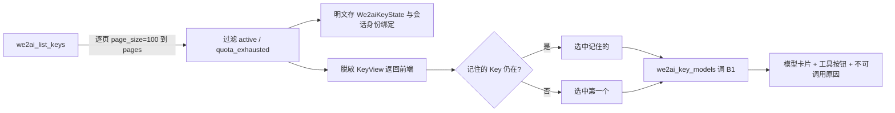
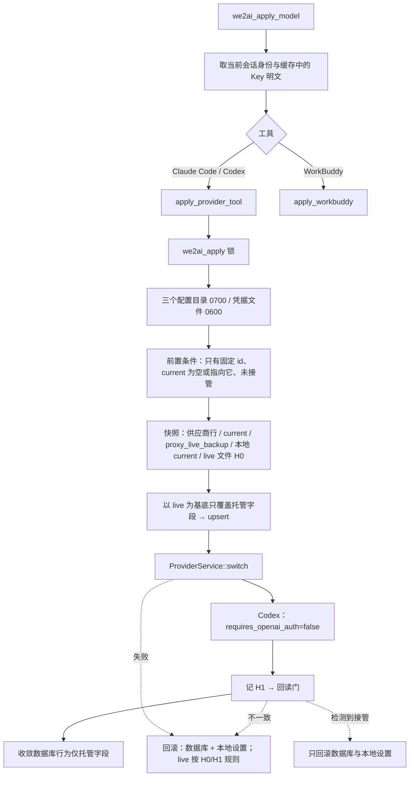

# we2ai 分支自定义功能列表

记录 `we2ai` 分支相对上游 `farion1231/cc-switch` 的全部差异，是同步上游时判断合并风险的唯一依据。实现细节看 git 历史，这里只写：fork 有什么、动了哪些文件、合并时要注意什么。

> 与代码冲突时以**当前代码**为准，并回头修正本文档。

## 分支模型

```
upstream/main (farion1231/cc-switch)
      │  fast-forward only（main 禁止混入 fork 改动）
      ▼
    main ──push──▶ origin/main
      │  整体 git merge（冲突主战场）
      ▼
    we2ai ──push──▶ origin/we2ai      ← 唯一发布分支，包含全部 fork 功能
```

| 动作 | 命令 |
|---|---|
| 合并前风险分析（只读） | Claude Code 中执行 `/sync-upstream` |
| 执行同步 | `./scripts/we2ai/sync-upstream.sh`（`NO_PUSH=1` 只合并不推送） |
| 单独跑守卫 | `./scripts/we2ai/check-guards.sh` |

**准入规则**：`we2ai` 对 `main` 一律整体 `git merge`，不逐条 cherry-pick。只有命中下方「排除类别」的上游内容，才在合并后手动裁剪；裁剪结论必须写进「同步记录」。

**新增 fork 功能时**：同一批提交内在本文档登记（风险表 + 功能说明）。会被上游改动还原、且能机械校验的，同时加进 `scripts/we2ai/check-guards.sh`。

---

## 快速风险评估表

同步后逐项检查，被还原的要手动恢复。同一文件只列一行。

| 风险 | 文件 / 位置 | 检查要点 | 守卫 |
|---|---|---|---|
| 🔴 高 | `package.json`、`src-tauri/tauri.conf.json`、`src-tauri/Cargo.toml`、`src-tauri/Cargo.lock` | 功能 1：4 处版本号一致，且主号 = 上游主号 + 1。上游每次发版都会改这几行，同步脚本会自动解决冲突 | ✅ 自动 |
| 🔴 高 | `.github/workflows/*.yml` | 功能 2：`on:` 只允许 `workflow_dispatch`（保留原有 `inputs`）。**上游新增的 workflow 文件不会冲突，会带着自动触发器直接进来**，靠守卫拦截 | ✅ 自动 |
| 🔴 高 | `src-tauri/tauri.conf.json` → `plugins.updater` | 功能 4：`endpoints` 只有 fork Release 地址；`pubkey` 为 we2ai 公钥（key ID `3B2842A26CC12882`）。上游换公钥/加镜像地址会冲突，保留 fork 侧 | ✅ 自动 |
| 🟡 中 | `src/components/DatabaseUpgrade.tsx`、`src/components/settings/AboutSection.tsx`、`src-tauri/src/commands/misc.rs` | 功能 4：发布页链接指向 `imleoo/cc-switch/releases`。上游新增的发布页/更新地址不会冲突，靠守卫扫 `farion1231/cc-switch/releases`、`dl.ccswitch.io` | ✅ 自动 |
| 🟢 低 | `scripts/we2ai/`、`.claude/commands/sync-upstream.md`、`CLAUDE.md`、本文档 | 功能 3：fork 独有文件，上游不会改 | — |
| 🔴 高 | `src-tauri/src/config.rs`、`settings.rs`（含 `mutate_settings` 可见性放宽为 `pub(crate)`，供 `we2ai::commands` 复用同一把写锁）、`panic_hook.rs`、`services/env_manager.rs` | 功能 6：5 行写死 `~/.cc-switch` 改为调用 `we2ai::mode::data_root()`（WE2AI 模式最先返回 `~/.we2ai`，早于 Store override 与 Windows 旧目录回退）。上游改这几个函数的写死路径高概率冲突，需人工核对 we2ai 分支的判断仍在最前面 | ✅ 自动（每处写死行上一行放 `// we2ai-allow-cc-switch` 标记，且标记必须落在登记的 `文件::函数名` 组合上——单纯贴标记不够，函数名对不上照样报错；非标记行一律要求落在 `#[cfg(test)]` 模块内；标记跟着代码走，不怕行号漂移；单测覆盖 `data_root()`、`get_backup_dir()` 落在 `.we2ai/backups`、真实负例 `get_app_config_dir()` 无视 Store override） |
| 🟢 低 | `src-tauri/src/app_store.rs` | 功能 6：新增 `#[cfg(test)] set_app_config_dir_override_for_test()`，仅供 `we2ai::mode` 的负例单测直接写入 override 缓存（该函数私有缓存原本只能通过真实 Tauri Store 写入，测试期没有真实 AppHandle） | — |
| 🔴 高 | `src-tauri/src/lib.rs` | 功能 7：`mod we2ai`（现为 `pub mod`，供外部集成测试引用）、`.invoke_handler(we2ai::mode::gate(...))` 包裹上游 `generate_handler!`、15 个启动/退出任务的 `we2ai::mode::startup_allowed(...)` 门控（含新增的 Skills SSOT 迁移、Codex 历史迁移三件套、定期数据库备份）、深链分发合并进 `handle_deeplink_url`、Linux deep-link handler 文件名按运行时实际二进制名动态推导（不写死 `cc-switch-handler`）、品牌字符串（`we2ai://`、`WE2AI v{}`、托盘 tooltip、数据库迁移对话框文案） | ✅ 自动（守卫检查 `invoke_handler(` 恰好出现 1 次且是 `gate(` 包裹的那次；`mode.rs` 的 `StartupTask` 每个变体在 `lib.rs` 里恰好出现 1 次，变体清单直接从 `mode.rs` 解析而非脚本里另存一份数字；`lib.rs` 不得出现字面量 `cc-switch-handler`；非注释行无残留 `CC Switch`；`cargo test` 用 `tauri::test` mock 运行时真实调用 `gate()` 验证三条分发路径，`tests/we2ai_startup_migration_gates.rs` 用真实 fixture 验证两个新增迁移门控） |
| 🟢 低 | `src-tauri/Cargo.toml` `[dev-dependencies]` | 功能 7：追加 `tauri = { version = "2.8.2", features = ["test"] }`，仅测试构建时通过 dev-dependency 与正式依赖合并生效，正式依赖不带 `test` feature，不影响发布产物体积；用于 `tauri::test::mock_builder`/`mock_app` 起 `MockRuntime` 测 `gate()` 的真实分发 | — |
| 🟡 中 | `src-tauri/src/codex_history_migration.rs`、`services/skill.rs` | 功能 7：不改动这两个文件本身，只是门控点调用的真实迁移逻辑所在，供排查"为什么这段没跑"时对照 | — |
| 🟡 中 | `src-tauri/src/tray.rs`、`auto_launch.rs` | 功能 5/7：托盘供应商/项目切换子菜单在 `we2ai::mode::enabled()` 时隐藏；主页链接 `we2ai.com`；开机自启注册名 `WE2AI` | — |
| 🟡 中 | `src-tauri/src/deeplink/parser.rs`、`lib.rs::handle_deeplink_url` | 功能 5：scheme 只接受 `we2ai`；WE2AI 模式下 provider/mcp/skill/prompt 四类导入全部拒绝，深链只用于唤起窗口；`we2ai::mode::enabled()` 分支恒真时会在此提前 `return true`，其后为非 WE2AI 构建保留的 `match parse_deeplink_url(...)` 分支在本 fork 中不可达，是死代码但不删除——上游解析失败（`Err(e)`）分支只发射 `deeplink-error` 事件、不聚焦主窗口（与解析成功分支不对称，成功才会 `unminimize/show/set_focus`），保留该行为差异供未来非 WE2AI 分支或上游同步核对，不属于 WE2AI 侧需要修的问题 | ✅ 自动（单测 `we2ai_scheme_is_accepted` / `ccswitch_scheme_is_rejected`） |
| 🔴 高 | `src-tauri/tauri.conf.json`、`tauri.windows.conf.json`、`Info.plist` | 功能 5：`productName=WE2AI`、`identifier=com.we2ai.desktop`、`mainBinaryName=we2ai`（见下方 Linux deep-link 行）、`plugins.deep-link.desktop.schemes=["we2ai"]`、Windows 窗口标题、macOS `CFBundleURLSchemes=we2ai` | ✅ 自动（守卫校验 tauri.conf.json 三项 + 对 `tauri.*.conf.json`/`Info.plist` 做 `CC Switch`/`ccswitch` 残留扫描） |
| 🔴 高 | `src-tauri/tauri.conf.json`（`mainBinaryName`）、`lib.rs`（Linux deep-link 处理器判断）、`.github/workflows/release.yml`（Windows exe 路径） | 功能 5：Linux 并存冲突修复——见下方"Linux deep-link 并存冲突"小节 | ✅ 自动（守卫拦 `cc-switch-handler` 字面量；三平台产物路径人工核对，未做真实跨平台构建验证，见已知限制） |
| 🟡 中 | `.github/workflows/release.yml` | 功能 5：DMG `.app`/卷名/图标目标、Windows 便携版 ZIP 内可执行文件名（`WE2AI.exe`）、Windows portable exe 源路径改为 `we2ai.exe`（`mainBinaryName` 生效后 cargo 产出的 `cc-switch.exe` 会被 `tauri build` 重命名，原路径不存在了）、产物文件名前缀、Release 标题与正文改为 WE2AI；上游改发版流程时高概率冲突 | — |
| 🟢 低 | `src/App.tsx`、`src/main.tsx`、`src/config/we2ai.ts`、`src/we2ai/`、`src/components/DatabaseUpgrade.tsx` | 功能 8：`WE2AI_MODE` 恒为 `true` 时 `App()` 早退渲染 `We2aiShell`；`main.tsx` 跳过 `syncModelsDevPricingOnStartup`；`DatabaseUpgrade.tsx` 隐藏 `check_app_update_available`/`open_app_config_folder` 两个非白名单入口 | ✅ 部分（`pnpm typecheck`；`tests/integration/App.test.tsx` mock `WE2AI_MODE=false` 继续覆盖上游 App 树；`We2aiShellIpcWhitelist.test.tsx`/`DatabaseUpgradeIpcWhitelist.test.tsx` 真实渲染 `<App/>`/`<DatabaseUpgrade/>` 并断言全部 `invoke()` 落在前端白名单 `src/we2ai/ipcWhitelist.ts` 内，该文件与 Rust 白名单由 `upstream_whitelist_matches_frontend_ipc_whitelist` 单测强制同步） |
| 🟢 低 | `src/we2ai/We2aiShell.tsx`（`web-logo.svg`）、`src/components/settings/AboutSection.tsx`（未改，logo 仍是上游 `app-icon.png`） | 功能 8：关于页 logo——`AboutSection.tsx` 在 WE2AI 模式下不挂载（属于 We2aiShell 不渲染的上游视图之一），改它的图标资源没有实际意义，也不属于"品牌改名"应该动的用户可见路径，未改；`We2aiShell` 自己的顶栏与关于卡片用 `assets/designs/web-logo.svg`（复制到 `src/assets/icons/web-logo.svg`，与 `favicon.svg` 同一引入方式） | — |
| 🟡 中 | `src-tauri/Cargo.toml` | 功能 9：新增生产依赖 `rand`（验证码 nonce）；按 `target.'cfg(target_os = "...")'.dependencies` 追加 `keyring`（macOS `apple-native`、Windows `windows-native`、Linux `sync-secret-service`，3.6 系列，MSRV 1.75，兼容本 crate 声明的 `rust-version = "1.85.0"`；v4 系列 MSRV 1.88 暂不采用）；`[dev-dependencies]` 新增 `wiremock` 做 HTTP mock 测试。上游改这些既有 target 分区（新增/调整依赖）时高概率冲突，需人工核对 `keyring` 那一行没被误删 | ✅ 自动（`cargo check`/`cargo test` 编译失败即报错） |
| 🟡 中 | `src-tauri/src/lib.rs` | 功能 9：`app.manage(We2aiSessionState(...))`、`app.manage(We2aiCaptchaState(...))` 初始化块（紧跟 `app.manage(app_state)` 之后）；`generate_handler!` 的 WE2AI 命令列表新增 12 个 `we2ai_*` 登录会话命令（含 `we2ai_retry_now`） | — |
| 🟢 低 | `src-tauri/src/we2ai/{api,captcha,region,secret_store,session,commands_auth}.rs`、`src/we2ai/{LoginPage.tsx}`、`src/we2ai/{api.ts,strings.ts,We2aiShell.tsx}`（登录会话相关新增部分） | 功能 9：fork 独有文件/新增导出，上游不会改，冲突面小 | — |
| 🟢 低 | `.github/workflows/{ci,release}.yml` 的 Linux apt 依赖列表 | 功能 9：新增 `libdbus-1-dev`（`keyring` crate 的 `sync-secret-service` 后端构建期链接系统 libdbus-1 所需）。上游若重排这段 apt 安装脚本会冲突，保留这一行 | — |
| 🟡 中 | `src-tauri/src/lib.rs` | 功能 10：`app.manage(we2ai::keys::We2aiKeyState::default())`；WE2AI 命令列表追加 `we2ai_list_keys`、`we2ai_select_key`、`we2ai_key_models` | — |
| 🔴 高 | `src-tauri/src/services/provider/mod.rs` `ProviderService::switch` | 功能 11：`should_hot_switch` 判定之后插入一段：`is_managed_provider_id(id)`（`we2ai-claude`/`we2ai-codex`）在接管状态下返回本地化错误 `we2ai.takeover_conflict`，不进入热切换、不写 live 与 `proxy_live_backup`。只拦 WE2AI 固定 id，上游其他供应商与上游测试行为不变。上游改 switch 的接管分支时高概率冲突，必须保留这段且位于热切换调用之前 | ✅ 自动（守卫 4.6：恰好 1 处且位于 `hot_switch_provider_inner` 之前；`apply_tests::takeover_starting_right_before_switch_is_refused_and_left_intact`） |
| 🟡 中 | `src-tauri/src/lib.rs`、`we2ai/commands_auth.rs` | 功能 11：WE2AI 命令列表追加 `we2ai_tool_status`、`we2ai_apply_plan`、`we2ai_apply_model`、`we2ai_restore_official`、`we2ai_restore_plan`（功能 17，P6 取代功能 12 的 `we2ai_remove_tool_keys`）；`we2ai_logout` 增加 `app_handle` 参数，登出后清除固定 id 供应商行里的 Key | ✅ 自动（守卫 4.9：`we2ai_remove_tool_keys`/`RemoveToolKeysOutcome` 不得重现；`we2ai_restore_official`/`we2ai_restore_plan` 必须在 `lib.rs` 命令列表里） |
| 🟢 低 | `src-tauri/src/we2ai/{apply,apply_tests,fsguard,snapshot,workbuddy,detect,commands_apply}.rs`、`src/we2ai/{ApplyDialog,ToolStatusBar}.tsx`、`src/we2ai/toolLabels.ts` | 功能 11：fork 独有 | — |
| 🟢 低 | `src-tauri/src/lib.rs`（WE2AI 初始化块）、`we2ai/mode.rs`、`docs/we2ai/` | 功能 12：启动时 `harden_data_root()`；`docs/we2ai/` 为 fork 独有文档目录。登出移除 Key 的命令注册已被功能 17 取代（原 `we2ai_remove_tool_keys`，见上一行） | — |
| 🟡 中 | `src-tauri/src/we2ai/{apply,commands_apply,session,secret_store}.rs`、`src/we2ai/{api,strings,We2aiShell,ToolStatusBar}.tsx` | 功能 17（P6，方案外增补）：`we2ai_restore_official` 取代 `we2ai_remove_tool_keys`——不再只删 Key，而是移除 WE2AI 为该工具写入的一切并把工具恢复到官方配置；结果分 `restored`/`unchanged`/`skipped` 三态，`unchanged`（未指向 WE2AI 或被 CC Switch 接管）不算失败、不弹警告；`we2ai_restore_plan` 是恢复确认弹窗专用的独立计划命令，与写入用的 `we2ai_apply_plan` 不共用（字段语义相反）；`SessionManager` 新增 `secret_store()` 只读访问器；`apply_provider_tool` 新增 `secret_store: &dyn SecretStore` 形参（Claude apply 删除用户自己的 `env.ANTHROPIC_API_KEY` 前先存入系统钥匙串固定 account `tool:claude:ANTHROPIC_API_KEY`，保存失败则整次 apply 中止不写入；恢复时如 live 没有该字段则从钥匙串写回，文件写入成功后才删钥匙串条目）。上游不会触碰这些文件，冲突面小；`apply_provider_tool`/`merged_claude_settings` 签名变化在同步时需要一并检查调用点 | ✅ 自动（守卫 4.9） |
| 🟢 低 | `src-tauri/src/we2ai/keys.rs`、`src/we2ai/ModelSquarePage.tsx`、`api.rs`/`session.rs`/`commands_auth.rs`/`api.ts`/`strings.ts`/`We2aiShell.tsx` 的 Key 与模型广场部分 | 功能 10：fork 独有，冲突面小 | ✅ 自动（守卫 4.5：`KeyView` 与 `We2aiKeyView` 字段允许清单，禁止 serde 属性） |
| 🟢 低 | `src/we2ai/we2ai-theme.css`（新增）、`src/we2ai/{We2aiShell,LoginPage,ModelSquarePage,ApplyDialog,ToolStatusBar}.tsx` 的 className | 功能 13：UI 视觉对齐 we2ai.com，只改样式不改行为/文案/testid，fork 独有文件，冲突面小 | ✅ 部分（`pnpm typecheck`；既有 `tests/integration/{We2aiShellIpcWhitelist,We2aiShellOffline,LoginPage,We2aiApplyFlow,ModelSquarePage}.test.tsx` 回归） |
| 🔴 高 | `src-tauri/Cargo.toml` | 功能 14：新增 `[[bin]] name = "we2ai" path = "src/main.rs"`，让 `cargo build`/`pnpm tauri dev` 直接产出 `we2ai(.exe)`，不再是跟着 `[package] name` 走的 `cc-switch(.exe)`。`[package] name`（`cc-switch`）与 `[lib] name`（`cc_switch_lib`）不变——上游同步改 `Cargo.toml` 时高概率与新增的 `[[bin]]` 段冲突，合并时必须保留这三者：包名/库名不变 + `[[bin]]` 段存在且 `name = "we2ai"` | ✅ 自动（守卫 4.7：`[[bin]]` 段存在且 `name` 为 `we2ai`；`[package]`/`[lib]` 的 `name` 未被误改） |
| 🟡 中 | `.github/workflows/release.yml` | 功能 15：macOS 签名/公证全部改为按 `secrets.APPLE_CERTIFICATE` 是否存在走双分支（有证书=原有完整签名公证流程；无证书=`APPLE_SIGNING_IDENTITY=-` 临时签名、跳过公证/装订、DMG 不加 `--codesign`）；`release` job 新增 tag 守卫（非 `v*` tag ref 直接失败）。上游改这段会与双分支逻辑冲突，需人工核对新增的 `HAS_APPLE_CERT` 判断与各步骤 `if:` 条件仍然完整 | ✅ 部分（守卫检查 tag 守卫步骤存在；双分支的实际 CI 运行未验证，见已知限制） |
| 🟢 低 | `src-tauri/icons/tray/macos/statusbar_template_3x.png`、`assets/designs/tray-template.svg`（新增） | 功能 16：macOS 菜单栏托盘模板图标换成 WE2AI 标志（上游同名文件被替换，上游改托盘图标时会产生二进制冲突，保留 fork 侧版本） | — |

## 排除类别（上游内容，we2ai 主动不采纳）

| 类别 | 判定依据 | 处理 |
|---|---|---|
| 自动触发的 workflow | 功能 2 | 合并后把 `on:` 改回仅 `workflow_dispatch` |

暂无其他排除类别。首次决定"整链不采纳"某项上游功能时，在此登记类别、判定依据和检查命令。

---

## 功能详细说明

> 每节固定三段：功能一句话 → 关键文件 → 合并注意。

### 1. 自定义版本号

上游主号 +1，次/修订号跟随上游：上游 `3.20.4` → we2ai `4.20.4`。副作用：主号更高，上游 3.x 的自动更新不会覆盖 we2ai 安装。

**文件**：`package.json`、`src-tauri/tauri.conf.json`、`src-tauri/Cargo.toml`（`[package]`）、`src-tauri/Cargo.lock`（`name = "cc-switch"` 条目）。读写逻辑在 `scripts/we2ai/lib.sh`。

**合并注意**：同步脚本会先把三方版本统一成占位符再做三方合并，只有版本号行冲突时自动解决；无冲突合并后也会统一改写为 fork 版本。手动 merge 时必须跑 `check-guards.sh`。

### 2. GitHub Actions 全部改为仅手动触发

7 个上游 workflow（ci / claude / labeler / release / stale / sync-r2 / wsl2-nightly）的 `on:` 块统一改为只有 `workflow_dispatch`，防止 fork 仓库自动跑上游的发版、R2 同步、定时任务、PR bot。

**文件**：`.github/workflows/*.yml` 的 `on:` 块（每个文件带 `# we2ai:` 注释标记）。

**合并注意**：上游改 `on:` 块会冲突，保留 fork 侧写法；上游**新增** workflow 不冲突，守卫检查会报出来。

### 3. 上游同步基础设施

两分支同步模型、同步脚本、守卫检查、`/sync-upstream` 风险分析命令，以及本文档。

**文件**：`scripts/we2ai/{lib,check-guards,sync-upstream}.sh`、`.claude/commands/sync-upstream.md`、`CLAUDE.md`、`自定义开发功能列表.md`。上游 `.gitignore` 忽略了 `CLAUDE.md` 和 `.claude/`，这两处是 `git add -f` 强制跟踪的。

**合并注意**：上游若改 `.gitignore` 不影响已跟踪文件；新建同类文件时记得 `git add -f`。

### 4. 自动更新指向 we2ai

应用内更新从 fork 的 GitHub Release 拉 `latest.json`，用 we2ai 自己的密钥验签；手动"打开发布页"的兜底链接也指向 fork。

**文件**：`src-tauri/tauri.conf.json`（`plugins.updater.endpoints` / `pubkey`）；发布页链接在 `DatabaseUpgrade.tsx`、`AboutSection.tsx`、`commands/misc.rs`。`release.yml` 生成 `latest.json` 时用 `$GITHUB_REPOSITORY`，无需改。

**密钥**：私钥 `~/.tauri/we2ai.key`，口令 `~/.tauri/we2ai.key.password`（均只在本机，权限 600）；GitHub Secret `TAURI_SIGNING_PRIVATE_KEY` / `TAURI_SIGNING_PRIVATE_KEY_PASSWORD` 已配置在 `imleoo/cc-switch`。**私钥丢失 = 已安装的 we2ai 客户端再也无法自动更新**，务必另行备份。

**发版**：打 `v4.x.y` tag 推到 origin 后，在 Actions 手动运行 `release.yml`（功能 2 已禁用 tag 自动触发），选 tag 作为 ref。`sync-r2.yml` 同步的是上游的 R2/`dl.ccswitch.io`，we2ai 不要运行。

**合并注意**：上游改 updater 配置会冲突，保留 fork 侧。项目主页链接自功能 5（WE2AI 品牌改名）起已改为 `we2ai.com`，不再是未改状态。

### 5. WE2AI 品牌改名

产品名、`identifier`、深链 scheme、图标、托盘、开机自启、发布产物全部改为 WE2AI；`identifier`/`productName`/scheme 首次发版前冻结，之后不再改。

**文件**：`src-tauri/tauri.conf.json`（`productName`/`identifier`/`plugins.deep-link.desktop.schemes`）、`src-tauri/tauri.windows.conf.json`（窗口标题）、`src-tauri/Info.plist`（`CFBundleURLSchemes`/`CFBundleURLName`；与 `tauri.conf.json` 的 `plugins.deep-link.desktop.schemes` 两处 scheme 必须保持一致，由 `check-guards.sh` 4.3b 的品牌/scheme 残留扫描保证）、`src-tauri/src/deeplink/parser.rs`（scheme 校验）、`src-tauri/src/lib.rs`（深链前缀、启动日志、托盘 tooltip、数据库迁移/初始化失败对话框里"回退到旧版本 WE2AI"“升级 WE2AI”文案——注意 `lib.rs` 里另外 3 处提到"CC Switch"的是注释，指的是与真实存在的 CC Switch 应用互操作场景，不应替换）、`src-tauri/src/tray.rs`（主页链接）、`src-tauri/src/auto_launch.rs`（开机自启注册名）、`src-tauri/icons/*`（`pnpm tauri icon assets/designs/appicon.png` 重新生成）、`src/index.html`（favicon，复制自 `assets/designs/favicon.svg` 到 `src/assets/icons/favicon.svg` 后以相对路径引用，与项目现有 `src/assets/icons/*` 静态资源方式一致）、`src/main.tsx`（数据库加载失败兜底路径 `~/.we2ai/config.json`）、`src/i18n/locales/*.json` 与 12 个前端文件（`CC Switch` → `WE2AI` 的用户可见文案）、`.github/workflows/release.yml`（DMG `.app`/卷名/图标目标、Windows 便携版 ZIP 内可执行文件改名 `WE2AI.exe`、全部产物文件名前缀与 Release 标题/正文）。updater 的 `endpoints`/`pubkey`（功能 4）不受影响。

**品牌替换的例外（不改）**：
- i18n `settings.partnerPromotion.*`（合作伙伴推广文案）：其中的"CC Switch"指代真实签约的产品名、"cc-switch"/"CCSWITCH"/"CC-SWITCH" 是第三方实际生效的优惠码，都是事实性内容，不是我们的自称，全部保留原文，不随品牌改名替换。
- `src/utils/errorUtils.ts` 的 `"changed outside CC Switch"`：这是与后端 `pi_config/mod.rs`、`services/{pi_prompt_files,prompt}.rs` 错误文案做字符串匹配的字面量，后端未改（那些文案面向的是 Pi 客户端交叉编辑场景，与品牌无关），前端必须保持一致才能命中匹配，不能替换。
- `src/config/codexProviderPresets.ts` 两处"直接/以 CC Switch 为例"：转述的是第三方（Kimi/Moonshot 官方文档）原文用词，改成 WE2AI 会歪曲第三方文档的实际表述，保留原文。
- 判断准则：字面量只要用于**匹配、比较、协议、外部事实转述**，一律不随品牌改名替换；只有**我们自称产品名**的用户可见文案才替换。

**i18n 路径文案同步**：`settings.skillStorage.ccSwitchHint`（键名是历史遗留，未改）的存储路径示例已从 `~/.cc-switch/skills/` 改为 `~/.we2ai/skills/`，与 `SkillService::get_ssot_dir()` 实际调用 `get_app_config_dir()` 的真实路径一致。

**合并注意**：上游改 `tauri.conf.json`/`Info.plist` 品牌字段、`deeplink/parser.rs` 的 scheme 校验、`lib.rs` 深链分发逻辑、`release.yml` 打包命名，均高概率冲突，保留 fork 侧 WE2AI 值；上游新增用户可见字符串若含 `CC Switch`，守卫会报出来但不会自动改，需要人工判断是否属于上面的"例外"再决定是否替换。

**Linux deep-link 并存冲突（identifier 不隔离这个场景）**：`app.path().data_dir()`（`PathResolver::data_dir()`）在 Linux 上解析到裸的 `$XDG_DATA_HOME`（即 `~/.local/share`），**不带 bundle identifier**——会按 identifier 隔离的是另一个方法 `app_data_dir()`，我们和 `tauri-plugin-deep-link` 2.4.7 内部用的都是前者。deep-link 插件把处理器写到 `~/.local/share/applications/<可执行文件名>-handler.desktop`（插件源码 `src/lib.rs` 的 `register`/`unregister`/`is_registered` 三处，见发行包 `tauri-plugin-deep-link-2.4.7.crate`），这是共享目录，只靠 identifier 不同并不能让 WE2AI 和真实 CC Switch 的处理器文件互不冲突——冲突的根源是**两边编译出的可执行文件都叫 `cc-switch`**（Cargo 包名未改）。

处理方式：在 `tauri.conf.json` 顶层加 `"mainBinaryName": "we2ai"`。这是 Tauri 2 官方配置项，作用是"`tauri build` 时把 cargo 产出的二进制重命名为这个名字，再交给 `tauri bundle`"（`tauri-utils::config::Config::main_binary_name` 的文档原文），选它而不是改 `[package] name`（Cargo 包名）是因为后者会让 `Cargo.toml`/`Cargo.lock` 的包名条目、版本管理脚本（`scripts/we2ai/lib.sh` 依赖 `name = "cc-switch"` 定位版本行）、以及所有引用包名的地方全部跟着变，冲突面大得多；`mainBinaryName` 只影响最终产物的文件名，不碰 Cargo 元数据。三个平台的影响：
- **Windows**：`tauri build` 产出 `we2ai.exe`（不再是 `cc-switch.exe`），release.yml 里 Windows 便携版打包步骤原本找 `target/**/release/cc-switch.exe` 已同步改成找 `we2ai.exe`。
- **macOS**：`.app/Contents/MacOS/` 内的可执行文件改名为 `we2ai`（`CFBundleExecutable` 由 tauri-bundler 同步指向新名字，这是该配置项的既定契约，本机没有 tauri-bundler 源码缓存，未逐行核对，需要在真实 macOS 构建里验证一次能正常启动）。DMG/`.app` 的打包发现逻辑用 `find "$path" -name "*.app"` 通配，不关心内部可执行文件名，不受影响。
- **Linux**：`tauri build` 产出的可执行文件（进而 AppImage/deb/rpm 内打包的那份）改名为 `we2ai`；release.yml 的 Linux 步骤只用 `--bundles appimage,deb,rpm` 让 tauri-cli 自己找二进制并打包，没有硬编码路径，不受影响。

`lib.rs` 侧配合改了判断逻辑：原来的 Linux 分支写死检查 `~/.local/share/applications/cc-switch-handler.desktop` 是否存在来决定要不要跳过注册（避免覆盖用户改过的 `.desktop` 文件），这个写死名字本身也是本次要修的问题之一。改为用 `tauri::utils::platform::current_exe()`（与插件内部用的是同一个函数）在运行时取实际可执行文件名，动态拼出 `<文件名>-handler.desktop` 再判断是否存在——这样无论 `mainBinaryName` 在当前这次运行下是否真的生效（例如某些不经过 `tauri build` 重命名步骤的运行方式，判断始终和插件的真实行为对齐，不会因为写死名字而跟插件的实际产物脱节。守卫拦截 `lib.rs` 里出现字面量 `cc-switch-handler`，防止这处判断被静默改回写死。

已知限制：`mainBinaryName` 对 macOS `CFBundleExecutable`、`tauri dev` 场景下二进制是否同步重命名，本次没有条件在三个平台各跑一次真实的 `tauri build`/`tauri dev` 验证，只核对了配置字段的官方文档描述与 `lib.rs` 判断逻辑本身的正确性（`cargo check` 通过，Linux 分支代码临时放宽 `#[cfg(target_os)]` 在 macOS 本机编译验证过语法与类型）；正式发版前应在 Linux 环境实机验证：装一个改名前的旧构建（模拟"真实 CC Switch"）+ 新的 WE2AI 构建，确认两者的 `.desktop` 文件不再重名。

**守卫 4.3c 的扫描范围只到 `lib.rs`，不是全仓**：`pi_config/mod.rs`、`services/{pi_prompt_files,prompt}.rs`、`database/backup.rs` 等文件里仍保留的"CC Switch"错误文案没有被扫描，也不需要扫描——这些文案所在的命令（Pi 供应商写冲突检测、SQL 备份导入校验等）本来就不在 IPC 白名单内，WE2AI 模式下 `gate()` 会在请求到达这些 handler 之前就拒绝掉，用户永远看不到这些文案，替换与否不影响 WE2AI 的用户体验，反而替换了会导致 `errorUtils.ts` 之类的前端匹配字面量需要同步改（见上面的"品牌替换例外"）。只扫 `lib.rs` 是因为它是 WE2AI 自己写的对话框/日志文案的唯一落点（数据库迁移、初始化失败对话框），这些命令在启动阶段就会跑到，是真正会展示给 WE2AI 用户看的文案。

### 6. 数据隔离（`~/.we2ai`）

WE2AI 与 CC Switch 除 `identifier` 不同外，运行时数据完全隔离：数据库、本地设置、崩溃日志、环境变量备份统一落在 `~/.we2ai`，不从 `~/.cc-switch` 自动导入任何数据。

**文件**：`src-tauri/src/we2ai/mode.rs`（`data_root()`）；`src-tauri/src/app_store.rs::set_app_config_dir_override_for_test`（仅测试期使用，直接写入 override 缓存验证负例）；5 处写死点，各自在写死行的**上一行**放 `// we2ai-allow-cc-switch` 标记放行——`config.rs`（`get_app_config_dir()` 里两处：默认目录、Windows 旧目录回退，早于 Store override 判断）、`settings.rs`（`AppSettings::settings_path()`）、`panic_hook.rs`（`default_app_config_dir()`）、`services/env_manager.rs`（`get_backup_dir()`）。

**合并注意**：上游若新增写死 `~/.cc-switch` 的位置，`check-guards.sh` 会因为那一行的上一行没有 `// we2ai-allow-cc-switch` 标记而报错，需要评估是否也要接入 `data_root()`——评估后决定放行的话，在写死行上一行加这个标记即可，不用改脚本或维护单独的行号清单。选标记而不是 `file:line` 精确登记：行号登记会在两种常见场景下失真——上游在登记行前面插入/删除代码导致行号整体偏移（明明还是同一行代码，行号对不上就被误报为新增违规）；或者 we2ai 分支的判断被误删但那一行字面量本身没删（行号凑巧还留在登记表里，反而漏报）。标记贴在代码行正上方，跟着代码一起移动、一起被删，两种失真都不会发生。测试代码判定按 `#[cfg(test)]` 模块边界排除（见 `database/backup.rs` 内的测试 fixture；`services/skill.rs` 的测试 fixture 已改用 `.we2ai` 不再匹配），不需要额外加标记。守卫匹配的是精确字符串字面量 `".cc-switch"`（不要求紧跟 `.join(`），能同时拦住 `PathBuf::from(".cc-switch")` 等写法，但不会误伤 `codex_config.rs` 里 `"[model_providers.cc-switch]"` 这类无关的更长字符串子串。

### 7. 启动/退出白名单与 IPC 默认拒绝白名单

WE2AI 模式下，启动阶段不导入/种子任何供应商、MCP、提示词、Skills，不做 Skills SSOT 迁移或 Codex 历史迁移，不做本地代理接管恢复或退出时的 live 恢复，不跑 WebDAV/S3 同步与会话用量扫描；IPC 层默认拒绝一切非白名单命令。

**文件**：`src-tauri/src/we2ai/mode.rs`（`StartupTask` 枚举 + `startup_allowed()`、`gate()` 及上游命令白名单纯函数）、`lib.rs`（14 处调用点门控 + `.invoke_handler(we2ai::mode::gate(...))` 包裹）、`we2ai/commands.rs`（`we2ai_get_settings`/`we2ai_save_settings`，唯一放行的设置读写入口，只覆盖主题/语言/窗口/开机自启相关字段，通过 `settings::mutate_settings` 单次写锁做读-改-写，避免并发保存互相覆盖）。

`lib.rs` 15 个启动/退出门控点（对应 `StartupTask` 枚举的全部变体，见 `mode.rs`；`check-guards.sh` 不再单独维护一份数量常量，而是直接从 `mode.rs` 解析变体清单，逐个核对每个变体在 `lib.rs` 里恰好出现一次——新增/删除变体或门控点会被守卫自动感知，不需要手改脚本里的数字）：首次运行导入现有工具供应商、官方供应商种子、累加模式导入（含 OMO/OMO Slim 本地导入）、默认 Skills 初始化、表空导入 MCP、表空导入提示词、启动代理状态恢复、崩溃残留恢复、退出时 live 恢复、WebDAV/S3 同步、会话用量同步与轮询、公共配置片段抽取与 Gemini 泄漏清理、**Skills SSOT 迁移**、**Codex 历史迁移三件套**、**定期数据库备份**（功能 11 新增：备份是整库副本，含供应商行里的 Key）。

**Skills SSOT 迁移 / Codex 历史迁移已加门控（此前的说法有误，已更正）**：早期版本认为这两处"只在全新数据根下走不到，不需要门控"，其中 Codex 历史迁移三个函数确实会在 DB 内没有第三方 provider 时提前 no-op，但 **Skills SSOT 迁移（`services/skill.rs::migrate_skills_to_ssot`）会扫描各工具的真实 Skills 目录（`~/.claude/skills`、`~/.codex/skills` 等）并把发现的文件复制进 SSOT**——这就是"从外部工具读取"，不是纯内部数据库格式迁移，此前"不读取任何外部工具配置"的表述是错的。两者现已分别用 `StartupTask::SkillsSsotMigration`、`StartupTask::CodexHistoryMigration` 门控。`tests/we2ai_startup_migration_gates.rs` 补了负例：预置迁移标记 + 真实会被扫到的 Skill 目录（Skills 侧）、预置会让 `collect_source_model_provider_ids` 非空的第三方 Codex 供应商 + 真实会被改写的 session jsonl（Codex 侧），每个测试双重验证：① 门控函数返回值——直接断言 `we2ai::mode::startup_allowed(task)` 为 `false`；② fixture 活性——迁移调用包在与 `lib.rs` 相同的 `if startup_allowed(task) { ... }` 模式内并保持未执行，随后断言 fixture（Skills 表、session jsonl、迁移完成标记）原样未变，证明这些 fixture 是会被真实扫描到、若门控失效将产生可观察副作用的活数据，而不是不会被触碰的摆设。

上游命令白名单（IPC gate 唯一放行的非 `we2ai_*` 命令）：`get_init_error`、`get_migration_result`、`get_skills_migration_result`、`set_window_theme`、`get_tool_versions`、`check_for_updates`、`install_update_and_restart`、`restart_app`、`open_external`、`get_auto_launch_status`、`set_auto_launch`。`plugin:*` 命令（如 `updater`、`opener`、`dialog`、`window`）不经过 `invoke_handler`，由 `capabilities/default.json` 单独管控，未改动。前端有一份镜像清单 `src/we2ai/ipcWhitelist.ts`（`WE2AI_UPSTREAM_IPC_WHITELIST`），两份清单没有跨语言共享机制，靠 `cargo test` 里的 `upstream_whitelist_matches_frontend_ipc_whitelist` 在测试期解析 TS 源文件、逐项 diff 两份列表来防止漂移；改任一侧都必须同步改另一侧，否则该单测会失败。

**守卫的真实能力（避免文档与实现不符）**：`check-guards.sh` 是静态结构检查，能确认三件事——①`invoke_handler(` 在 `lib.rs` 里恰好出现 1 次且是 `gate(` 包裹的那一次（多一处未包裹的 `invoke_handler` 就可能绕开白名单）；②`mode.rs` 的 `StartupTask` 每个变体在 `lib.rs` 里恰好被引用 1 次（不是只核对调用点"总数"——总数相同不代表每个变体都被正确用到，可能出现"漏了一个变体、另一个变体被误用两次"从而总数凑巧相等还蒙混过关的情况，已用故意构造的漂移场景验证过总数检查会漏掉但逐变体检查能抓到）；③写死 `.cc-switch` 路径的标记必须落在登记的 file+函数名 组合上（见功能 6）。它**不能**验证"白名单外的调用真的会被拒绝"这种运行时行为——那部分由 `cargo test` 覆盖：`gate_dispatches_ipc_commands_to_the_correct_handler`（用 `tauri::test::mock_builder`/`mock_app` 起一个真实的 `MockRuntime` App，各发一次 `we2ai_*`、白名单内、白名单外三种命令，核对分发结果）、`upstream_whitelist_rejects_everything_else`（判定纯函数的负例）。`Cargo.toml` 的 `[dev-dependencies]` 里为此把 `tauri` 加了 `features = ["test"]`（正式依赖不带这个 feature，只在测试构建时通过 dev-dependency 合并生效，不影响发布产物体积）。

**合并注意**：上游在 `lib.rs` 新增启动任务或新命令时不会自动加入白名单/门控，默认即被拒绝/跳过——这是设计意图（更安全），但如果新功能应该在 WE2AI 里可用，需要人工评估是否要放行。上游高频改动 `lib.rs`，每次同步都要跑 `cargo test we2ai` 核对 15 个门控点与白名单判定仍然成立；新增门控点时只需要在 `mode.rs` 加变体、在 `lib.rs` 加一次引用，`check-guards.sh` 会自动核对数量，不需要再手改脚本常量。

### 8. WE2AI 前端壳

`WE2AI_MODE` 恒为 `true`：`App()` 顶部早退只渲染 `We2aiShell`（未登录时渲染登录页 `LoginPage`；登录后为品牌顶栏 + 模型广场（功能 10）+ 精简设置页，见功能 9），上游供应商/MCP/Skills/代理等视图不挂载，`main.tsx` 跳过会触发非白名单命令的启动任务（如 `syncModelsDevPricingOnStartup`）。

**文件**：`src/config/we2ai.ts`（`WE2AI_MODE` 常量）、`src/we2ai/`（`We2aiShell.tsx`、`api.ts`、`strings.ts`、`ipcWhitelist.ts`）、`src/App.tsx`（1 处早退分支）、`src/main.tsx`（1 处条件跳过）、`src/components/DatabaseUpgrade.tsx`（WE2AI 模式下隐藏"打开配置目录"按钮，且启动时不探测 `check_app_update_available`——二者均不在 IPC 白名单内；这个界面独立于 `App.tsx`/`We2aiShell` 渲染，由 `main.tsx` 在数据库版本过新时直接挂载，所以要单独处理，不能指望 `We2aiShell` 的早退分支覆盖它）。

**合并注意**：上游改 `App.tsx` 顶部结构（如迁移到新的状态管理、拆分组件）容易和早退分支冲突，冲突时保留 we2ai 分支的早退判断，其余按上游改动合并；上游改 `DatabaseUpgrade.tsx` 增加新的 IPC 调用时要检查是否需要同样在 WE2AI 模式下隐藏。`tests/integration/App.test.tsx` 通过 `vi.mock("@/config/we2ai", ...)` 把 `WE2AI_MODE` 强制设为 `false`，继续对上游 App 树做回归测试——上游代码仍打包在 fork 里，只是默认不挂载，这样上游测试改动同步时仍能提示真实回归。`tests/integration/We2aiShellIpcWhitelist.test.tsx` 反过来用真实的 `WE2AI_MODE=true`（不 mock）渲染 `<App/>`，断言它落在 `We2aiShell` 分支、且期间发出的每个 `invoke()` 都在 `src/we2ai/ipcWhitelist.ts` 白名单内；`tests/integration/DatabaseUpgradeIpcWhitelist.test.tsx` 同样用真实 `WE2AI_MODE=true` 单独渲染 `<DatabaseUpgrade/>`（它不挂在 `We2aiShell` 树下，需要单独覆盖），断言挂载阶段不产生任何 invoke、"打开配置目录"按钮不渲染、点击"升级应用"后的 `invoke()` 落在白名单内。

### 9. 登录会话（方案第 5.1、5.2 节，P2 阶段）

邮箱密码登录（含 2FA）、国内版手机验证码登录、单飞 refresh、失败分类、登出四步、验证码窗口内导航拦截、会话索引与钥匙串持久化。

**文件**：

- `src-tauri/src/we2ai/region.rs`：`Region` 枚举（国际版 / 国内版正式 / 国内版测试，后者仅 `cfg!(debug_assertions)` 可选）与基址映射、存储 key。
- `src-tauri/src/we2ai/api.rs`：`ApiClient`（reqwest）、envelope/四种错误响应形态解码为 `ErrorCode::{Named,Status}`、`User-Agent: WE2AI-Desktop` 常量与 `X-We2ai-Client` 头、`CaptchaTicket` 按 provider 序列化为 SubPanel 实际请求字段（`turnstile_token` / `tencent_captcha_ticket`+`tencent_captcha_randstr`，字段名已对照 SubPanel `auth_handler.go` 的 `LoginRequest`/`SendSmsCodeRequest`/`PhoneLoginRequest` 核实，不是按方案文字臆测）。
- `src-tauri/src/we2ai/secret_store.rs`：`SecretStore` trait + `KeyringSecretStore`（生产，基于 `keyring` crate）+ `test_support::InMemorySecretStore`（仅测试期，可注入读/写/删除失败，覆盖"钥匙串锁定/不可用/拒绝访问"退化路径而不依赖真实系统钥匙串）。
- `src-tauri/src/we2ai/session.rs`：`SessionManager`（`Arc` 包装、廉价 `Clone`）——会话索引 `~/.we2ai/session_index.json`（`region → {user_id, email_masked}`；"记住上次"的区域另存独立文件 `~/.we2ai/last_region.json`，见下方第 5 轮条目；二者均经 `we2ai::mode::data_root()`，原子写入用上游 `config::atomic_write_private`）、单飞 refresh（`futures::future::Shared`，同一时刻多个调用者只触发一次 `/auth/refresh`）、失败分类（受保护接口 `TOKEN_EXPIRED`/`ACCESS_TOKEN_EXPIRED` 触发单飞 refresh 后重放，重放结果再走一次 `classify_protected_error` 而不是原样上抛；`TOKEN_REVOKED`/`INVALID_TOKEN`/`USER_NOT_ACTIVE`/`BACKEND_MODE_ACTIVE`/未知 401 终止会话；refresh 接口对应终止码集合另列；网络/429/5xx 保留凭证退避重试）、登出四步（置登出中拒绝新 refresh → 等待在途 refresh → 持最新 refresh_token 调 `/auth/logout` → 清钥匙串与索引、generation 递增）、`ResumeOutcome::{Restored,NeedLogin,OfflineRetained}` 三态恢复结果（断网时保留内存会话，不回登录页）。
  - 简化：只维护"当前一个活跃会话"，未按 `{region}:{user_id}` 做锁表——桌面客户端 UI 一次只显示一个已登录账号，多会话锁表是不必要的复杂度（YAGNI），已在文件顶部文档注释登记。
  - **并发/竞态修复（Opus 5 代码评审）**：① 单飞 refresh 槽位改成 `(attempt_id, future)`，清空前核对 `attempt_id` 是自己那次，不再无条件 `*guard = None`（否则一批并发请求完成后清槽位的动作可能顶掉另一批新请求刚放进去的 future，导致重复触发 `/auth/refresh`，B5 下会被判为复用）；② `persist_rotated_token` 返回 `PersistOutcome::{Written,Stale,WriteFailed}` 三态，`Stale`（generation 已过期）与 `WriteFailed` 不再一律 `terminate`；`clear_local_session` 改用 `ClearScope::{Force,ActiveGeneration(u64)}`，`ActiveGeneration` 只在当前状态恰好是 `Active` 且 generation 匹配时才清空（不清 `LoggingOut`、不清已经被推进的新会话），彻底避免"旧 refresh 完成后清掉重新登录建立的新会话"与"refresh 在途时登出，refresh 成功轮转后 logout() 读到 LoggedOut 而误报 NotLoggedIn、从未真正调用 `/auth/logout`"两个问题；③ `call_protected` 重放前比较"失败时用的 token"与"当前 token"，不同则说明并发的另一次调用已经刷新过，直接用新 token 重放、不再触发一次没必要的 refresh。
  - **已退化会话的轮转（中危）**：`persist_rotated_token` 对 `keyring_degraded == true` 的会话直接按 `Written` 处理、跳过钥匙串写入尝试，只有"本来能写、这次写失败"才会真正判定为 `WriteFailed` 并进入需要重新登录，避免已退化会话每次轮转都被误判成"钥匙串刚变得不可用"。
  - **`establish_session`（现 `commit_new_session`） 的孤儿家族清理（低危）**：拿到 token 对后 `get_profile` 失败时，尽力调用一次 `logout(refresh_token)`（忽略其结果）再上抛原始错误，避免这个从未被记录到任何地方的 refresh_token 家族无限期有效。
  - **`ensure_refreshed` 状态检查竞态（低危，Opus 5 第 2 轮）**：新建 refresh future 前的会话状态检查（`LoggingOut`/`LoggedOut`）挪到已经持有 `refresh_inflight` 锁之后再做，不再是"先查状态、再单独去拿锁插入"——后者中间那段空档可能被 `logout()` 插进来，导致新建了一次 `logout()` 读取 inflight 槽位时机不巧就漏等的 refresh。加入一个已有 future 不需要重复检查。
  - **自动退避重试（中危，Opus 5 第 2 轮，未推迟到 P3）**：新增 `backoff_delay(attempt)`（1s、2s、4s……封顶 60s）。`resume_session` 遇到瞬时网络错误时启动后台重试循环（`start_offline_retry`/`run_offline_retry_loop`），按退避序列反复调用 `ensure_refreshed()`，成功或遇到终止性错误才停止；`SessionSummary.offline_retry_in_seconds` 暴露下次尝试的倒计时供前端展示；`retry_now()` 提供"立即重试一次"（窗口聚焦/`online` 事件/手动按钮），不等后台定时器；`call_protected` 的 `RetryWithBackoff` 分支同样按这套序列自动重试，最多 `MAX_PROTECTED_BACKOFF_ATTEMPTS`（7 次，对应退避到 60s 那一档）后把最后一次错误上抛，不无限期挂起调用方（已被第 4 条取代：现为 `PROTECTED_FAST_RETRY_ATTEMPTS` 2 次快速重试）。退避调度选在 Rust 侧实现（而不是前端）：`SessionManager` 本来就持有会话状态与单飞 refresh 机制，重试循环直接复用 `ensure_refreshed()`，且 Rust 侧用 `tokio::time::sleep` + wiremock 能对退避序列做确定性的端到端测试；前端只负责每秒轮询一次 `we2ai_session_status`（纯本地查询）刷新倒计时展示，以及在窗口聚焦/`online` 事件时调用 `we2ai_retry_now`。
  - **断网恢复的空 token（中危，Opus 5 第 2 轮）**：`OfflineRetained` 恢复出的会话 `access_token` 是空字符串，`call_protected` 发请求前先判空并触发一次 `ensure_refreshed()`，不会真的带空 Bearer 发请求（SubPanel `jwt_auth.go` 对空 token 返回 401 `EMPTY_TOKEN`）；`EMPTY_TOKEN` 也已加入"需刷新"错误码集合作为兜底。
  - **登录/区域切换操作代次（高危，Codex 第 3 轮）**：新增 `Inner::login_epoch`（`AtomicU64`），`login_email`/`login_2fa`/`login_phone`/`resume_session` 在发起网络请求之前先用 `begin_login_epoch()` 领取一个严格递增的代次号；`establish_session`（现 `commit_new_session`） 与 `resume_session` 在真正写 `state` 那一刻、同一把锁内重新核对代次是否仍等于"当前已发出的最新代次"，不是就丢弃（登录场景尽力调用一次 `logout(refresh_token)` 避免孤儿家族，恢复场景直接按 `summary().logged_in` 汇报当前实际状态，不再对着一个可能已经被别的操作改写的 `state` 继续 `ensure_refreshed()`）。修复"区域 A 登录在途、切到区域 B 恢复成功、A 登录稍后完成时覆盖 B 会话"（及其镜像：区域 A 恢复在途、切到区域 B 登录先完成）。钥匙串/会话索引写入也挪进这同一把锁的临界区（两者都是同步调用，跨锁没有异步调度问题），确保"检查代次"与"真正提交（含持久化）"之间不会插入另一次并发提交。前端 `LoginPage.tsx` 配合：登录/2FA 请求在途禁用区域 `Select`，区域切换在途禁用登录/2FA/发短信按钮（`loginFlowBusy`/`regionSwitchBusy`），是 UX 层配合措施，不是正确性的唯一保障。测试：`stale_login_completing_after_a_newer_region_switch_wins_is_discarded_and_logged_out`、`stale_resume_completing_after_a_newer_login_wins_does_not_clobber_the_new_session`；前端交错用例见 `tests/integration/LoginPage.test.tsx` 的 `disables the region select while an email login request is in flight` / `disables the login button while a region switch is resuming a session`。
  - **结构性重构：单一提交串行化（Codex 第 4 轮，3 高 2 中，会话持久化的并发时序问题连续 3 轮暴露，改为架构级修复而不是逐点打补丁）**：

    根因复盘：前三轮的补丁思路是"在 `state: std::sync::Mutex<SessionState>` 这一把锁的临界区里塞进越来越多的校验"，第 3 轮甚至把钥匙串/索引 I/O 也挪进了这把 `std::sync::Mutex` 的临界区（为了让"检查代次"和"写入"原子）——这直接引入了新的阻塞问题：真实 macOS Keychain 弹出 Touch ID/密码授权对话框时可能挂起数十秒，期间持有 `std::sync::Mutex` 会让 `summary()`/`call_protected()`（前端每秒轮询、受保护接口取 token）全部卡死。三轮下来证明"在单一 std 锁上叠校验"这条路线无法收敛，本轮改为架构级方案。

    **新架构：读写分离 + 提交锁**（第 5 轮在第 4 轮基础上又收紧了一处关键设计，见下方"登录提交"）

    - **只读快照**：`Inner::snapshot: std::sync::Mutex<Arc<SessionState>>` 取代原来的 `state: Mutex<SessionState>`。所有读路径（`summary()`、`call_protected()` 取 access token、`ensure_retry_target_still_active()` 等）只 `.lock().unwrap().clone()` 这个 `Arc` 指针，从不在持有这把锁时做任何 I/O 或 `.await`——因此永远不会被钥匙串/索引 I/O 卡住。写路径（下述"提交"）只在真正要发布新状态的那一刻整体替换这个 `Arc`。
    - **提交锁**：`Inner::commit_lock: tokio::sync::Mutex<()>`。所有改变会话持久化或身份的操作——登录/2FA/手机登录提交、区域恢复/切换、refresh 结果落盘、登出清理、generation 匹配的终止清理、索引降级处理——都必须持有它才能真正"发布新快照"。用 `tokio::sync::Mutex` 而不是 `std::sync::Mutex`，因为需要跨 `spawn_blocking().await` 持有；持有它不会阻塞任何读路径（读路径根本不碰这把锁），只会串行化"会改变身份/持久化"的操作之间彼此的提交顺序，**不加超时强行放锁**（见下方"不加超时的取舍"）。
    - **按操作是否写持久化状态区分两种模式**（第 5 轮修正：第 4 轮曾经把"登录提交"也归进"两阶段、锁外写"一类，Codex 第 3 轮 review 指出这样过期登录的钥匙串/索引写入会在锁外的窗口里覆盖掉已经提交的更新登录的凭证，且被作废登录写下的残留从不回滚——本轮改为登录提交也必须"整体原子"）：
      1. **只读、不写持久化状态，可被更新操作抢先作废（区域恢复/切换）**：`resume_session` 先在 `commit_lock` 内领取代次号（`login_epoch` 严格递增；即便"目标区域没有索引、直接 `NeedLogin`"这条快路径也要先在锁内领号，才能让更早发起、仍在网络在途的登录被这次领号作废，修 Codex 高-1），随后在锁外读（不写）钥匙串/索引，最后在一次新的 `commit_lock` 持有内复查代次并发布新快照。之所以可以安全地把"读"放在锁外，是因为 `resume_session` 全程只读不写持久化状态——不存在"锁外窗口里的孤儿写入覆盖别人"的风险，读到的数据如果因为代次已过期而作废，直接丢弃内存里的中间结果即可，磁盘上什么都没有被这次读操作改变过。
      2. **会写持久化状态，必须整体原子（登录提交 / refresh 落盘 / 登出清理 / 终止清理）**：网络请求（登录、`get_profile`、refresh、登出）永远在 `commit_lock` **之外**执行；拿到结果后获取**一次** `commit_lock`，在这一次持有内连续完成"复查（代次/generation/当前状态）→ 通过 `spawn_blocking` 写钥匙串 → 写索引（含失败时的补救）→ 发布新快照"，中途不释放锁——复查失败就什么持久化 I/O 都不做，只在锁外尽力做一次远端 `logout` 撤销孤儿 refresh。这保证了：
         - **登录提交**（`commit_new_session`，第 5 轮高危项 1）：同账号的两次并发登录，较晚发起的那个代次号更新；较早的那个即使网络响应先回来，只要它进入 `commit_lock` 时代次已经过期，就完全不触碰钥匙串/索引——不会出现"过期登录在锁外把已提交的新登录覆盖掉"，也不会有残留需要回滚（因为压根没写）。复查还额外拒绝"当前状态是 `LoggingOut`"的情况（第 5 轮低危项 7）：登出正在进行时不能被登录提交覆盖，返回可重试的 `SessionError::Transient`，不碰 `LoggingOut` 状态，登出本身不受影响地继续。
         - **refresh 落盘**（`commit_refreshed_token`）：generation 校验与钥匙串写入在同一次持有内完成（修高-3 前半）——如果检查完就放锁、写钥匙串放在锁外，同账号的新登录可能抢先写入更新的 token，随后 refresh 的写入会把它覆盖回旧值；改成同一次持有后，新登录的提交只能排在 refresh 完全提交（或判定 Stale/WriteFailed）之后才能拿到锁，最终钥匙串必然是"更晚提交"的那个值。
         - **登出第④步 / 终止清理**（`wipe_persisted_credentials` + `terminate_if_generation_matches`/`logout`）：置 `LoggedOut` 与删钥匙串/索引在同一次持有内完成，且只有当前状态仍是"发起时那个 generation"才动手——否则说明等待网络那段时间里，同一个 `region:user_id`（钥匙串 key 完全一样）已经被重新登录取代，此时如果仍然删钥匙串会把新登录刚写入的凭据删掉；不满足就整个跳过清理（登出：视为目标会话已不存在，回 `NotLoggedIn`；终止清理：直接放弃，返回 `false`，不误伤新会话）。
    - **同一把 `commit_lock` 上"两阶段"与"整体原子"混用为什么是安全的**：`resume_session` 领号（阶段①）本身就是对 `commit_lock` 的一次独立、短暂持有；`commit_new_session`/`commit_refreshed_token`/清理路径的"整体原子"提交也各自独立持有同一把锁。由于 Rust 互斥锁保证同一时刻只有一个持有者，`resume_session` 的领号步骤和其他任何提交的复查/写入步骤不可能真正并发交叉执行；`resume_session` 唯一"跨越锁外"的部分是只读操作，不产生需要与其他提交互斥的副作用。
    - **钥匙串/索引 I/O 一律通过 `tokio::task::spawn_blocking` 执行**（新增模块级 `async fn keyring_get/keyring_set/keyring_delete` 与 `SessionManager::load_index/index_save`），不占用 tokio 工作线程，也不在执行期间持有任何 `std::sync::Mutex`（`commit_lock` 是 `tokio::sync::Mutex`，允许跨 `.await` 持有但不会阻塞其他线程的调度）。
    - **不加超时的取舍（第 5 轮中危项 5，诚实登记）**：`commit_lock` 在持有期间执行钥匙串 `spawn_blocking` 调用时**不设超时强行放锁**——真实系统钥匙串（尤其 macOS Keychain）可能弹出 Touch ID/密码授权对话框，用户不理会时可能挂起数十秒甚至更久。曾经考虑"超时后放锁、让其他操作先走"，但这样做会破坏"整体原子"提交的正确性保证（超时放锁之后，谁也不知道钥匙串那次调用最终是否成功，另一个操作此时如果也去写同一个 key，会造成两次并发写入互相踩踏，比现在的"排队等一次授权"更危险）。因此选择让等待方（其他登录/刷新/登出/读取快照都不受影响，只有其他**同样需要 `commit_lock` 的提交**会排队）诚实地等待，前端在 `resumeSession`/`retryNow`/`logout` 的等待超过 10 秒时提示"正在等待系统钥匙串授权"（`We2aiShell.tsx` 的 `withKeyringWaitHint`），而不是假装很快会有结果。**P5 真机验收待办**：需要在真实弹出系统钥匙串授权对话框的场景下验证这个提示确实会出现，且用户完成/取消授权后应用能正确恢复。
    - **离线重试循环加 `loop_id`**：`OfflineRetryState` 新增 `loop_id: u64`（`Inner::offline_retry_loop_counter` 递增分配）。`run_offline_retry_loop` 在唤醒检查、`ensure_refreshed()` 成功后的清空、瞬时失败后的状态推进、终止性失败后的清空**这四处**都核对自己的 `loop_id` 仍与 `offline_retry` 里记录的一致（第 5 轮中危项 4 修正：第 4 轮只在唤醒时核对，`ensure_refreshed().await` 完成之后的清空仍是无条件的，一次耗时较长的旧循环调用完成时会清掉在它等待期间已经启动的新循环的状态）；`start_offline_retry`/`clear_offline_retry` 之间没有耦合，"停止后立即重新开始"或"旧循环仍在刷新时新循环已启动"都不会出现旧循环清掉新循环状态的情况。
    - **索引持续写失败与"可靠作废"（本轮扩展修高-2 / 高-3）**：
      - 登录时索引写**成功**且该区域原索引指向另一个 `user_id`：顺手删除旧账号的钥匙串条目，不留孤儿凭据（第 5 轮扩展——第 4 轮只在索引写**失败**的分支里清理旧账号，成功分支完全没有清理）。
      - 登录时索引写**失败**：若该区域原索引指向另一个账号，尝试删除旧账号的钥匙串条目；删除成功则视为已安全清场，标记这次会话 `index_degraded`（仅本次运行内有效）；连旧账号钥匙串都删不掉，就不报告登录成功——锁内已经放弃提交，锁外尽力撤销新签发的 refresh，返回 `SessionError::PersistFailed`（前端错误码 `SESSION_PERSIST_FAILED`，文案"无法保存登录状态"）。
      - 登出/终止清理的"可靠作废"设计（第 5 轮高危项 3）：`wipe_persisted_credentials` 先删索引、后删钥匙串，返回 `PersistedCredentialsCleanup{index_absent, index_entry_removed, keyring_removed}`（第 10 轮起为三项；索引读取失败时前两项都为 false，不算确认无条目）；**三项任一成立**就能保证重启时 `resume_session` 走 `NeedLogin`（索引不指向该用户就不会去拼钥匙串 key；钥匙串没了即使索引还在也读不到 refresh_token）。`logout()` 据此计算最终结果：远端确认撤销（`revoked: true`）优先报 `Revoked`（不管本地清理成不成功，服务端家族已经真的失效）；远端未确认且本地两项**全部**失败，新增 `LogoutOutcome::LocalCleanupFailed`，前端不得表现成"已退出"，改为提示"退出未完成：无法清除本机保存的登录凭据"并提供重试（`We2aiShell.tsx` 的 `handleConfirmLogout`）。
    - **"记住上次区域"拆到独立文件（第 5 轮高危项 2）**：新增 `LastRegionFile`（`~/.we2ai/last_region.json`，原子写 0600），`SessionIndex` 不再含 `last_region` 字段。根因：`set_last_region` 原来对整份 `session_index.json` 做"读—改—存"，如果与登录/登出对同一份文件的"读—改—存"交错执行，后写入的一方会把先写入的一方刚加/删的条目覆盖掉。拆成独立文件后两者不再共享任何可变状态，问题从根源上消失；`we2ai_get_last_region`/`we2ai_set_last_region` 保持同步命令不变（单个几十字节的原子写入不构成有意义的阻塞，二选一里选了"拆文件"而不是"改 async + spawn_blocking"）。写入失败会返回 `LAST_REGION_SAVE_FAILED` 给前端，登录页 toast 提示"下次启动可能恢复为之前的区域"（第 6 轮中危项 3，此前错误被吞掉）。前端 `LoginPage.tsx` 的 `handleRegionChange` 不需要 `await`/排序 `setLastRegion` 与 `resumeSession` 的调用顺序——两者现在天然互不干扰。
    - **第 6 轮（Codex 验收第 4 轮）修正**：
      - **操作上下文统一校验（高危项 1）**：`call_protected` 发起时用 `current_token_and_context` 捕获 `OperationContext{generation, region}`，每次刷新、重放、快速重试前都经 `current_token_if_context_matches` 校验；账号或区域一旦变化立即返回 `SessionError::SessionChanged`（命令层 `SESSION_CHANGED`），绝不读取新会话 token 去重放发往旧身份/区域 API 的请求。
      - **恢复不打断登出（高危项 2）**：`resume_session` 提交时拒绝 `LoggingOut`，与登录提交一致；refresh 落盘只原地更新字段、从不把 `LoggingOut` 换成 `Active`。三条会发布 `Active` 的路径对 `LoggingOut` 行为一致。
      - **可重试的本地清理（高危项 3）**：远端未确认且索引、钥匙串都删不掉时，登记待清理目标（第 8 轮起改为发布 `LoggedOut` 并写入独立的 `pending_cleanups`，见下方），新增 `we2ai_retry_local_cleanup` 命令（`we2ai_` 前缀经 gate、前端白名单同步），前端重试按钮调用它；待清理期间，索引仍指向待清理用户的区域 `resume_session` 被拒，不会从残留凭据里把刚登出的会话救活；切到其他区域照常恢复（移出规则见第 9、10 轮条目）。
      - **同账号再次登录钥匙串写失败（中危项 1）**：先删除该账号旧钥匙串条目，删不掉则删除该区域索引项，两者都失败则登录返回 `PersistFailed` 并撤销新 refresh，保证"仅本次运行有效"的提示成立。
      - 测试：`call_protected_stops_with_session_changed_when_account_or_region_switches_mid_call`、`resume_during_logout_does_not_revive_the_session_or_skip_cleanup`、`retry_local_cleanup_completes_after_failures_clear_and_restart_needs_login`、`same_account_relogin_with_keyring_write_failure_does_not_restore_old_refresh_on_restart`、`set_last_region_reports_write_failure`。
    - **第 7 轮（Codex 验收第 5 轮）修正**：
      - **登录提交读回校验（高危项 1）**：发布新会话前从磁盘读回索引，并用三态 `keyring_read`（区分"确认不存在"与"此刻读不出"）读取索引指向的钥匙串条目，判断重启后 `resume_session` 会恢复成什么；只有"指向本次新账号且钥匙串正是本次新 refresh"才算完整持久化，其余可被重启复活的残留依次尝试删除钥匙串条目、删除该区域索引项，都失败则返回 `PersistFailed` 并撤销新 refresh。取代此前逐个枚举"钥匙串写失败 × 索引写失败 × 同/异账号"组合的分支。
      - **终止路径保留待清理目标（高危项 2）**：`terminate_if_generation_matches` 本地两项清理都失败时登记待清理目标（与登出一致；第 8 轮起为独立的 `pending_cleanups`），`SessionSummary.local_cleanup_pending` 暴露给前端；未登录界面顶部显示提示与重试按钮（调用 `we2ai_retry_local_cleanup`）。
      - **refresh 未知非 401 不终止（中危项）**：新增 `RefreshOutcome::Failed`，清单外具名码或无业务码的非 401 4xx 保留会话，按普通失败上抛（方案第 3.1 节）。
      - **成功响应也复查身份（中危项）**：`call_protected` 返回成功结果前复查 `OperationContext`，会话已切换则返回 `SessionChanged`。
      - **可控提交放行点（中危项）**：测试构建新增 `Inner::commit_gate`（`set_test_commit_gate`），登录在网络阶段结束、获取 `commit_lock` 前通知到达并等待放行；双登录交错测试改为在此窗口执行**真实**的 B 登录后再放行 A，不再依赖响应延迟或手动递增代次。
      - **测试构建 HTTP 客户端不保留空闲连接**：`pool_max_idle_per_host(0)` 仅作用于 `cfg(test)`，避免池化连接跨 `#[tokio::test]` 运行时复用导致随机网络错误；生产保留连接池，单测因此不覆盖生产连接复用行为。
      - 测试：`keyring_and_double_index_failure_on_same_account_relogin_is_not_restorable_on_restart`、`login_fails_with_persist_failed_when_stale_credential_cannot_be_invalidated_by_any_means`、`terminate_with_double_cleanup_failure_keeps_pending_cleanup_and_retry_clears_it`、`refresh_unknown_400_keeps_the_session_and_credentials`、`classify_refresh_unknown_non_401_is_a_non_terminal_failure`、`call_protected_success_arriving_after_session_switch_returns_session_changed`；前端 `shows a cleanup-pending banner on the login view and retries local cleanup`。
    - **第 8 轮（Codex 验收第 6 轮）修正**：
      - **读回校验区分索引读取失败（高危项 1）**：新增 `SessionIndex::try_load`（文件不存在为空索引，读取或解析失败为错误）。读回时若索引读取失败，不再按"无条目"放行，而是把索引覆盖写成已知内容（钥匙串写入成功时只含本区域新条目，否则为空，其他区域条目随之丢弃，属安全方向）；覆盖写也失败则返回 `PersistFailed` 并撤销新 refresh。
      - **待清理残留独立于会话状态（高危项 2）**：移除 `SessionState::LogoutCleanupPending`，改为 `Inner::pending_cleanups: region → user_id`，只在持 `commit_lock` 时修改。登出与终止在本地双失败时登记；登录或恢复其他区域不再覆盖它；`resume_session` 拒绝有待清理残留的区域并明确返回 `NeedLogin`（此前落到"按当前状态汇报"分支，当前为其他区域会话时会误报 `Restored`）；某区域登录提交成功后，同一账号的待清理条目移出，不同账号须确认旧账号钥匙串已删除才移出（见第 9 轮）；`retry_local_cleanup` 逐个重试所有待清理区域。`SessionSummary.local_cleanup_pending` 在已登录与未登录界面都会展示提示与重试按钮；重试成功后前端重新读取真实会话状态，不再强行切到未登录。
      - 限制：待清理集合只在进程内存中；本地双失败后若应用在重试成功前重启，磁盘上的残留仍可能被恢复——这正是 `LocalCleanupFailed` 不报告"已退出"的原因，磁盘持续不可写时无法落盘任何"勿恢复"标记。
      - 测试：`index_read_failure_during_read_back_resets_index_so_restart_cannot_restore_stale_session`、`pending_cleanup_survives_switching_to_another_region_and_blocks_reviving_it`；前端 `shows the cleanup-pending banner while logged into another region`。
    - **第 9 轮（Codex 验收第 7 轮）修正**：
      - **同区域换账号登录不再过早丢弃待清理记录（高危项 1）**：登录提交时，若该区域待清理的是同一账号可直接移出；是另一账号则须确认旧账号钥匙串条目已删除才移出，否则保留提示与重试入口。`wipe_persisted_credentials` 只删除**指向该 user_id** 的索引项，按旧账号重试清理不会删掉新账号的索引；索引不指向该用户时必须靠删除钥匙串判定清理完成。`resume_session` 只拦"索引仍指向待清理用户"的区域，同区域已被新账号占用时正常恢复新账号。
      - **登出后按真实摘要渲染（高危项 2）**：登出成功后前端重新读取 `we2ai_session_status`，不再写入固定的"未登录"摘要，其他区域的待清理提示不会被隐藏。
      - 测试：`relogin_as_another_account_keeps_pending_cleanup_until_old_keyring_entry_is_deleted`；前端 `keeps the cleanup-pending banner after logging out of another region`。
    - **第 10 轮（Codex 验收第 8 轮）修正**：
      - **清理路径区分索引读取失败（高危项 1）**：`wipe_persisted_credentials` 改用 `load_index_checked`，返回 `index_absent`（确认无条目）、`index_entry_removed`（删掉了指向该用户的条目）、`keyring_removed` 三项；读取失败三项中前两项均为 false，且不改写读不到的索引。登出/终止的"可靠作废"为三项任一成立。
      - **待清理移出条件收紧（高危项 2）**：`retry_local_cleanup` 只在"删掉了指向该用户的索引项"或"删掉了它的钥匙串条目"时移出；索引不指向它（包括无条目、被新账号占用）时必须靠删除钥匙串。
      - 测试：`logout_with_index_read_failure_and_keyring_delete_failure_is_not_reported_as_cleaned`、`pending_old_account_is_not_dropped_when_index_is_empty_but_its_keyring_entry_remains`。
    - **第 11 轮（Fable 5 终验）修正**：终验 PASS，两项中危、四项低危处理如下。
      - **恢复读取与登出清理交错（中危 1）**：新增 `Inner::wipe_epoch`，每次 `wipe_persisted_credentials`（均在 `commit_lock` 内）递增；`resume_session` 在锁外读索引/钥匙串前记下，提交时不等即放弃，防止"读在登出前、提交在登出后"复活已登出会话。不复用 `login_epoch`，避免与登出并发的正常登录被作废。测试 `resume_read_before_logout_wipe_does_not_revive_the_logged_out_session`（去掉检查即失败）。
      - **索引已删、钥匙串删失败（中危 2）**：新增 `needs_pending_cleanup`：远端确认撤销不登记；三项全失败登记；索引已作废但钥匙串删失败也登记，给出提示与重试入口。例外：会话本身钥匙串退化（写不进钥匙串）时不登记，否则会留下永远重试不掉的提示，重启安全由索引作废保证。横幅文案改为"本机保存的登录凭据未能完全清除，请重试"。测试 `logout_with_only_index_cleanup_succeeding_still_forces_need_login_on_restart`（追加待清理与重试断言）、`keyring_degraded_session_logout_does_not_leave_an_unclearable_pending_cleanup`。
      - 低：登出④与终止在持锁内 `clear_offline_retry`；`we2ai_get_last_region` 过滤当前构建不可用的区域；`call_protected` 注释与本文第 4 条改为"瞬时失败交调用方界面重试，后台循环只由启动恢复启动"；历史条目中已改名的标识标注现名。
      - 已知低危（不修）：`ensure_refreshed` 加入在途 refresh 时不核对 generation，新会话首个受保护调用若撞上旧会话在途 refresh，会多收到一次 `Transient`，重试即恢复。
    - **公开 API 基本不变**：`SessionManager` 对外方法签名（`login_email`/`login_2fa`/`login_phone`/`resume_session`/`retry_now`/`summary`/`call_protected`/`last_region`/`set_last_region`）保持不变；`logout()` 返回类型新增 `LogoutOutcome::LocalCleanupFailed` 变体，`SessionError` 新增 `PersistFailed` 变体，`commands_auth.rs`/前端 `api.ts` 对应新增 `localCleanupFailed`/`SESSION_PERSIST_FAILED` 分支，其余调用点无需改动。
    - **第 4 轮遗留的残余风险已在第 5 轮关闭**：第 4 轮版本"登录提交"仍是锁外写钥匙串/索引，同账号双登录竞争时无法保证钥匙串字节与内存快照一致；第 5 轮把登录提交也改成"整体原子"后，这个窗口已经不存在——见 `same_account_double_login_race_leaves_only_the_final_committers_credentials` 测试：同账号双登录交错 + 模拟重启，断言钥匙串与索引都是最终提交者的值，被作废的一方不留下任何持久化残留。

  - **会话索引写入失败的一致性（高危，Codex 第 3 轮，已被上面的结构性重构取代/扩展）**：`ActiveSession`/`SessionSummary` 新增 `index_degraded` 字段（`indexDegraded`），语义与 `keyring_degraded` 一致——"仅本次运行内有效，不可持久恢复"。`establish_session`（现 `commit_new_session`） 里索引 `save()` 失败时，尽力删除该区域的索引项（而不是放任旧账号的索引项继续留在磁盘上）：否则下次启动 `resume_session` 会用旧索引项的 `user_id` 拼出旧账号的钥匙串 key，把它当成"可以免登录恢复"的账号，而用户明明已经登录了一个新账号。新账号刚写入钥匙串的那条 refresh_token 保留不删——索引项已经被删除后，`resume_session` 从一开始就不会尝试拼这个账号的 key，删不删它不影响"是否会错误匹配到旧账号"这个安全性质，保留可以让代码更简单。`persist_rotated_token` 同样把 `index_degraded` 并入"已退化、跳过钥匙串写入"的判断（复用 `keyring_degraded` 的既有分支）。前端提示文案新增 `sessionNotPersistableWarning`（"登录状态无法保存，下次启动需要重新登录"），与 `keyringDegradedWarning` 分开展示，避免把"索引写失败"错误归因成"系统钥匙串不可用"。测试：`login_with_failed_index_write_degrades_session_and_does_not_resurrect_the_old_account`（用测试专用的 `set_test_force_index_save_failures` 确定性复现"旧索引仍在、新账号写索引失败"，断言当前内存会话仍可用且标记 `index_degraded`，磁盘索引项已被删除，模拟重启后 `resume_session` 返回 `NeedLogin` 而不是恢复旧账号）。
- `src-tauri/src/we2ai/captcha.rs`：`CaptchaRegistry`（32 字节随机 nonce、120 秒 pending、一次性消费）+ `evaluate_navigation()`（纯函数：校验 https/host/路径/provider/nonce 并按 provider 提取字段，可在没有真实窗口的情况下单测）+ `open_captcha_window()`（真正创建 `WebviewWindow`、注册 `on_navigation`/`on_window_event`，只能在真实 Tauri 运行时里跑，不做单测）。
  - **验证码窗口纵深防御（高危，Opus 5 第 1 轮）**：`evaluate_navigation` 新增 `expected_region` 参数，对非 done 路径的导航也做校验——必须是 https 且 host 属于当前区域域名、`CAPTCHA_SDK_HOSTS` 精确域名、或 `CAPTCHA_SDK_HOST_SUFFIXES` 后缀域名之一，否则一律 `RejectReason::DisallowedNavigation` 拒绝。
  - **iframe 子导航修正（中危，Opus 5 第 2 轮，v1 假设有误）**：v1 文档错误地断言"`on_navigation` 只对顶层 frame 触发"——实测 wry 0.54.3 的 macOS `WKWebView` 导航策略回调（`wkwebview/navigation.rs::navigation_policy`）完全没有检查 `isMainFrame()`，Linux WebKitGTK 的 `decide-policy` 同样覆盖子 frame，验证码挑战 iframe 自身的导航也会经过这里。修正：① `about:blank`/`about:srcdoc`（iframe 初始空文档）无条件放行；② `data:`/`blob:` 默认不放行（三家官方接入方式都是脚本创建指向真实 https 地址的 iframe，没找到需要这两种 scheme 的证据，真机验收如发现需要再补证据放开）；③ 腾讯、阿里改按域名后缀匹配（`.captcha.qcloud.com`、`.gtimg.com`、`.alicdn.com`、`.aliyuncs.com`，后缀边界精确匹配防 `evilqcloud.com` 类仿冒）。**P5 实机验收登记**：需要在 macOS 与 Linux 上分别实测 Turnstile、腾讯天御、阿里云三家验证码，确认这份域名清单是否完整、iframe 导航是否都被正确放行。
  - **并发创建保护（中危）**：`CaptchaRegistry` 新增 `window_lock: tokio::sync::Mutex<()>`，`open_captcha_window` 持锁贯穿整个调用期间，序列化验证码窗口创建（标签固定为 `"we2ai-captcha"`，同时创建两个会失败）；前端 `LoginPage.tsx` 配合把邮箱登录/发短信/手机登录三个按钮的置灰状态合并为 `captchaFlowBusy`，减少用户能感知到的"排队等待"。
  - **窗口建失败作废 nonce（中危）**：`.build()` 失败时先 `registry.invalidate(&nonce)` 再返回错误，避免这次 pending 一直占位到 120 秒自然过期。
  - **锁释放时机（低危，Opus 5 第 2 轮）**：`window.close()` 在部分平台（Windows WebView2）上不是同步销毁完成的；`_window_guard` 改为等 `WindowEvent::Destroyed` 真正触发后才释放（5 秒兜底超时防止异常情况下把锁永久卡住），避免排队中的下一次验证码请求在旧窗口标签还没被系统回收时就因为标签冲突创建失败。
- `src-tauri/src/we2ai/mode.rs`：**IPC 调用来源校验（高危安全项，Opus 5 第 1 轮）**——`gate()` 分发前新增 `is_trusted_invoke_source()` 校验：调用方 webview 的标签必须是 `"main"`，且当前 URL 是本应用资源，不满足则直接 `reject`，即便命令名本身在白名单内。根因：Tauri 2.10.3 向**所有** webview 的主 frame 无条件注入 IPC 桥接脚本（`manager/webview.rs` 的 `IpcJavascript` 初始化脚本），ACL 校验只在"命令属于插件"或"应用声明了自己的 ACL manifest"时才生效（`webview/mod.rs::on_message`），本应用 `build.rs` 只调用 `tauri_build::build()`、未给自定义命令声明 ACL，因此 `capabilities/default.json` 的 `"windows": ["main"]` **只挡得住 `plugin:*` 命令，挡不住 `we2ai_*` 等自定义命令**。
  - **`is_app_local_url` 阻断性 bug 修复（Opus 5 第 2 轮）**：第 1 轮实现只在 `cfg!(debug_assertions)` 为真时放行 `http://` scheme 且只认 `localhost`/`127.0.0.1`，忽略了 Tauri 2 在 **Windows/Android 生产构建**下默认地址就是 `http://tauri.localhost`（`WindowManager::tauri_protocol_url()`，`manager/mod.rs:331-337`，由 `useHttpsScheme` 配置决定 `http`/`https`，本项目未设置该项、默认 `false` → `http`）——上线会导致 Windows 正式版主窗口的全部 IPC 被拒、应用不可用。修复为按 scheme+host 精确匹配 `tauri://localhost`（macOS/Linux）与 `{http,https}://tauri.localhost`（Windows/Android，两种都放行，不按当前编译平台分支——`.localhost` 是 RFC 6761 保留域名，接受"平台并集"不构成安全放宽）、`http://localhost:3000`/`http://127.0.0.1:3000`（仅 `debug_build` 参数为真时，对应 devUrl 端口）。拆成 `is_app_local_url`（真实调用）与 `is_app_local_url_for_build(url, debug_build)`（显式传参，供表驱动单测同时覆盖 debug/release 两种构建类型的判定结果）。`check-guards.sh` 新增 4.3f 静态检查 `gate()` 函数体内存在该校验且在分发之前；真正的运行时验证是 `cargo test` 的 `gate_rejects_invokes_from_non_main_windows_even_for_whitelisted_commands` / `gate_rejects_invokes_from_main_window_navigated_to_a_remote_url` / `is_app_local_url_table_driven_platform_and_build_matrix`（用 `tauri::test::mock_builder` 起真实 `MockRuntime`）。**第 3 轮追加**：低危项 1，`{http,https}://tauri.localhost` 分支额外要求 `url.port().is_none()`——带非默认端口的地址不是 Tauri 生产构建会产生的真实地址；低危项 3，表驱动测试补了 6 种更刁钻的仿冒/边界形态（userinfo 夹带 `tauri.localhost@evil.com`、大小写、结尾多余的点、host 里的百分号编码点、自定义 scheme 的大小写保留、显式非默认端口），逐个用 `url` crate 2.5.8 的真实解析结果核实后再写期望值，而不是假设。
- `src-tauri/src/we2ai/api.rs`：`ApiClient`（reqwest）、envelope/四种错误响应形态解码为 `ErrorCode::{Named,Status}`、`User-Agent: WE2AI-Desktop` 常量与 `X-We2ai-Client` 头、`CaptchaTicket` 按 provider 序列化为 SubPanel 实际请求字段（`turnstile_token` / `tencent_captcha_ticket`+`tencent_captcha_randstr`，字段名已对照 SubPanel `auth_handler.go` 的 `LoginRequest`/`SendSmsCodeRequest`/`PhoneLoginRequest` 核实，不是按方案文字臆测）。
  - **共享 HTTP 客户端（低危）**：`ApiClient::new*` 改为 `.clone()` 一个 `once_cell::sync::Lazy` 静态 `reqwest::Client`，不再每次请求都 `Client::builder()...build()`（此前每次登录/刷新/登出都重建一次连接池，丢弃 keep-alive 复用）。代理策略：不调用 `.no_proxy()`，走 reqwest 默认行为，遵循系统代理与 `HTTP_PROXY`/`HTTPS_PROXY`/`NO_PROXY` 环境变量；WE2AI 客户端本身不提供独立的全局代理配置项。
- `src-tauri/src/we2ai/commands_auth.rs`：`we2ai_get_public_settings`、`we2ai_available_regions`、`we2ai_get_last_region`/`we2ai_set_last_region`、`we2ai_resume_session`（返回 `We2aiResumeOutcome::{restored,needLogin,offlineRetained}`）、`we2ai_login_email`、`we2ai_login_2fa`、`we2ai_send_sms_code`、`we2ai_login_phone`、`we2ai_session_status`、`we2ai_logout`——全部 `we2ai_*` 前缀，登录/发短信/手机登录内部按需驱动 `captcha.rs`，验证码票据不经过任何 IPC 返回值。
- `src/we2ai/LoginPage.tsx`：登录页（区域切换 + 记住上次、邮箱/密码、2FA、国内区域显示手机登录 Tab、错误码中文化，`BACKEND_MODE_ACTIVE` 在手机 Tab 显示"请使用邮箱登录"）。切区域时静默调用 `resumeSession(newRegion)`，命中 `restored`/`offlineRetained` 直接进入已登录界面，不需要重新输入邮箱密码。
- `src/we2ai/{api.ts,strings.ts,We2aiShell.tsx}`：`we2aiApi` 新增登录会话方法与类型（字段名已用 Rust 侧 `commands_auth::serde_shape_tests*` 单测锁定实际 wire 形状，含 `We2aiResumeOutcome` 三态、`SessionSummary.offlineRetryInSeconds`）；`We2aiShell` 启动时按"记住的区域"静默恢复会话，`offlineRetained` 时保持已登录界面并展示离线横幅（显示 Rust 后台自动退避重试的倒计时，每秒轮询 `we2ai_session_status` 刷新；窗口 `focus`/`online` 事件与手动"重试"按钮均调用 `we2ai_retry_now` 立即重试一次），未登录渲染 `LoginPage`，已登录显示账号 + 登出按钮（确认弹窗说明"工具配置中的 Key 保留"）。

**已知简化 / 限制**（诚实登记，均在报告中一并说明）：

1. （P2 时）工具 Key 写入尚未实现，登出弹窗只说明保留。P5 已补"同时从工具配置中移除 Key"勾选项，见功能 12。
2. 未做真实系统钥匙串、真实 SubPanel 部署、真实验证码窗口三项端到端环境验证——`SecretStore` 抽成 trait 后单测全部用内存假实现，`captcha.rs` 的窗口编排代码没有自动化测试覆盖，仅静态核对 Tauri 2.10.3 源码中的 `on_navigation`/`WebviewWindowBuilder`/`WindowEvent`/`Webview::label`/`Webview::url` 签名。**P5 实机验收待办**：需要在 Windows 与 macOS 上分别实测 `on_navigation` 回调收到的 `Url` 是否保留 `#fragment`（票据字段目前放在 fragment 里，两个平台的 WebView2/WKWebView 对 fragment 的处理理论上应该一致，但未做真机验证）。
3. `we2ai_get_public_settings` 命令暴露给前端但当前登录页未调用它（验证码判定完全在 Rust 侧内部完成），保留是为了匹配方案第 3.3 节列出的接口清单，供未来展示"验证码已启用"之类的提示时复用。
4. 断网重连已实现自动指数退避重试（`backoff_delay`：1s/2s/4s.../封顶 60s，Rust 后台循环 + 前端每秒轮询展示倒计时 + 窗口聚焦/`online` 事件/手动按钮立即重试），不是"只有手动按钮"的范围收窄版本。`call_protected`（受保护接口调用包装）**改为**只在自身请求内做 2 次快速重试（1s、2s，`PROTECTED_FAST_RETRY_ATTEMPTS`），超过就把错误当 `Transient` 交回调用方——由调用方界面提示并提供重试（后台自动退避循环只由启动恢复 `resume_session` 启动，`call_protected` 不启动），不在一次 `invoke` 里挂起（Codex 代码评审第 3 轮中危项 1：原先上限 7 次退避叠加单次请求 20 秒超时，断网最坏要 ~4.7 分钟才返回）。同时：① 只对幂等请求（`idempotent: bool` 由调用方按 HTTP 方法语义传入，GET 等）自动重试，POST 等非幂等请求遇到网络错误/429/5xx 直接返回 `Transient`、一次都不重放，避免服务端已处理完第一次请求时产生重复副作用；② 每次快速重试前用 `ensure_retry_target_still_active`（现 `current_token_if_context_matches`） 重新确认会话仍是发起调用时的那个 generation 的 `Active` 状态，期间登出/切换账号会立即停止重试并返回相应错误，不会对着一个已经不存在的会话继续傻等。
5. Linux 上 `keyring` crate 的 `sync-secret-service` 后端依赖桌面环境提供 Secret Service（GNOME 的 gnome-keyring 或 KDE 的 KWallet 通过 `ksecretservice` 桥接）；没有这类服务的极简桌面环境或纯 CLI/容器场景会导致钥匙串读写失败，按方案退化为"本次会话内存保存"，即每次启动都需要重新登录。构建期该后端通过 pkg-config 链接系统 `libdbus-1`，`.github/workflows/{ci,release}.yml` 的 Linux 依赖列表已加 `libdbus-1-dev`。
6. `data:`/`blob:` 导航默认不放行进验证码窗口（见上方 captcha.rs 条目），如果 P5 真机验收发现某家验证码依赖它们，需要补充证据后再调整。
7. `CAPTCHA_SDK_HOST_SUFFIXES` 里的 `.aliyuncs.com`、`.gtimg.com` 两个后缀偏宽（`.aliyuncs.com` 覆盖阿里云几乎所有产品线的子域，`.gtimg.com` 是腾讯通用静态资源域，不是验证码专属）——本轮（Codex 代码评审第 3 轮中危项 2）**不改代码**，先如实登记。**P5 实机验收待办**：实测打开 Turnstile、腾讯天御、阿里云三家验证码窗口，抓取 `on_navigation` 实际收到的子域名清单，把这两个后缀收窄到验证码实际用到的具体子域（而不是整个厂商泛域名），减小理论上被同厂商其他子域"蹭"放行的攻击面。
8. **Windows 正式构建真机 IPC 分发（P5 实机验收待办）**：`is_app_local_url` 对 `http://tauri.localhost`/`https://tauri.localhost` 的放行目前只由 `MockRuntime` 与表驱动单测验证。需在 Windows 正式安装包上实测：主窗口全部白名单命令可调用；验证码窗口（远程源）调用任一 `we2ai_*` 与白名单上游命令均被拒。
9. **交错测试的时序保证边界（如实登记）**：会话模块交错测试用 `RequestGate` 在请求到达 mock server 时发确定性信号，响应本身靠 `set_delay` 延迟放行，另一侧只需在延迟窗口内完成本地内存操作。wiremock 0.6 用单线程运行时处理全部连接，`respond()` 内阻塞会让同一 server 上其他并发请求停摆，因此无法做到"按需放行"；当前方案在该限制下已是最确定的做法，延迟余量（300ms 起）远大于本地操作耗时。

**合并注意**：以上文件均为 fork 新增，上游不会触碰，冲突面小；`lib.rs` 的 `app.manage(...)` 初始化块与 `generate_handler!` 追加项按功能列表登记的位置核对即可；`mode.rs` 的 `gate()` 是上游同步时的高风险点——上游若重构 `Invoke`/`InvokeMessage` 的窗口访问 API，`is_trusted_invoke_source` 需要跟着核对，`check-guards.sh` 4.3f 会在校验调用被误删时报错，但不能替代 `cargo test` 里两条真实分发测试的验证。

### 10. Key 列表与模型广场（方案第 1、3.3 节，P3 阶段）

登录后在模型广场选 Key，查看该 Key 可用的模型及每个模型支持的工具。



| 项 | 规则 |
|---|---|
| 受保护调用 | 新增 `SessionManager::call_protected_api`：发起时捕获身份，用同一身份的区域构造 `ApiClient`，返回结果附带 `SessionIdentity{region,user_id,generation}`；原 `call_protected` 抽出 `run_protected` 共用 |
| 分页 | 每页都走 `call_protected_api`，各页身份不一致按 `SessionChanged` 整体失败、不写缓存；上限 50 页，到上限仍未到最后一页返回 `KEY_LIST_TOO_LARGE`，不交出不完整列表 |
| 缓存写入顺序 | 每次拉取领取序号，只有比已写入的序号更新的结果才写缓存；过期结果返回 `KEY_LIST_SUPERSEDED`，前端忽略（Codex P3 验收第 2 轮中危项） |
| 明文 Key | 只存在 `We2aiKeyState`（进程内存），取用时身份不一致即清空；`we2ai_logout` 后清空；`RemoteApiKey` 的 `Debug` 隐去明文 |
| 选择记忆 | `~/.we2ai/key_selection.json`，键为 `区域:用户 id`，0600，不含秘密；`we2ai_select_key` 只接受当前缓存里的 Key |
| B1 | 工具只保留 `claude_code`/`codex`/`workbuddy`；`callable=true` 时丢弃 `blocked_reason`；Key 不在缓存直接 `KEY_NOT_FOUND`、不发请求；校验与请求的会话身份必须一致 |
| 前端 | 单个 Key 不显示下拉；Key 列表与模型请求都只采纳最后一次（序号保护）；会话终止类错误回调外壳刷新会话状态；页面以 `区域:脱敏邮箱` 作 React key，换账号整页重建；工具按钮 P3 阶段置灰，P4 接入写入 |

**测试**：`keys.rs` 10 个（分页与过滤且序列化无明文、按账号记忆与回退、身份变化清缓存、B1 工具过滤与准入、页数上限报错、两次拉取乱序不覆盖缓存、分页途中换会话、未登录、脱敏、`Debug` 隐去明文）；`tests/integration/ModelSquarePage.test.tsx` 8 个（单 Key、不同 Key 不同模型与按钮、模型慢响应不覆盖、Key 列表乱序不覆盖、不可调用原因、无 Key、会话终止回调与重试、网络错误不回调）。

**评审**：Codex 验收 2 轮（第 2 轮 PASS，剩余中危已修）；Fable 5 终验 PASS。终验低危处理：除网络类错误外一律回调外壳复查会话（覆盖按未知 401 终止的情形）；最新请求被 Rust 判为过期时自动重拉一次；刷新成功后即使选中 Key 未变也重拉模型与准入状态。测试见 `ModelSquarePage.test.tsx` 新增 3 个（共 11 个）。未修低危：被动终止会话后明文缓存要到下次取用才清空（取用时身份校验必然失败，不会被使用）；页面 React key 用脱敏邮箱，不同账号脱敏后相同不会重建（当前换账号必经登录页卸载，不可触发）。

**已知限制**：B1 的 `ACCESS_DENIED` 按客户端请求 B1 时的出口 IP 判定，与工具实际出口不同时为近似判断（方案 3.2 节已登记）；真实分组下"不同 Key 显示不同模型"需在 jiwu 测试环境部署 SubPanel 后实测（P5 待办）。

### 11. 工具写入与安装检测（方案第 4 节，P4 阶段）

模型卡片上的工具按钮 → 确认弹窗（展示将写入的文件与字段，Claude Code 可在"高级"里分别指定三个槽位）→ `we2ai_apply_model` 写入并激活 → 顶栏工具状态刷新。



| 项 | 实现 |
|---|---|
| 固定 id | `we2ai-claude`、`we2ai-codex`；`meta.common_config_enabled = Some(false)`；Codex provider 表名 `we2ai` |
| 托管字段 | Claude：`env.ANTHROPIC_BASE_URL/AUTH_TOKEN/MODEL/DEFAULT_{SONNET,OPUS,HAIKU}_MODEL`，删除 `env.ANTHROPIC_API_KEY`；Codex：顶层 `model_provider`、`model`，整张 `[model_providers.we2ai]`（`toml_edit` 保留注释格式），Key 由上游管道写成 provider 级 `experimental_bearer_token` |
| Codex 登录 | `preserve_codex_official_auth_on_switch` 在首次写 Codex 前固定为 true，`auth.json` 永不删除；switch 后把 `we2ai` 表的 `requires_openai_auth` 改为 false |
| 回滚规则 | 有 H1：当前 = H1 恢复，= H0 跳过，其余视为外部改写，不恢复并把原内容另存到 `~/.we2ai/apply-snapshots/`；无 H1 且**已标记"尝试过写入"**（switch 中途失败）：≠ H0 即按快照写回；无 H1 且**从未标记"尝试过写入"**：≠ H0 一律视为外部改写、不覆盖（`RestoreResult::ExternalModified`，P6 二轮新语义，见下）；switch 因接管拒绝或回读发现接管时只回滚数据库与本地设置，不动 live；Codex 的 `auth.json` 不在这份快照/回滚清单里（P6 五轮，见下） |
| 上游触点 | `switch` 对固定 id 在接管状态下拒绝（见风险表）；清空 DB current 用 WE2AI 自有 SQL |
| 前置条件读取失败 | 读取 `proxy_live_backup` 出错时停止，不当作没有备份 |
| WorkBuddy | 目录 `$WORKBUDDY_CONFIG_DIR` → `$CODEBUDDY_CONFIG_DIR` → `get_home_dir()/.workbuddy`；托管记录存 `~/.we2ai/workbuddy_managed.json`（id + 规范化 JSON 指纹，0600，不含 Key；方案写"自有数据库"，此处用自有文件，避免新增表）；新旧 id 与指纹规则按方案 4.3；同名需确认时返回 `WORKBUDDY_CONFIRM_OVERWRITE`，前端二次确认后带 `overwrite` 重试；读后、替换前哈希变化则重算，最多 3 次，每次重算重新取快照；托管记录写失败时 `models.json` 只回到本次写入前（保留期间其他程序的修改）；B1 返回可选能力时写 `supportsToolCall`、`supportsImages`、`supportsReasoning` + `reasoning.supportedEfforts`，未返回则省略（能力按会话身份与 Key 缓存自最近一次 B1 查询） |
| 安装检测 | Claude/Codex 复用 `get_tool_versions`（经 JSON 读取私有字段 `version`、`installed_but_broken`，后者显示「已安装但无法运行」；字段名由单测锁定）；WorkBuddy：macOS 读 `Info.plist`（XML 取版本，二进制 plist 视为已安装、版本未知）、Windows 查 `%LOCALAPPDATA%\Programs\WorkBuddy\WorkBuddy.exe`、兜底配置目录；下载链接按区域；顶栏同时显示当前生效的 WE2AI 模型 |
| CC Switch 并存 | macOS `osascript` 查 bundle id `com.ccswitch.desktop`、Windows `tasklist` 查 `cc-switch.exe`、Linux `pgrep -x cc-switch`；运行中时顶栏提示，apply 成功提示附警告 |
| 登出 | `clear_local_key_material`：清空两条固定 id 供应商行的整个 `settings_config`（方案 5.2）、删除 Claude/Codex 的 `proxy_live_backup`、清空 `~/.we2ai/backups`；工具 live 文件保留。任一项失败：登出结果改为 `localCleanupFailed`，会话摘要 `localCleanupPending=true`，`we2ai_retry_local_cleanup` 连同会话凭据一起重试（Codex P4 验收第 1 轮高危项）；待清理状态同时写持久标记 `~/.we2ai/key_material_cleanup_pending`（不含秘密），重启后仍提示并可重试（第 2 轮高危项）；标记写不进磁盘时，未登录状态下 `we2ai_session_status` 与重试命令直接扫描残留（供应商行 Key、代理备份、备份目录非空，`key_material_residue`），第 3 轮高危项 2 |
| apply 与登出串行 | 清理全程持 `we2ai_apply` 锁；apply 取锁后先复查会话身份（`ensure_session_current`），已登出或换会话返回 `SESSION_CHANGED` 且不写入；进行中的 apply 先完成，清理随后去掉它写进数据库行的 Key（第 2 轮高危项）；清理拿到锁后若已有新会话（登出后又登录），不再清理，材料归新会话（第 3 轮高危项 1） |
| 定期备份 | WE2AI 模式禁用定期数据库备份（新增启动门控 `StartupTask::PeriodicBackup`），避免备份持续复制含 Key 的供应商行 |

**`FileSnapshot` 语义变化（P6 二轮起，Opus 复核高危项 1a，影响本节所有回滚路径；P6 四轮再修正）**：`snapshot.rs::FileSnapshot` 新增 `write_attempted` 标记（默认 `false`）与配套的 `h_pre`（标记那一刻的哈希）。`mark_write_attempted()` 由调用方在"真正可能开始写 live 文件"之前显式调用，同时记录 `h_pre`——`apply_provider_tool` 在 `hook!(BeforeSwitch)` 成功之后、`ProviderService::switch` 调用之前统一标记全部快照；`workbuddy.rs` 在确认 `current == H0`（确定还没被外部抢先改写）之后、真正调用 `atomic_write_private` 之前标记。`restore()` 现在的判定顺序是：① 当前 = H0 → `Unchanged`；② **未标记** → 一律 `ExternalModified`（不覆盖，无论 H1 是否存在）；③ 已标记且**当前 = H_pre** → 从标记那一刻到现在这个文件其实从未被真正写过（一次 `switch` 会给多个文件统一打标记，但某个文件可能因为管道内部逻辑而不写——如 Codex 保留 ChatGPT 登录时 `auth.json` 从不写入，或更早的失败发生在触碰任何 live 文件之前）——按 `h_pre` 是否等于 H0 分别报告 `Unchanged`/`ExternalModified`，不写入（**P6 四轮新增，见下**）；④ 已标记且当前 ≠ H_pre 时才看 H1：有 H1 时当前 = H1 才恢复，其余视为被外部改写、不恢复并报告；没有 H1（`switch` 中途失败）时按快照写回。

这两轮各自堵住一个漏洞：
- **二轮**（只有 `write_attempted`，没有 `h_pre`）：Claude apply 的 `preserve_users_claude_api_key`（钥匙串 `set`，可能阻塞在系统授权弹窗）曾经发生在快照捕获**之后**、真正调用 `switch` 之前；用户在授权弹窗停留期间编辑 `settings.json`，弹窗结束后若 `set` 失败中止 apply，旧逻辑（"没有 H1 时任何差异都当部分写入"）会把这次外部编辑当成"我们的半写状态"直接覆盖回滚，静默丢弃用户刚做的编辑。
- **四轮**（`h_pre` 修正"已标记≠真的写过"）：二轮的方案有个遗留漏洞——`mark_write_attempted()` 是给**这次 apply 涉及的全部文件**统一打标记，但 `switch` 可能在触碰任何 live 文件之前就失败（如保存本地 current 失败），或者某个文件（Codex 的 `auth.json`）在整次 `switch` 期间压根不会被写。这些文件被标记为"尝试过写入"，但没有 H1，如果标记之后（例如在 `Stage::BeforeSwitch` 阶段）这个文件被外部程序改动过一次（如 Codex 自己刷新了令牌），旧逻辑仍然会把这次改动当成"部分写入"覆盖掉。`h_pre` 通过在标记那一刻就固定"当时的内容"，让 `restore()` 能识别出"这个文件从标记到现在压根没被我们碰过"，从而正确区分"真的是我们的半写状态"与"标记前就已经存在、且我们从未真正写过的外部差异"。

**WorkBuddy 的 H1 改为从内存字节直接计算（P6 四轮 Opus 复核高危项 2，独立于上面两轮，是另一处既有的类似漏洞）**：新增 `FileSnapshot::record_h1_from_bytes(&[u8])`，直接用刚写盘的字节算哈希，不重新读盘。`workbuddy.rs` 原先的写法是：`atomic_write_private` 写完 → 尝试保存托管记录 → **只在保存失败时**才 `mark_write_attempted()` + 重新读盘记 H1——写入与"重新读盘记 H1"之间隔着保存托管记录这段时间，如果外部程序恰好在这个窗口改写了 `models.json`，重新读盘拿到的就是外部内容而不是我们真正写下的内容，H1 会被外部编辑"认领"；一旦保存记录真的失败触发回滚，旧逻辑发现"当前 = H1"就直接拿我们自己的原始快照覆盖回去，把外部编辑连同我们自己的写入一起抹掉。修复后 `mark_write_attempted()` 挪到 `atomic_write_private` **之前**（此时 `current == H0`，`h_pre` 因此等于 H0，不会误触发上面④的新分支），`record_h1_from_bytes` 紧跟在 `atomic_write_private` **之后**用内存里的 `bytes` 直接算，全程不重新读盘，彻底消除这个窗口。

**Codex `auth.json` 移出快照/回滚清单（P6 五轮 Codex 验收高危项 1）**：`live_files(Codex)` 从 `[auth.json, config.toml, model_catalog, marker]` 减到 `[config.toml, model_catalog, marker]`。WE2AI 模式下 `preserve_codex_official_auth_on_switch` 恒为 `true`（见下方 `ensure_codex_login_preservation`），上游 `switch` 管道在这个设置下保证不写 `auth.json`——这次调用从职责上就不会碰这个文件，不该纳入"我们负责标记、回滚"的清单：即便有 `h_pre` 兜底能避免误覆盖，多一个从不会被写的文件留在清单里也只是徒增判定面、没有实际收益。`credential_files()`（权限收紧用途，仍然包含 `auth.json`）与 `restore_codex`（恢复官方配置用途，本来就不碰 `auth.json`）不受影响，此处只是让 apply 的快照/回滚清单与它们的既有原则保持一致。

**`mark_write_attempted()` 不再吞掉读取错误（P6 五轮 Codex 验收高危项 2）**：签名从 `fn mark_write_attempted(&mut self)` 改为返回 `std::io::Result<()>`。标记那一刻如果 `hash_file` 因为权限问题等真正的 I/O 错误失败（`NotFound` 已经在 `hash_file` 内部归一化成"文件不存在"这个正常状态，不会走到 `Err` 分支），错误不再被旧版 `.ok()` 静默吞掉、误判成"没有 `h_pre`"，而是原样返回给调用方。`apply_provider_tool` 的标记循环遇到 `Err` 立刻中止（记录错误后 `break`，循环结束才调用 `fail(&files, ...)`，避免与 `files.iter_mut()` 的可变借用冲突），此时还没有调用 `switch`，没有任何 live 文件被真正写过；`workbuddy.rs` 同样把标记错误 `?` 出去，写入前中止。`restore()` 新增一条独立兜底：已标记但 `h_pre` 未知（标记时读取失败）时一律不写入，报告 `Failed("标记写入前读取文件失败，无法判断是否需要恢复")`——即便调用方没有正确中止（防御性设计），这个文件也不会被误判成"可以安全按 H1 恢复"或"当作部分写入覆盖"。

**`rollback()` 同时报告外部修改与恢复失败（P6 五轮 Codex 验收高危项 3）**：旧逻辑只要 `external` 非空就直接返回 `ERR_EXTERNAL`，把同一次回滚里其他文件的 `failures`（恢复本身失败，如读取失败）整个丢掉，用户看不到"还有文件没能恢复"这件事。修复后两个列表都拼进同一条消息；只要 `failures` 非空就用更严重的 `ERR_ROLLBACK`（外部修改至少内容还在原地，恢复失败则状态不确定），否则外部修改单独存在时仍是 `ERR_EXTERNAL`——单独存在外部修改时的错误码与既有行为保持不变，不影响老测试。

**测试**：`apply_tests.rs` 31 个（备份条目删不掉时清理报失败、旧登出清理不动新会话材料、无标记时的残留扫描；会话已变化时不写入、登出清理等待进行中的 apply 后去掉 Key、待清理持久标记；登出清除 Key 材料含备份目录与代理备份、WorkBuddy 能力字段有无、重算后记录写失败只回到本次写入前；Claude 两次指定保留非托管字段与数据库收敛、首次使用三目录 0700、已有目录与文件收紧、三阶段故障注入回滚、成功后再失败回到上次状态、回滚前外部改写不覆盖并另存快照、旧版 `claude.json` 回滚且 0600、第二条供应商拒绝、live 接管与代理备份拒绝、switch 前开启接管被拒且 live 原样保留、同工具并发两次均完成、登出清 Key；Codex 两次指定保留注释/其他 provider/MCP/profiles 且 `auth.json` 不变、五种登录态下 `requires_openai_auth=false`、三阶段故障注入回滚；WorkBuddy 换 Key 原地替换、换模型删旧留手改、同名需确认、新建与 0644 文件均 0600、读写之间的外部修改不丢失、托管记录写失败回滚、目录环境变量）；`fsguard` 4 个、`snapshot` 4 个、`detect` 7 个、`commands_auth` 登出与重试结果合成 2 个、`keys.rs` 能力缓存断言；前端 `We2aiApplyFlow.test.tsx` 9 个。

**评审**：Codex 验收 4 轮（第 4 轮 PASS，剩余中危已修）；Fable 5 终验 PASS。终验处理：WorkBuddy 安装检测的配置目录兜底改为"目录内有 WorkBuddy 自己的其他文件，或 `models.json` 有非 WE2AI 条目"（WE2AI 写任何工具前都会创建该目录，原兜底会误报已安装）；Codex 确认弹窗同时列出模型目录文件；只回滚数据库的两条路径也收紧凭据文件；写入清单读取失败时禁止确认；补 Codex 文件 0600 断言。已知偏差：CC Switch 进程检测在登录后刷新顶栏与每次 apply 之后附加警告，未在 apply 之前单独检测（结果等价，每次 apply 多一次子进程）。

**已知限制**：跨进程无共同文件锁，比对与替换之间的毫秒级窗口无法消除（方案 4.1）；Windows 下错误 `HOME` + 正确 `USERPROFILE` 的目录解析依赖 `dirs::home_dir()`，需 Windows 实机验证；Codex 实际启动不出现登录页、请求走 WE2AI、CC Switch 不同代理端口下的实际请求需实机验证（P5）。WorkBuddy 托管指纹覆盖整条目（含 `apiKey`）：若 WorkBuddy 保存时给条目补默认字段，托管条目会被判为手改，需实机确认 5.5.3 不重写条目（P5）。**apply 侧同类窗口（P6 五轮如实登记，不打算修复）**：`config.toml`/`settings.json` 在 `mark_write_attempted()` 之后、真正调用上游 `switch` 之前仍有一个无法消除的极短窗口——如果外部程序恰好在这个窗口里改写了文件，而 `switch` 随后失败，这次外部编辑仍可能被回滚覆盖，因为上游 `switch` 不会报告它这次实际写了哪些文件，WE2AI 无法在事后分辨"这次失败前 `switch` 已经写过这个文件"与"这次外部编辑发生在写入之前、`switch` 其实从未碰过它"。与恢复路径的同类窗口（见功能 17 已知限制、真机验收 4A.7）是同一种限制，接受为已知限制，真机验收前不当作已解决。

### 12. 收尾：数据目录权限与文档（方案第 8 节 P5）

| 项 | 实现 |
|---|---|
| 数据目录权限 | 启动时（数据库初始化之后）`we2ai::mode::harden_data_root()`：`~/.we2ai` 与子目录 0700、文件 0600，最多到根下第 5 层，不跟随符号链接（数据根本身是链接时报失败不处理），只收紧不放宽；失败只记日志不阻止启动 |
| 登出后无 Key | 见功能 11"登出"：供应商行去 Key、删 `proxy_live_backup`、清空备份目录；定期备份已禁用 |
| 登出移除工具 Key（**已被功能 17 取代**） | ~~登出弹窗勾选"同时从工具配置中移除 Key"后，登出成功时调用 `we2ai_remove_tool_keys`~~——P6 改为"恢复官方配置"（移除 WE2AI 写入的一切，不只是 Key），命令改名 `we2ai_restore_official`，见功能 17。本行保留仅作历史记录，不代表当前行为 |
| 用户文档 | `docs/we2ai/用户说明.md`：使用流程、写入字段、安装检测、已知限制（跨进程无锁、接管、Codex 账户状态、便携版检测、Linux 钥匙串）、登出与数据位置 |
| 实机验收 | `docs/we2ai/实机验收清单.md`：前置部署与推送、登录会话、模型广场、工具写入、安装并存、SubPanel 遗留低危，逐项给出平台、步骤与通过标准 |

**测试**：`mode::tests::harden_data_root_makes_dirs_0700_and_files_0600_without_following_symlinks`。

### 13. WE2AI 客户端视觉对齐 we2ai.com（neo-brutalist）

只改 `src/we2ai/` 下组件的 className/样式，不动行为、props、IPC 调用、文案、`data-testid`、`role`；不改上游组件与全局 `src/index.css`/`tailwind.config`。

**文件**：`src/we2ai/we2ai-theme.css`（新增，CSS 变量 `--we2ai-paper/-paper-2/-ink/-orange/-blue` 与少量原子类 `.we2ai-panel`/`.we2ai-ticker`/`.we2ai-chip`/`.we2ai-model-cell` 等，作用域限定在 `.we2ai-theme` 类下，`.dark .we2ai-theme` 覆盖深色变量）；`We2aiShell.tsx`、`LoginPage.tsx`、`ModelSquarePage.tsx`、`ApplyDialog.tsx`、`ToolStatusBar.tsx`（各自 `className` 改为直角描边 + 硬阴影 + mono 大写标签的品牌视觉，shadcn 组件用 Tailwind 任意值 className 覆盖默认样式，不改组件本身）。

**已知坑与处理**：Radix `Dialog`/`Select` 的内容默认 portal 到 `document.body`，脱离 `.we2ai-theme` 所在 DOM 子树，CSS 变量不会级联过去——所有 `DialogContent`/`SelectContent` 都额外挂了 `we2ai-theme` class 重新声明变量（`We2aiShell.tsx` 登出弹窗与两个设置下拉、`LoginPage.tsx` 区域下拉、`ModelSquarePage.tsx` Key 下拉、`ApplyDialog.tsx` 弹窗）。

**macOS 红绿灯遮挡修复**：`titleBarStyle: "Overlay"`（`src-tauri/tauri.conf.json`）下红绿灯悬浮不占布局空间，原顶栏 logo/文案被遮住；`We2aiShell.tsx` 顶栏与 `LoginPage.tsx` 顶部拖拽条用 `isMac()`（`@/lib/platform`）判断后加左侧留白（`pl-20`），沿用上游 `App.tsx` 已有的 `data-tauri-drag-region` 做法，非 macOS 平台不受影响。

**"只改样式"的例外**：为红绿灯留白与窗口拖动新增了非 className 属性——仅 macOS 渲染的顶部拖拽条（`isMac()` 判断，拖拽属性用上游 `DRAG_REGION_ATTR`，Linux 上按上游规避 Tauri #13440 自动关闭），占位元素 `aria-hidden="true"`（纯装饰，不应被读屏）；顶栏内可点击元素的 `style={{ WebkitAppRegion: "no-drag" }}` 沿用上游 `App.tsx` 写法（Tauri 拖拽只在 `e.target` 自身带 `data-tauri-drag-region` 时触发，WKWebView 不实现 `-webkit-app-region`，该 style 实际无副作用，保留仅为与上游一致）。位置：`LoginPage.tsx`、`We2aiShell.tsx` 加载屏与顶栏。不涉及 IPC、文案、`data-testid`、`role`。

**测试**：不新增测试，靠既有 `tests/integration/{We2aiShellIpcWhitelist,We2aiShellOffline,LoginPage,We2aiApplyFlow,ModelSquarePage}.test.tsx`（均只断言 role/testid/文案，不断言 className）回归；`pnpm typecheck`、`pnpm test:unit`、`./scripts/we2ai/check-guards.sh` 均通过。

### 14. dev/release 二进制名统一为 we2ai

`pnpm tauri dev`/`cargo build` 之前产出的二进制沿用 Cargo 包名 `cc-switch(.exe)`（`tauri.conf.json` 的 `mainBinaryName="we2ai"` 只在 `tauri build` 打包阶段重命名产物，不影响 `cargo build`/`tauri dev` 直接跑出来的可执行文件），导致本地开发时 macOS 钥匙串授权弹窗、登录项等系统级 UI 显示的进程名是 `cc-switch` 而不是 `WE2AI`。

**文件**：`src-tauri/Cargo.toml` 新增 `[[bin]] name = "we2ai" path = "src/main.rs"`。不改 `[package] name`（仍是 `cc-switch`）与 `[lib] name`（仍是 `cc_switch_lib`）——改包名会牵动 `Cargo.lock` 包名条目、`scripts/we2ai/lib.sh` 的版本号定位（依赖 `name = "cc-switch"` 一行）、以及测试代码里大量 `cc_switch_lib::` 引用，冲突面远大于只加一个 `[[bin]]` table。

**验证**：`cargo build` 产出 `target/debug/we2ai`（不再产出/更新 `target/debug/cc-switch`，该文件是改动前的旧产物，`target/` 已被 gitignore）；`cargo test`（全部 17 个测试二进制、含 3119 个 lib 单测）全部通过；`pnpm tauri build --bundles app` 产出 `src-tauri/target/release/bundle/macos/WE2AI.app/Contents/MacOS/we2ai`，`plutil -p Info.plist` 确认 `CFBundleExecutable => we2ai`（updater `.tar.gz` 的 `.sig` 签名步骤因本机未设置 `TAURI_SIGNING_PRIVATE_KEY` 而失败，属预期的本地限制，不影响本功能验证）。

**全仓扫描结论**：搜索 `target/(debug|release)/cc-switch`、`cc-switch.exe`、`CARGO_BIN_EXE_cc-switch` 等构建产物路径/名字引用，未发现需要跟着改的地方——`.github/workflows/release.yml` 的 Windows 便携版步骤在功能 5 时已经改成找 `we2ai.exe`；`ci.yml`/`wsl2-nightly.yml` 里的 `cc-switch` 字符串是 WSL 测试用的临时目录名（`/tmp/cc-switch-windows-test-root`）和 lib target 名（`cc_switch_lib`），都不是二进制文件名，不受影响；`flatpak/` 目录（`com.ccswitch.desktop.{desktop,yml,metainfo.xml}` 的 `Exec=cc-switch`/`command: cc-switch`/`<binary>cc-switch</binary>`）不属于 fork 定制范围、未在本文档登记过、也没有被任何 workflow 实际调用（`release.yml` 只安装了 `flatpak`/`flatpak-builder` 这两个系统包，没有执行 flatpak 打包步骤），是纯上游遗留的手动/本地构建脚本，在 `mainBinaryName="we2ai"` 生效（功能 5）时就已经与实际产物不一致，本次不在改动范围内，按现状登记，不处理。

**合并注意**：上游改 `Cargo.toml` 的 `[package]`/`[lib]` 段容易和新增的 `[[bin]]` 段产生上下文冲突，合并时保留三者：`[package] name = "cc-switch"`、`[lib] name = "cc_switch_lib"`、`[[bin]] name = "we2ai"`。

### 15. release.yml 在无 Apple 证书 Secret 时也能发内测包

fork 仓库 `imleoo/cc-switch` 未配置 Apple Developer ID 证书（只有 `TAURI_SIGNING_PRIVATE_KEY`/`TAURI_SIGNING_PRIVATE_KEY_PASSWORD` 用于 updater 签名），原 `release.yml` 的 macOS 签名/公证步骤在证书 Secret 为空时会直接失败（导入空证书报错、`stapler staple`/`create-dmg --codesign` 在签名身份为空时硬失败、公证与校验步骤强制要求公证成功）。

**文件**：`.github/workflows/release.yml`。

- **`HAS_APPLE_CERT` 双分支**：`release` job 新增 job 级 `env: HAS_APPLE_CERT: ${{ secrets.APPLE_CERTIFICATE != '' }}`（job 级 `env` 支持引用 `secrets`）。`true` 时走原有完整流程（导入证书 → 真实签名构建 → staple → 签名 DMG → 公证 → 校验签名+公证），一行代码都不变；`false` 时：跳过导入证书步骤，新增"Configure unsigned macOS signing identity"步骤把 `APPLE_SIGNING_IDENTITY` 设为 `-`（Tauri 2 的 ad-hoc 签名标记）；构建前 `unset APPLE_ID APPLE_PASSWORD APPLE_TEAM_ID`（不能留成空字符串——tauri-bundler 只判断这三个环境变量"是否被设置"，空字符串仍会触发公证尝试并失败）；跳过 `stapler staple`；`create-dmg` 不传 `--codesign`；跳过整个"Notarize macOS DMG"步骤；校验步骤只对 `.app` 跑 `codesign --verify --deep --strict`（ad-hoc 签名也能通过这个检查）并确认 DMG 文件存在，不跑 `spctl`/`stapler validate`（这两者对未公证产物必然失败，属预期）。每个跳过/降级分支都用 `::warning::` 显式提示。
- **Release 正文双文案**：`publish-release` job 用 `${{ secrets.APPLE_CERTIFICATE != '' && '<已签名文案>' || '<内测包提示：需手动跳过 Gatekeeper 或 xattr -dr com.apple.quarantine>' }}` 替换原来写死的"已通过 Apple 代码签名和公证"一句话。**`publish-release` job 新增 `environment: release`**——这个 secret 挂在 `release` 这个 GitHub Environment 下，job 不声明就读不到，会一律读成空字符串、永远显示"未公证"文案，即使实际签名成功也会显示错误提示；这是本次改动里最容易被忽略但如果漏掉会产出错误文案的一点。
- **tag 守卫**：`release` job 新增首个步骤"Guard against non-tag dispatch"，`workflow_dispatch` 手动运行时若 `github.ref_type != 'tag'` 或 `github.ref_name` 不匹配 `v*`，立即报错退出——防止 `publish-release` 用 `github.ref_name` 当 `tag_name` 时，误把一次选错 ref（分支）的手动运行发布成一个以分支名为 tag 的错误 Release。放在矩阵每条 runner 的最前面（而不是拆成单独的前置 job），实现简单，代价是 5 条 runner 各花几秒重复校验一次同一个条件。

**验证**：`python3 -c 'import yaml; yaml.safe_load(...)'` 解析通过（`on:` 被 PyYAML 按 YAML 1.1 规则解析成布尔键 `True` 是已知的库行为，不代表文件有问题）；`./scripts/we2ai/check-guards.sh` 新增的 4.8 项通过。**未安装 `actionlint`**（`brew list actionlint` 未找到，`npx actionlint` 也没有对应的可执行 npm 包），未做 actionlint 校验，这是本次验证的已知空白。**签名/未签名两条分支均未在真实 GitHub Actions 上跑过**（没有触发一次真实 CI），只做了静态审查：`if:` 条件覆盖的语义、`unset` 时机、`create-dmg` 的 `--codesign` 条件数组写法（`"${DMG_CODESIGN_ARGS[@]}"`，空数组时不传该参数）均按 bash 语法人工核对，未做端到端验证——这是发布前必须补的一步，建议先手动 `workflow_dispatch` 跑一次（在没有配置 Apple 证书的当前仓库状态下应该产出未签名内测包并成功发布 Release）。

**合并注意**：上游改这段 macOS 签名/公证流程时，`HAS_APPLE_CERT` 判断与各步骤的 `if:`/`unset`/`DMG_CODESIGN_ARGS` 分支高概率冲突，需要人工核对每一处 `if: runner.os == 'macOS'` 是否还需要叠加 `&& env.HAS_APPLE_CERT == 'true'`；`publish-release` 的 `environment: release` 与正文的三元表达式也要保留。

**bash 3.2 兼容**：DMG 步骤在 `set -u` 下展开可能为空的 `DMG_CODESIGN_ARGS` 数组，必须写成 `${DMG_CODESIGN_ARGS[@]+"${DMG_CODESIGN_ARGS[@]}"}`；直接写 `"${DMG_CODESIGN_ARGS[@]}"` 在 macOS 自带 bash 3.2 下会报 `unbound variable`（本机 `/bin/bash` 3.2.57 已复现）。

**流程变化**：`publish-release` 声明 `environment: release` 后，若在仓库设置里给该 Environment 配了 required reviewers / wait timer，构建完成后发布前会出现第二道审批门（不是失败）。tag 守卫中的 `github.ref_type`/`ref_name` 经 `env:` 传入脚本，不直接内联。

### 16. macOS 托盘模板图标

P0 换品牌时只替换了应用图标，macOS 菜单栏托盘仍显示上游星形图标：`lib.rs::macos_tray_icon()` 以 `include_bytes!` 嵌入 `icons/tray/macos/statusbar_template_3x.png` 并 `icon_as_template(true)`。Windows/Linux 托盘用 `default_window_icon()`（即应用图标），不受影响。

**文件**：`assets/designs/tray-template.svg`（新增，`appicon.svg` 同一标志的单色版本，线条加粗以适配菜单栏尺寸）；`src-tauri/icons/tray/macos/statusbar_template_3x.png`（由上述 SVG 用 `rsvg-convert -w 72 -h 72` 导出，72×72 RGBA，模板图只有 alpha 生效）。同目录的 `statusTemplate.png`/`statusTemplate@2x.png` 为上游遗留、代码未引用，未改动。

**合并注意**：上游若替换同名 PNG 会产生二进制冲突，保留 fork 侧文件。

### 17. 恢复官方配置（P6，取代功能 12 的登出移除 Key）

登出弹窗与顶栏都能把某个工具恢复为官方默认状态：不再只删 Key，而是移除 WE2AI 写入的全部托管字段，同时保护用户自己原有的 Claude `ANTHROPIC_API_KEY`（apply 时先存钥匙串、恢复时写回）。

**已知限制（用户确认的范围：只做恢复官方 + API Key 保护，不做通用存档）**：apply 前用户自己配置的其他托管键——Claude 的 `ANTHROPIC_BASE_URL`/`ANTHROPIC_AUTH_TOKEN`/`ANTHROPIC_MODEL`/`ANTHROPIC_DEFAULT_*_MODEL`（例如接第三方中转的地址与 token）、Codex 顶层的 `model`/`model_provider`——在 apply 时被覆盖且不留存，恢复时只删除、不还原，用户需自行重新配置。唯一被保存并写回的是 `env.ANTHROPIC_API_KEY`（非空时）。顶栏"恢复官方"按钮只在工具"指向 WE2AI 且有 Key"（`detect.rs` 的 `managedModel`）时出现；"指向 WE2AI 但 Key 已被删除"的状态（未发布的旧版"登出时移除 Key"遗留）只能通过登出勾选"同时恢复工具的官方配置"恢复，`restore_official` 本身能处理该状态。

**问题**：旧版 `we2ai_remove_tool_keys` 只删认证字段，工具仍指向 WE2AI 网关但没有 Key——两头都不可用；Claude apply 还会静默丢弃用户自己配置的 `env.ANTHROPIC_API_KEY`，没有任何找回途径。

**新命令**：`we2ai_restore_official(tools: Vec<We2aiToolArg>)` → `RestoreOfficialOutcome { restored: Vec<String>, unchanged: Vec<String>, skipped: Vec<String> }`（camelCase）。无论是否登录都可调用；持与 `apply_provider_tool` 相同的 `apply_lock`（进行中的 apply 先完成）。三个字段语义严格区分（Opus 复核高危项 1）：
- `restored`：真的移除了 WE2AI 写入内容的文件；
- `unchanged`：本来就没有可做的事，**不是失败**——未指向 WE2AI、或正被 CC Switch 代理接管（接管判定与未指向 WE2AI 的文件一律不动，天然不会碰 CC Switch 的接管）；
- `skipped`：真失败——读取/解析失败、WorkBuddy 条目被手工修改、`still_allowed()` 变为 false（会话已变化）、DB 清理失败、钥匙串读取失败。

`unchanged` 与 `skipped` 混在一起会让"三个工具只指定了一个"这种正常情况在登出恢复时始终弹出警告 toast——三个工具里两个天然落进 `unchanged`，前端如果不区分就会把这当成失败提示，是假警报。

| 工具 | 恢复动作 |
|---|---|
| Claude Code | 仅当 `env.ANTHROPIC_BASE_URL` 仍是 WE2AI 网关、且未检测到 CC Switch 代理接管时动手：删除 `claude_managed_env` 定义的全部托管键（`ANTHROPIC_BASE_URL`/`AUTH_TOKEN`/`MODEL`/`DEFAULT_{SONNET,OPUS,HAIKU}_MODEL`，恢复函数与 apply 共用同一份键清单，不重复维护）；若钥匙串里存有 apply 时保存的用户 Key 且当前 `env` 没有 `ANTHROPIC_API_KEY`，写回后再删钥匙串条目；恢复后 `env` 即使变空也不删除该对象本身（方案决定，最小改动） |
| Codex | 仅当顶层 `model_provider == "we2ai"`、且未检测到 CC Switch 代理接管才删顶层 `model_provider`/`model`；`[model_providers.we2ai]` 表只在其 `base_url` 仍是 WE2AI 网关时才整张删除（与 Claude 一致的"用户改过端点就不动"判定），`model_providers` 变空一并删除该表；`auth.json`（ChatGPT 官方登录）从不触碰 |
| WorkBuddy | 复用既有 `workbuddy::remove_managed_entry`（未改） |

**用户自己 Key 的保护**（方案外新增，与本命令搭配）：`SessionManager` 新增 `secret_store()` 只读访问器，复用登录会话已经注入的同一个 `SecretStore` 实现（生产为系统钥匙串，测试为 `InMemorySecretStore`）；固定 account `tool:claude:ANTHROPIC_API_KEY`（与登录会话账号 `{region}:{user_id}` 格式不同，不会冲突）。`apply_provider_tool` 新增 `secret_store: &dyn SecretStore` 形参。

**apply 侧的 TOCTOU 防护**（P6 三轮 Opus 复核高危项 1，取代二轮版本）：`preserve_and_read_users_claude_api_key` 是 Claude apply 的第一步——早于 `FileSnapshot::capture`、早于 `DbSnapshot::capture`：读一次 live 的 `env.ANTHROPIC_API_KEY`（非空才有值），非空则立刻 `secret_store.set(...)`（可能阻塞在系统授权弹窗上），保存失败直接中止、此时还没有任何快照，没有可回滚的东西，live 文件保持外部编辑（若有）原样。快照随后才被捕获，天然反映弹窗结束后的最新内容。`merged_claude_settings` 不再自己调用 `secret_store.set`，改为接收上一步保存的值作为 `saved_key: Option<&str>`：重新读到的 `env.ANTHROPIC_API_KEY` 若非空且与 `saved_key` 不同（说明文件在"保存到钥匙串"与"这次真正读取"之间的极短窗口里又被改过一次），直接中止并报错"检测到 Claude 配置在授权期间被修改，请重试"，不写入任何内容。二轮版本把 `secret_store.set` 放在快照捕获**之后**的 `merged_claude_settings` 内部，本轮验收发现：`rollback` 复用同一套 `FileSnapshot::restore`，而当时没有 H1 时"任何差异都当部分写入覆盖"的旧语义（见功能 11）会把授权弹窗期间的外部编辑当成半写状态吞掉——这正是下面 `FileSnapshot` 语义修复要解决的同一类问题，本轮从"更早保存 Key + 不再依赖回滚"的角度一并堵上。

**`FileSnapshot::mark_write_attempted` / `h_pre` / `record_h1_from_bytes`**（P6 三轮 + 四轮 + 五轮 Opus 复核高危项 1/1a/2，详见功能 11 的完整语义说明）：`restore()` 在从未标记"尝试过写入"时，遇到与 H0 不同的当前内容一律 `ExternalModified`、不覆盖，不再依赖"有没有 H1"；`mark_write_attempted()` 额外记录标记那一刻的哈希 `h_pre`，用于区分"已标记但这个文件其实从未被真正写过"（四轮新增，修的正是三轮版本自己留下的漏洞：一次 `switch` 给多个文件统一标记，但 Codex 的 `auth.json` 在保留 ChatGPT 登录时从不写入，`switch` 也可能在碰任何 live 文件之前就失败）。`apply_provider_tool` 在 `hook!(BeforeSwitch)` 成功之后、真正调用 `switch` 之前统一标记；`workbuddy.rs` 改为在确认 `current == H0` 之后、`atomic_write_private` **之前**标记，并用 `record_h1_from_bytes` 从内存里的写入字节直接算 H1（不再重新读盘，避免"写入"与"记 H1"之间的窗口被外部编辑抢先并误认成"我们写的内容"，四轮新增，是独立于 `mark_write_attempted` 的另一处既有漏洞）。**五轮**再修三处（详见功能 11）：① Codex 的 `auth.json` 直接移出这份标记/回滚清单，不再需要靠 `h_pre` 兜底去区分"标记了但从不写"；② `mark_write_attempted()` 签名改为返回 `std::io::Result<()>`，标记时读取失败（权限问题等真正 I/O 错误）不再被 `.ok()` 吞掉，调用方必须在真正调用 `switch` 之前中止、不写任何文件，`restore()` 对"已标记但 `h_pre` 未知"这种状态也独立兜底成不写入、报告 `Failed`；③ `rollback()` 不再让 `external` 非空就吞掉同一次回滚里的 `failures`，两者都进消息，有恢复失败时错误码升级为更严重的 `ERR_ROLLBACK`。

**恢复的 TOCTOU 防护**（`restore_claude`/`restore_codex`，与 apply 侧是两套独立机制，設計取舍不同）：
- **`restore_codex` 无钥匙串依赖**，直接在写入前复查。`restore_claude` 则是"先读 live 文件、只在确实需要时才碰钥匙串"（P6 三轮 Opus 复核中危项 2，取代二轮"钥匙串优先"的版本）——二轮版本让 `restore_claude` 无条件先 `secret_store.get()` 再读文件，会导致登出批量恢复对着**从未指定过 WE2AI** 的工具也触发一次系统钥匙串访问（可能弹授权窗，纯属多余）。三轮改为：文件不存在 → 直接 `Unchanged`，不碰钥匙串；文件存在但不指向 WE2AI 且没有非空 `ANTHROPIC_API_KEY` → 同样不碰钥匙串；不指向 WE2AI 但有非空 Key → 查一次钥匙串，走陈旧残留清理（`cleanup_stale_claude_key`）；指向 WE2AI、真正要恢复 → 才读钥匙串（可能阻塞）。
- **写入前复查（`restore_claude`、`restore_codex` 均有，语义不变）**：组装好待写内容后、真正 `atomic_write_private` 之前，重新执行三项检查——① 重新读一次文件字节，与最初解析时的字节逐一比对；② 重新调一次 `detect_takeover_in_live_config_for_app`；③ 重新调一次调用方传入的 `still_allowed()`（`restore_claude`/`restore_codex` 均有 `still_allowed: &dyn Fn() -> bool` 形参，由 `restore_official` 透传，同一个闭包在写入前会被再调用一次）。命中任一项都不写、不改钥匙串，报告"检测到其他程序修改，未恢复，请重试"/"检测到 CC Switch 代理接管，未恢复"/"登录状态已变化，未恢复"（进 `skipped`）。三项按"字节比对 → 接管判定 → 会话判定"顺序检查，字节已变化时不会再单独暴露接管专属文案——接管发生必然伴随字节变化，字节比对天然覆盖这一类场景。
- **已知限制（如实登记，与方案第 4.1 节"只做尽力检测"一致）**：最后一次比对与真正调用 `atomic_write_private` 之间仍有一个无法消除的极短窗口——这段窗口只是纯内存操作（没有阻塞 I/O），已经比"阻塞钥匙串期间"的窗口小了几个数量级，但不是零。真机验收 4A.7 登记了这条限制的复现步骤。**apply 侧是同一种限制**（P6 五轮如实登记，不打算修复）：`config.toml`/`settings.json` 在 `mark_write_attempted()` 之后、真正调用上游 `switch` 之前也有类似的极短窗口，外部编辑若恰好落在这个窗口里、随后 `switch` 又失败，仍可能被回滚覆盖——根因是上游 `switch` 不报告它这次实际写了哪些文件，WE2AI 无法事后分辨；详见功能 11 已知限制、真机验收清单"4. 工具写入"小节末尾的已知限制说明。
- **测试**：`InMemorySecretStore` 包一层 `SecretStoreWithGetSideEffect`（在 `get()` 里对 live 文件做副作用）与 `SecretStoreWithSetSideEffect`（在 `set()` 里做副作用），前者覆盖 `restore_claude` 自身等待钥匙串期间被外部编辑即中止、会话/接管变化时不写入三种场景，后者覆盖 apply 侧"钥匙串写入期间的编辑被自然拿到/中止后不回滚/Key 二次变化时中止"三种场景；`CountingSecretStore` 统计 `get()` 调用次数，覆盖"文件不存在""指向别处且无 Key"（0 次）与"指向别处但有 Key""真正恢复"（≥1 次）四种路径；`restore_codex` 用 `still_allowed()` 调用计数验证写入前复查生效。

**DB 收尾**：恢复每个工具时，**无论 live 文件这次是否真的被恢复（`restored`/`unchanged`/`skipped` 任一结果）都会执行**，清空该 app 在 WE2AI 自有数据库里的 current 标记与固定 id 供应商行的 `settings_config`（这个 DB 完全是 `~/.we2ai` 私有数据，与真实 CC Switch 的 `~/.cc-switch` 无关，清空不影响接管判定，也不需要等 live 恢复成功）；`proxy_live_backup` 只在其内容能匹配到任一区域的 WE2AI 网关地址时才删除（方案决定：粗略按"文本包含 WE2AI 网关地址"判断，不为 Claude/Codex 两种不同的备份内容结构各写一套精确解析），其余情况保留不动，那是 CC Switch 对其他供应商的合法备份。DB 清理失败会进 `skipped`（真失败，不因为 live 侧是 `unchanged` 就跳过报告）；工具在顶栏的当前模型状态读的是 live 文件不是这个 DB，所以 DB 清理与 live 恢复是否成功无关，该工具随时可以重试恢复。

**恢复确认弹窗的独立计划**（Opus 复核中危项 2）：新命令 `we2ai_restore_plan(tool: We2aiToolArg)` → `apply::restore_plan_for(RestoreTool)`（`ApplyPlan` 复用同一形状），与写入用的 `we2ai_apply_plan`/`plan_for` 是两套独立实现，不能共用——`plan_for` 展示"将写入什么"，恢复场景下语义相反：`env.ANTHROPIC_API_KEY（删除）` 在恢复里其实是写回；Codex 的 apply 计划额外列出模型目录文件，恢复从不触碰它。`restore_plan_for` 的 Claude 字段列表直接从 `CLAUDE_MANAGED_ENV_KEYS` 派生（不重复维护），逐个标"移除"，末尾追加"`ANTHROPIC_API_KEY`（如之前保存过用户自己的 Key，则写回）"；Codex 只列 `config.toml`（不含模型目录文件），字段标"移除"并注明 `auth.json`（ChatGPT 登录）不受影响；WorkBuddy 只列 `models.json`。同样是 `we2ai_*` 前缀命令，注册方式与放行规则和 `we2ai_restore_official` 完全一致（守卫 4.9 一并检查它出现在 `lib.rs`）。

**Codex 注释保留算法**（取代早期"只接到下一个键、且没有own 注释才接"的简化版；P6 三轮 Codex 验收中危项 3 补上了同行尾注释）：删除 `model_provider`/`model` 之前，按它们在文件里的原始出现顺序（不假设固定先后）依次收集**该键的 leading 注释**（`# note\nkey = ...` 这种写在上一行的）与**该值的 trailing 注释**（`key = "x" # note` 这种写在同一行值后面的，存在 `toml_edit` 值的 decor suffix 上，不是 key 的 decor，删 key 时会单独丢失，早期版本没收集这部分）；删除后把收集到的注释**前置**（不是替换）到表里新的第一个位置：
- 若那个位置是普通键值对，前置到它自己的 leading 注释前面，原有注释不丢；
- 若那个位置是一张表（含隐式表——`toml_edit` 对隐式表自身的 leading 注释不会渲染进输出，实测确认过）、或恢复后顶层已经空空如也，前置到文档级 leading 文本上（`doc.as_table_mut().decor_mut()`），同样是前置不是替换。

**已知行为（方案外决定，如实登记）**：保留的注释会移动到"新的第一个剩余顶层位置"，不是原来的物理行号——例如注释原本紧贴 `model_provider` 这一行，恢复后会出现在 `approval_policy`（或其他新首键/首表）前面，不是留在原地变成孤立注释。这是有意选择：孤立注释没有语义归属，容易被误认为描述错误的内容；移动到新首位仍然是"整个文件顶部说明"的合理位置。五种场景（只注释一个键、两个键都注释且新首键自己也有注释、恢复后只剩表、同行尾注释、连续恢复两次不重复）各有单测锁定，断言原始注释文本恰好出现一次。

**钥匙串条目删除失败的重试**：`restore_claude` 返回类型为 `ClaudeRestoreResult { Restored { path, keychain_delete_failed }, Unchanged { keychain_cleanup_failed } }`——文件写回用户 Key 成功后，删钥匙串条目失败不算恢复失败（`restored` 仍记这个文件），但会额外推一条消息进 `skipped`。这份残留在下一次恢复时会被自动清理：`restore_claude` 判定"未指向 WE2AI 但有 Key"的路径里调用 `cleanup_stale_claude_key`，只有当钥匙串里的值与 live 当前的 `ANTHROPIC_API_KEY` **完全一致**时才删除（证明它确实是多余的陈旧副本，不是用户自己另配的新 Key），删除成功不产生任何消息，失败才报进 `skipped`。**UI 影响与文案**（P6 三轮 Codex 验收低危项 4）：删除失败后该工具的 `managedModel` 已经是空的（live 已经恢复），顶栏"恢复官方"按钮随之消失，用户没有手动入口再触发一次针对该工具的单独恢复；两条 `skipped` 消息（写回成功但删钥匙串失败、陈旧残留清理失败）都在文案末尾补了一句"下次执行“恢复官方”或登出恢复时会自动重试清理"，明确告诉用户不需要手动操作——下一次任意包含该工具的 `restore_official` 调用（最典型是登出勾选"同时恢复工具的官方配置"，那个入口不依赖 `managedModel`）都会自动重试。未新增专门的重试 UI。

**IPC 白名单**：`we2ai_restore_official`/`we2ai_restore_plan` 都是 `we2ai_*` 前缀命令，已被 `gate()` 的默认放行规则覆盖，不需要单独登记进 `mode.rs::UPSTREAM_COMMAND_WHITELIST` 或前端 `src/we2ai/ipcWhitelist.ts`（那两份清单只登记非 `we2ai_*` 的上游命令，`we2ai_apply_plan` 同样不在其中，两个新命令与它保持一致的镜像关系）；只需要出现在 `lib.rs` 的 WE2AI 命令列表（`generate_handler!`）里，守卫 4.9 检查这一点。

**前端**：登出弹窗勾选项文案改为"同时恢复工具的官方配置（移除 WE2AI 写入的内容）"，登出成功后调用 `restoreOfficial(["claude_code","codex","workbuddy"])`；`ToolStatusBar.tsx` 对每个 `managedModel` 非空的工具行加"恢复官方"按钮，点击弹出确认弹窗（调用 `restorePlan` 展示将被移除/写回的文件与字段，视觉沿用 `ApplyDialog` 的直角描边+硬阴影风格），确认后调用 `restoreOfficial([tool])` 并刷新顶栏状态。Toast 规则（登出流程与顶栏单工具恢复一致）：`restored` 非空 → 成功提示；`skipped` 非空 → 警告提示并列出原因；`restored` 与 `skipped` 都为空（即全部落在 `unchanged`，或本来就没有工具需要处理）→ 中性提示"工具未指向 WE2AI，无需恢复"（`toolsRestoreNoop`），不是警告。

**恢复弹窗防串号**（Opus 复核中危项 4）：`openConfirm` 用 `useRef` 自增请求序号，`restorePlan` 的 `.then`/`.catch` 里核对自己的序号仍是最新才落地——快速"打开 A → 关闭 → 打开 B"时，A 的响应即使更晚到达也不会盖掉正在展示的 B 的计划。确认按钮 `disabled={restoring || !plan}`：计划还没加载成功（含加载失败 `planFailed`）时不能点确认，避免用户在看到错误提示的同时还能盲目点下去。

**测试**：`apply_tests.rs` 新增/重写约 42 个：功能性用例（恢复移除全部托管字段并保留非托管内容、恢复后 `key_material_residue` 为 false、未指向 WE2AI 的文件落 `unchanged` 而非 `skipped`、配置损坏或不可读落 `skipped`、Codex 表指向自有端点时只删顶层字段保留表、Codex 顶层非 we2ai 时整个文件不动且落 `unchanged`、恢复过程中会话变化即停止处理剩余工具、CC Switch 接管时即便 base_url 匹配也完全不动 live 文件、`restore_plan_for(Claude/Codex)` 各一例）；apply 侧 TOCTOU 三例（钥匙串写入期间的并发编辑存活、钥匙串保存失败时不回滚一个从未存在的快照、Key 二次变化时中止且不写入）；restore 侧 TOCTOU 与钥匙串访问范围七例（自身等待钥匙串期间被外部编辑即中止、会话/接管变化时不写入、文件不存在/指向别处无 Key 时零次钥匙串访问、指向别处有 Key/真正恢复时至少一次访问、Codex 写入前会话变化不写入）；Codex 注释保留五例（只一个键有注释、两个键都注释且新首键自己也有、恢复后只剩表、同行尾注释、连续恢复两次不重复）；钥匙串删除重试三例（删除失败仍报告恢复成功并额外警告、下一次恢复自动清理陈旧残留且成功时静默、live 已有自己的 Key 时不覆盖也不动用钥匙串）；`snapshot.rs` 新增三例（未标记"尝试写入"时外部改动不被覆盖、标记后维持原有部分写入语义、四轮新增：已标记但从未真正写过时，标记前就存在的外部差异不被覆盖）；`apply_tests.rs` 四轮再新增两例（Claude：`BeforeSwitch` 阶段外部编辑了 `settings.json`、`switch` 立即失败，外部编辑存活且错误码升级为 `ERR_EXTERNAL`；Codex：`BeforeSwitch` 阶段模拟 `auth.json` 刷新、`AfterLiveWrite` 阶段才失败，`auth.json` 保留刷新内容而 `config.toml` 正确回滚）；`workbuddy.rs` 四轮再新增一例（`models.json` 写盘后、保存托管记录前发生外部编辑，记录保存失败时外部内容存活而非被当成"我们的写入"覆盖）。**五轮再新增五例**：`snapshot.rs` 一例（标记那一刻读取失败——权限拒绝——不被吞掉，`restore()` 在 `h_pre` 未知时报告 `Failed` 且不写入）；`apply_tests.rs` 四例（Claude：标记 `settings.json` 时读取失败必须在 `switch` 之前中止、文件完全不受影响，替换原先合在一起的用例；Codex 的 `auth.json` 刷新测试拆成两例——`Stage::Switch` 钩子里标记之后刷新、立即失败 vs. 更晚阶段才失败，均断言 `auth.json` 不在快照清单里因而不受影响、错误码是 `ERR_FAILED`（不再是 `ERR_EXTERNAL`，因为 `auth.json` 已经移出回滚清单）；`rollback()` 同一次调用里既有外部修改（managed marker 从未被标记）又有恢复失败（model catalog 标记时读取失败、后续 `hash_file` 持续失败），断言消息同时包含两部分且错误码升级为 `ERR_ROLLBACK`）。前端更新/替换引用旧命令与旧字段语义的用例，新增"只指定过一个工具时不弹警告"“全部未指向 WE2AI 时弹中性提示而非警告”“确认弹窗不出现'删除'字样”“过期的 restorePlan 响应不覆盖当前弹窗”“计划加载失败时确认按钮保持禁用”共五例。

**评审**：本批经过五轮 Opus 复核（第三、四、五轮均由 Codex 验收 FAIL 触发）。第一轮修复：`unchanged`/`skipped` 混淆导致假警告 [高]、恢复弹窗误用写入计划导致文案说反 [中]。第二轮修复：恢复的 TOCTOU 竞态 [高]、Codex 注释保留算法丢注释 [中]、钥匙串删除失败无重试途径 [中]、恢复确认弹窗未防串号 [中]。第三轮修复：apply 回滚会覆盖授权弹窗期间的外部编辑（`FileSnapshot` 未标记写入尝试就被当成部分写入）[高]、`restore_claude` 为了二轮的"钥匙串优先"顺序而对未指定过的工具也触发钥匙串访问 [中]、Codex 恢复丢失同行尾注释 [中]、钥匙串删除失败后按钮消失但文案没说会自动重试 [低]。第四轮修复（均为三轮版本自身留下的漏洞，非回归）：`mark_write_attempted()` 给一次 `switch` 涉及的全部文件统一打标记，但 `switch` 可能在碰任何 live 文件之前就失败、或 Codex 的 `auth.json` 在保留 ChatGPT 登录时压根不写——标记后、真正写入前发生的外部编辑（如 Codex 自己刷新令牌）会被当成"我们的部分写入"回滚覆盖，新增 `h_pre` 区分"标记后是否真的写过" [高]；`workbuddy.rs` 写完 `models.json` 到保存托管记录之间有一段重新读盘记 H1 的窗口，期间的外部编辑会被误认成"我们写的内容"，记录保存失败触发回滚时把外部编辑连同自己的写入一起抹掉，新增 `FileSnapshot::record_h1_from_bytes` 直接用写盘字节算 H1、不再重新读盘 [高]。第五轮修复：Codex 的 `auth.json` 既然 `preserve_codex_official_auth_on_switch` 恒为 `true`、`switch` 保证不写它，就不该继续留在快照/标记/回滚清单里——直接移出 `live_files(Codex)`，比依赖 `h_pre` 兜底更彻底 [高]；`mark_write_attempted()` 用 `.ok()` 静默吞掉标记时的读取错误（权限问题等），把"真正的 I/O 错误"和"文件不存在"混为一谈，签名改为返回 `std::io::Result<()>`，调用方必须在真正调用 `switch` 之前中止、不写任何文件，`restore()` 对"已标记但 `h_pre` 未知"也独立兜底为不写入 [高]；`rollback()` 只要检测到外部修改就直接返回，会把同一次回滚里其他文件的恢复失败（`failures`）整个吞掉，用户看不到还有文件没能恢复，改为两者都进消息、有恢复失败时用更严重的 `ERR_ROLLBACK` [高]。仍未走完整的 Codex/Fable 多轮评审流程（P6 为方案之外的增补任务）；已知未验证：`backup_config_is_we2ai` 的"文本包含网关地址"判断未覆盖 Claude 与 Codex 两种备份内容的真实二义性边界；最后一次写入前复查与真正调用 `atomic_write_private` 之间仍有一个无法消除的极短窗口（方案第 4.1 节"只做尽力检测"），apply 侧 `mark_write_attempted()` 之后到 `switch` 之间也有同类窗口，均如实登记为已知限制，真机验收前不当作已验证。

---

## 同步记录

每次同步追加一行（最新在上）。

| 日期 | 上游版本 | we2ai 版本 | 合并方式 | 冲突 / 裁剪 | 备注 |
|---|---|---|---|---|---|
| 2026-09-25 | 3.20.4 (`8e478b2b`) | 4.20.4 | 无（未合并上游，本地功能开发） | 无 | 功能 13：客户端视觉对齐 we2ai.com；功能 14：Cargo.toml 新增 `[[bin]]` 统一 dev/release 二进制名为 we2ai；功能 15：release.yml 支持无 Apple 证书 Secret 时发内测包 + tag 守卫；功能 16：macOS 托盘模板图标换成 WE2AI 标志；功能 17（P6）：`we2ai_restore_official` 取代 `we2ai_remove_tool_keys`，恢复官方配置并保护用户自己的 Claude `ANTHROPIC_API_KEY`；`RestoreOfficialOutcome` 拆出 `unchanged` 字段避免假警告，新增独立的 `we2ai_restore_plan` 恢复计划命令（Opus 复核第一轮修复）；恢复流程加 TOCTOU 写入前复查、Codex 注释保留改为按原始顺序收集并前置、钥匙串删除失败可在下次恢复自动重试清理、顶栏恢复弹窗防止过期响应串号（Codex 验收 FAIL 后 Opus 复核第二轮修复）；apply 端 Claude Key 保护改为在任何快照之前完成并让 `FileSnapshot` 区分"是否真正尝试过写入"、`restore_claude` 改回"先读文件、按需才碰钥匙串"、Codex 注释保留补上同行尾注释、钥匙串删除失败文案补充自动重试说明（Codex 二次验收 FAIL 后 Opus 复核第三轮修复）；`FileSnapshot` 新增 `h_pre` 区分"已标记但从未真正写过"、`workbuddy.rs` 的 H1 改为从写盘字节直接算、不再重新读盘（Codex 三次验收 FAIL 后 Opus 复核第四轮修复）；Codex 的 `auth.json` 移出 apply 的快照/标记/回滚清单、`mark_write_attempted()` 改为返回 `Result` 不再吞掉标记时的读取错误并要求调用方在 `switch` 之前中止、`rollback()` 不再让外部修改吞掉同一次回滚里的恢复失败（改用更严重的 `ERR_ROLLBACK` 且两者都进消息）（Codex 四次验收 FAIL 后 Opus 复核第五轮修复） |
| 2026-09-23 | 3.20.4 (`8e478b2b`) | 4.20.4 | 从 main 新建 we2ai | 无 | 初始化 fork 管理：功能 1-3 |
